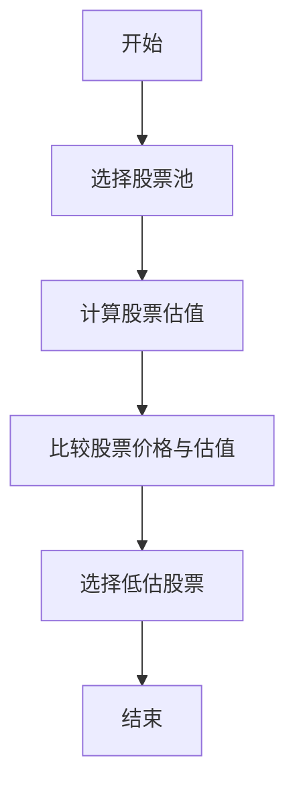
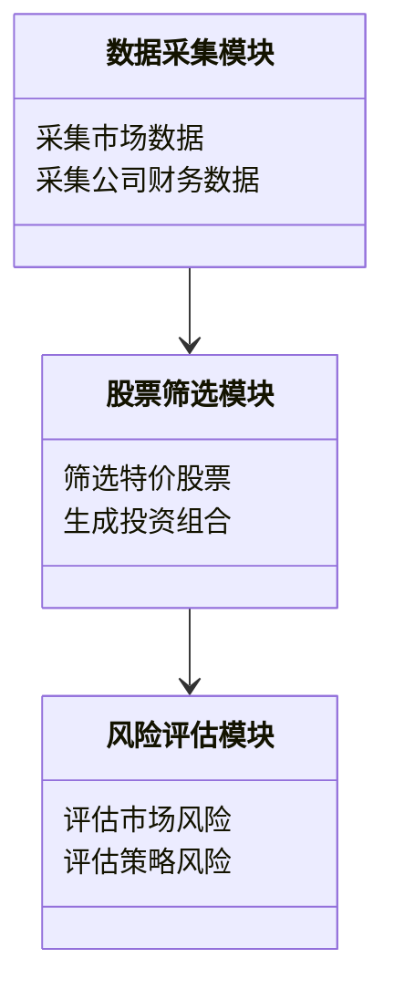
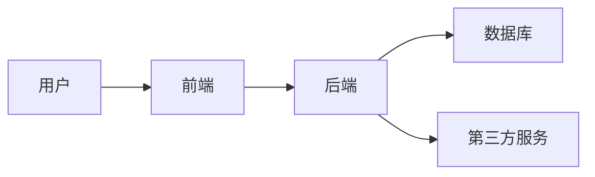
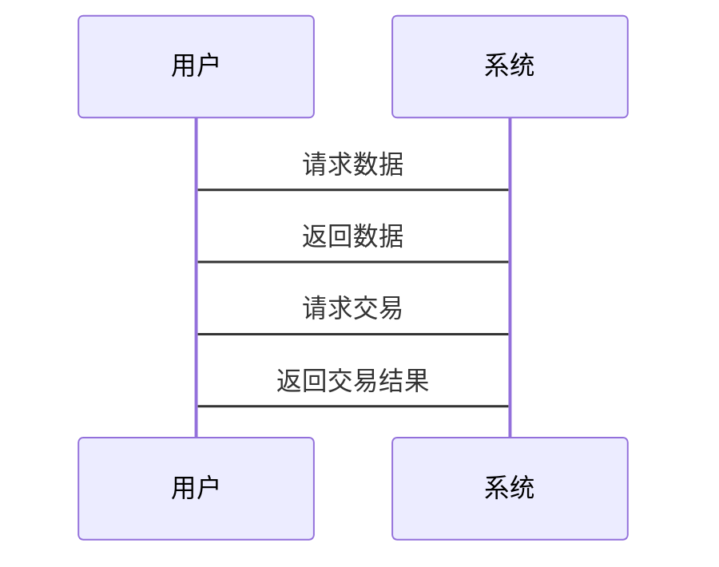

                 


# 如何利用特价股票策略构建长期数字主权与隐私保护对冲组合

> 关键词：数字主权，隐私保护，特价股票，对冲组合，风险管理

> 摘要：本文探讨了如何通过特价股票策略构建长期数字主权与隐私保护的对冲组合。文章首先介绍了数字主权和隐私保护的重要性，然后详细分析了特价股票策略的核心原理和应用场景。接下来，通过数学模型和算法，结合系统架构设计，提出了构建对冲组合的具体方法。最后，通过项目实战案例，验证了策略的有效性和可行性，为投资者提供了实践指导。

---

## 第1章: 数字主权与隐私保护概述

### 1.1 数字主权的定义与核心要素

#### 1.1.1 数字主权的定义
数字主权是指一个国家或个人对其数字资产和数据的自主控制权，包括数据的生成、存储、传输和使用。数字主权强调数据的独立性和安全性，旨在保护个人和国家免受外部数据操控和侵犯。

#### 1.1.2 数字主权的核心要素
- **数据所有权**：数据的归属和使用权。
- **数据安全**：防止数据泄露和非法访问。
- **数据自主性**：数据的生成、存储和使用的自主权。
- **数据主权**：国家对数字资产的控制权。

#### 1.1.3 数字主权的边界与外延
数字主权不仅涉及个人隐私，还涵盖国家层面的网络安全和数据主权。其外延包括数据跨境流动、数据加密技术、数据备份与恢复等。

### 1.2 隐私保护的重要性

#### 1.2.1 隐私保护的基本概念
隐私保护是指保护个人或组织的敏感信息不被未经授权的访问和使用。在数字化时代，隐私保护是数字主权的重要组成部分。

#### 1.2.2 数字化时代隐私保护的挑战
- **数据泄露**：黑客攻击和内部人员泄露。
- **数据滥用**：未经授权的数据使用和商业用途。
- **技术漏洞**：数据加密和传输的安全性问题。

#### 1.2.3 隐私保护与数字主权的关系
隐私保护是数字主权的核心要素，数字主权的实现依赖于有效的隐私保护措施。

### 1.3 特价股票策略的背景与意义

#### 1.3.1 特价股票的定义与特点
特价股票是指价格被市场低估，具有潜在上涨空间的股票。其特点包括低估值、高成长性和较高的安全边际。

#### 1.3.2 特价股票策略的历史演变
特价股票策略起源于价值投资理论，强调通过分析公司基本面，寻找被市场低估的投资标的。

#### 1.3.3 特价股票策略在数字主权与隐私保护中的作用
通过特价股票策略，投资者可以在市场波动中获得超额收益，同时通过分散投资保护隐私和数字主权。

---

## 第2章: 特价股票策略的核心原理

### 2.1 特价股票策略的基本原理

#### 2.1.1 市场波动与特价股票的识别
市场波动可能导致股票价格偏离其内在价值，投资者可以通过技术分析和基本面分析识别被低估的股票。

#### 2.1.2 技术分析与基本面分析的结合
- **技术分析**：通过K线图、均线、成交量等技术指标预测股票价格走势。
- **基本面分析**：通过公司财务报表、行业地位、盈利能力等基本面因素评估股票价值。

#### 2.1.3 特价股票策略的风险与收益分析
- **风险**：市场波动可能导致股价短期下跌，投资失败。
- **收益**：长期持有被低估股票可能带来超额收益。

### 2.2 数字主权视角下的特价股票策略

#### 2.2.1 数字主权对金融市场的影响力
数字主权影响金融市场的数据安全、交易透明度和监管政策。

#### 2.2.2 特价股票策略在数字主权框架下的应用
通过数字主权框架，投资者可以更安全地进行股票交易和数据管理。

#### 2.2.3 数字主权对特价股票策略的优化作用
数字主权框架可以提高交易的安全性和透明度，优化特价股票策略的实施效果。

---

## 第3章: 数字主权与隐私保护的数学模型与算法

### 3.1 数字主权与隐私保护的数学模型

#### 3.1.1 数字主权的数学表示
数字主权可以用集合论表示，其中$D$表示数据，$S$表示数字主权，$S \subseteq D$表示数字主权是数据的子集。

#### 3.1.2 隐私保护的数学表示
隐私保护可以用概率论表示，其中$P$表示隐私保护概率，$P = 1 - \text{泄露概率}$。

#### 3.1.3 数字主权与隐私保护的关系
数字主权与隐私保护是相互依存的关系，可以用图论表示，其中$S$和$P$是图的两个节点，边表示它们之间的关系。

### 3.2 特价股票策略的数学模型

#### 3.2.1 特价股票的数学定义
特价股票可以用以下公式表示：
$$
\text{特价股票} = \arg\min_{i} \left( \frac{P_i}{V_i} \right)
$$
其中，$P_i$是股票价格，$V_i$是股票的价值。

#### 3.2.2 特价股票策略的优化算法
以下是特价股票策略的优化算法流程图：



---

## 第4章: 系统分析与架构设计

### 4.1 项目介绍

#### 4.1.1 项目目标
通过数字主权框架，利用特价股票策略构建长期对冲组合。

#### 4.1.2 项目背景
随着数字化进程的加快，数据安全和隐私保护成为投资者关注的重点。

### 4.2 系统功能设计

#### 4.2.1 系统功能概述
系统功能包括数据采集、股票筛选、策略执行、风险评估和隐私保护。

#### 4.2.2 系统功能设计图
以下是系统功能设计的类图：



### 4.3 系统架构设计

#### 4.3.1 系统架构图
以下是系统架构设计的架构图：



### 4.4 系统接口设计

#### 4.4.1 系统接口设计
系统接口包括数据接口、交易接口和隐私保护接口。

#### 4.4.2 系统接口设计图
以下是系统接口设计的序列图：



---

## 第5章: 项目实战

### 5.1 环境安装

#### 5.1.1 系统要求
- 操作系统：Windows 10或更高版本，或macOS 10.15或更高版本。
- Python版本：Python 3.8或更高版本。
- 其他工具：Jupyter Notebook，Git，虚拟环境。

#### 5.1.2 安装依赖
```bash
pip install numpy pandas matplotlib
```

### 5.2 系统核心实现

#### 5.2.1 核心代码实现
以下是Python代码实现：

```python
import numpy as np
import pandas as pd
import matplotlib.pyplot as plt

def find_cheap_stock(data):
    # 计算股票估值
    data['valuation'] = data['市盈率'] * data['每股收益']
    # 选择低估股票
    cheap_stock = data[data['valuation'] < data['当前股价']]
    return cheap_stock

# 示例数据
data = {'股票代码': ['A', 'B', 'C'],
        '当前股价': [10, 20, 15],
        '市盈率': [15, 10, 12],
        '每股收益': [0.5, 1, 0.8]}
df = pd.DataFrame(data)
print(find_cheap_stock(df))
```

### 5.3 实际案例分析

#### 5.3.1 案例分析
以某公司为例，分析其股价波动和估值情况，选择低估股票。

#### 5.3.2 案例解读
通过分析，发现某公司的股价被低估，适合长期持有。

---

## 第6章: 总结与展望

### 6.1 本章小结
本文通过数字主权和隐私保护的视角，探讨了特价股票策略的应用。通过数学模型和系统设计，提出了一种构建对冲组合的方法。

### 6.2 未来研究方向
未来可以进一步研究数字主权与隐私保护的结合，优化特价股票策略。

---

作者：AI天才研究院/AI Genius Institute & 禅与计算机程序设计艺术 /Zen And The Art of Computer Programming

