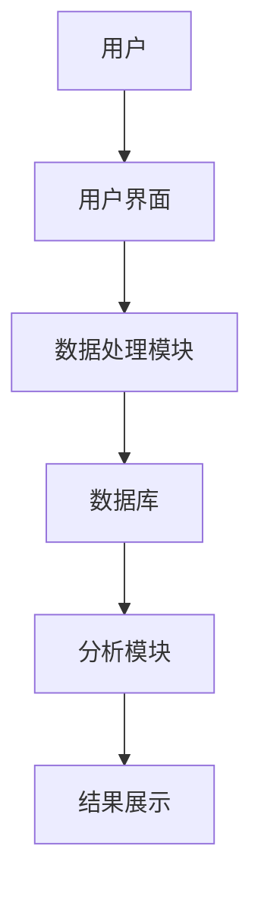

                 


# 如何利用特价股票策略构建长期数字主权与隐私保护投资组合

## 关键词：数字主权，隐私保护，特价股票策略，投资组合，算法原理

## 摘要：本文详细探讨如何利用特价股票策略构建一个兼顾数字主权与隐私保护的长期投资组合。通过分析数字主权和隐私保护的核心概念，结合特价股票策略的原理和算法，本文提出了一种基于数学模型和系统架构的设计方案，并通过实际案例展示了如何在保障隐私的同时实现稳健投资。

---

## 第一部分：背景介绍

### 第1章：数字主权与隐私保护的背景

#### 1.1 数字主权的核心概念
- **1.1.1 数字主权的定义与内涵**
  - 数字主权是指个体或国家对其数字资产和数据的控制权和使用权。
  - 在数字化时代，数字主权是保护国家安全和个体隐私的基础。
- **1.1.2 数字主权的重要性与挑战**
  - 数据泄露和网络攻击的频率增加，使得数字主权的保护变得至关重要。
  - 随着全球化的加深，数字主权的边界变得模糊，保护数字主权需要技术和法律的双重支持。

#### 1.2 隐私保护的必要性
- **1.2.1 隐私保护的定义与范围**
  - 隐私保护是指保护个人或组织的敏感信息不被未经授权的访问或泄露。
  - 隐私保护涵盖了数据的收集、存储、传输和使用等多个环节。
- **1.2.2 数字化时代隐私保护的挑战**
  - 数据滥用和算法歧视等问题威胁着个人隐私。
  - 隐私保护需要技术手段和法律法规的双重保障。

#### 1.3 特价股票策略的基本概念
- **1.3.1 特价股票的定义与特点**
  - 特价股票是指价格低于其内在价值的股票，具有较高的投资潜力。
  - 特价股票通常出现在市场低迷或公司暂时遇到困境时。
- **1.3.2 特价股票策略的应用场景**
  - 投资者通过低价买入特价股票，在股价回升时卖出获利。
  - 特价股票策略需要对市场趋势和公司基本面有深入的分析。

---

## 第二部分：数字主权与隐私保护的核心概念

### 第2章：数字主权的核心要素

#### 2.1 数字主权的构成要素
- **2.1.1 数据主权**
  - 数据主权是指数据产生地的国家对其数据的管辖权。
  - 数据主权的保护需要通过法律和技术创新来实现。
- **2.1.2 网络主权**
  - 网络主权是指国家对网络空间的治理权力。
  - 网络主权的实现需要国际合作和协调。
- **2.1.3 应用主权**
  - 应用主权是指国家对关键应用和平台的控制权。
  - 应用主权的保护需要技术创新和政策支持。

#### 2.2 隐私保护的法律框架
- **2.2.1 数据保护法规**
  - 数据保护法规如GDPR（通用数据保护条例）为隐私保护提供了法律依据。
  - GDPR要求企业明确数据处理的目的和合法性，确保数据的透明性和可追溯性。
- **2.2.2 隐私权的法律保障**
  - 隐私权是基本人权，法律通过禁止未经授权的数据收集和使用来保护隐私。
  - 隐私权的保护需要企业和个人共同努力。

---

## 第三部分：特价股票策略的原理与应用

### 第3章：特价股票策略的原理

#### 3.1 特价股票的识别方法
- **3.1.1 市场分析法**
  - 通过分析市场趋势和行业动态，识别具有潜力的特价股票。
  - 市场分析法需要结合技术分析和基本面分析。
- **3.1.2 技术分析法**
  - 利用技术指标和图表模式预测股票价格走势。
  - 技术分析法可以帮助投资者识别股票的买卖信号。

#### 3.2 特价股票策略的实施步骤
- **3.2.1 确定投资目标**
  - 设定投资目标和风险承受能力，选择适合的特价股票。
  - 投资目标需要与个人的财务规划和投资策略相一致。
- **3.2.2 制定投资计划**
  - 制定详细的投资计划，包括买入价格、持有时间和卖出时机。
  - 投资计划需要根据市场变化和公司情况及时调整。

---

## 第四部分：数字主权与隐私保护的结合

### 第4章：数字主权与隐私保护的结合

#### 4.1 数字主权与隐私保护的相互作用
- **4.1.1 数字主权对隐私保护的影响**
  - 数字主权的保护为隐私保护提供了法律和制度保障。
  - 数字主权的实现需要隐私保护作为基础。
- **4.1.2 隐私保护对数字主权的支撑**
  - 隐私保护是数字主权的重要组成部分，保障数据的安全性和合法性。
  - 隐私保护的加强可以提升数字主权的实现水平。

---

## 第五部分：算法原理与系统架构设计

### 第5章：算法原理与数学模型

#### 5.1 特价股票预测模型
- **5.1.1 数据收集与预处理**
  - 收集历史股票数据，清洗和标准化数据。
  - 数据预处理需要去除异常值和填补缺失值。
- **5.1.2 模型训练与优化**
  - 使用机器学习算法如随机森林和神经网络进行模型训练。
  - 通过交叉验证和网格搜索优化模型参数。

#### 5.2 数学模型与公式
- **线性回归模型**
  $$ y = \beta_0 + \beta_1x_1 + \beta_2x_2 + \cdots + \beta_nx_n + \epsilon $$
  其中，$y$ 是目标变量，$x_i$ 是自变量，$\beta_i$ 是回归系数，$\epsilon$ 是误差项。
- **时间序列分析模型**
  $$ y_t = \alpha y_{t-1} + \beta y_{t-2} + \cdots + \gamma y_{t-n} + \epsilon_t $$
  其中，$y_t$ 是当前时刻的股票价格，$y_{t-i}$ 是过去时刻的股票价格，$\alpha, \beta, \gamma$ 是系数，$\epsilon_t$ 是误差项。

---

## 第六部分：系统架构设计

### 第6章：系统架构与接口设计

#### 6.1 系统功能设计
- **用户界面**
  - 提供股票数据可视化和投资组合管理功能。
  - 用户可以通过界面查看实时股票价格和历史数据。
- **数据处理模块**
  - 负责数据的收集、存储和分析，支持多种数据格式和接口。
  - 数据处理模块需要高效处理大量数据，确保系统的实时性和准确性。

#### 6.2 系统架构图


---

## 第七部分：项目实战与案例分析

### 第7章：项目实战与案例分析

#### 7.1 环境安装与配置
- 安装Python和相关库（如Pandas、Scikit-learn、Plotly）。
- 配置数据源，如Yahoo Finance API。
  ```python
  import pandas as pd
  import numpy as np
  import matplotlib.pyplot as plt
  ```

#### 7.2 核心功能实现
- 数据清洗与特征提取：
  ```python
  data = pd.read_csv('stock_data.csv')
  data = data.dropna()
  data['return'] = data['close'].pct_change()
  ```
- 模型训练与预测：
  ```python
  from sklearn.ensemble import RandomForestRegressor
  model = RandomForestRegressor(n_estimators=100, random_state=42)
  model.fit(X_train, y_train)
  ```

#### 7.3 案例分析
- 分析某公司股票数据，预测其未来走势。
- 根据预测结果制定投资策略，实现收益最大化。

---

## 第八部分：总结与展望

### 第8章：总结与展望

#### 8.1 小结
- 特价股票策略是一种有效的投资方式，结合数字主权和隐私保护可以实现长期稳健的投资回报。
- 技术创新和法律法规的完善是实现数字主权和隐私保护的关键。

#### 8.2 注意事项
- 投资者需要具备一定的市场分析和风险识别能力。
- 在实际操作中，需要严格遵守相关法律法规，确保数据的安全性和合法性。

#### 8.3 拓展阅读
- 建议读者进一步学习数据科学和投资学的相关知识。
- 关注数字主权和隐私保护领域的最新动态和技术发展。

---

## 作者：AI天才研究院/AI Genius Institute & 禅与计算机程序设计艺术 /Zen And The Art of Computer Programming

