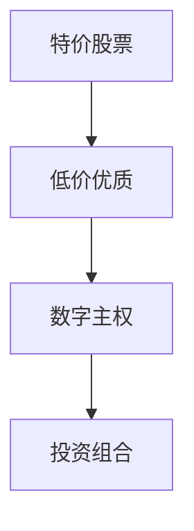
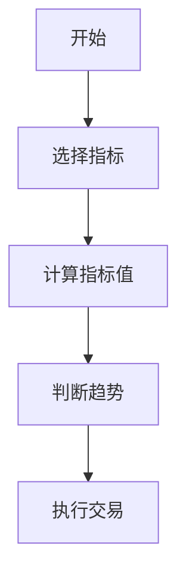
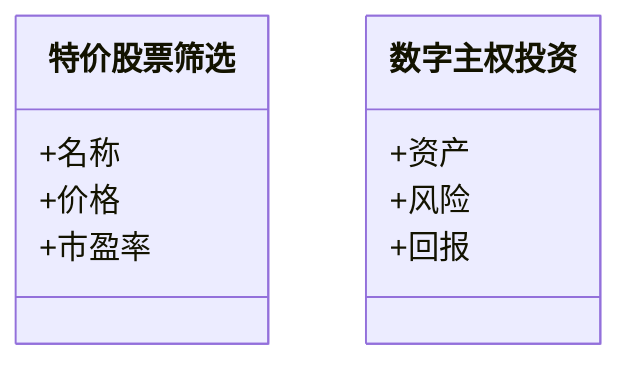
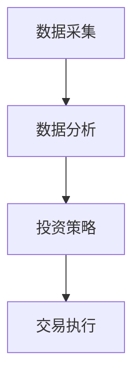
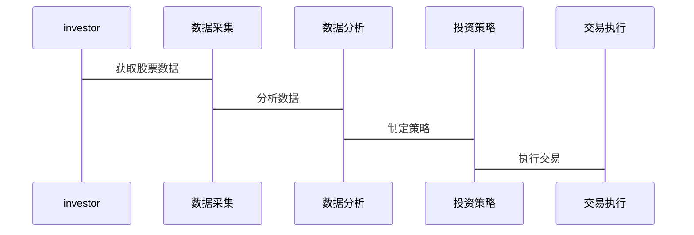

                 


# 如何利用特价股票策略构建长期数字主权投资组合

## 关键词：特价股票，数字主权，投资组合，股票策略，长期投资

## 摘要：本文详细探讨如何利用特价股票策略构建长期数字主权投资组合。首先，介绍特价股票和数字主权的定义与重要性，分析两者结合的必要性。接着，深入讲解特价股票策略的核心原理，包括识别方法和数字主权投资的核心要素。然后，通过数学模型和算法流程图，展示如何优化投资组合。最后，提供系统架构设计和实际项目案例，总结最佳实践和注意事项。

---

# 第一部分: 特价股票策略与数字主权投资组合的背景介绍

## 第1章: 特价股票策略的起源与发展

### 1.1 特价股票的定义与特点

#### 1.1.1 特价股票的定义
特价股票指的是在特定市场条件下，价格被低估的股票。这些股票通常具有较高的潜在回报率，但可能暂时未被市场充分发现。

#### 1.1.2 特价股票的特点
- **低估值**：市盈率、市净率等指标低于行业平均水平。
- **高潜力**：公司基本面良好，但市场反应滞后。
- **周期性**：通常出现在市场低迷期。

#### 1.1.3 特价股票与普通股票的区别
| 属性 | 特价股票 | 普通股票 |
|------|----------|----------|
| 估值 | 低       | 市场价    |
| 风险 | 较高     | 中等     |
| 回报 | 高       | 稳定     |

### 1.2 数字主权的定义与重要性

#### 1.2.1 数字主权的定义
数字主权指一个国家或组织对其数字资产和数据的自主控制权，确保其安全和利益。

#### 1.2.2 数字主权的核心要素
- **数据控制**：数据的生成、存储和管理。
- **网络安全**：防止数据泄露和网络攻击。
- **政策法规**：制定相关政策以保护数字资产。

#### 1.2.3 数字主权与投资的关系
数字主权投资强调投资于那些在数字领域有强大控制权的公司，以确保投资组合的长期安全性。

## 第2章: 特价股票策略与数字主权投资的结合

### 2.1 特价股票策略在投资中的作用

#### 2.1.1 特价股票策略的优势
- **高回报潜力**：识别被低估的股票，提前布局。
- **风险分散**：通过多样化投资降低风险。

#### 2.1.2 特价股票策略的风险
- **市场波动**：低价股可能受市场情绪影响较大。
- **信息不对称**：投资者可能难以获取公司内部信息。

#### 2.1.3 特价股票策略与长期投资的结合
通过长期持有特价股票，投资者可以分享公司成长的收益，同时降低短期波动的影响。

### 2.2 数字主权投资的必要性

#### 2.2.1 数字主权投资的背景
随着数字化转型，数字资产在经济中的作用日益重要，数字主权成为各国竞争的焦点。

#### 2.2.2 数字主权投资的目标
- **资产保护**：确保数字资产的安全和收益。
- **战略控制**：通过投资掌握关键数字技术。

#### 2.2.3 数字主权投资的挑战
- **技术复杂性**：数字技术更新快，投资门槛高。
- **监管环境**：政策变化可能影响投资策略。

---

# 第二部分: 特价股票策略与数字主权投资的核心概念

## 第3章: 特价股票策略的核心原理

### 3.1 特价股票的识别方法

#### 3.1.1 基本分析法
分析公司的财务状况，如盈利能力、负债情况等，识别被低估的股票。

#### 3.1.2 技术分析法
通过股票价格和成交量的走势，预测未来价格变动。

#### 3.1.3 综合分析法
结合基本分析和技术分析，提高选股的准确性。

### 3.2 数字主权投资的核心要素

#### 3.2.1 数字资产的选择
选择那些在数字领域有竞争优势的公司，如区块链、人工智能等领域。

#### 3.2.2 数字资产的风险管理
通过分散投资、设定止损点等方式，降低投资风险。

#### 3.2.3 数字资产的长期价值
关注公司基本面和长期发展趋势，而非短期价格波动。

## 第4章: 数字主权投资的核心要素

### 4.1 数字主权投资的属性特征

| 属性 | 特性 | 描述 |
|------|------|------|
| 数据控制 | 独立性 | 数据由本国控制 |
| 网络安全 | 防护性 | 防御网络攻击 |
| 政策法规 | 合规性 | 符合国家政策 |

### 4.2 特价股票与数字主权投资的关系



### 4.3 实体关系图

```mermaid
erd
entity 投资者
entity 特价股票
entity 数字主权投资
investor --> owns: 持有
investor --> manages: 管理
```

---

# 第三部分: 特价股票策略与数字主权投资的算法原理

## 第5章: 算法原理讲解

### 5.1 技术分析算法



#### 5.1.1 技术指标
- **移动平均线（MA）**：显示价格趋势。
- **相对强弱指数（RSI）**：衡量超买或超卖状态。

### 5.2 数学模型

#### 5.2.1 均值-方差模型
$$ \text{最小方差} = \argmin \sum_{i=1}^{n} w_i^2 \sigma_i^2 $$
$$ \text{最大夏普比率} = \argmax \frac{\mu_p - r_f}{\sigma_p} $$

---

# 第四部分: 系统分析与架构设计方案

## 第6章: 系统分析与架构设计

### 6.1 问题场景介绍
投资者希望通过系统实现特价股票筛选和数字主权投资组合优化。

### 6.2 项目介绍
开发一个投资管理系统，帮助投资者实现特价股票策略和数字主权投资。

### 6.3 系统功能设计

#### 6.3.1 领域模型



### 6.4 系统架构设计



### 6.5 系统接口设计
- 数据接口：从数据库获取股票数据。
- 策略接口：实现投资策略算法。

### 6.6 系统交互流程



---

# 第五部分: 项目实战

## 第7章: 项目实战

### 7.1 环境安装
- Python 3.8+
- Pandas, NumPy, Matplotlib库

### 7.2 核心实现代码

```python
import pandas as pd
import numpy as np

# 数据采集
data = pd.read_csv('stock_data.csv')

# 数据分析
def calculate_technical_indicators(data):
    # 计算移动平均线
    data['MA'] = data['Price'].rolling(5).mean()
    # 计算相对强弱指数
    data['RSI'] = (data['Price'] - data['Price'].shift(1)) / data['Price'].shift(1)
    return data

data = calculate_technical_indicators(data)

# 投资策略
def select_penny_stocks(data, threshold=0.1):
    data['Is_Penny'] = data['Price'] < threshold
    return data[data['Is_Penny']]

selected_stocks = select_penny_stocks(data)
```

### 7.3 实际案例分析
以某科技公司为例，分析其股价走势，识别特价股票，制定投资策略。

---

# 第六部分: 总结与展望

## 第8章: 总结与展望

### 8.1 最佳实践
- 定期审查投资组合。
- 保持对市场趋势的敏感性。

### 8.2 小结
通过特价股票策略和数字主权投资的结合，投资者可以实现长期稳定的收益。

### 8.3 注意事项
- 风险控制是关键。
- 保持对市场的持续学习。

### 8.4 拓展阅读
- 《投资学基础》
- 《数字主权与经济发展》

---

# 作者

作者：AI天才研究院/AI Genius Institute & 禅与计算机程序设计艺术 /Zen And The Art of Computer Programming

