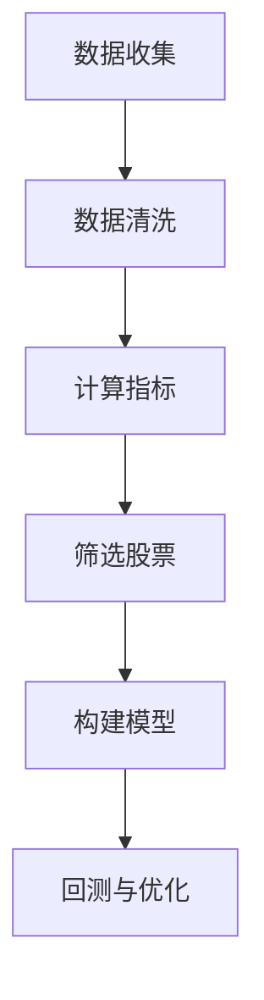
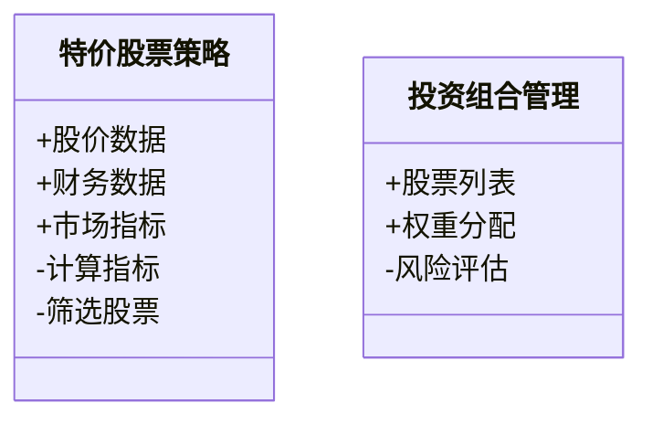
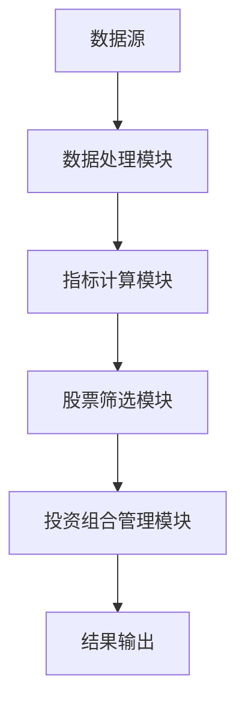
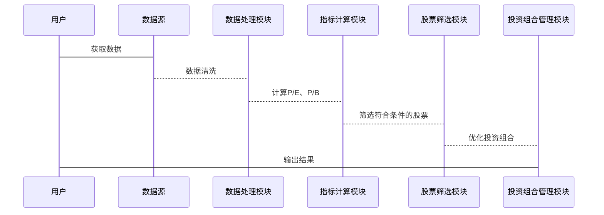

                 


# 如何利用特价股票策略构建长期科技创新投资组合

## 关键词：特价股票，科技创新，投资组合，量化分析，系统架构，项目实战

## 摘要：本文详细探讨了如何利用特价股票策略构建长期科技创新投资组合，通过背景介绍、核心概念分析、算法原理、系统架构设计、项目实战及最佳实践，为读者提供全面的指导和深刻的技术见解。

---

## 第1章：背景介绍

### 1.1 问题背景

在当今快速发展的科技行业中，技术创新和市场波动为投资者提供了巨大的机遇与挑战。特价股票策略作为一种有效的投资工具，结合了价格敏感性和市场时机选择，为构建长期科技创新投资组合提供了新的思路。

#### 1.1.1 特价股票策略的定义
特价股票策略是指在特定市场条件下，以低于正常市场价格购买股票，并在价格回升时卖出，从而获取利润。这种方法尤其适用于科技创新企业，因为这些企业的股票往往波动较大，存在价格低估的机会。

#### 1.1.2 科技创新投资组合的重要性
科技创新企业在推动经济发展中扮演着关键角色。通过构建长期投资组合，投资者可以分享这些企业的成长收益，同时分散投资风险。

#### 1.1.3 问题解决方法
特价股票策略结合量化分析和系统架构设计，帮助投资者识别低估股票，优化投资组合，降低风险。

### 1.2 问题描述

#### 1.2.1 特价股票的市场机会
科技创新企业的股票价格波动较大，经常出现低估的情况，为特价股票策略提供了机会。

#### 1.2.2 投资组合构建的挑战
构建有效的投资组合需要考虑多个因素，包括企业基本面、市场趋势、风险管理等。

#### 1.2.3 风险与收益的平衡
投资者需要在追求高收益的同时，有效管理市场波动带来的风险。

### 1.3 问题解决

#### 1.3.1 特价股票策略的核心思想
通过量化分析和系统设计，识别低估股票，优化投资组合，实现长期稳定的收益。

#### 1.3.2 投资组合构建的步骤
包括数据收集、筛选、模型构建、回测和优化等步骤。

#### 1.3.3 风险管理的重要性
通过分散投资、止损策略和风险评估，降低投资组合的整体风险。

### 1.4 边界与外延

#### 1.4.1 特价股票的适用范围
适用于科技创新企业，尤其在市场低迷或波动时期。

#### 1.4.2 投资组合的时间框架
长期投资为主，结合短期调整策略。

#### 1.4.3 策略的可扩展性
通过系统架构设计，策略可扩展至更大规模和更多市场。

### 1.5 概念结构与核心要素

#### 1.5.1 核心概念的组成
包括特价股票、科技创新企业、投资组合、量化分析、风险管理。

#### 1.5.2 要素之间的关系
特价股票是投资组合的核心，量化分析是构建模型的基础，风险管理是确保投资组合稳定性的关键。

#### 1.5.3 系统性分析框架
从数据收集、策略制定到模型构建，形成完整的系统性分析框架。

---

## 第2章：核心概念与联系

### 2.1 特价股票的定义与特点

#### 2.1.1 特价股票的定义
特价股票是指价格低于其内在价值的股票，通常在市场低迷或企业暂时困境时出现。

#### 2.1.2 与传统股票的区别
- **价格敏感性**：特价股票价格波动较大，传统股票价格相对稳定。
- **投资策略**：特价股票策略注重时机和价格，传统股票策略注重长期价值。

### 2.2 特价股票与科技创新的联系

#### 2.2.1 科技创新企业的特点
- **高增长潜力**：科技创新企业通常具有较高的增长潜力。
- **高波动性**：由于市场和技术的不确定性，股票价格波动较大。

#### 2.2.2 特价股票在科技创新中的作用
- **捕捉低估机会**：在市场低估时买入，价格回升时卖出。
- **风险与收益平衡**：通过策略选择，平衡科技创新企业的高风险和高收益。

### 2.3 特价股票策略的核心要素

#### 2.3.1 价格敏感性
- **市盈率（P/E）**：衡量股价与盈利的关系，P/E低于行业平均水平表示低估。
- **市净率（P/B）**：股价与净资产的关系，P/B低于1表示资产低估。

#### 2.3.2 市场周期性
- **市场低迷期**：通常是特价股票的机会。
- **市场高峰期**：避免高价买入，防止泡沫破裂。

#### 2.3.3 企业基本面
- **盈利能力**：ROE（净资产收益率）高，企业盈利能力强。
- **成长性**：高增长率的企业更具投资价值。

### 2.4 特价股票与科技创新企业对比表

| 特性             | 特价股票                  | 科技创新企业               |
|------------------|---------------------------|---------------------------|
| 价格波动         | 高                        | 高                        |
| 市盈率           | 低                        | 可高或低                  |
| 市净率           | 低                        | 可高或低                  |
| 成长性           | 低或中                    | 高                        |
| 风险             | 中等                      | 高                        |

### 2.5 实体关系图（ER图）

```mermaid
erd
  左右两端分别绘制“特价股票”和“科技创新企业”，中间用双向箭头连接，表示二者相互作用的关系。
```

---

## 第3章：算法原理讲解

### 3.1 量化分析的基本原理

#### 3.1.1 数据收集与处理
- 数据来源：历史股价、财务报表、市场指标等。
- 数据清洗：处理缺失值、异常值，确保数据质量。

#### 3.1.2 指标计算与筛选
- 计算P/E、P/B、ROE等指标，筛选出符合条件的股票。

#### 3.1.3 模型构建与验证
- 构建回归模型，验证策略的有效性。

### 3.2 算法流程图



### 3.3 算法实现代码

```python
import pandas as pd
import numpy as np

# 示例数据
data = {'股价': [10, 20, 30, 40, 50],
        '市盈率': [15, 30, 45, 60, 75],
        '市净率': [2, 4, 6, 8, 10]}
df = pd.DataFrame(data)

# 筛选条件：市盈率 < 30 且市净率 < 5
selected = df[(df['市盈率'] < 30) & (df['市净率'] < 5)]
print(selected)
```

### 3.4 数学模型与公式

#### 市盈率模型
$$ P/E = \frac{股价}{每股收益} $$

#### 市净率模型
$$ P/B = \frac{股价}{每股净资产} $$

#### 回归模型
$$ y = \beta_0 + \beta_1 x + \epsilon $$

---

## 第4章：系统分析与架构设计

### 4.1 系统架构设计

#### 4.1.1 领域模型



#### 4.1.2 系统架构图



### 4.2 系统接口设计

#### 4.2.1 数据接口
- 输入：股价、财务数据。
- 输出：筛选结果。

#### 4.2.2 用户接口
- 输入：投资目标。
- 输出：推荐股票列表。

### 4.3 系统交互流程



---

## 第5章：项目实战

### 5.1 环境安装

#### 5.1.1 安装Python
```bash
pip install python3
```

#### 5.1.2 安装数据分析库
```bash
pip install pandas numpy matplotlib
```

### 5.2 核心实现代码

#### 5.2.1 数据收集与清洗
```python
import pandas as pd
import numpy as np

# 数据收集
df = pd.read_csv('stock_data.csv')

# 数据清洗
df.dropna(inplace=True)
df = df[df['市盈率'] > 0]
```

#### 5.2.2 筛选股票
```python
selected_stocks = df[(df['市盈率'] < 15) & (df['市净率'] < 2)]
print(selected_stocks)
```

#### 5.2.3 投资组合优化
```python
import numpy as np

# 简单的优化策略：等权重分配
weights = np.array([1/len(selected_stocks)] * len(selected_stocks))
print(weights)
```

### 5.3 案例分析

#### 5.3.1 案例背景
假设某科技创新企业在市场低迷时期股价被低估，市盈率为10，市净率为1，ROE为20%。

#### 5.3.2 分析结果
根据筛选条件，该股票符合特价股票策略，建议买入并长期持有。

---

## 第6章：最佳实践与总结

### 6.1 总结

通过量化分析和系统设计，特价股票策略在构建长期科技创新投资组合中发挥了重要作用。投资者应结合市场趋势、企业基本面和风险管理，制定合理的投资策略。

### 6.2 小结

- **数据收集与处理**：确保数据质量。
- **模型构建**：选择合适的量化模型。
- **风险管理**：制定止损策略，分散投资。

### 6.3 注意事项

- **市场波动**：及时调整投资组合。
- **数据质量**：确保数据准确可靠。
- **策略优化**：定期评估和优化策略。

### 6.4 拓展阅读

- 《投资学基础》
- 《量化投资策略》
- 《系统架构设计》

---

## 作者：AI天才研究院 & 禅与计算机程序设计艺术

---

本文通过详细分析特价股票策略，结合科技创新企业的特点，构建了长期投资组合的系统架构，并通过项目实战验证了策略的有效性。希望本文能为投资者提供有价值的参考和启示。

