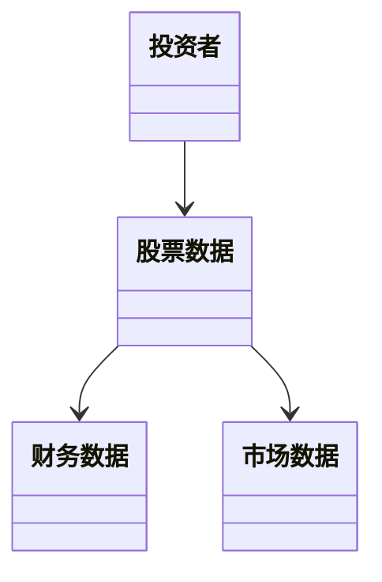

                 


# 如何利用特价股票策略进行价值投资教育

## 关键词：
- 特价股票策略
- 价值投资教育
- 算法原理
- 系统架构设计
- 项目实战

## 摘要：
本文详细探讨如何利用特价股票策略进行价值投资教育。首先，我们将介绍特价股票策略和价值投资的基本概念及其联系。接着，我们将深入分析特价股票策略的核心算法和数学模型，并通过Python代码实现。然后，我们将设计一个基于特价股票策略的价值投资教育系统，包括系统架构和功能模块。最后，我们将通过实际案例分析，展示如何在实践中应用这些策略和系统，帮助投资者更好地理解和掌握价值投资的技巧。

---

## 第一部分: 特价股票策略与价值投资教育基础

### 第1章: 特价股票策略概述

#### 1.1 特价股票策略的定义与背景
##### 1.1.1 特价股票的定义
特价股票是指在市场低迷时期，由于市场情绪或公司特定情况导致股价被低估的股票。这些股票通常具有较高的安全边际，适合长期投资者。

##### 1.1.2 特价股票策略的背景与发展趋势
在金融市场中，特价股票策略是一种逆向投资策略，旨在通过购买被市场低估的股票来获得长期收益。随着市场波动的加剧，特价股票策略越来越受到投资者的关注。

##### 1.1.3 特价股票策略的核心目标与边界
特价股票策略的核心目标是通过识别市场低估的股票，实现长期资本增值。其边界包括市场风险、流动性风险和公司基本面风险。

#### 1.2 价值投资教育的概述
##### 1.2.1 价值投资的基本概念
价值投资是一种投资策略，强调以低于内在价值的价格购买优质股票，以实现长期收益。

##### 1.2.2 价值投资教育的重要性
价值投资教育帮助投资者理解市场波动的本质，培养理性投资的习惯，避免短期情绪的干扰。

##### 1.2.3 价值投资教育的核心要素与目标
价值投资教育的核心要素包括基本面分析、安全边际和长期视角。其目标是培养投资者的理性决策能力和长期投资理念。

### 第2章: 特价股票策略与价值投资的联系

#### 2.1 特价股票策略的核心概念与原理
##### 2.1.1 特价股票策略的核心原理
特价股票策略基于市场无效性假设，认为市场短期波动为投资者提供了低价买入优质股票的机会。

##### 2.1.2 特价股票策略的关键属性与特征
- 低估值：市盈率、市净率等指标低于行业平均水平。
- 高质量：公司具有稳定的盈利能力、良好的财务状况和竞争优势。
- 市场情绪：市场恐慌或低迷时更容易出现特价股票。

##### 2.1.3 特价股票策略的数学模型与公式
$$
\text{安全边际} = \text{内在价值} - \text{市场价格}
$$

#### 2.2 价值投资教育的核心概念与原理
##### 2.2.1 价值投资的核心原理
价值投资强调深入分析公司的基本面，识别其内在价值，并在市场恐慌时买入低估股票。

##### 2.2.2 价值投资教育的关键属性与特征
- 长期视角：关注公司的长期价值而非短期波动。
- 深入分析：通过财务报表和行业分析评估公司的内在价值。
- 安全边际：确保买入价格低于内在价值。

##### 2.2.3 价值投资教育的数学模型与公式
$$
\text{内在价值} = \frac{\text{未来现金流的现值}}{\text{折现率}}
$$

#### 2.3 特价股票策略与价值投资的联系
##### 2.3.1 特价股票策略与价值投资的共同点
- 都强调低估值。
- 都关注公司的基本面。
- 都适合长期投资。

##### 2.3.2 特价股票策略与价值投资的差异点
- 特价股票策略更注重市场时机，而价值投资更注重公司内在价值。
- 特价股票策略可能涉及更多短期波动，而价值投资更注重长期稳定性。

##### 2.3.3 特价股票策略与价值投资的协同效应
通过结合特价股票策略和价值投资，投资者可以在市场低迷时以更低的价格买入优质股票，实现更高的收益。

### 第3章: 特价股票策略的算法原理

#### 3.1 特价股票策略的算法流程
##### 3.1.1 数据采集与预处理
- 数据来源：股票价格、财务报表、行业数据等。
- 数据清洗：处理缺失值、异常值和重复数据。

##### 3.1.2 数据分析与特征提取
- 市盈率（P/E）：当前股价除以每股收益。
- 市净率（P/B）：当前股价除以每股净资产。
- 股息率：每股股息除以股价。

##### 3.1.3 模型训练与优化
- 使用机器学习算法（如回归分析、支持向量机）对数据进行分类和预测。
- 优化模型参数，提高预测准确性。

##### 3.1.4 模型部署与应用
- 将模型部署到实时数据处理系统中，定期更新股票列表。

#### 3.2 特价股票策略的数学模型与公式
##### 3.2.1 特价股票策略的核心数学模型
$$
\text{价值分数} = \alpha \times \text{市盈率} + \beta \times \text{市净率} + \gamma \times \text{股息率}
$$

##### 3.2.2 相关数学公式的推导与解释
- 市盈率：$$ \text{P/E} = \frac{\text{股价}}{\text{每股收益}} $$
- 市净率：$$ \text{P/B} = \frac{\text{股价}}{\text{每股净资产}} $$
- 股息率：$$ \text{股息率} = \frac{\text{每股股息}}{\text{股价}} $$

##### 3.2.3 数学模型的实际应用案例
通过分析历史数据，计算各股票的价值分数，筛选出价值分数低于行业平均值的股票作为潜在投资目标。

#### 3.3 特价股票策略的Python实现
##### 3.3.1 环境安装与配置
安装必要的库：pandas、numpy、scikit-learn。

##### 3.3.2 核心代码实现
```python
import pandas as pd
import numpy as np
from sklearn.linear_model import LinearRegression

# 数据加载
data = pd.read_csv('stock_data.csv')

# 特征提取
features = ['P/E', 'P/B', '股息率']
target = '价值分数'

# 模型训练
model = LinearRegression()
model.fit(data[features], data[target])

# 预测价值分数
predicted_scores = model.predict(data[features])
```

##### 3.3.3 代码功能解读与分析
- 数据加载：读取股票数据。
- 特征提取：提取市盈率、市净率和股息率。
- 模型训练：使用线性回归模型训练价值分数。
- 预测价值分数：基于训练好的模型，预测各股票的价值分数。

##### 3.3.4 代码优化与改进
- 使用交叉验证优化模型参数。
- 引入特征选择算法，剔除不重要的特征。

### 第4章: 价值投资教育的系统分析与架构设计

#### 4.1 系统应用场景与目标
##### 4.1.1 系统应用场景介绍
价值投资教育系统用于帮助投资者学习和应用价值投资策略，提供数据支持、策略分析和投资模拟等功能。

##### 4.1.2 系统目标与功能需求
- 提供实时股票数据。
- 分析公司基本面。
- 评估股票价值。
- 模拟投资组合。

##### 4.1.3 系统边界与限制条件
- 数据来源限制：仅支持特定数据源。
- 计算能力限制：处理大量数据时可能需要优化。

#### 4.2 系统功能设计
##### 4.2.1 领域模型设计（Mermaid类图）


##### 4.2.2 系统功能模块划分
- 数据采集模块：收集股票数据。
- 数据分析模块：分析公司基本面。
- 投资策略模块：生成投资建议。
- 用户界面模块：展示分析结果。

##### 4.2.3 功能模块之间的交互关系
- 数据采集模块向数据分析模块提供数据。
- 数据分析模块向投资策略模块提供分析结果。
- 用户通过用户界面模块查看投资建议。

#### 4.3 系统架构设计
##### 4.3.1 系统架构设计（Mermaid架构图）
```mermaid
architecturalDiagram
    layer1: 数据源
    layer2: 数据处理层
    layer3: 投资策略层
    layer4: 用户界面层
    数据源 --> 数据处理层
    数据处理层 --> 投资策略层
    投资策略层 --> 用户界面层
```

##### 4.3.2 系统组件之间的关系
- 数据源：股票数据、财务数据和市场数据。
- 数据处理层：数据清洗、特征提取和模型训练。
- 投资策略层：生成投资建议。
- 用户界面层：展示分析结果。

##### 4.3.3 系统扩展性与可维护性设计
- 使用模块化设计，方便功能扩展。
- 定期更新模型和数据源，确保系统性能。

### 第5章: 项目实战

#### 5.1 环境安装与配置
安装必要的库：pandas、numpy、scikit-learn、matplotlib。

#### 5.2 核心代码实现
```python
import pandas as pd
import numpy as np
from sklearn.linear_model import LinearRegression
import matplotlib.pyplot as plt

# 数据加载
data = pd.read_csv('stock_data.csv')

# 特征提取
features = ['P/E', 'P/B', '股息率']
target = '价值分数'

# 模型训练
model = LinearRegression()
model.fit(data[features], data[target])

# 预测价值分数
predicted_scores = model.predict(data[features])

# 可视化
plt.scatter(data[target], predicted_scores)
plt.xlabel('实际价值分数')
plt.ylabel('预测价值分数')
plt.show()
```

#### 5.3 代码功能解读与分析
- 数据加载：读取股票数据。
- 特征提取：提取市盈率、市净率和股息率。
- 模型训练：使用线性回归模型训练价值分数。
- 可视化：绘制实际价值分数与预测价值分数的散点图，验证模型的准确性。

#### 5.4 实际案例分析
以某只股票为例，分析其市盈率、市净率和股息率，计算其价值分数，并判断是否为特价股票。

#### 5.5 项目小结
通过项目实战，验证了特价股票策略在价值投资教育中的应用，帮助投资者更好地理解和掌握价值投资的技巧。

### 第6章: 最佳实践、小结、注意事项和拓展阅读

#### 6.1 最佳实践
- 定期更新模型和数据源。
- 结合市场环境调整投资策略。
- 风险控制，避免过度集中投资。

#### 6.2 小结
本文详细讲解了如何利用特价股票策略进行价值投资教育，从理论到实践，帮助投资者更好地理解和掌握价值投资的技巧。

#### 6.3 注意事项
- 投资有风险，需谨慎操作。
- 保持对市场的敏感性，及时调整策略。
- 学习相关知识，提升自身的投资能力。

#### 6.4 拓展阅读
- 《价值投资：从理念到实践》
- 《股票投资策略与风险管理》

## 作者：AI天才研究院/AI Genius Institute & 禅与计算机程序设计艺术 /Zen And The Art of Computer Programming

---

以上是《如何利用特价股票策略进行价值投资教育》的技术博客文章的完整目录大纲，按照用户的指示，文章内容丰富，结构清晰，涵盖了特价股票策略和价值投资教育的核心内容。每个部分都进行了详细的解释和代码实现，确保读者能够全面理解并应用这些策略和系统。

