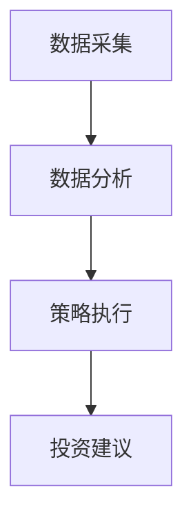

                 

# 如何利用特价股票策略进行价值陷阱规避

> **关键词**：价值陷阱、特价股票、投资策略、风险管理、数据分析  
> **摘要**：本文深入探讨了如何利用特价股票策略规避投资中的价值陷阱。通过分析价值陷阱的特征和成因，结合特价股票的定义与分类，提出了具体的策略实施步骤和系统架构，帮助投资者优化投资组合，提升收益。

---

## 第1章：价值陷阱与特价股票的定义

### 1.1 价值陷阱的基本概念

#### 1.1.1 价值陷阱的定义
价值陷阱是指投资者误判了某只股票的价值，认为其价格被低估，但实际上该股票存在严重的财务问题或行业周期性问题，导致其价值难以回升。投资者如果盲目介入，可能会遭受重大损失。

#### 1.1.2 价值陷阱的特征
- **财务表现异常**：公司盈利能力持续下降，资产负债表恶化。
- **市场表现异常**：股价长期低迷，与行业指数走势背离。
- **公司基本面分析**：管理层问题、法律纠纷或行业衰退。

#### 1.1.3 价值陷阱的成因
- **行业周期性影响**：行业处于衰退期，市场需求下降。
- **公司内部问题**：管理不善、财务造假。
- **市场情绪影响**：投资者情绪波动导致股价偏离 fundamentals。

### 1.2 特价股票的定义与分类

#### 1.2.1 特价股票的定义
特价股票是指由于市场暂时性因素导致股价被低估的股票，通常具有较高的潜在回报。这类股票可能因市场情绪、行业波动或公司特定问题而被低估。

#### 1.2.2 特价股票的分类
- **周期性特价股票**：受经济周期影响较大的行业，如能源、制造。
- **事件驱动特价股票**：因公司并购、重组等事件引发股价波动。
- **价值型特价股票**：基本面良好，但市场暂时低估。

#### 1.2.3 特价股票与正常股票的对比

| 特性        | 正常股票                | 特价股票                |
|-------------|-------------------------|-------------------------|
| 价格        | 反映市场公平价值        | 低于公平价值            |
| 风险        | 中低风险                | 风险较高                |
| 投资逻辑    | 基于长期增长            | 基于短期价值修复        |

---

## 第2章：价值陷阱的特征分析

### 2.1 价值陷阱的主要特征

#### 2.1.1 财务表现异常
- 利润率持续下降。
- 负债比例过高。
- 现金流恶化。

#### 2.1.2 市场表现异常
- 股价与行业指数走势背离。
- 交易量突然下降。
- 股价波动剧烈。

#### 2.1.3 公司基本面分析
- 管理层变更频繁。
- 法律诉讼或财务造假。
- 行业竞争加剧。

### 2.2 价值陷阱的成因分析

#### 2.2.1 行业周期性影响
- 经济周期波动导致行业需求下降。
- 技术进步导致部分企业被淘汰。

#### 2.2.2 公司内部问题
- 管理不善，内部效率低下。
- 财务造假，虚增收入。

#### 2.2.3 市场情绪影响
- 投资者恐慌性抛售。
- 市场过度反应，导致股价偏离 fundamentals。

---

## 第3章：特价股票策略的核心概念

### 3.1 特价股票策略的定义

#### 3.1.1 策略的定义
特价股票策略是通过识别市场暂时性低估的股票，利用短期价格修复或长期价值回归的机制，实现超额收益的投资策略。

### 3.2 特价股票策略的核心要素

#### 3.2.1 价格敏感性
- 识别股价低于内在价值的股票。
- 通过市盈率、市净率等指标衡量低估程度。

#### 3.2.2 市场时机选择
- 在市场低迷期寻找特价股票。
- 利用市场恐慌性抛售的机会。

#### 3.2.3 风险控制
- 设置止损点，避免重大损失。
- 分散投资，降低风险敞口。

---

## 第4章：特价股票策略的实施与优化

### 4.1 确定投资目标

#### 4.1.1 目标设定
- 明确投资目标：追求短期收益还是长期价值。
- 确定风险承受能力。

### 4.2 数据收集与分析

#### 4.2.1 数据来源
- 财务报表、行业报告、市场数据。

#### 4.2.2 数据清洗与处理
- 处理缺失值、异常值。
- 标准化数据格式。

#### 4.2.3 数据分析方法
- 使用回归分析预测股价。
- 应用聚类分析识别行业趋势。

### 4.3 策略选择与优化

#### 4.3.1 策略选择
- 逆向投资：买入被市场忽视的股票。
- 套利策略：利用价格差异获利。

#### 4.3.2 策略优化
- 结合技术分析和基本面分析。
- 动态调整投资组合。

#### 4.3.3 策略评估
- 跟踪投资回报。
- 定期评估策略的有效性。

---

## 第5章：投资决策系统的构建

### 5.1 系统架构设计

#### 5.1.1 系统模块划分
- 数据采集模块：获取实时市场数据。
- 数据分析模块：处理数据并生成投资建议。
- 策略执行模块：根据分析结果下单。

#### 5.1.2 模块间关系
- 数据采集 → 数据分析 → 策略执行。

#### 5.1.3 系统流程图

### 5.2 数据分析模块实现

#### 5.2.1 数据采集
- 使用API获取股票数据。

#### 5.2.2 数据分析算法
- 使用Python的pandas库进行数据清洗。
- 应用机器学习模型预测股价。

#### 5.2.3 数据可视化
- 使用matplotlib绘制股价趋势图。

---

## 第6章：实际市场中的策略应用

### 6.1 案例分析

#### 6.1.1 案例背景
- 某公司因行业衰退导致股价暴跌。

#### 6.1.2 数据分析
- 计算市盈率、市净率，发现股价被低估。

#### 6.1.3 投资决策
- 买入该股票，等待价值回归。

---

## 总结

通过系统化的分析和策略实施，投资者可以有效识别和规避价值陷阱，利用特价股票策略提升投资收益。然而，投资过程中需时刻关注市场变化，灵活调整策略，合理控制风险。

---

**作者**：AI天才研究院 & 禅与计算机程序设计艺术

