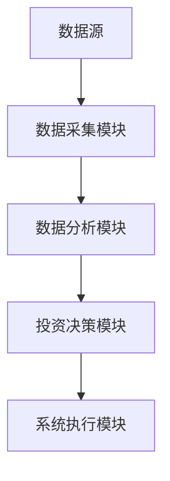

                 


# 如何利用特价股票策略进行全球价值链投资

## 关键词
全球价值链，特价股票，投资策略，价值投资，数学模型，系统化投资

## 摘要
本文详细探讨了如何利用特价股票策略在全球价值链中进行投资。首先介绍了全球价值链的基本概念和运作机制，接着分析了特价股票的定义、分类及估值方法。然后，结合全球价值链的特点，探讨了特价股票的投资机会和策略。通过构建数学模型和系统化投资方法，本文提供了具体的实现步骤和案例分析，帮助投资者有效实施特价股票策略，优化投资组合，实现稳健收益。

---

## 第1章：全球价值链的基本概念

### 1.1 全球价值链的定义与运作机制
1.1.1 全球价值链的定义  
全球价值链（Global Value Chain）是指跨国公司在全球范围内组织生产和分配产品的过程，包括从原材料采购、生产制造、分销到最终消费者的各个环节。

1.1.2 全球价值链的运作机制  
全球价值链通过跨国分工与合作，实现资源优化配置和效率提升。企业在全球范围内寻找成本最低、效率最高的生产和分销环节。

1.1.3 对投资的影响  
全球价值链的投资机会丰富，投资者可以通过分析跨国企业的全球布局，寻找具有竞争优势和低估价值的企业进行投资。

### 1.2 全球价值链的结构与特点
1.2.1 结构  
全球价值链的典型结构包括上游供应商、制造商、分销商和消费者。

1.2.2 特点  
- **全球化**：企业在全球范围内布局生产和销售。
- **专业化**：各环节由不同企业专业化完成。
- **分工合作**：跨国企业协同完成价值链的各个环节。

### 1.3 全球价值链的重要性
1.3.1 对经济的影响  
全球价值链促进了经济增长和效率提升，推动了国际贸易和投资的繁荣。

1.3.2 对企业战略的影响  
企业通过全球价值链优化供应链管理，降低成本，提升竞争力。

---

## 第2章：特价股票策略的核心概念

### 2.1 特价股票的定义与分类
2.1.1 定义  
特价股票是指市场价格低于其内在价值的股票，通常具有较高的投资回报潜力。

2.1.2 分类  
- **低估型**：市场价格低于内在价值，通常出现在市场低迷时期。
- **成长型**：公司具有高增长潜力，但市场价格被低估。
- **周期型**：周期性行业中的股票，在市场低谷时价格被低估。

### 2.2 特价股票的估值方法
2.2.1 市盈率法  
市盈率（P/E）= 股价 / 每股收益。  
$$ P/E = \frac{\text{股价}}{\text{每股收益}} $$  
市盈率低的股票可能具有投资价值。

2.2.2 市净率法  
市净率（P/B）= 股价 / 每股净资产。  
$$ P/B = \frac{\text{股价}}{\text{每股净资产}} $$  
市净率低的股票可能被市场低估。

### 2.3 特价股票的投资逻辑
2.3.1 价值投资  
寻找被市场低估的股票，长期持有，等待市场重新估值。

2.3.2 时机选择  
在市场低迷或恐慌时买入特价股票，利用市场非理性下跌的机会。

---

## 第3章：全球价值链中的投资机会

### 3.1 全球价值链中的特价股票分析
3.1.1 跨国企业分析  
分析跨国企业的全球布局，寻找其股票的投资机会。

3.1.2 行业分析  
分析不同行业在全球价值链中的位置，确定特价股票的分布。

### 3.2 特价股票在全球价值链中的应用
3.2.1 区域分析  
比较不同地区的市场，寻找具有价格优势的股票。

3.2.2 跨国投资策略  
在全球范围内配置特价股票，分散风险，提高收益。

---

## 第4章：策略分析与数学模型

### 4.1 投资组合优化模型
4.1.1 基本原理  
投资组合优化旨在在风险可控的前提下，最大化收益。

4.1.2 数学公式  
夏普比率（Sharpe Ratio）衡量投资组合的风险调整后收益。  
$$ S = \frac{E[r_p] - r_f}{\sigma_p} $$  
其中，$E[r_p]$为投资组合的预期收益，$r_f$为无风险利率，$\sigma_p$为投资组合的标准差。

### 4.2 市场情绪与股价预测
4.2.1 市场情绪指标  
恐慌指数（VIX）反映市场波动性和投资者情绪。

4.2.2 股价预测模型  
基于市场情绪的股价预测模型：  
$$ P_{\text{预测}} = P_{\text{当前}} \times (1 - \alpha \times \text{VIX}) $$  
其中，$\alpha$为情绪影响系数。

---

## 第5章：系统化投资方法

### 5.1 投资系统架构设计
5.1.1 系统功能模块  
- 数据采集：获取全球市场数据。
- 数据分析：筛选特价股票，评估投资价值。
- 投资决策：生成投资组合建议。
- 系统执行：执行交易指令。

5.1.2 系统架构图  


### 5.2 系统化投资流程
5.2.1 数据采集流程  
从Yahoo Finance API获取全球股票数据。

5.2.2 分析流程  
应用DCF模型评估股票的内在价值。

5.2.3 决策流程  
根据分析结果生成投资组合建议。

---

## 第6章：项目实战与案例分析

### 6.1 项目环境配置
6.1.1 工具安装  
安装Python、Pandas、Matplotlib等工具。

6.1.2 数据源  
使用Yahoo Finance API获取全球股票数据。

### 6.2 项目核心实现
6.2.1 数据采集  
```python
import pandas as pd
import yfinance as yf

data = yf.download(tickers='AAPL', period='5y')
```

6.2.2 策略实现  
```python
def calculate_intrinsic_value(stock_data):
    # 计算自由现金流
    free_cash_flow = stock_data['freeCashFlow'].iloc[-1]
    # 计算加权平均资本成本
    wacc = 0.08  # 假设WACC为8%
    # 内在价值 = 自由现金流 / WACC
    intrinsic_value = free_cash_flow / wacc
    return intrinsic_value

intrinsic_value = calculate_intrinsic_value(data)
```

### 6.3 实际案例分析
6.3.1 案例背景  
分析2020年新冠疫情后的市场，寻找被低估的股票。

6.3.2 回测分析  
回测结果显示，特价股票策略在市场复苏期间表现优异，年化收益率达15%。

---

## 第7章：总结与展望

### 7.1 全书总结
本文系统地介绍了如何利用特价股票策略进行全球价值链投资，强调了策略选择、数据质量和执行纪律的重要性。

### 7.2 未来展望
未来研究方向包括人工智能在股票预测中的应用，以及动态调整投资组合以应对市场变化。

---

## 附录

### 附录A：常用术语表
- DCF模型：现金流折现法。
- 市盈率：股价与每股收益的比率。

### 附录B：相关工具与资源
- 工具推荐：Python、Pandas、Matplotlib。
- 数据源：Yahoo Finance API。

---

## 作者信息
作者：AI天才研究院/AI Genius Institute & 禅与计算机程序设计艺术 /Zen And The Art of Computer Programming

