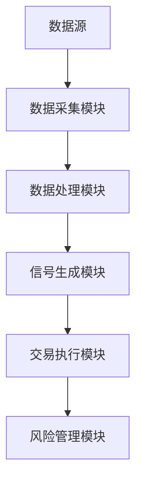
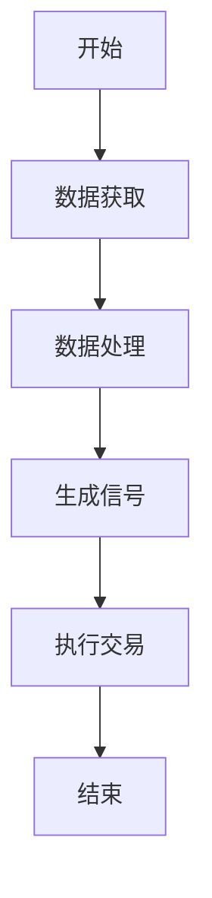

                 


# 如何利用特价股票策略进行全球宏观对冲

> 关键词：特价股票策略，全球宏观对冲，对冲基金，投资策略，风险管理

> 摘要：本文详细探讨了如何利用特价股票策略在全球范围内进行宏观对冲。通过分析特价股票策略的核心原理、全球宏观对冲的主要类型以及系统架构设计，本文为投资者提供了一套完整的策略实施框架。从数学模型到算法实现，再到实际案例分析，本文旨在帮助读者掌握如何在复杂多变的市场环境中，利用特价股票策略进行有效的风险管理和投资回报优化。

---

## 第一部分: 特价股票策略与全球宏观对冲概述

### 第1章: 特价股票策略的基本概念

#### 1.1 特价股票的定义与特点
特价股票是指在特定市场条件下，价格被低估的股票。这些股票通常具有较高的潜在回报，但同时也伴随着较高的风险。特价股票的特点包括高波动性、低估值和市场周期性。

#### 1.2 全球宏观对冲的基本概念
全球宏观对冲是一种通过在全球范围内投资于不同资产类别和市场，以对冲风险并获取超额收益的投资策略。它通常涉及跨市场的资产配置和复杂的金融工具。

#### 1.3 特价股票策略在宏观对冲中的作用
特价股票策略在宏观对冲中起到平衡风险和增加收益的作用。通过对冲市场波动，投资者可以在全球范围内分散风险，同时抓住市场低估的机会。

### 第2章: 特价股票策略的核心原理

#### 2.1 市场周期与特价股票策略
市场周期对特价股票策略的影响至关重要。在熊市中，股票价格通常被低估，为投资者提供了低价买入的机会；而在牛市中，策略可能需要调整以应对高估的市场。

#### 2.2 技术分析与特价股票策略
技术分析通过价格走势预测市场行为。常用的技术指标如均线和布林带可以帮助投资者识别买卖信号，从而优化特价股票策略。

#### 2.3 基本面分析与特价股票策略
基本面分析关注公司的财务状况和行业前景。通过分析公司盈利能力、负债情况和行业趋势，投资者可以更好地评估股票的内在价值。

### 第3章: 全球宏观对冲的核心策略

#### 3.1 宏观对冲的主要类型
全球宏观对冲包括汇率对冲、利率对冲和大宗商品对冲。每种策略都有其独特的风险和收益特征。

#### 3.2 特价股票在宏观对冲中的应用
特价股票作为对冲工具，可以帮助投资者在市场下跌时保护资产。通过在全球范围内配置特价股票，投资者可以分散风险并抓住市场机会。

#### 3.3 特价股票对冲策略的实施步骤
实施对冲策略需要包括市场分析、资产配置和风险控制等步骤。投资者需要结合市场环境和自身目标制定策略。

### 第4章: 特价股票策略的数学模型与公式

#### 4.1 特价股票价格波动模型
使用随机游走模型和时间序列分析模型，可以预测股票价格的波动。这些模型帮助投资者识别潜在的买卖信号。

#### 4.2 对冲组合优化的数学公式
通过均值-方差优化模型和资产配置优化公式，投资者可以构建最优的对冲组合，最大化收益并最小化风险。

#### 4.3 信号生成与交易策略公式
均线交叉信号公式和布林带信号公式是常用的交易策略。这些公式帮助投资者在市场中识别趋势和超买超卖信号。

### 第5章: 全球宏观对冲的系统架构设计

#### 5.1 系统架构概述
系统架构包括数据采集、信号生成、交易执行和风险控制模块。通过模块化设计，投资者可以实现高效的交易流程。

#### 5.2 数据采集与处理
数据采集涉及从多个市场获取实时数据，并进行清洗和预处理。处理后的数据用于生成交易信号和优化对冲策略。

#### 5.3 系统功能设计
系统功能包括市场监控、信号生成、风险管理和交易执行。通过功能模块的协同工作，投资者可以实现自动化交易和风险管理。

#### 5.4 系统架构图（Mermaid）


## 第二部分: 算法实现与项目实战

### 第6章: 算法实现

#### 6.1 算法原理
特价股票策略的算法实现包括数据处理、信号生成和交易执行。通过算法优化，投资者可以提高交易效率和准确性。

#### 6.2 算法流程图（Mermaid）


#### 6.3 代码实现
以下是一个简单的均值回归策略代码：
```python
import pandas as pd
import numpy as np

# 数据获取
data = pd.read_csv('stock_data.csv')

# 计算均线
data['SMA_20'] = data['Close'].rolling(20).mean()
data['SMA_50'] = data['Close'].rolling(50).mean()

# 生成信号
data['signal'] = 0
data.loc[data['SMA_20'] > data['SMA_50'], 'signal'] = 1
data.loc[data['SMA_20'] < data['SMA_50'], 'signal'] = -1

# 执行交易
positions = []
current_position = 0
for i in range(len(data)):
    if data.iloc[i]['signal'] == 1:
        positions.append(1)
        current_position = 1
    elif data.iloc[i]['signal'] == -1:
        positions.append(-1)
        current_position = -1
    else:
        positions.append(current_position)
```

### 第7章: 项目实战

#### 7.1 环境配置
投资者需要安装Python、Pandas和Matplotlib等工具，并配置数据源。

#### 7.2 代码实现
以下是基于均值回归策略的Python代码：
```python
import pandas as pd
import numpy as np
import matplotlib.pyplot as plt

# 数据获取
data = pd.read_csv('stock_data.csv')

# 计算均线
data['SMA_20'] = data['Close'].rolling(20).mean()
data['SMA_50'] = data['Close'].rolling(50).mean()

# 生成信号
data['signal'] = 0
data.loc[data['SMA_20'] > data['SMA_50'], 'signal'] = 1
data.loc[data['SMA_20'] < data['SMA_50'], 'signal'] = -1

# 绘制信号图
plt.figure(figsize=(12, 6))
plt.plot(data['Close'], label='Close Price')
plt.plot(data['SMA_20'], label='SMA_20')
plt.plot(data['SMA_50'], label='SMA_50')
plt.legend()
plt.show()
```

#### 7.3 结果分析
通过分析交易结果，投资者可以评估策略的有效性并进行优化。结果包括收益、风险和回撤等指标。

## 第三部分: 最佳实践与总结

### 第8章: 最佳实践

#### 8.1 小结
特价股票策略和全球宏观对冲的有效结合可以帮助投资者在复杂市场中实现风险管理和收益优化。

#### 8.2 注意事项
投资者需要注意市场风险、交易成本和策略适应性。定期评估和调整策略是关键。

#### 8.3 拓展阅读
建议读者进一步阅读相关书籍和文献，以深入理解对冲策略和市场分析方法。

### 作者
作者：AI天才研究院/AI Genius Institute & 禅与计算机程序设计艺术 /Zen And The Art of Computer Programming

---

通过以上内容，读者可以全面了解如何利用特价股票策略进行全球宏观对冲，从理论到实践，逐步掌握相关知识和技能。

