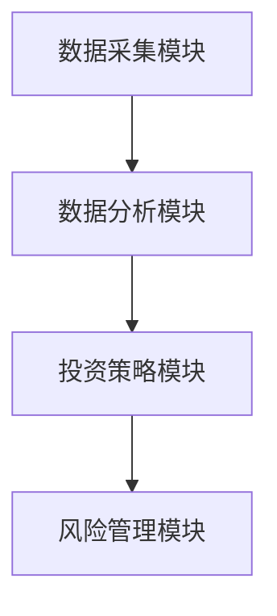
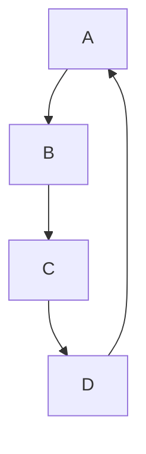

                 


# 如何利用特价股票策略进行全球数字价值链重构投资

## 关键词
- 特价股票策略
- 全球数字价值链重构
- 投资策略
- 数字经济
- 价值重构

## 摘要
本文将深入探讨如何利用特价股票策略在全球数字价值链重构中进行投资。通过分析数字经济发展带来的投资机会，结合特价股票策略的核心原理，构建数学模型，并设计系统架构，提供实际案例和风险管理策略，为投资者提供科学的指导。

---

## 第1章: 特价股票策略与全球数字价值链重构的背景

### 1.1 特价股票策略的定义与特点
#### 1.1.1 特价股票的定义
特价股票是指价格显著低于其内在价值的股票，通常出现在市场低迷或公司短期困境时期。其特点包括低估值、高潜力和周期性。

#### 1.1.2 特价股票的核心特点
- **低估值**：市场价格低于内在价值。
- **高潜力**：具备复苏或增长的潜力。
- **周期性**：依赖于市场周期波动。

#### 1.1.3 特价股票策略与传统投资策略的区别
| 特性 | 特价股票策略 | 传统投资策略 |
|------|--------------|---------------|
| 投资目标 | 低价买入，价值回归 | 长期增值 |
| 风险偏好 | 高风险，高回报 | 中低风险，稳定回报 |
| 持股周期 | 中短期 | 长期 |

### 1.2 全球数字价值链重构的背景
#### 1.2.1 数字经济的崛起
数字经济成为全球经济的主要驱动力，数字技术改变传统产业链。

#### 1.2.2 全球化与价值链重构的趋势
全球化导致价值链分布变化，数字技术加速重构。

#### 1.2.3 数字技术对价值链的影响
数字技术提升效率，降低成本，推动企业数字化转型。

### 1.3 特价股票策略与数字价值链重构的结合
#### 1.3.1 数字经济下的投资机会
数字技术推动产业升级，创造投资机会。

#### 1.3.2 特价股票策略在数字价值链重构中的作用
低价买入，价值重构中获得超额收益。

#### 1.3.3 特价股票策略与全球数字价值链重构的关联
数字技术推动企业价值重构，特价股票策略抓住投资机会。

---

## 第2章: 特价股票策略的核心概念与原理

### 2.1 特价股票策略的核心概念
#### 2.1.1 市场周期与投资机会
分析市场周期，抓住低价买入机会。

#### 2.1.2 特价股票的市场定位
评估公司基本面，确定其市场价格是否低估。

#### 2.1.3 特价股票策略的实施条件
市场低迷、公司基本面良好、价值回归潜力。

### 2.2 数字价值链重构的核心原理
#### 2.2.1 数字技术对价值链的影响
数字技术改变生产、分配和消费环节。

#### 2.2.2 数字化转型与企业竞争力
数字化转型提升企业竞争力，降低成本。

#### 2.2.3 数字价值链重构的驱动因素
技术进步、市场需求和政策支持。

### 2.3 特价股票策略与数字价值链重构的联系
#### 2.3.1 数字经济下的投资逻辑
数字技术推动企业价值重构，创造投资机会。

#### 2.3.2 特价股票策略在数字价值链重构中的应用
抓住数字经济转型中的低价股票，实现价值回归。

#### 2.3.3 数字经济时代投资策略的演变
从传统投资转向数字驱动的策略优化。

---

## 第3章: 特价股票策略与数字价值链重构的数学模型

### 3.1 特价股票策略的数学模型
#### 3.1.1 市场周期模型
$$ P = V \times (1 - \alpha) $$
其中，P为市场价格，V为内在价值，α为折价率。

#### 3.1.2 特价股票选择模型
$$ S = \sum_{i=1}^{n} (V_i - P_i) $$
其中，S为总价值差额，V_i为内在价值，P_i为市场价格。

#### 3.1.3 投资组合优化模型
$$ \max \sum w_i r_i $$
$$ \text{subject to} \sum w_i = 1 $$
其中，w_i为投资权重，r_i为预期回报率。

### 3.2 数字价值链重构的数学模型
#### 3.2.1 数字化转型评估模型
$$ E = \sum_{j=1}^{m} (0.3 \times T_j + 0.4 \times C_j + 0.3 \times R_j) $$
其中，T_j为技术因素，C_j为成本因素，R_j为收益因素。

#### 3.2.2 数字经济下的企业价值模型
$$ V = K \times (1 + r)^t $$
其中，K为初始价值，r为增长率，t为时间。

#### 3.2.3 数字价值链重构的预测模型
$$ P(t) = a \times t + b $$
其中，P(t)为预测价格，a为斜率，b为截距。

### 3.3 案例分析: 数学模型在实际投资中的应用
#### 3.3.1 案例背景
某科技公司因市场低迷，股价低于内在价值，具备价值回归潜力。

#### 3.3.2 模型构建与应用
使用市场周期模型和投资组合优化模型，评估投资价值。

#### 3.3.3 投资结果与模型验证
验证模型预测的准确性，评估投资回报。

---

## 第4章: 特价股票策略与数字价值链重构的系统架构设计

### 4.1 系统功能模块设计
#### 4.1.1 数据采集模块
采集市场数据、公司基本面数据。

#### 4.1.2 数据分析模块
分析数据，评估股票价值。

#### 4.1.3 投资策略模块
制定投资策略，优化投资组合。

#### 4.1.4 风险管理模块
评估风险，制定风险管理策略。

### 4.2 系统架构设计
#### 4.2.1 系统架构图


#### 4.2.2 模块交互流程图


#### 4.2.3 系统接口设计
- 数据接口：数据采集模块与外部数据库交互。
- 模型接口：数据分析模块与投资策略模块交互。

### 4.3 系统交互序列图
```mermaid
sequenceDiagram
参与者: 用户
系统: 投资系统
参与者 -> 系统: 请求分析
系统 -> 数据采集模块: 获取数据
数据采集模块 -> 数据分析模块: 分析数据
数据分析模块 -> 投资策略模块: 制定策略
投资策略模块 -> 风险管理模块: 评估风险
风险管理模块 -> 系统: 返回结果
系统 -> 用户: 提供投资建议
```

---

## 第5章: 特价股票策略与数字价值链重构的项目实战

### 5.1 环境安装
- 安装Python、数据处理工具、数据分析库。

### 5.2 系统核心实现源代码
```python
import pandas as pd
import numpy as np

# 数据采集模块
def collect_data(tickers):
    data = pd.DataFrame()
    for ticker in tickers:
        # 获取数据
        pass
    return data

# 数据分析模块
def analyze_data(data):
    valuation = data['valuation']
    price = data['price']
    value_diff = valuation - price
    return value_diff

# 投资策略模块
def invest_strategy(value_diff, threshold=0.1):
    buy = value_diff > threshold
    return buy

# 风险管理模块
def manage-risk(buy_signal, portfolio):
    # 风险评估
    pass

# 实际应用
tickers = ['AAPL', 'MSFT', 'GOOGL']
data = collect_data(tickers)
value_diff = analyze_data(data)
buy_signal = invest_strategy(value_diff)
manage-risk(buy_signal, portfolio)
```

### 5.3 代码应用解读与分析
- 数据采集模块：获取目标股票的市场数据和基本面数据。
- 数据分析模块：计算股票的内在价值与市场价格差额。
- 投资策略模块：根据价值差额制定买入信号。
- 风险管理模块：评估投资组合的风险，调整投资策略。

### 5.4 实际案例分析
- 案例背景：某科技公司因市场低迷，股价低于内在价值。
- 数据分析：计算价值差额，确定买入信号。
- 投资结果：股价回升，实现收益。

### 5.5 项目小结
- 成功实现特价股票策略在数字价值链重构中的应用。
- 验证模型的有效性，为投资者提供科学指导。

---

## 第6章: 特价股票策略与数字价值链重构的风险管理

### 6.1 风险识别与评估
- 市场风险：市场波动影响股票价格。
- 个股风险：公司基本面变化影响股价。
- 操作风险：投资决策失误或操作失误。

### 6.2 风险管理策略
- 分散投资：降低个股风险。
- 风险对冲：使用衍生工具对冲市场风险。
- 定期评估：定期评估投资组合，调整策略。

### 6.3 风险管理的数学模型
$$ R = \sum_{i=1}^{n} w_i \times r_i $$
其中，R为总风险，w_i为权重，r_i为风险因素。

---

## 第7章: 数字经济时代特价股票策略的未来趋势

### 7.1 数字经济对投资策略的影响
- 数字技术推动投资策略创新。
- 数据分析能力成为核心竞争力。

### 7.2 特价股票策略的演变
- 从传统策略转向数据驱动策略。
- 利用人工智能和大数据优化投资决策。

### 7.3 数字经济时代的投资机会
- 数字技术推动产业升级，创造投资机会。
- 全球化与本地化结合，拓展投资空间。

---

## 附录

### 附录A: 术语表
- 特价股票：市场价格低于内在价值的股票。
- 数字价值链：基于数字技术的产业链。

### 附录B: 参考文献
- John C. Bogle,《The Intelligent Investor》
- Eugene F. Fama,《Stochastic Discounted Cash Flow Models》

---

## 作者
作者：AI天才研究院 & 禅与计算机程序设计艺术

---

通过以上目录大纲，我们可以看到，文章从背景、核心概念、数学模型、系统设计、实战案例、风险管理到未来趋势，全面而深入地探讨了如何利用特价股票策略进行全球数字价值链重构投资。

