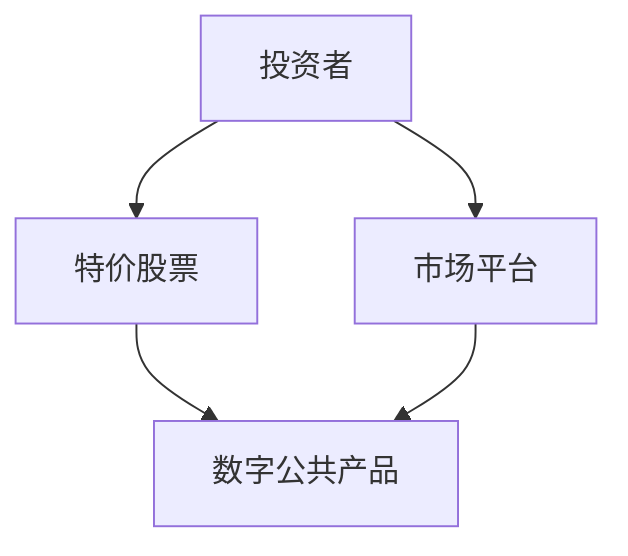
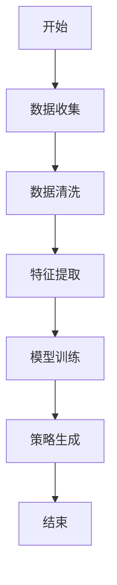
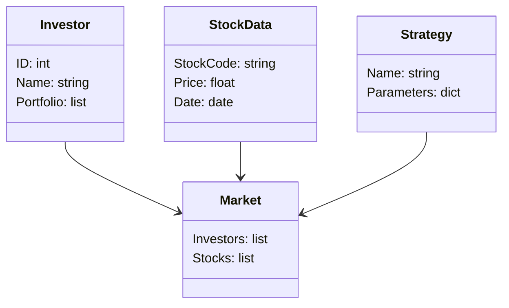
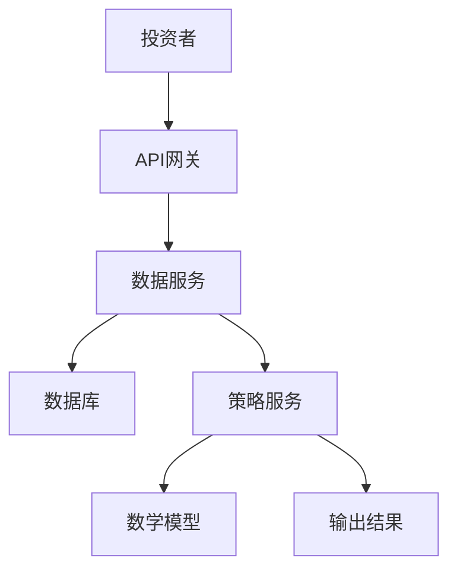
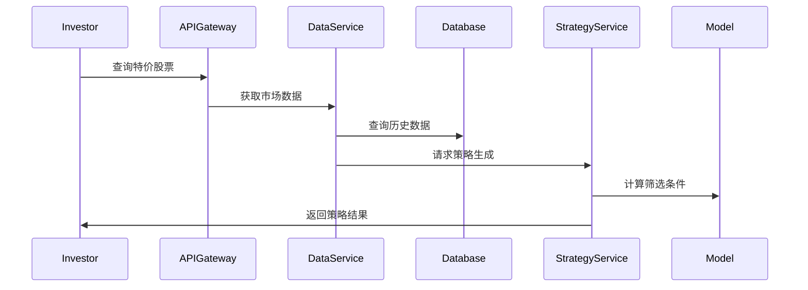

                 


# 如何利用特价股票策略进行全球数字公共产品投资

## 关键词：特价股票、数字公共产品、投资策略、算法分析、系统架构

## 摘要：本文详细探讨了如何利用特价股票策略在全球范围内投资数字公共产品。通过分析特价股票的市场机制和数字公共产品的经济模型，结合算法原理和系统设计，为投资者提供有效的投资策略和实战案例。

---

## 第一部分：背景介绍

### 第1章：特价股票策略与全球数字公共产品概述

#### 1.1 特价股票策略的背景与概念

##### 1.1.1 特价股票的定义与特点
特价股票是指在特定条件下以低于市场价出售的股票。这些条件可能包括市场波动、公司重组或促销活动。特价股票的特点包括高波动性、高风险和潜在的高回报。

##### 1.1.2 全球数字公共产品的概念
数字公共产品是指通过数字技术提供的、可访问且可持续的公共服务或产品。例如，在线教育平台、数字支付系统和云服务等。这些产品在全球范围内具有广泛的应用和影响。

##### 1.1.3 特价股票策略与数字公共产品的结合
将特价股票策略应用于数字公共产品投资，可以通过低价买入高潜力的股票，利用市场的波动性和数字产品的需求增长，实现投资收益。

#### 1.2 投资背景与问题描述

##### 1.2.1 当前全球投资环境分析
全球市场波动加剧，数字技术的普及使得数字公共产品成为投资热点。投资者需要寻找有效的策略，在不确定的市场中获取稳定收益。

##### 1.2.2 特价股票策略的应用场景
在市场低迷或特定事件（如公司重组）时，特价股票可能提供低价买入的机会。通过分析这些机会，投资者可以利用数字公共产品的增长潜力，实现投资收益。

##### 1.2.3 数字公共产品在全球投资中的作用
数字公共产品具有高成长性和广泛的应用场景。通过投资相关股票，投资者可以分享数字技术发展的红利，同时利用特价策略降低投资成本。

#### 1.3 问题解决与边界

##### 1.3.1 特价股票策略如何解决投资问题
通过低价买入，投资者可以在市场回升时获得超额收益。特价策略帮助投资者降低进入市场的成本，提高投资效率。

##### 1.3.2 边界与外延：策略适用的范围
特价股票策略适用于市场波动较大、有特定催化剂事件的股票。然而，策略的有效性取决于市场条件和公司基本面。

##### 1.3.3 核心要素：策略的关键组成部分
特价股票策略的关键要素包括市场分析、股票筛选、投资时机和风险管理。这些要素共同决定了策略的成功与否。

---

## 第二部分：核心概念与联系

### 第2章：特价股票策略的核心概念

#### 2.1 核心概念原理

##### 2.1.1 特价股票的市场机制
特价股票通常由市场机制驱动，如供给与需求的变化、市场情绪波动和公司特定事件。理解这些机制有助于投资者识别潜在的机会。

##### 2.1.2 数字公共产品的经济模型
数字公共产品具有网络效应和规模经济。其经济模型通常涉及高初始投资和边际成本递减。这些特征使其在数字时代具有较高的投资价值。

##### 2.1.3 两者结合的理论基础
特价股票策略与数字公共产品投资的结合基于市场波动性和数字技术的长期增长潜力。投资者通过在低价时买入数字公共产品相关股票，可以在市场回升时获得收益。

#### 2.2 核心概念属性对比

##### 2.2.1 表格对比：特价股票与普通股票的差异

| 属性                | 特价股票             | 普通股票             |
|---------------------|---------------------|---------------------|
| 定义                | 特定条件下低价出售的股票 | 市场价格波动的股票     |
| 波动性              | 高                  | 中到高               |
| 投资风险            | 高                  | 中到高               |
| 投资回报潜力        | 高                  | 中到高               |

##### 2.2.2 图表分析：数字公共产品的属性特征

数字公共产品的属性特征可以通过以下图表展示：


#### 2.3 ER实体关系图

以下是一个简化的ER实体关系图，展示了特价股票、投资者和数字公共产品之间的关系：



---

## 第三部分：算法原理讲解

### 第3章：特价股票策略的算法分析

#### 3.1 算法流程图

以下是一个特价股票策略的算法流程图：



#### 3.2 算法实现代码

以下是一个简单的Python代码示例，用于筛选特价股票：

```python
import pandas as pd

def find_discount_stocks(data, threshold=0.2):
    """
    筛选低于市场价一定比例的股票
    """
    market_price = data['当前股价'].mean()
    discounted_stocks = data[data['当前股价'] < market_price * (1 - threshold)]
    return discounted_stocks

# 示例数据
data = {
    '股票代码': ['A', 'B', 'C', 'D'],
    '当前股价': [100, 80, 90, 120]
}
df = pd.DataFrame(data)
result = find_discount_stocks(df, 0.15)
print(result)
```

#### 3.3 数学模型与公式

##### 3.3.1 特价股票筛选模型
$$ \text{筛选条件} = \text{当前股价} < \text{基准价} \times (1 - \theta) $$

其中，$\theta$ 是折扣比例，通常在0到1之间。

##### 3.3.2 投资收益计算
$$ \text{收益} = \sum_{i=1}^{n} (\text{卖出价}_i - \text{买入价}_i) $$

##### 3.3.3 风险评估模型
$$ \text{风险指数} = \frac{\sum_{i=1}^{n} (\text{波动率}_i)}{n} $$

---

## 第四部分：系统分析与架构设计

### 第4章：投资分析系统设计

#### 4.1 系统功能设计

##### 4.1.1 功能模块
- 数据采集模块：实时收集股票数据和市场信息。
- 数据处理模块：清洗和预处理数据，提取特征。
- 策略生成模块：基于算法生成投资策略。
- 风险评估模块：评估投资风险，提供风险管理建议。

##### 4.1.2 领域模型类图



#### 4.2 系统架构设计

##### 4.2.1 系统架构图



#### 4.3 接口设计

##### 4.3.1 数据接口
- 输入接口：接受投资者的查询请求，返回市场数据。
- 输出接口：返回筛选后的股票列表和投资策略。

##### 4.3.2 交互流程图



---

## 第五部分：项目实战

### 第5章：全球数字公共产品投资实战

#### 5.1 环境配置

##### 5.1.1 技术栈
- 数据库：MySQL
- 语言：Python
- 工具：Pandas、NumPy、Matplotlib

#### 5.2 系统核心实现

##### 5.2.1 策略实现代码

```python
import pandas as pd
import numpy as np

def generate_strategy(data, threshold=0.15):
    """
    生成特价股票投资策略
    """
    # 计算基准价
    benchmark = data['当前股价'].mean()
    # 筛选特价股票
    discounted_stocks = data[data['当前股价'] < benchmark * (1 - threshold)]
    return discounted_stocks

# 示例数据加载
data = pd.read_csv('market_data.csv')
# 生成策略
result = generate_strategy(data)
print(result)
```

##### 5.2.2 风险管理代码

```python
def calculate_risk(data, window=30):
    """
    计算股票的波动率
    """
    returns = data['当前股价'].pct_change()
    volatility = returns.rolling(window).std()
    return volatility

# 示例计算
risk = calculate_risk(data)
print(risk)
```

#### 5.3 案例分析

##### 5.3.1 实际案例
假设在2023年，某数字公共产品公司的股票因市场波动降价。投资者利用特价股票策略，以低价买入该股票。当市场回升时，股票价格上涨，投资者获利。

##### 5.3.2 项目总结
通过特价股票策略，投资者能够在市场波动中捕捉到低价机会，利用数字公共产品的长期增长潜力，实现投资收益。同时，系统化的分析和风险管理能够降低投资风险，提高策略的有效性。

---

## 第六部分：最佳实践

### 第6章：总结与建议

#### 6.1 小结

特价股票策略与全球数字公共产品投资的结合，为投资者提供了新的机会。通过系统化的分析和策略实施，投资者可以在市场波动中获利。

#### 6.2 注意事项

- **风险控制**：投资者需注意市场波动和公司基本面，避免盲目跟风。
- **策略优化**：根据市场变化，定期优化投资策略和模型。
- **技术依赖**：依赖先进的数据分析工具和技术，提高策略执行效率。

#### 6.3 拓展阅读

建议读者深入学习量化投资、算法交易和数字公共产品的相关知识，以提升投资策略的有效性。

---

## 作者：AI天才研究院/AI Genius Institute & 禅与计算机程序设计艺术 /Zen And The Art of Computer Programming

---

**结语**：通过本文的详细讲解，读者可以系统地了解如何利用特价股票策略进行全球数字公共产品投资。从理论分析到实战案例，本文为投资者提供了全面的指导和实用的建议。

