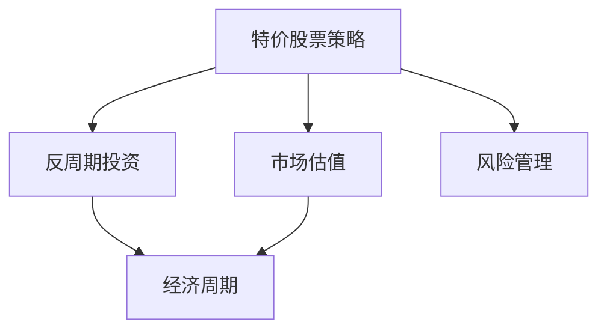
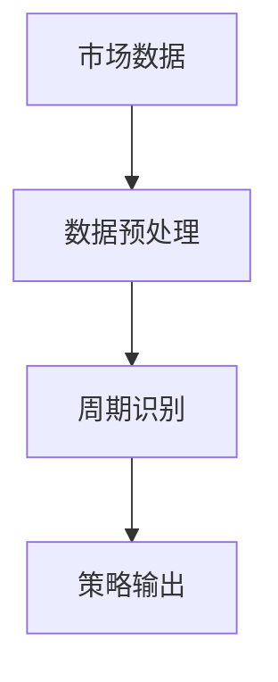
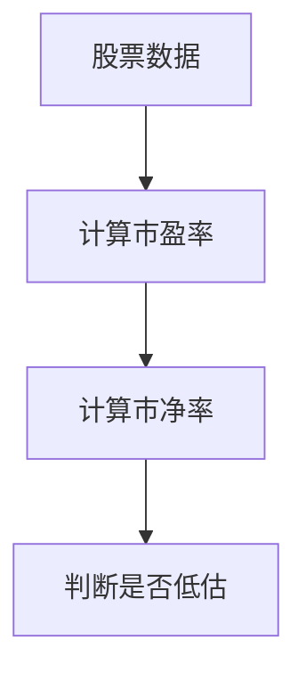
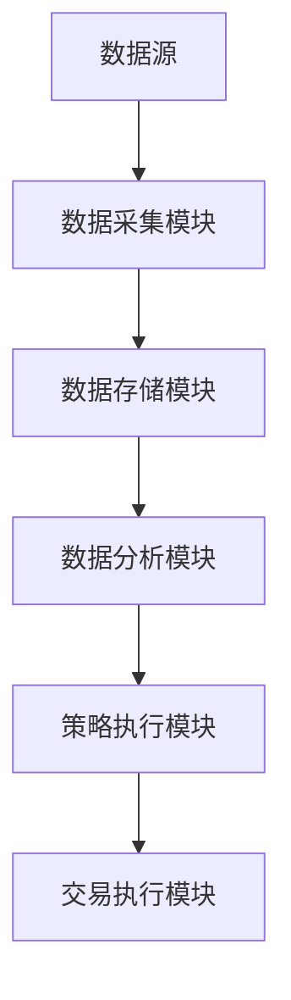
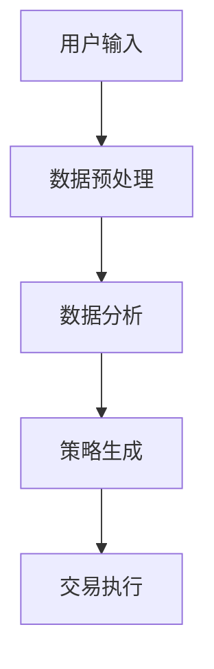

                 


# 如何利用特价股票策略进行反周期投资

## 关键词：
- 特价股票策略
- 反周期投资
- 市场周期分析
- 估值分析
- 风险管理

## 摘要：
在经济波动加剧的背景下，反周期投资成为投资者规避风险、抓住机遇的重要策略。特价股票策略作为一种有效的投资工具，通过在市场低谷时买入、在市场高点时卖出，帮助投资者实现超额收益。本文将详细探讨特价股票策略与反周期投资的核心概念、数学模型、算法原理、系统设计及实际应用，帮助投资者在经济周期波动中把握投资机会。

---

# 第一部分: 特价股票策略与反周期投资基础

## 第1章: 特价股票策略概述

### 1.1 特价股票策略的核心概念

#### 1.1.1 什么是特价股票
特价股票是指在市场周期低谷时，因市场恐慌或短期波动导致价格被低估的优质股票。这些股票通常具有较高的内在价值，但在市场下跌时被错杀，为投资者提供了买入机会。

#### 1.1.2 特价股票的特征与优势
- **低估值**：市盈率、市净率等估值指标显著低于行业平均水平。
- **高分红**：部分特价股票公司具备稳定的盈利能力，能够持续分红。
- **逆周期特性**：在经济低迷时，部分行业（如公用事业、医疗等）的需求相对稳定，相关股票价格波动较小。

#### 1.1.3 特价股票与普通股票的区别
| 特性 | 特价股票 | 普通股票 |
|------|----------|----------|
| 估值 | 通常低估 | 估值合理或高估 |
| 风险 | 风险较低 | 风险受市场影响较大 |
| 时机 | 适合在市场低谷时买入 | 适合在市场高点时买入 |

### 1.2 反周期投资的基本原理

#### 1.2.1 经济周期与投资的关系
经济周期分为四个阶段：繁荣、衰退、萧条、复苏。反周期投资的核心在于在经济衰退或萧条阶段布局，避免市场高点的剧烈波动。

#### 1.2.2 反周期投资的定义与目标
反周期投资是指在经济周期低谷时投资，通过买入被低估的资产，在市场复苏时卖出，实现超额收益。

#### 1.2.3 反周期投资的核心策略
- **逆向投资**：在市场恐慌时买入，市场乐观时卖出。
- **价值投资**：寻找具有持续盈利能力且估值被低估的企业。
- **分散投资**：通过多元化配置降低投资风险。

### 1.3 特价股票策略与反周期投资的联系

#### 1.3.1 特价股票策略在反周期投资中的作用
特价股票策略是反周期投资的重要工具，通过在市场低谷时买入特价股票，投资者可以在市场复苏时获得超额收益。

#### 1.3.2 反周期投资如何影响特价股票策略
反周期投资强调在经济低谷时布局，这与特价股票策略的核心思想高度契合。通过分析经济周期，投资者可以更好地把握特价股票的投资时机。

#### 1.3.3 特价股票策略的适用场景与边界
- **适用场景**：经济衰退、市场恐慌、行业周期低谷。
- **边界**：避免在市场过热时盲目买入，需结合行业分析和公司基本面。

### 1.4 特价股票策略与反周期投资的概念结构图


---

## 第2章: 特价股票策略的核心概念与联系

### 2.1 特价股票策略的核心要素

#### 2.1.1 市场周期分析
- **市场周期**：通过分析经济指标（如GDP增速、PMI、失业率等）判断市场所处周期阶段。
- **市场情绪**：利用投资者情绪指标（如恐慌指数VIX）判断市场是否处于恐慌或贪婪状态。

#### 2.1.2 估值分析
- **市盈率（P/E）**：股票价格与每股收益的比率，衡量股票是否被高估或低估。
- **市净率（P/B）**：股票价格与每股净资产的比率，适用于评估银行、房地产等行业的股票。

#### 2.1.3 风险管理
- **止损策略**：设定止损点，避免亏损过大。
- **分散投资**：通过投资不同行业和地区的股票降低风险。

### 2.2 特价股票策略与反周期投资的关系

#### 2.2.1 特价股票策略在反周期投资中的位置
特价股票策略是反周期投资的重要组成部分，通过在市场低谷时买入被低估的股票，投资者可以在市场复苏时获得超额收益。

#### 2.2.2 反周期投资如何影响特价股票策略
反周期投资强调在经济低谷时布局，这为特价股票策略提供了明确的投资时机。通过分析经济周期，投资者可以更好地把握特价股票的投资机会。

#### 2.2.3 两者结合的数学模型
$$
\text{投资收益} = \text{买入价} \times \text{持有时间} \times (\text{卖出价} - \text{买入价})
$$

---

## 第3章: 特价股票策略的数学模型与算法原理

### 3.1 特价股票策略的数学模型

#### 3.1.1 市场周期的数学表示
$$
\text{周期阶段} = \begin{cases}
\text{繁荣} & \text{GDP增速 > 4\%} \\
\text{衰退} & \text{GDP增速 < 2\%} \\
\text{复苏} & \text{2\% < GDP增速 < 4\%} \\
\text{萧条} & \text{GDP增速 < 0\%}
\end{cases}
$$

#### 3.1.2 估值的数学公式
$$
\text{市盈率} = \frac{\text{股票价格}}{\text{每股收益}}
$$
$$
\text{市净率} = \frac{\text{股票价格}}{\text{每股净资产}}
$$

#### 3.1.3 风险的数学模型
$$
\text{风险} = \text{标准差} \times \text{投资金额}
$$

### 3.2 算法原理讲解

#### 3.2.1 市场周期识别算法


#### 3.2.2 估值分析算法


---

# 第二部分: 策略与分析

## 第4章: 特价股票策略的实施

### 4.1 特价股票策略的实施步骤

#### 4.1.1 确定投资目标
- 明确投资目标：收益目标、风险承受能力。
- 选择行业：优先选择防御性行业（如公用事业、医疗等）。

#### 4.1.2 数据收集与分析
- 数据收集：收集历史价格、财务报表、行业数据等。
- 数据分析：利用技术分析（如K线图、均线、MACD）和基本面分析（如ROE、ROA）判断股票是否被低估。

#### 4.1.3 构建投资组合
- 分散投资：将资金分配到不同行业和地区的股票中，降低风险。
- 定期调整：根据市场变化和公司基本面调整持仓。

### 4.2 技术分析与投资策略

#### 4.2.1 技术分析方法
- **相对强弱指数（RSI）**：用于判断股票是否超买或超卖。
- **移动平均线（MA）**：用于判断股票的短期和长期趋势。

#### 4.2.2 量化交易策略
- **均值回归策略**：在股票价格偏离均值时买入或卖出。
- **动量策略**：根据价格趋势进行投资。

### 4.3 投资组合管理

#### 4.3.1 投资组合构建
- **资产配置**：根据市场周期选择股票、债券等资产的比例。
- **行业配置**：选择具有抗跌性的行业。

#### 4.3.2 风险控制
- **止损策略**：设定止损点，避免亏损过大。
- **再平衡**：定期调整投资组合，保持目标配置。

---

## 第5章: 系统分析与架构设计

### 5.1 系统分析

#### 5.1.1 问题场景介绍
- 投资者需要在市场低谷时快速识别特价股票。
- 需要实时监控市场数据，及时调整投资策略。

#### 5.1.2 系统功能设计
- **数据采集模块**：收集市场数据、公司财务数据等。
- **分析模块**：进行估值分析、市场周期判断。
- **策略执行模块**：根据分析结果生成买卖信号。

### 5.2 系统架构设计

#### 5.2.1 系统架构图


#### 5.2.2 数据流图


---

## 第6章: 项目实战

### 6.1 项目背景与目标

#### 6.1.1 项目背景
- 选择一个经济衰退的阶段，寻找被低估的股票。
- 以医疗行业为例，分析其防御性特征。

#### 6.1.2 项目目标
- 识别医疗行业的特价股票。
- 构建投资组合，制定交易策略。

### 6.2 系统实现

#### 6.2.1 环境安装
- 数据源：Yahoo Finance API。
- 工具：Python、Pandas、Matplotlib、Backtrader。

#### 6.2.2 核心代码实现
```python
import pandas as pd
import yfinance as yf

# 数据获取
data = yf.download('AAPL', start='2020-01-01', end='2023-12-31')

# 计算估值指标
data['PE'] = data['Close'] / data['EPS']
data['PB'] = data['Close'] / data['Book Value Per Share']

# 筛选特价股票
cheap Stocks = data[data['PE'] < data['PE'].mean() & data['PB'] < data['PB'].mean()]
```

---

## 第7章: 最佳实践与总结

### 7.1 最佳实践

#### 7.1.1 投资策略
- 逆向投资：在市场恐慌时买入，市场乐观时卖出。
- 分散投资：避免过度集中，降低风险。

#### 7.1.2 风险管理
- 设定止损点：避免亏损过大。
- 定期再平衡：保持投资组合的稳定性。

### 7.2 总结与展望

#### 7.2.1 总结
- 特价股票策略是一种有效的反周期投资工具。
- 通过市场周期分析和估值分析，投资者可以在市场低谷时抓住投资机会。

#### 7.2.2 展望
- 随着技术进步，量化交易和机器学习将为反周期投资提供更多的工具和方法。
- 投资者需要不断学习和适应市场变化，才能在复杂的经济环境中立于不败之地。

---

# 结语

通过本文的详细讲解，读者可以全面了解如何利用特价股票策略进行反周期投资。从理论到实践，从基础到高级，本文为投资者提供了系统的指导和实用的工具。希望本文能够帮助投资者在经济波动中把握投资机会，实现财富的稳健增长。

---

**作者：AI天才研究院/AI Genius Institute & 禅与计算机程序设计艺术 /Zen And The Art of Computer Programming**

