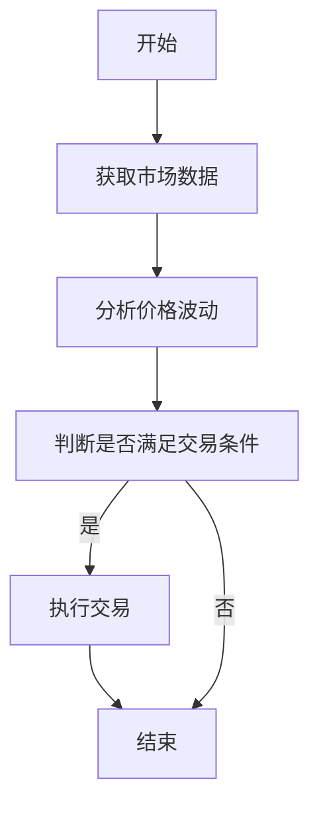
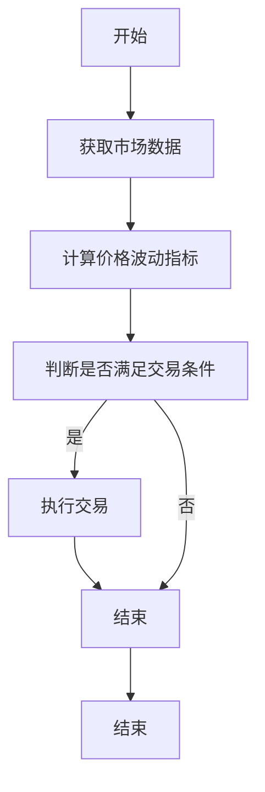
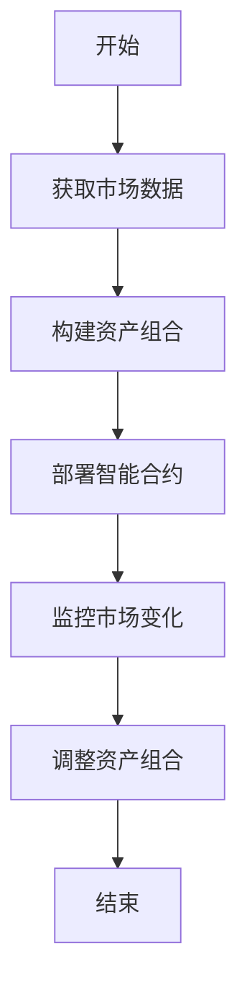
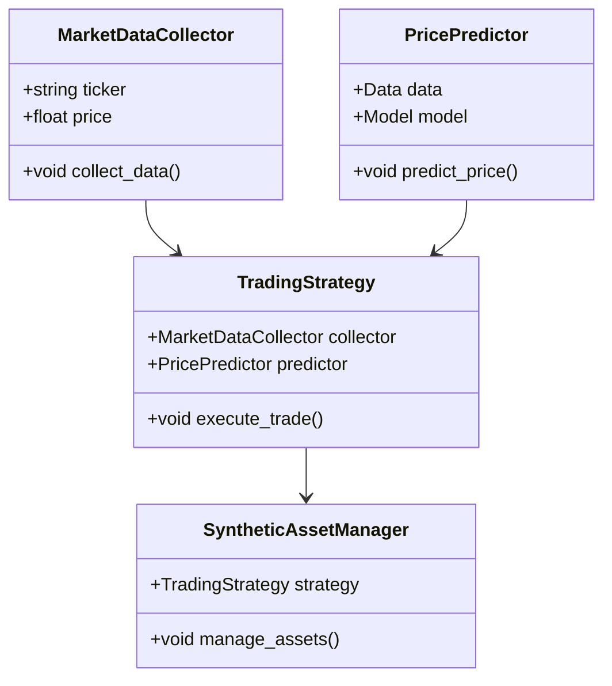
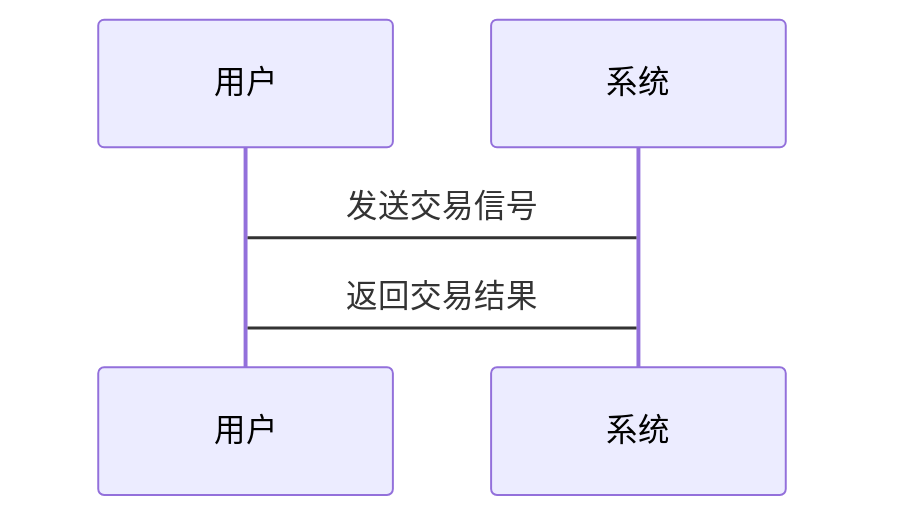

                 


# 如何利用特价股票策略进行数字合成资产投资

> 关键词：特价股票策略、数字合成资产、投资策略、算法实现、系统架构

> 摘要：本文详细探讨了如何利用特价股票策略进行数字合成资产投资。首先介绍了特价股票策略和数字合成资产的基本概念，接着分析了两者的联系与区别。然后从算法原理、系统架构设计、项目实战等方面详细阐述了如何将特价股票策略应用于数字合成资产投资中。文章还提供了具体的代码实现和案例分析，帮助读者更好地理解和应用相关知识。

---

## 第一部分: 特价股票策略与数字合成资产投资背景介绍

### 第1章: 特价股票策略概述

#### 1.1 什么是特价股票策略
特价股票策略是一种基于市场波动和价格差异，通过购买和销售特定股票来获利的投资策略。其核心在于捕捉市场中的短期价格波动，利用价格差异进行套利或短期投资。

- **1.1.1 特价股票的定义**
  特价股票指的是在特定时间点价格低于市场平均水平的股票。这些股票通常具有较高的性价比，适合进行短期投资或套利。

- **1.1.2 特价股票的特点**
  - 价格波动大，容易捕捉短期机会。
  - 风险较高，需要精准的市场判断。
  - 适合短期投资者，尤其是机构投资者。

- **1.1.3 特价股票与传统股票的区别**
  传统股票是指在市场中长期持有的股票，而特价股票则是短期交易的工具，注重价格波动带来的收益。

#### 1.2 数字合成资产的基本概念
数字合成资产是一种通过算法和区块链技术合成的虚拟资产，它可以代表多种金融资产的组合。数字合成资产的优势在于其高度的流动性和透明性，能够为投资者提供更多的投资选择。

- **1.2.1 数字合成资产的定义**
  数字合成资产是通过智能合约在区块链上合成的虚拟资产，可以代表股票、债券、黄金等多种传统资产。

- **1.2.2 数字合成资产的优势**
  - 高度透明，交易记录可追溯。
  - 全球化，不受地域限制。
  - 高度流动性，可以随时买卖。

- **1.2.3 数字合成资产的应用场景**
  数字合成资产可以用于对冲风险、分散投资、套利等多种场景，尤其适合机构投资者和高净值个人。

#### 1.3 特价股票策略与数字合成资产的关系
特价股票策略和数字合成资产之间存在密切的联系。通过数字合成资产，投资者可以将特价股票策略扩展到更广泛的金融资产领域，利用数字技术实现更高效的交易和风险管理。

---

### 第2章: 特价股票策略在数字合成资产中的应用

#### 2.1 特价股票策略的核心思想
特价股票策略的核心思想是通过分析市场波动，捕捉短期价格差异，实现快速盈利。这一策略在数字合成资产中的应用，可以通过算法自动识别市场机会，提高交易效率。

#### 2.2 数字合成资产的优势
数字合成资产的优势在于其高度的可编程性和透明性，能够为特价股票策略提供更强大的技术支撑。通过数字合成资产，投资者可以实现跨市场的资产配置，降低交易成本，提高投资效率。

#### 2.3 数字合成资产中的特价股票策略实现
在数字合成资产中，特价股票策略可以通过智能合约实现自动化的交易和风险管理。投资者可以设定特定的触发条件，当市场出现有利的价格波动时，智能合约会自动执行交易，实现快速套利。

---

## 第二部分: 特价股票策略与数字合成资产的核心概念与联系

### 第3章: 特价股票策略的核心原理

#### 3.1 特价股票策略的数学模型
特价股票策略的核心是基于价格波动的预测和分析。通过统计学方法和机器学习算法，可以建立数学模型，预测股票价格的短期波动。

- **3.1.1 时间序列分析**
  使用ARIMA模型对股票价格进行预测，分析价格的短期趋势。

- **3.1.2 机器学习算法**
  利用随机森林或支持向量机等算法，对市场数据进行分类，识别价格波动的模式。

- **3.1.3 数学公式**
  使用以下公式对股票价格进行预测：
  $$ P(t) = a \cdot P(t-1) + b \cdot P(t-2) + c \cdot P(t-3) $$
  其中，$P(t)$ 表示第t时刻的价格，$a$、$b$、$c$为系数。

#### 3.2 特价股票策略的算法流程
以下是特价股票策略的算法流程图：



---

### 第4章: 数字合成资产的核心原理

#### 4.1 数字合成资产的构建方法
数字合成资产的构建方法包括以下步骤：

- **4.1.1 数据采集**
  从多个数据源获取市场数据，包括股票价格、指数、汇率等。

- **4.1.2 数据处理**
  对数据进行清洗和标准化处理，确保数据的准确性和一致性。

- **4.1.3 资产组合优化**
  使用均值-方差模型对资产组合进行优化，降低风险，提高收益。

- **4.1.4 智能合约部署**
  将优化后的资产组合部署到区块链上，通过智能合约实现自动化的交易和风险管理。

#### 4.2 数字合成资产的风险管理
数字合成资产的风险管理包括以下方面：

- **市场风险**
  通过分散投资和对冲策略，降低市场波动带来的风险。

- **流动性风险**
  通过提高资产的流动性，确保资产能够快速变现。

- **操作风险**
  通过严格的内部控制和审计，降低操作失误带来的风险。

#### 4.3 数字合成资产的流动性问题
数字合成资产的流动性问题主要体现在以下几个方面：

- **市场深度不足**
  某些数字合成资产的市场深度不足，可能导致买卖价差较大。

- **交易成本高**
  数字合成资产的交易成本较高，可能影响投资收益。

- **市场波动大**
  数字合成资产的市场价格波动较大，可能影响资产的流动性。

---

### 第5章: 特价股票策略与数字合成资产的对比分析

#### 5.1 对比分析表格
以下是特价股票策略与数字合成资产的对比分析表格：

| 对比维度       | 特价股票策略                   | 数字合成资产                   |
|----------------|-------------------------------|-------------------------------|
| 投资目标         | 捕捉短期价格波动               | 分散投资风险，追求稳定收益     |
| 投资周期         | 短期交易，通常不超过1周         | 中长期投资，通常为3-5年        |
| 投资风险         | 高风险，市场波动大             | 中等风险，通过分散投资降低风险 |
| 投资收益         | 收益不稳定，取决于市场波动       | 收益相对稳定，受市场影响较小     |
| 技术要求         | 需要专业的市场分析和技术支持     | 需要懂区块链和智能合约技术       |

#### 5.2 特价股票策略对数字合成资产投资的影响
特价股票策略可以通过提高交易效率和捕捉市场机会，为数字合成资产投资者带来更高的收益。同时，数字合成资产的特性也为特价股票策略提供了更广阔的应用场景。

---

## 第三部分: 特价股票策略与数字合成资产的算法原理

### 第6章: 特价股票策略的算法实现

#### 6.1 算法流程图
以下是特价股票策略的算法流程图：



#### 6.2 Python代码实现
以下是特价股票策略的Python代码实现：

```python
import pandas as pd
import numpy as np
from sklearn.ensemble import RandomForestClassifier

def get_market_data(tickers):
    # 获取市场数据
    data = pd.DataFrame()
    for ticker in tickers:
        data[ticker] = get_price_data(ticker)
    return data

def get_price_data(ticker):
    # 获取单只股票的价格数据
    return pd.Series([100, 98, 95, 92, 90], index=[1,2,3,4,5])

def predict_price(data):
    # 使用随机森林模型预测价格波动
    model = RandomForestClassifier()
    model.fit(data.iloc[:-1], data.iloc[-1])
    return model.predict(data.iloc[-1])

def execute_trade(signal):
    # 执行交易
    if signal == 'buy':
        return '买入'
    elif signal == 'sell':
        return '卖出'
    else:
        return '不交易'

def main():
    tickers = ['AAPL', 'GOOGL', 'MSFT']
    data = get_market_data(tickers)
    prediction = predict_price(data)
    signal = 'buy' if prediction > 0 else 'sell'
    result = execute_trade(signal)
    print(result)

if __name__ == '__main__':
    main()
```

#### 6.3 数学模型与公式
以下是特价股票策略的数学模型：

$$ P(t) = \beta_1 P(t-1) + \beta_2 P(t-2) + \epsilon $$

其中，$P(t)$ 表示第t时刻的价格，$\beta_1$ 和 $\beta_2$ 是回归系数，$\epsilon$ 是误差项。

---

### 第7章: 数字合成资产的算法实现

#### 7.1 算法流程图
以下是数字合成资产的算法流程图：



#### 7.2 Python代码实现
以下是数字合成资产的Python代码实现：

```python
from web3 import Web3
import json

def deploy_contract(w3, contract_json):
    # 部署智能合约
    contract = w3.eth.contract(abi=contract_json['abi'])
    tx_hash = contract.constructor().transact()
    tx_receipt = w3.eth.waitForTransactionReceipt(tx_hash)
    return contract(address=tx_receipt.contractAddress)

def main():
    # 初始化Web3
    w3 = Web3(Web3.HTTPProvider("http://localhost:8545"))
    # 加载智能合约ABI
    with open("synthetic_asset.json") as f:
        contract_json = json.load(f)
    # 部署智能合约
    contract = deploy_contract(w3, contract_json)
    print("智能合约地址:", contract.address)

if __name__ == '__main__':
    main()
```

#### 7.3 数学模型与公式
以下是数字合成资产的数学模型：

$$ W_i = \sum_{j=1}^{n} w_j \cdot A_j $$

其中，$W_i$ 表示合成资产的权重，$A_j$ 表示第j个基础资产的价值，$w_j$ 是权重系数。

---

## 第四部分: 特价股票策略与数字合成资产的系统分析与架构设计

### 第8章: 系统分析与架构设计

#### 8.1 系统功能设计
以下是系统功能设计的类图：



#### 8.2 系统架构设计
以下是系统架构设计的分层架构图：

```mermaid
rectangle 数据层 {
    Data Layer
}
rectangle 业务逻辑层 {
    Business Logic Layer
}
rectangle 表现层 {
    Presentation Layer
}
数据层 --> 业务逻辑层
业务逻辑层 --> 表现层
```

#### 8.3 系统接口设计
以下是系统接口设计的序列图：



---

## 第五部分: 特价股票策略与数字合成资产的项目实战

### 第9章: 项目实战

#### 9.1 环境安装
以下是项目实战的环境安装步骤：

1. 安装Python和必要的库：
   ```bash
   pip install pandas numpy scikit-learn web3
   ```

2. 安装以太坊节点：
   ```bash
   geth --ipc-enabled
   ```

3. 部署智能合约：
   ```bash
   python deploy_contract.py
   ```

#### 9.2 核心代码实现
以下是项目实战的核心代码实现：

```python
import web3
from web3 import Web3

# 初始化Web3
w3 = Web3(Web3.HTTPProvider("http://localhost:8545"))

# 加载智能合约ABI
with open("synthetic_asset.json") as f:
    contract_json = json.load(f)

# 部署智能合约
contract = deploy_contract(w3, contract_json)

# 调用智能合约方法
tx_hash = contract.functions.buy().transact()
w3.eth.waitForTransactionReceipt(tx_hash)
```

#### 9.3 案例分析
以下是项目实战的案例分析：

假设我们有一个数字合成资产，由苹果、谷歌和微软的股票组成，权重分别为40%、30%和30%。我们通过特价股票策略，预测这三只股票的价格将在短期内上涨，因此决定买入这三只股票的合成资产。通过智能合约，我们自动执行交易，当价格达到预期目标时，自动卖出，实现套利。

---

## 第六部分: 特价股票策略与数字合成资产的最佳实践

### 第10章: 最佳实践

#### 10.1 小结
通过本文的详细介绍，我们可以看到，将特价股票策略应用于数字合成资产投资中，可以通过技术手段提高交易效率和风险管理能力，为投资者带来更高的收益。

#### 10.2 注意事项
- **风险控制**：投资者需要严格控制风险，避免过度杠杆和集中投资。
- **技术实现**：需要掌握区块链技术和智能合约开发，确保系统的安全性和稳定性。
- **法律合规**：需要遵守相关法律法规，确保投资活动的合法合规。

#### 10.3 拓展阅读
- 《区块链与智能合约》
- 《股票投资策略与算法实现》
- 《数字合成资产的应用与实践》

---

## 作者信息

作者：AI天才研究院/AI Genius Institute & 禅与计算机程序设计艺术/Zen And The Art of Computer Programming

---

感谢您的阅读！希望本文能为您提供有价值的信息和启发！

