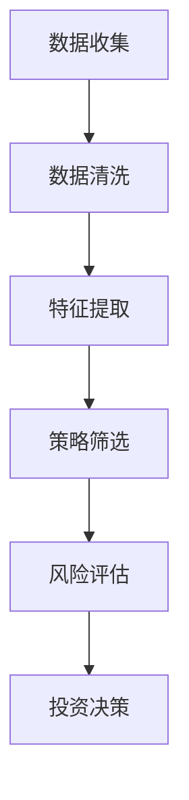
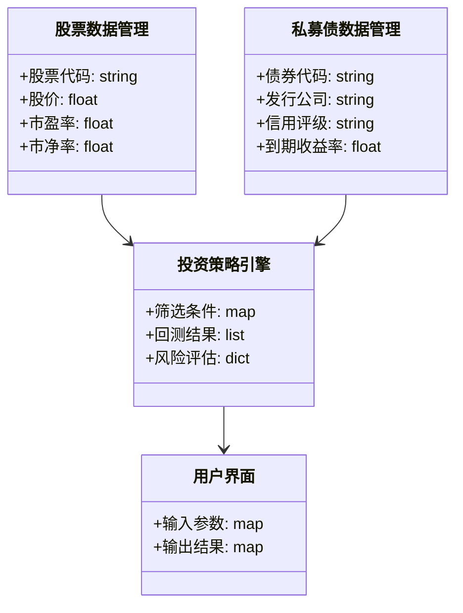
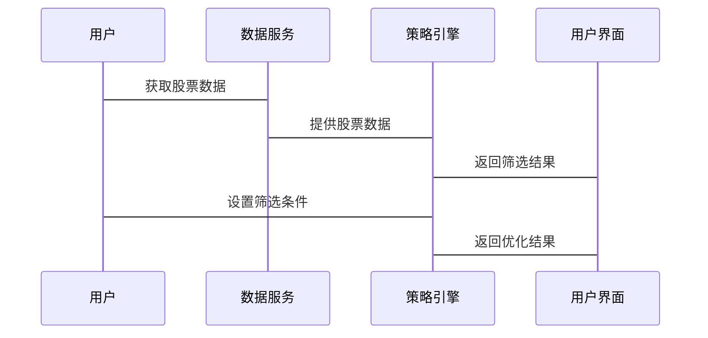

                 


# 如何利用特价股票策略进行私募债投资

> 关键词：特价股票策略、私募债投资、算法原理、系统架构、项目实战

> 摘要：本文详细探讨了如何利用特价股票策略进行私募债投资，从背景介绍、核心概念、算法原理到系统架构和项目实战，为读者提供全面的分析和指导。

---

## 第一部分: 特价股票策略与私募债投资背景

### 第1章: 特价股票策略与私募债投资概述

#### 1.1 特价股票策略的基本概念
- **1.1.1 特价股票的定义与特点**
  - 特价股票是指市场价格低于其内在价值的股票。
  - 特点：低估值、高潜力、暂时性折扣。

- **1.1.2 特价股票策略的分类**
  - 价值投资策略：寻找被市场低估的股票。
  - 事件驱动策略：基于特定事件（如并购、重组）寻找机会。

- **1.1.3 特价股票策略的应用场景**
  - 市场低迷期：寻找被低估的股票。
  - 特定行业或公司困境时的投资机会。

#### 1.2 私募债投资的基本概念
- **1.2.1 私募债的定义与特点**
  - 私募债券是面向特定合格投资者发行的债券。
  - 特点：高收益、高风险、流动性较低。

- **1.2.2 私募债的投资方式**
  - 直接购买：通过私募机构购买债券。
  - 间接投资：通过基金或信托产品参与。

- **1.2.3 私募债与公募债的主要区别**
  - 投资门槛：私募债通常要求较高的投资门槛。
  - 流动性：私募债流动性较低，转让相对复杂。

#### 1.3 特价股票策略与私募债投资的结合
- **1.3.1 特价股票策略在私募债投资中的应用**
  - 通过分析私募债发行公司的股票价格，寻找低估的投资机会。
  - 结合公司基本面分析，评估债券的潜在收益。

- **1.3.2 两者结合的可行性分析**
  - 市场波动性：股票和债券市场的联动效应为策略提供机会。
  - 投资者可以通过同时关注股票和债券市场，优化投资组合。

- **1.3.3 相关法律法规与风险提示**
  - 需遵守私募债的相关法规，确保合规性。
  - 风险提示：市场波动、信用风险、流动性风险。

---

## 第二部分: 特价股票策略的核心概念与原理

### 第2章: 特价股票策略的核心原理

#### 2.1 市场有效性与定价偏差
- 市场有效性分析：分析股票价格是否反映其真实价值。
- 定价偏差：当市场价格低于内在价值时，存在投资机会。

#### 2.2 价值投资与市场情绪
- 价值投资：寻找被市场低估的股票。
- 市场情绪：投资者情绪波动导致价格偏离价值。

#### 2.3 特价股票的筛选标准
- 市盈率（P/E）：低于行业平均水平。
- 市净率（P/B）：低于行业平均水平。
- 股东权益回报率（ROE）：高于行业平均水平。

### 第3章: 私募债投资的核心原理

#### 3.1 私募债的信用评级与风险评估
- 信用评级：AAA、AA、A、BBB、BB、B、CCC、CC、C、D。
- 风险评估：考虑发行人的财务状况、行业风险、经济周期影响。

#### 3.2 私募债的流动性与收益性
- 流动性：私募债流动性较低，转让相对复杂。
- 收益性：高收益通常伴随着高风险。

#### 3.3 私募债的发行与交易机制
- 发行机制：私募发行，面向合格投资者。
- 交易机制：场外市场交易，需通过私募机构进行。

---

## 第三部分: 特价股票策略与私募债投资的算法原理

### 第4章: 算法原理概述

#### 4.1 数据收集与处理
- 数据来源：股票价格、财务数据、市场新闻、债券信息。
- 数据清洗：处理缺失值、异常值、重复数据。

#### 4.2 策略筛选与优化
- 筛选标准：市盈率、市净率、ROE等指标。
- 优化方法：基于历史数据的回测，调整筛选参数。

#### 4.3 风险控制与收益评估
- 风险控制：设置止损点、分散投资、避免过度集中。
- 收益评估：使用夏普比率、最大回撤等指标评估收益风险比。

### 第5章: 算法流程图



### 第6章: 算法实现与数学模型

#### 6.1 Python代码实现

```python
import pandas as pd
import numpy as np

# 数据收集与清洗
data = pd.read_csv('stock_data.csv')
data = data.dropna()

# 特征提取
features = ['PE', 'PB', 'ROE']
data_features = data[features]

# 策略筛选
selected_stocks = data_features[(data_features['PE'] < 15) & (data_features['PB'] < 2) & (data_features['ROE'] > 10)]
```

#### 6.2 数学模型与公式

- 市盈率（P/E）公式：
  $$ P/E = \frac{\text{股价}}{\text{每股收益}} $$

- 市净率（P/B）公式：
  $$ P/B = \frac{\text{股价}}{\text{每股净资产}} $$

- 股东权益回报率（ROE）公式：
  $$ ROE = \frac{\text{净利润}}{\text{股东权益}} $$

---

## 第四部分: 系统架构与实现

### 第7章: 系统架构设计

#### 7.1 项目介绍
- 系统名称：特价股票策略驱动的私募债投资平台。
- 目标：通过算法筛选出符合条件的私募债投资机会。

#### 7.2 系统功能设计



#### 7.3 系统接口设计



---

## 第五部分: 项目实战与案例分析

### 第8章: 项目实战

#### 8.1 环境安装
- 安装Python、Pandas、NumPy、Plotly。
- 安装相关金融分析库：如yfinance、pandas_datareader。

#### 8.2 核心代码实现

```python
import pandas as pd
import numpy as np

# 数据收集
stock_data = pd.DataFrame({
    '股票代码': ['A', 'B', 'C', 'D'],
    '股价': [10, 15, 20, 25],
    '市盈率': [10, 15, 20, 25],
    '市净率': [2, 3, 4, 5],
    'ROE': [15, 10, 5, 20]
})

# 策略筛选
selected_stocks = stock_data[
    (stock_data['市盈率'] < 15) &
    (stock_data['市净率'] < 3) &
    (stock_data['ROE'] > 10)
]

print(selected_stocks)
```

#### 8.3 案例分析
- 案例背景：假设市场中有四只股票，其中股票D的ROE最高，市盈率和市净率均低于行业平均水平。
- 分析结果：股票D符合筛选条件，值得进一步关注。

---

## 第六部分: 最佳实践与总结

### 第9章: 最佳实践

#### 9.1 投资策略总结
- 价值投资是长期策略，需耐心等待市场回归。
- 私募债投资需谨慎，确保发行人资质良好。

#### 9.2 注意事项
- 风险控制是关键，避免过度集中投资。
- 定期评估投资组合，及时调整策略。

#### 9.3 拓展阅读
- 《投资最重要的事》——本杰明·格雷厄姆
- 《债券市场分析与投资策略》——某金融分析专家

---

作者：AI天才研究院/AI Genius Institute & 禅与计算机程序设计艺术/Zen And The Art of Computer Programming

---

这篇文章从背景介绍到实战案例，全面分析了如何利用特价股票策略进行私募债投资，结合算法、系统架构和实际案例，为读者提供了详尽的指导。

