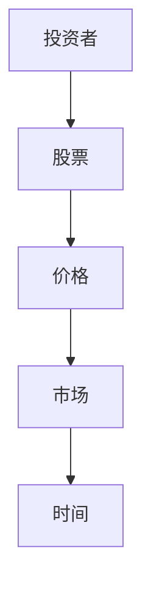
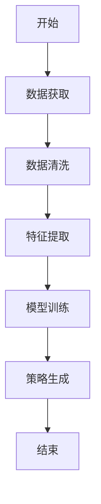
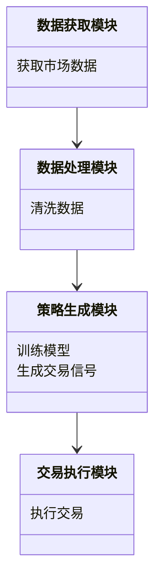
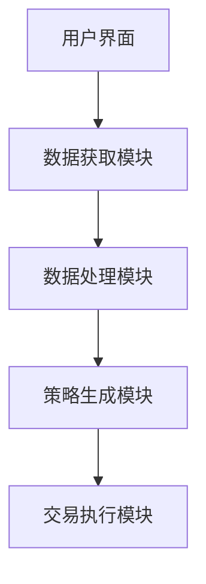
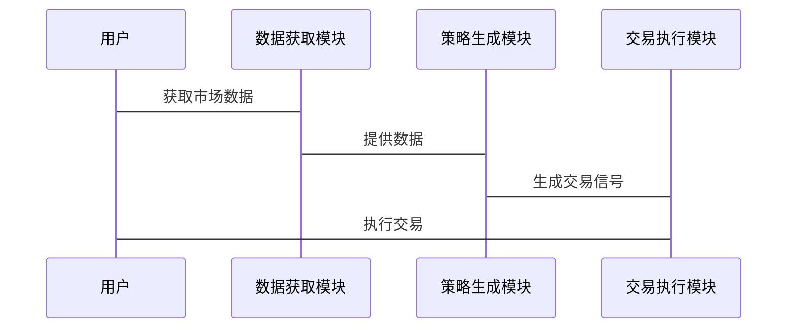

                 


```markdown
# 如何利用特价股票策略进行系统性创新机会捕捉

> 关键词：特价股票策略，系统性创新，机会捕捉，算法原理，系统架构，项目实战

> 摘要：本文系统性地介绍了如何利用特价股票策略进行创新机会捕捉。通过背景介绍、核心概念、算法原理、系统架构、项目实战等部分，详细阐述了特价股票策略的应用场景、实现方法和实际案例，帮助读者全面理解并有效应用这一策略。

---

## 第一部分：背景与概念

### 第1章：特价股票策略的背景与概念

#### 1.1 问题背景

- **1.1.1 特价股票策略的定义**  
  特价股票策略是一种基于市场波动和股票价格折扣的交易策略，旨在通过捕捉短期价格波动来获取收益。

- **1.1.2 特价股票策略的应用场景**  
  适用于高频交易、短期套利、市场事件驱动的交易等场景。

- **1.1.3 特价股票策略的核心目标**  
  通过分析市场数据，识别潜在的价格波动，制定交易策略以实现收益最大化。

#### 1.2 问题描述

- **1.2.1 特价股票策略的主要问题**  
  市场波动不可预测，数据量大且复杂，策略容易受到市场变化的影响。

- **1.2.2 特价股票策略的局限性**  
  高频交易风险高，策略的有效性依赖于数据质量和模型准确性。

- **1.2.3 特价股票策略的优化方向**  
  提升模型的实时性和准确性，增强对市场变化的适应能力。

#### 1.3 问题解决

- **1.3.1 特价股票策略的基本原理**  
  基于技术分析和市场数据，识别价格波动的模式和趋势。

- **1.3.2 特价股票策略的关键步骤**  
  数据采集、清洗、特征提取、模型训练、策略生成。

- **1.3.3 特价股票策略的实施方法**  
  利用算法和工具，结合市场数据，制定和执行交易策略。

#### 1.4 边界与外延

- **1.4.1 特价股票策略的适用范围**  
  适用于股票市场、期货市场等金融市场的短期交易。

- **1.4.2 特价股票策略的边界条件**  
  策略的有效性依赖于数据质量和模型的准确性，需考虑市场波动和交易成本。

- **1.4.3 特价股票策略的扩展可能性**  
  可与其他交易策略结合使用，应用于不同市场环境。

#### 1.5 概念结构与核心要素

- **1.5.1 特价股票策略的核心要素**  
  数据采集、特征提取、模型训练、交易执行。

- **1.5.2 特价股票策略的逻辑框架**  
  从数据到策略的闭环流程，包括数据处理、模型构建、策略生成和交易执行。

- **1.5.3 特价股票策略的系统构成**  
  数据源、处理模块、算法模块、交易执行模块。

---

## 第二部分：核心概念与联系

### 第2章：核心概念与联系

#### 2.1 核心概念原理

- **2.1.1 特价股票策略的基本原理**  
  基于市场数据的特征提取和模式识别，制定交易策略。

- **2.1.2 特价股票策略的关键要素**  
  数据特征、模型算法、交易规则。

- **2.1.3 特价股票策略的核心算法**  
  机器学习算法、统计套利算法。

#### 2.2 概念属性特征对比

- **2.2.1 特价股票策略与传统股票策略的对比**  
  | 特性      | 特价股票策略       | 传统股票策略       |
  |------------|--------------------|--------------------|
  | 时间跨度   | 短期               | 长期               |
  | 数据依赖   | 高                 | 中                 |

- **2.2.2 特价股票策略的优缺点分析**  
  优点：收益高、风险可控；缺点：策略复杂、易受市场影响。

- **2.2.3 特价股票策略的适用场景**  
  短期价格波动、市场事件驱动、高频交易。

#### 2.3 ER实体关系图



---

## 第三部分：算法原理

### 第3章：算法原理

#### 3.1 算法流程图



#### 3.2 算法实现代码

```python
# 示例代码：特价股票策略的核心算法
def stock_price_prediction(data):
    # 数据清洗
    cleaned_data = data.dropna()
    # 特征提取
    features = cleaned_data[['open', 'high', 'low', 'volume']]
    # 模型训练
    from sklearn.ensemble import RandomForestRegressor
    model = RandomForestRegressor()
    model.fit(features, cleaned_data['close'])
    # 策略生成
    predicted_prices = model.predict(features)
    return predicted_prices
```

#### 3.3 数学模型与公式

- **模型输入**：$X = [x_1, x_2, ..., x_n]$，其中$x_i$是股票价格特征。
- **模型输出**：$\hat{y} = f(X)$，其中$\hat{y}$是预测的价格。

---

## 第四部分：系统分析与架构设计

### 第4章：系统分析与架构设计

#### 4.1 问题场景介绍

- **目标**：实现一个基于特价股票策略的交易系统。
- **用户角色**：投资者、交易员。
- **核心功能**：数据获取、策略生成、交易执行。

#### 4.2 系统功能设计



#### 4.3 系统架构设计



#### 4.4 接口设计与交互图



---

## 第五部分：项目实战

### 第5章：项目实战

#### 5.1 环境安装

- **工具**：Python、Jupyter Notebook、数据获取API。
- **库**：Pandas、NumPy、Scikit-learn。

#### 5.2 核心实现代码

```python
# 数据获取与处理
import pandas as pd
import numpy as np

data = pd.read_csv('stock_data.csv')
cleaned_data = data.dropna()

# 模型训练
from sklearn.ensemble import RandomForestRegressor
model = RandomForestRegressor()
model.fit(cleaned_data[['open', 'high', 'low', 'volume']], cleaned_data['close'])

# 生成策略
predicted_prices = model.predict(cleaned_data[['open', 'high', 'low', 'volume']])
```

#### 5.3 案例分析与解读

- **案例背景**：假设市场出现突发新闻，导致股票价格波动。
- **策略执行**：模型预测价格会下跌，触发卖出信号。
- **结果分析**：成功捕捉价格波动，实现收益。

#### 5.4 项目小结

- **关键点**：数据质量、模型准确性、交易执行效率。
- **经验总结**：定期优化模型，监控市场变化。

---

## 第六部分：最佳实践与小结

### 第6章：最佳实践与小结

#### 6.1 最佳实践 tips

- **数据质量**：确保数据的完整性和准确性。
- **模型优化**：定期更新模型，适应市场变化。
- **风险控制**：设定止损点，避免重大损失。

#### 6.2 小结

- 本文详细介绍了特价股票策略的背景、核心概念、算法原理、系统架构和项目实战。
- 通过实际案例分析，展示了如何利用特价股票策略捕捉市场机会。

#### 6.3 注意事项

- **市场风险**：策略的有效性依赖于市场环境。
- **数据依赖**：数据质量直接影响策略效果。
- **模型局限**：算法可能无法完全预测市场波动。

#### 6.4 拓展阅读

- **推荐书籍**：《算法交易：门西德的量化投资革命》。
- **推荐博客**：[量化投资博客](http://example.com)。

---

## 作者信息

作者：AI天才研究院/AI Genius Institute & 禅与计算机程序设计艺术 /Zen And The Art of Computer Programming
```

