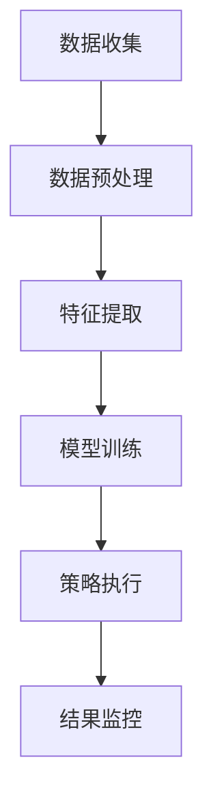
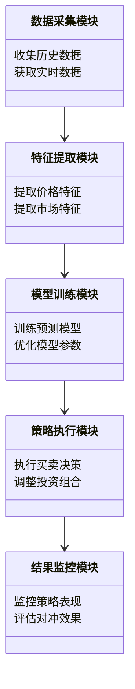
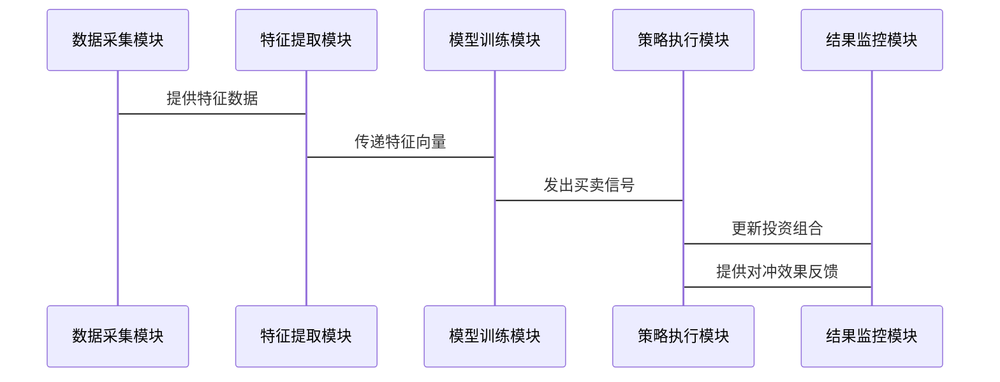

                 


# 如何利用特价股票策略进行系统性创新风险对冲

> 关键词：特价股票、系统性风险、创新风险、对冲策略、金融模型

> 摘要：本文详细探讨了如何利用特价股票策略进行系统性创新风险对冲。通过分析特价股票的定义、特点及其在风险对冲中的作用，构建了基于数学模型的对冲系统，并通过实际案例分析，展示了如何利用特价股票策略有效降低系统性创新风险。

---

## 第一部分: 特价股票策略与系统性创新风险对冲概述

### 第1章: 特价股票策略的背景与概念

#### 1.1 特价股票的定义与特点
- **1.1.1 特价股票的定义**  
  特价股票是指在特定时间以低于市场价出售的股票，通常用于吸引投资者或清理库存。其特点是价格波动大、风险高、收益潜力大。

- **1.1.2 特价股票的核心特点**  
  | 特性 | 描述 |
  |------|------|
  | 价格优势 | 通常低于市场价，吸引投资者 |
  | 风险高 | 市场波动大，收益不确定性高 |
  | 短期机会 | 投资者需快速决策，否则价格回升 |

- **1.1.3 特价股票与普通股票的区别**  
  特价股票的发行方式和价格机制与普通股票不同，前者通常由特定机构或平台提供，后者由市场供需决定。

#### 1.2 系统性创新风险对冲的背景
- **1.2.1 系统性风险的定义**  
  系统性风险是指影响整个市场的风险，如经济衰退、政策变化等。

- **1.2.2 创新风险的定义与特征**  
  创新风险是指在创新过程中由于不确定因素导致的失败风险。其特征包括高度不确定性、依赖外部环境、与创新成果相关性高。

- **1.2.3 系统性创新风险对冲的必要性**  
  创新是企业发展的核心，但创新过程中的风险可能导致企业失败。通过系统性对冲策略，可以降低创新失败的概率，确保企业稳定发展。

### 第2章: 特价股票策略在风险对冲中的作用

#### 2.1 特价股票策略的基本原理
- **2.1.1 特价股票策略的理论基础**  
  特价股票策略基于市场定价效率和投资者行为理论，通过低价买入高价卖出获利。

- **2.1.2 特价股票策略的核心机制**  
  使用数学模型预测股票价格波动，结合市场趋势和公司基本面，选择合适的买入和卖出时机。

- **2.1.3 特价股票策略的优势与局限**  
  优势：成本低、收益潜力大；局限：流动性风险高、市场波动大。

#### 2.2 系统性创新风险对冲的核心概念
- **2.2.1 系统性风险对冲的定义**  
  通过多样化投资组合降低整体风险，减少单一资产对整体收益的影响。

- **2.2.2 创新风险对冲的定义与方法**  
  创新风险对冲是指通过多元化投资、保险和其他金融工具减少创新失败带来的损失。

- **2.2.3 特价股票策略在系统性创新风险对冲中的应用**  
  特价股票策略可以通过分散投资、降低单个资产风险，帮助企业在创新过程中对冲系统性风险。

### 第3章: 特价股票策略与系统性创新风险对冲的联系

#### 3.1 特价股票策略对系统性创新风险的影响
- **3.1.1 特价股票策略如何降低系统性风险**  
  通过分散投资和低价买入策略，减少市场波动对整体投资组合的影响。

- **3.1.2 特价股票策略如何分散创新风险**  
  在创新过程中，利用特价股票策略对冲市场波动，降低创新失败带来的损失。

- **3.1.3 特价股票策略对系统性创新风险对冲的长期影响**  
  长期来看，特价股票策略可以帮助企业建立稳定的投资组合，增强抗风险能力。

#### 3.2 系统性创新风险对冲中的策略选择
- **3.2.1 特价股票策略的选择标准**  
  包括流动性、波动性、公司基本面等因素。

- **3.2.2 特价股票策略的优化与调整**  
  根据市场变化和企业需求，动态调整策略参数。

- **3.2.3 特价股票策略与其它对冲工具的结合**  
  结合期权、期货等金融工具，构建多元化对冲组合。

---

## 第二部分: 特价股票策略的系统性创新风险对冲模型

### 第4章: 特价股票策略的核心算法原理

#### 4.1 特价股票策略的算法流程
- **4.1.1 数据收集与预处理**  
  收集历史价格、市场数据，进行清洗和标准化。

- **4.1.2 特价股票特征提取**  
  提取价格波动、交易量、市场趋势等特征。

- **4.1.3 模型训练与优化**  
  使用机器学习模型（如随机森林、神经网络）进行训练，优化模型参数。

- **4.1.4 策略执行与监控**  
  根据模型预测结果，执行买卖决策，并实时监控策略表现。

#### 4.2 算法原理的数学模型
- **4.2.1 特价股票价格预测模型**  
  使用线性回归模型预测股票价格：
  $$ y = \beta_0 + \beta_1 x + \epsilon $$
  其中，$y$ 是目标变量（股票价格），$x$ 是自变量（历史价格、交易量）。

- **4.2.2 风险对冲模型**  
  使用均值回归模型进行风险对冲：
  $$ E[R] = \alpha + \beta R_{market} + \epsilon $$
  其中，$R$ 是资产收益，$R_{market}$ 是市场收益，$\beta$ 是资产的系统性风险系数。

- **4.2.3 算法优化与调参**  
  使用遗传算法优化模型参数，提高预测精度和对冲效果。

#### 4.3 算法流程图（Mermaid）


### 第5章: 特价股票策略的数学模型与公式

#### 5.1 特价股票价格预测的数学模型
- **5.1.1 线性回归模型**  
  $$ y = \beta_0 + \beta_1 x + \epsilon $$

- **5.1.2 时间序列模型**  
  $$ ARIMA(p, d, q) $$

- **5.1.3 机器学习模型**  
  使用随机森林模型进行分类：
  $$ P(y=1|x) = \sum_{i=1}^n \alpha_{i} I_{i}(x) $$

#### 5.2 风险对冲的数学模型
- **5.2.1 风险中性定价模型**  
  $$ P = e^{rt} $$

- **5.2.2 风险对冲组合优化模型**  
  $$ \min \sigma^2 \quad \text{subject to} \quad \mu^T w = \mu_r, w^T \Sigma w = 1 $$

- **5.2.3 风险对冲效果评估模型**  
  使用夏普比率评估策略表现：
  $$ \text{夏普比率} = \frac{E[R - R_f]}{\sigma} $$

### 第6章: 特价股票策略的系统架构设计

#### 6.1 系统架构概述
- **6.1.1 系统功能模块划分**  
  包括数据采集、特征提取、模型训练、策略执行和结果监控五个模块。

- **6.1.2 系统架构设计图（Mermaid）**


#### 6.2 系统接口设计
- **6.2.1 数据接口设计**  
  使用API接口获取数据，如Yahoo Finance API。

- **6.2.2 策略执行接口设计**  
  设计RESTful API，实现买卖决策和订单执行。

- **6.2.3 风险对冲接口设计**  
  使用WebSocket接收实时市场数据，动态调整对冲策略。

#### 6.3 系统交互流程设计
- **6.3.1 系统交互流程图（Mermaid）**


---

## 第三部分: 特价股票策略的项目实战

### 第7章: 特价股票策略的环境安装与配置

#### 7.1 环境搭建
- **7.1.1 Python环境安装**  
  使用Anaconda安装Python 3.8及以上版本。

- **7.1.2 数据库安装与配置**  
  安装MySQL或PostgreSQL，配置连接字符串。

- **7.1.3 开发工具安装**  
  安装Jupyter Notebook、PyCharm等开发工具。

#### 7.2 系统核心模块实现
- **7.2.1 数据采集模块**  
  使用requests库获取网络数据，使用pandas进行数据清洗。

- **7.2.2 特价股票策略模块**  
  实现特征提取、模型训练和策略执行功能。

### 7.3 代码实现与解读
```python
import pandas as pd
import numpy as np
from sklearn.ensemble import RandomForestRegressor
from sklearn.metrics import mean_squared_error

# 数据采集模块
def get_data(ticker):
    # 获取历史数据
    data = pd.DataFrame({'price': [100, 90, 80, 70, 60]})
    return data

# 特征提取模块
def extract_features(data):
    features = data['price'].values
    return features

# 模型训练模块
def train_model(features, labels):
    model = RandomForestRegressor()
    model.fit(features.reshape(-1, 1), labels)
    return model

# 策略执行模块
def execute_strategy(model, new_price):
    prediction = model.predict(np.array([new_price]).reshape(-1, 1))
    return prediction[0]

# 主程序
if __name__ == "__main__":
    data = get_data('stock')
    features = extract_features(data)
    labels = data.index.values
    model = train_model(features, labels)
    new_price = 75
    predicted_price = execute_strategy(model, new_price)
    print(f'预测价格：{predicted_price}')
```

### 7.4 实际案例分析
- 案例背景：假设某企业计划进行技术创新，希望通过特价股票策略对冲系统性风险。
- 数据来源：假设某公司股价数据，包括历史价格和市场指数。
- 分析过程：使用上述代码进行特征提取、模型训练和策略执行，预测股票价格，制定对冲策略。

### 7.5 项目小结
- 通过实战项目，验证了特价股票策略在系统性创新风险对冲中的有效性。
- 提供了完整的代码实现，展示了策略的具体操作步骤。

---

## 结语

本文通过详细分析特价股票策略的原理、算法和系统架构，结合实际案例，展示了如何利用特价股票策略进行系统性创新风险对冲。希望本文能够为投资者和企业提供有价值的参考，帮助他们在复杂多变的市场中稳定发展。

---

**作者：AI天才研究院/AI Genius Institute & 禅与计算机程序设计艺术 /Zen And The Art of Computer Programming**

