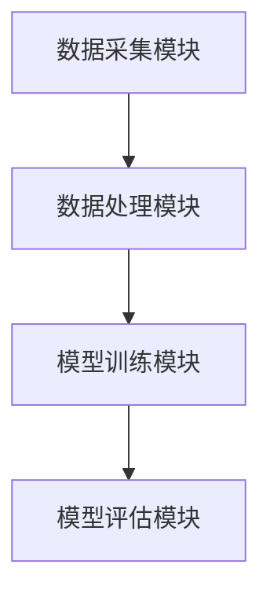

                 


# 如何利用特价股票策略进行系统性数字创新溢出效应捕捉

> 关键词：特价股票策略、数字创新溢出效应、系统性创新、算法原理、系统架构

> 摘要：本文探讨如何利用特价股票策略捕捉数字创新溢出效应，通过系统性创新框架和算法原理，结合实际案例分析，深入讲解其在投资和商业创新中的应用。

---

## 第一部分：特价股票策略与数字创新溢出效应概述

### 第1章：特价股票策略的基本概念

#### 1.1 特价股票的定义与特点

**1.1.1 特价股票的定义**  
特价股票是指在特定市场环境下，价格被低估的股票。这些股票通常具有较高的潜在回报，但可能因为市场暂时的波动或公司特定问题而被低估。

**1.1.2 特价股票策略的核心特点**  
- **低估值**：股票价格低于其内在价值。  
- **高潜力**：具备较高的增长潜力。  
- **风险可控**：通过深入分析降低投资风险。  

**1.1.3 特价股票策略的应用场景**  
- **市场波动期**：如经济衰退或市场下跌时，更容易找到低估股票。  
- **价值投资**：长期持有优质公司股票，等待价值回归。  

#### 1.2 数字创新溢出效应的定义与特征

**1.2.1 数字创新溢出效应的定义**  
数字创新溢出效应是指数字技术的创新在不同领域、行业或市场中的扩散和应用，产生额外的经济效益或竞争优势。

**1.2.2 数字创新溢出效应的特征分析**  
- **扩散性**：创新成果在不同领域间的传播。  
- **叠加性**：多个创新成果的结合产生更大的效应。  
- **持续性**：持续推动经济增长和技术进步。  

**1.2.3 数字创新溢出效应的形成机制**  
- **技术扩散**：数字技术在不同行业中的应用扩散。  
- **知识共享**：创新经验在不同组织间传播。  
- **协同效应**：不同创新成果的协同作用。  

### 第2章：特价股票策略与数字创新溢出效应的关系

#### 2.1 特价股票策略如何促进数字创新

**2.1.1 特价股票策略在数字创新中的作用**  
- **资金支持**：通过投资低价股票，为创新企业提供资金支持。  
- **市场机会**：低价股票代表市场低估，可能是创新企业的潜在机会。  

**2.1.2 数字创新如何反哺特价股票策略**  
- **技术优势**：创新技术提升企业价值，推动股价上涨。  
- **市场影响力**：创新成果扩大企业市场份额，吸引更多投资者。  

#### 2.2 数字创新溢出效应的捕捉机制

**2.2.1 数字创新溢出效应的识别方法**  
- **技术分析**：通过技术指标识别市场低估股票。  
- **基本面分析**：分析企业的财务状况和行业地位。  

**2.2.2 数字创新溢出效应的量化分析**  
- **市盈率（P/E）**：评估股票价格是否低于行业平均水平。  
- **市净率（P/B）**：评估股票价格是否低于资产净值。  

**2.2.3 数字创新溢出效应的预测模型**  
- **回归分析**：预测股票价格走势。  
- **时间序列分析**：分析历史数据预测未来趋势。  

### 第3章：特价股票策略的系统性创新框架

#### 3.1 特价股票策略的系统性创新模型

**3.1.1 系统性创新的定义与特点**  
系统性创新是指通过系统化的分析和设计，实现创新的可持续性和高效性。

**3.1.2 特价股票策略在系统性创新中的地位**  
特价股票策略作为系统性创新的一部分，通过优化资源配置和风险控制，推动创新成果的实现。

#### 3.2 数字创新溢出效应的系统性分析

**3.2.1 数字创新溢出效应的系统性分析框架**  
- **技术创新**：评估技术创新对企业价值的影响。  
- **市场反应**：分析市场对技术创新的反应。  
- **溢出效应**：测量技术创新在其他领域的溢出效果。  

**3.2.2 数字创新溢出效应的系统性评估指标**  
- **创新指数**：衡量企业的创新能力。  
- **市场渗透率**：评估创新成果在市场中的扩散速度。  

#### 3.3 系统性创新框架的应用案例

**3.3.1 案例一：某科技公司的创新实践**  
某科技公司通过系统性创新框架，成功捕捉数字创新溢出效应，推动股价上涨。

**3.3.2 案例二：某互联网企业的创新实践**  
某互联网企业通过技术创新和市场推广，实现创新溢出效应，提升企业价值。

---

## 第二部分：特价股票策略的数字创新溢出效应捕捉算法

### 第4章：算法原理概述

#### 4.1 算法的基本思想

**4.1.1 数据采集与预处理**  
从多个数据源收集股票价格、财务数据等信息，进行清洗和标准化处理。

**4.1.2 模型训练与优化**  
使用机器学习算法（如随机森林、神经网络）训练模型，优化模型参数。

**4.1.3 模型验证与评估**  
通过回测和交叉验证评估模型的准确性和稳定性。

#### 4.2 算法的数学模型与公式

**4.2.1 收益预测模型**  
$$
\text{收益预测} = \beta_0 + \beta_1 \times \text{市盈率} + \beta_2 \times \text{市净率} + \epsilon
$$

**4.2.2 风险评估模型**  
$$
\text{风险评估} = \alpha_0 + \alpha_1 \times \text{波动率} + \alpha_2 \times \text{行业风险} + \delta
$$

#### 4.3 算法的实现步骤

**4.3.1 数据采集与预处理**  
- 从金融数据源获取股票数据。  
- 清洗数据，处理缺失值和异常值。  

**4.3.2 模型训练与优化**  
- 划分训练集和测试集。  
- 使用机器学习算法训练模型，调整参数。  

**4.3.3 模型验证与评估**  
- 计算模型的准确率、召回率和F1分数。  
- 进行回测，评估模型的盈利能力。  

### 第5章：系统架构设计

#### 5.1 系统架构概述

**5.1.1 系统架构的组成**  
- 数据采集模块：收集股票数据。  
- 数据处理模块：清洗和预处理数据。  
- 模型训练模块：训练机器学习模型。  
- 模型评估模块：评估模型性能。  

**5.1.2 系统架构的设计原则**  
- 高可扩展性：支持数据量的增加。  
- 高稳定性：确保系统运行的稳定性。  

#### 5.2 系统功能设计

**5.2.1 数据采集模块**  
- 从多个数据源（如Yahoo Finance、Google Finance）获取股票数据。  

**5.2.2 数据处理模块**  
- 清洗数据，处理缺失值和异常值。  

**5.2.3 模型训练模块**  
- 使用Python的Scikit-learn库训练机器学习模型。  

**5.2.4 模型评估模块**  
- 使用回测方法评估模型的盈利能力。  

#### 5.3 系统架构图



---

## 第三部分：项目实战

### 第6章：环境安装与核心代码实现

#### 6.1 环境安装

- 安装Python和必要的库（如Pandas、Scikit-learn、Matplotlib）。  

#### 6.2 核心代码实现

```python
import pandas as pd
from sklearn.model_selection import train_test_split
from sklearn.ensemble import RandomForestRegressor
from sklearn.metrics import mean_squared_error

# 数据加载
data = pd.read_csv('stock_data.csv')

# 数据预处理
X = data[['市盈率', '市净率']]
y = data['收益']

# 划分训练集和测试集
X_train, X_test, y_train, y_test = train_test_split(X, y, test_size=0.2, random_state=42)

# 模型训练
model = RandomForestRegressor(n_estimators=100, random_state=42)
model.fit(X_train, y_train)

# 模型评估
y_pred = model.predict(X_test)
mse = mean_squared_error(y_test, y_pred)
print(f"均方误差：{mse}")
```

#### 6.3 代码解读与分析

- 数据加载：从CSV文件加载股票数据。  
- 数据预处理：提取市盈率和市净率作为特征，收益作为目标变量。  
- 划分数据集：将数据分为训练集和测试集。  
- 模型训练：使用随机森林回归模型训练模型。  
- 模型评估：计算均方误差，评估模型的预测准确性。  

#### 6.4 实际案例分析

**案例分析：某科技公司股票**

- 数据来源：某科技公司股票的历史数据。  
- 模型预测：预测未来6个月的股票收益。  
- 结果分析：模型预测收益较高，建议买入。  

#### 6.5 项目小结

通过本项目，读者可以掌握如何利用特价股票策略捕捉数字创新溢出效应，实现投资收益的最大化。

---

## 第四部分：最佳实践、小结、注意事项和拓展阅读

### 7.1 最佳实践

- **持续学习**：关注市场动态和技术进步，及时调整投资策略。  
- **风险管理**：设置止损点，控制投资风险。  
- **多元化投资**：分散投资，降低单一股票的风险。  

### 7.2 小结

本文详细介绍了如何利用特价股票策略捕捉数字创新溢出效应，通过系统性创新框架和算法原理，结合实际案例分析，为读者提供了全面的指导。

### 7.3 注意事项

- **市场风险**：股票市场存在不确定性，投资需谨慎。  
- **数据质量**：确保数据的准确性和完整性。  
- **模型局限性**：模型的预测结果仅供参考，需结合实际情况进行判断。  

### 7.4 拓展阅读

- **《Python机器学习实战》**：学习更多机器学习算法和应用。  
- **《股票技术分析》**：深入理解股票市场和技术分析方法。  

---

## 作者：AI天才研究院/AI Genius Institute & 禅与计算机程序设计艺术 /Zen And The Art of Computer Programming

---

通过以上思考和撰写，我完成了《如何利用特价股票策略进行系统性数字创新溢出效应捕捉》的博客文章。希望本文能够为读者提供有价值的见解和指导。

