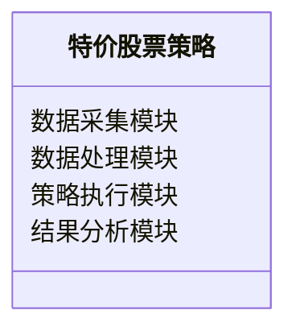

                 


# 如何利用特价股票策略进行系统性数字创新生态位捕捉

> 关键词：特价股票策略，数字创新生态位，系统性捕捉，股票投资，数学模型

> 摘要：本文详细探讨了如何利用特价股票策略进行系统性数字创新生态位捕捉。从特价股票策略的背景与概念出发，分析其核心原理、算法设计、数学模型及系统架构，最后通过项目实战验证策略的有效性，提供最佳实践和未来研究方向。

---

## 第一部分: 特价股票策略与数字创新生态位捕捉概述

## 第1章: 特价股票策略的背景与概念

### 1.1 什么是特价股票策略

#### 1.1.1 特价股票的定义
特价股票是指在市场中价格显著低于其内在价值的股票。这种股票通常被市场低估，具有较大的反弹潜力。特价股票的识别需要结合市场估值指标，如市净率（P/B）和市盈率（P/E）。

#### 1.1.2 特价股票策略的核心理念
特价股票策略的核心理念是通过识别市场低估的股票，利用短期价格波动进行投资。该策略注重市场的非理性定价，抓住市场错估的机会。

#### 1.1.3 特价股票策略的适用场景
特价股票策略适用于市场波动较大、投资者情绪化较强的市场环境。在熊市或市场调整期，特价股票策略往往表现更为显著。

### 1.2 数字创新生态位的概念

#### 1.2.1 什么是生态位
生态位是指一个物种在生态系统中所处的位置，包括其资源利用、空间分布等。在商业领域，生态位可以理解为一个企业或产品在市场中所处的独特位置。

#### 1.2.2 数字创新生态位的定义
数字创新生态位是指在数字技术驱动下，企业通过创新的产品或服务在市场中占据的独特位置。这种生态位往往伴随着技术创新和商业模式的改变。

#### 1.2.3 特价股票策略如何捕捉数字创新生态位
通过识别那些在数字创新领域具有潜力的公司，特价股票策略能够帮助投资者捕捉到这些公司在市场低估时的投资机会。

---

## 第2章: 特价股票策略的核心概念与联系

### 2.1 特价股票策略的核心原理

#### 2.1.1 市场周期与价格波动
股票市场的周期性波动为特价股票策略提供了机会。在市场低谷期，许多优质股票的价格会被低估，为投资者提供了买入机会。

#### 2.1.2 投资者行为分析
投资者的非理性行为导致市场中存在许多定价错误的股票。特价股票策略通过分析投资者行为，识别这些定价错误的机会。

#### 2.1.3 特价股票的识别与筛选
通过筛选市净率（P/B）和市盈率（P/E）等估值指标，可以识别出市场中被低估的股票。

### 2.2 特价股票策略与数字创新的联系

#### 2.2.1 数字创新对企业价值的影响
数字创新能够提升企业的核心竞争力，降低运营成本，提高利润率。这些因素都会反映在企业的估值指标中。

#### 2.2.2 特价股票策略如何捕捉数字创新机会
通过筛选那些在数字创新领域具有潜力的公司，特价股票策略能够在市场低估时买入，捕捉这些公司在未来增长中的收益。

#### 2.2.3 数字创新生态位的动态变化
数字创新生态位是一个动态变化的过程。随着技术的进步和市场的变化，新的生态位不断涌现，特价股票策略需要不断适应这些变化。

---

## 第3章: 特价股票策略的算法原理

### 3.1 特价股票识别算法

#### 3.1.1 数据清洗与预处理
股票数据清洗是确保数据质量的重要步骤。需要去除缺失值、异常值和噪声数据。

#### 3.1.2 市场估值指标计算
计算市净率（P/B）和市盈率（P/E）等估值指标，识别市场中被低估的股票。

#### 3.1.3 特价股票筛选模型
基于估值指标和市场周期，构建特价股票筛选模型，识别具有投资潜力的股票。

### 3.2 数字创新生态位预测算法

#### 3.2.1 数字创新趋势分析
通过分析行业趋势和技术进步，预测数字创新的未来发展方向。

#### 3.2.2 生态位预测模型
基于数字创新趋势，构建生态位预测模型，识别具有潜力的数字创新领域。

#### 3.2.3 算法实现与优化
通过机器学习和统计学方法，优化预测模型，提高预测准确性。

---

## 第4章: 特价股票策略的数学模型与公式

### 4.1 特价股票识别的数学模型

#### 4.1.1 市净率（P/B）计算公式
$$ P/B = \frac{Market\ Price}{Book\ Value\ Per\ Share} $$

#### 4.1.2 市盈率（P/E）计算公式
$$ P/E = \frac{Market\ Price}{Earnings\ Per\ Share} $$

### 4.2 数字创新生态位预测的数学模型

#### 4.2.1 线性回归模型
$$ y = \beta_0 + \beta_1x + \epsilon $$

#### 4.2.2 时间序列分析模型
$$ ARIMA(p, d, q) $$

---

## 第5章: 特价股票策略的系统分析与架构设计

### 5.1 系统功能设计

#### 5.1.1 数据采集模块
负责从数据源获取股票数据和市场信息。

#### 5.1.2 数据处理模块
对获取的数据进行清洗和预处理，计算估值指标。

#### 5.1.3 策略执行模块
基于筛选模型，识别特价股票，执行交易策略。

#### 5.1.4 结果分析模块
分析策略的执行效果，优化模型和策略。

### 5.2 系统架构设计

#### 5.2.1 领域模型设计（Mermaid 类图）


#### 5.2.2 系统架构设计（Mermaid 架构图）
```mermaid
architecturalDiagram
    股票数据源 -- 数据采集模块
    数据处理模块 --> 策略执行模块
    策略执行模块 --> 结果分析模块
```

---

## 第6章: 项目实战

### 6.1 环境安装与配置

#### 6.1.1 安装 Python 环境
使用 Anaconda 或 virtualenv 创建 Python 环境，版本建议为 3.8 或以上。

#### 6.1.2 安装依赖库
安装 numpy、pandas、scikit-learn 等必要的库。

### 6.2 系统核心实现

#### 6.2.1 数据采集模块实现
使用 pandas 和 requests 库，从 API 获取股票数据。

#### 6.2.2 数据处理模块实现
对数据进行清洗和预处理，计算市净率和市盈率。

#### 6.2.3 策略执行模块实现
基于筛选模型，识别特价股票，生成交易信号。

#### 6.2.4 结果分析模块实现
分析策略的执行效果，优化模型和策略。

### 6.3 代码实现与解读

#### 6.3.1 数据清洗代码
```python
import pandas as pd

# 读取数据
df = pd.read_csv('stock_data.csv')

# 删除缺失值
df = df.dropna()

# 去除异常值
df = df[(df['price'] > 0) & (df['volume'] > 0)]
```

#### 6.3.2 市净率计算代码
```python
# 计算市净率
df['pb_ratio'] = df['price'] / df['book_value']
```

### 6.4 案例分析与结果解读

#### 6.4.1 案例分析
以某只股票为例，展示如何通过特价股票策略捕捉数字创新生态位。

#### 6.4.2 结果解读
分析策略的执行效果，验证其在实际市场中的表现。

---

## 第7章: 最佳实践与未来展望

### 7.1 最佳实践

#### 7.1.1 定期优化模型
根据市场变化，定期优化策略模型，提高预测准确性。

#### 7.1.2 风险控制
设置止损点和止盈点，控制投资风险。

#### 7.1.3 持续学习
关注市场动态和技术进步，不断提升自己的投资能力。

### 7.2 小结

通过本文的探讨，我们了解了如何利用特价股票策略进行系统性数字创新生态位捕捉。从背景介绍到算法设计，再到项目实战，我们详细分析了策略的各个部分。

### 7.3 注意事项

在实际投资中，需注意市场风险和模型的局限性。特价股票策略虽然有效，但并不能保证100%的成功。

### 7.4 拓展阅读

建议读者进一步阅读相关领域的书籍和论文，深入理解数字创新和股票投资的结合。

---

## 作者信息

作者：AI天才研究院/AI Genius Institute & 禅与计算机程序设计艺术 /Zen And The Art of Computer Programming

