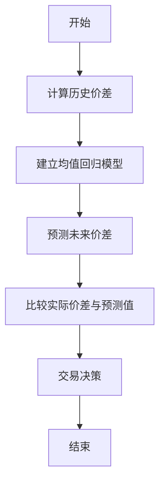
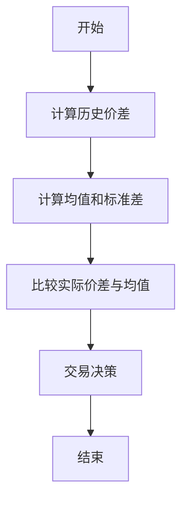
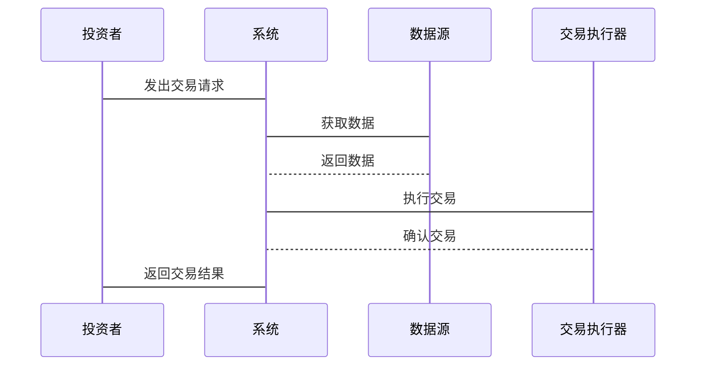
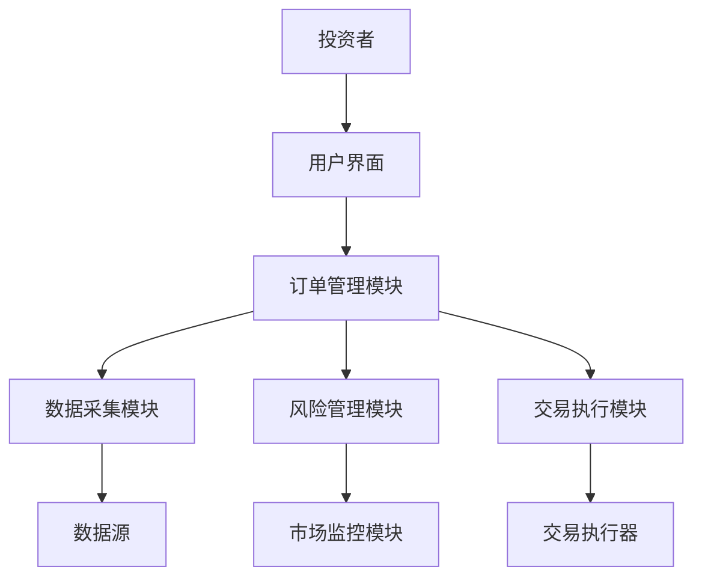

                 


# 如何利用特价股票策略进行系统性风险对冲

> 关键词：系统性风险，特价股票策略，统计套利，配对交易，风险对冲

> 摘要：本文详细探讨了如何利用特价股票策略进行系统性风险对冲。首先介绍了系统性风险和特价股票策略的基本概念，然后分析了两者之间的联系和对冲原理。接着，通过配对交易策略和统计套利算法，详细讲解了如何实现系统性风险对冲。最后，通过实际案例分析，展示了如何将理论应用于实践，并总结了最佳实践和注意事项。

---

# 第一部分: 系统性风险与特价股票策略的背景介绍

## 第1章: 系统性风险与特价股票策略概述

### 1.1 系统性风险的定义与特征

#### 1.1.1 系统性风险的定义
系统性风险是指影响整个金融市场的风险，通常由宏观经济因素或市场整体波动引起，如经济衰退、市场崩盘或政策变化。这种风险无法通过分散投资来完全消除，因为它影响所有资产。

#### 1.1.2 系统性风险的特征
系统性风险具有以下特征：
1. **普遍性**：影响整个市场或大部分资产。
2. **不可分散性**：无法通过多样化投资来消除。
3. **高相关性**：资产之间的相关性在市场下跌时会显著增加。
4. **传染性**：系统性风险可能从一个市场或资产扩散到其他市场。

#### 1.1.3 系统性风险对投资者的影响
系统性风险可能导致投资组合的大幅亏损，甚至引发流动性危机。在极端情况下，系统性风险可能引发金融危机，影响全球经济。

### 1.2 特价股票策略的定义与特点

#### 1.2.1 特价股票的定义
特价股票通常指价格低于其内在价值的股票，这些股票可能因市场短期波动或公司特定问题而被低估。投资者认为这些股票具有恢复潜力，因此可能在低价时买入，等待价值回归。

#### 1.2.2 特价股票策略的核心特点
1. **逆向投资**：在市场低迷时买入，市场上涨时卖出。
2. **价值导向**：基于对公司内在价值的分析，而非短期市场情绪。
3. **长期持有**：投资者通常耐心等待价值回归，而非频繁交易。

#### 1.2.3 特价股票与传统投资策略的区别
传统投资策略（如动量策略或趋势跟踪）依赖于市场趋势，而特价股票策略基于对公司基本面的深入分析，寻找被市场低估的机会。前者更关注市场情绪，后者更关注内在价值。

### 1.3 系统性风险对冲的必要性

#### 1.3.1 系统性风险对冲的背景
在2008年全球金融危机后，投资者意识到系统性风险的潜在破坏性。对冲系统性风险成为投资组合管理的重要部分。

#### 1.3.2 特价股票策略在对冲中的作用
特价股票策略通过寻找市场低估的资产，可以在市场下跌时提供缓冲，帮助对冲系统性风险。例如，在市场崩盘时，某些股票可能大幅下跌，但其内在价值可能远高于当前价格，为长期投资者提供抄底机会。

#### 1.3.3 对冲机制的基本原理
对冲机制通过同时买入和卖出相关资产，或利用衍生工具（如期货和期权），来减少市场波动对投资组合的影响。特价股票策略通过选择性买入低估资产，可以在一定程度上对冲市场整体下跌的风险。

---

## 第2章: 特价股票策略与系统性风险对冲的核心概念

### 2.1 特价股票策略的数学模型

#### 2.1.1 特价股票策略的数学表达式
假设一只股票的内在价值为 \( V \)，而当前市场价格为 \( P \)。当 \( P < V \) 时，股票被认为是特价，值得买入。数学模型可以表示为：
$$ \text{投资信号} = \begin{cases}
1 & \text{如果 } P < V \\
0 & \text{否则}
\end{cases} $$

#### 2.1.2 相关数学公式的详细推导
内在价值 \( V \) 可以通过多种方法计算，如股息贴现模型（DDM）或自由现金流模型。以DDM为例：
$$ V = \frac{D}{r - g} $$
其中：
- \( D \) 是预期股息
- \( r \) 是折现率
- \( g \) 是股息增长率

当市场价格 \( P \) 低于内在价值 \( V \) 时，股票被认为是特价。

#### 2.1.3 特价股票与系统性风险的关系
在市场整体下跌时，许多股票的价格可能低于其内在价值，为特价股票策略提供了机会。然而，这种策略的风险在于，系统性风险可能导致所有股票价格下跌，即使其内在价值未变。

### 2.2 系统性风险对冲的原理

#### 2.2.1 系统性风险对冲的基本原理
通过同时持有多种资产或使用衍生工具，投资者可以减少系统性风险的影响。例如，买入低估的股票（特价股票）的同时，卖出市场指数期货，以对冲市场整体下跌的风险。

#### 2.2.2 系统性风险对冲的数学模型
假设投资组合 \( P \) 由两部分组成：一部分投资于特价股票 \( S \)，另一部分投资于市场指数期货 \( F \)。为了对冲系统性风险，投资组合的 beta 系数应接近零。beta 系数可以通过以下公式计算：
$$ \beta = \frac{\text{协方差}(S, M)}{\text{方差}(M)} $$
其中 \( M \) 是市场指数。通过调整 \( S \) 和 \( F \) 的头寸，可以使得整体 beta 系数接近零。

#### 2.2.3 对冲机制的数学表达式
假设市场指数 \( M \) 的 beta 系数为 1，而特价股票 \( S \) 的 beta 系数为 \( \beta_S \)。为了对冲系统性风险，投资者可以卖出 \( \beta_S \) 手市场指数期货，使得整体 beta 系数为零：
$$ \beta_{\text{组合}} = \beta_S - \beta_F = 0 $$

---

### 2.3 核心概念的联系与对比

#### 2.3.1 核心概念的联系
系统性风险和特价股票策略通过以下方式联系起来：
1. 系统性风险影响整体市场，而特价股票策略寻找市场低估的资产。
2. 对冲系统性风险需要利用衍生工具或多样化投资，而特价股票策略提供了一种基于价值的投资方式。

#### 2.3.2 核心概念的属性对比
以下是一个对比表格：

| 属性                | 系统性风险           | 特价股票策略        |
|---------------------|--------------------|---------------------|
| 定义                | 整体市场的风险      | 市场低估的股票投资 |
| 特征                | 不可分散性、传染性  | 逆向投资、价值导向 |
| 对冲方式            | 衍生工具、多样化     | 买入低估股票        |
| 相关性              | 高相关性            | 低相关性（相对于市场） |

#### 2.3.3 实体关系图
以下是系统性风险和特价股票策略的实体关系图：

```mermaid
er
    actor 投资者
    actor 市场
    actor 个股
    actor 系统性风险
    actor 特价股票
    actor 投资组合

    投资者 --> 系统性风险: 暴露于
    投资者 --> 投资组合: 持有
    投资组合 --> 特价股票: 包含
    特价股票 --> 个股: 由组成
    市场 --> 系统性风险: 引发
```

---

## 第3章: 特价股票策略的算法原理

### 3.1 统计套利算法

#### 3.1.1 统计套利的定义
统计套利是一种基于统计学的方法，通过寻找资产之间的价格差异，并在这些差异缩小时获利。它依赖于资产之间的长期均衡关系。

#### 3.1.2 统计套利的数学模型
假设两只股票 \( A \) 和 \( B \) 之间存在均衡关系：
$$ A - B = \mu + \epsilon $$
其中 \( \mu \) 是均值，\( \epsilon \) 是误差项。当 \( A - B \) 显著偏离 \( \mu \) 时，统计套利者会买入低估的资产并卖出高估的资产。

#### 3.1.3 统计套利的实现步骤
1. 计算两只股票的历史价差。
2. 使用均值回归模型预测未来价差。
3. 当实际价差偏离预测值时，进行交易。

以下是统计套利算法的mermaid流程图：



#### 3.1.4 统计套利的Python代码示例

```python
import pandas as pd
import numpy as np

# 假设我们有两个股票的收盘价数据
stock_A = pd.Series([100, 105, 98, 102, 101])
stock_B = pd.Series([90, 95, 92, 94, 93])

# 计算价差
spread = stock_A - stock_B

# 计算均值回归模型
mu = np.mean(spread)
std = np.std(spread)

# 预测未来价差
predicted_spread = mu + np.random.normal(0, std, 5)

# 比较实际价差与预测值
for i in range(len(spread)):
    if spread[i] < predicted_spread[i]:
        print(f"买入股票A，卖出股票B，价差为{spread[i]}")
    elif spread[i] > predicted_spread[i]:
        print(f"卖出股票A，买入股票B，价差为{spread[i]}")
```

---

### 3.2 配对交易策略

#### 3.2.1 配对交易的定义
配对交易是一种统计套利策略，选择两只相关性较高的股票，并在它们的价格偏离历史均值时进行交易。

#### 3.2.2 配对交易的数学模型
假设两只股票 \( A \) 和 \( B \) 的价格分别为 \( P_A \) 和 \( P_B \)。配对交易的策略是：
$$ \text{交易信号} = \begin{cases}
1 & \text{如果 } P_A - P_B < \mu \\
-1 & \text{如果 } P_A - P_B > \mu \\
0 & \text{否则}
\end{cases} $$

#### 3.2.3 配对交易的实现步骤
1. 计算两只股票的历史价差。
2. 计算价差的均值和标准差。
3. 当实际价差偏离均值超过一定阈值时，进行交易。

以下是配对交易策略的mermaid流程图：



#### 3.2.4 配对交易的Python代码示例

```python
import pandas as pd
import numpy as np

# 假设我们有两个股票的收盘价数据
stock_A = pd.Series([100, 105, 98, 102, 101])
stock_B = pd.Series([90, 95, 92, 94, 93])

# 计算价差
spread = stock_A - stock_B

# 计算均值和标准差
mu = np.mean(spread)
std = np.std(spread)

# 设定交易阈值
threshold = 1.5 * std

# 配对交易策略
positions = []
for i in range(len(spread)):
    if spread[i] < mu - threshold:
        positions.append(1)
    elif spread[i] > mu + threshold:
        positions.append(-1)
    else:
        positions.append(0)

# 输出交易信号
for i in range(len(positions)):
    print(f"时间{i}: 交易信号为{positions[i]}")
```

---

## 第4章: 系统分析与架构设计方案

### 4.1 系统分析

#### 4.1.1 项目介绍
本项目旨在开发一个基于特价股票策略的系统性风险对冲系统。系统将结合统计套利和配对交易策略，利用市场低估的股票对冲系统性风险。

#### 4.1.2 系统功能设计

##### 4.1.2.1 数据采集模块
- 从Yahoo Finance获取历史价格数据。
- 数据清洗和预处理。

##### 4.1.2.2 信号生成模块
- 计算股票的内在价值。
- 生成买入或卖出信号。

##### 4.1.2.3 交易执行模块
- 根据信号执行交易。
- 记录交易日志。

##### 4.1.2.4 风险管理模块
- 监控系统性风险。
- 调整交易头寸。

#### 4.1.2.4 接口设计
- 数据接口：与Yahoo Finance API交互。
- 交易接口：与 brokers 连接。

#### 4.1.2.5 交互流程
以下是系统交互的mermaid序列图：



### 4.2 系统架构设计

#### 4.2.1 系统架构图
以下是系统架构的mermaid图：



#### 4.2.2 功能模块设计

##### 4.2.2.1 数据采集模块
- 从Yahoo Finance获取数据。
- 数据清洗和预处理。

##### 4.2.2.2 订单管理模块
- 处理用户的交易请求。
- 生成交易信号。

##### 4.2.2.3 风险管理模块
- 监控市场风险。
- 调整交易头寸。

#### 4.2.3 接口设计

##### 4.2.3.1 数据接口
- 使用Yahoo Finance API获取数据。
- 数据格式为JSON或CSV。

##### 4.2.3.2 交易接口
- 与 brokers 连接。
- 使用API发送交易指令。

---

## 第5章: 项目实战

### 5.1 环境安装

#### 5.1.1 安装Python
安装Python 3.x，推荐使用Anaconda或Miniconda。

#### 5.1.2 安装依赖库
安装以下库：
- pandas
- numpy
- matplotlib
- yfinance

安装命令：
```bash
pip install pandas numpy matplotlib yfinance
```

### 5.2 核心代码实现

#### 5.2.1 数据采集模块

```python
import yfinance as yf

# 下载股票数据
aapl = yf.download('AAPL', start='2020-01-01', end='2023-01-01')
msft = yf.download('MSFT', start='2020-01-01', end='2023-01-01')

# 数据清洗
aapl = aapl['Close']
msft = msft['Close']
```

#### 5.2.2 信号生成模块

```python
import numpy as np

# 计算价差
spread = aapl - msft

# 计算均值和标准差
mu = np.mean(spread)
std = np.std(spread)

# 生成信号
threshold = 1.5 * std
signal = []
for i in range(len(spread)):
    if spread[i] < mu - threshold:
        signal.append(1)
    elif spread[i] > mu + threshold:
        signal.append(-1)
    else:
        signal.append(0)
```

#### 5.2.3 交易执行模块

```python
import pandas as pd
import time

# 模拟交易执行
positions = signal
trading_log = []

for i in range(len(signal)):
    if signal[i] == 1:
        trading_log.append(f"时间{i}: 买入AAPL，卖出MSFT")
    elif signal[i] == -1:
        trading_log.append(f"时间{i}: 卖出AAPL，买入MSFT")
    else:
        trading_log.append(f"时间{i}: 无交易")

# 输出交易日志
for log in trading_log:
    print(log)
```

---

## 第6章: 最佳实践、小结与注意事项

### 6.1 最佳实践

#### 6.1.1 风险管理
- 设置止损和止盈点。
- 分阶段建仓，避免一次性投入过多。

#### 6.1.2 数据源选择
- 使用可靠的数据源，如Yahoo Finance。
- 数据清洗和预处理是关键。

#### 6.1.3 系统监控
- 实时监控市场变化。
- 定期回顾和优化交易策略。

### 6.2 小结
本文详细探讨了如何利用特价股票策略进行系统性风险对冲，结合统计套利和配对交易策略，通过系统架构设计和项目实战，展示了如何在实际中应用这些策略。

### 6.3 注意事项

#### 6.3.1 市场风险
系统性风险无法完全消除，投资者需做好心理准备。

#### 6.3.2 模型风险
统计套利模型依赖于历史数据，可能无法预测未来市场变化。

#### 6.3.3 操作风险
交易执行中的延迟和滑点可能影响收益。

### 6.4 拓展阅读
- "The New Finance: The Case for capit markets" by David Swensen
- "Pairs Trading: A Guide to the Equities Market" by Harry Ryser

---

## 附录

### 附录A: 术语表
- **系统性风险**：影响整个市场的风险。
- **特价股票**：价格低于内在价值的股票。
- **统计套利**：基于统计学的套利策略。
- **配对交易**：选择两只相关股票进行对冲的策略。

### 附录B: 数据源
- Yahoo Finance API：https://pypi.org/project/yfinance/

### 附录C: 参考文献
- Fama, E. F. (1970). Efficient Capital Markets: A Review of a Thirty-Year Debate. Journal of Finance.
- Grinblatt, M., & Titman, S. (2011). Financial Markets and Corporate Strategy.

---

作者：AI天才研究院/AI Genius Institute & 禅与计算机程序设计艺术 /Zen And The Art of Computer Programming

