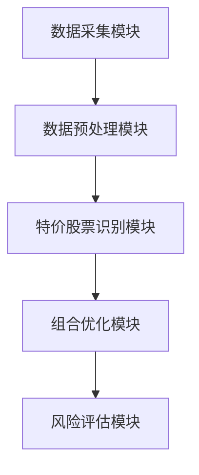

                 


# 如何利用特价股票策略进行组合优化

> 关键词：特价股票，组合优化，投资策略，算法优化，风险控制

> 摘要：本文深入探讨了如何利用特价股票策略进行组合优化，通过数学模型、算法实现和系统设计等多方面的分析，帮助投资者实现风险分散和收益最大化。

---

# 第1章: 特价股票策略概述

## 1.1 特价股票的定义与特点

### 1.1.1 什么是特价股票
特价股票是指在特定市场条件下价格被低估的股票。这些股票通常具有较高的潜在回报，但同时也伴随着较高的风险。

### 1.1.2 特价股票的市场特征
- 价格低于内在价值
- 市场流动性较低
- 周期性波动明显

### 1.1.3 特价股票的投资机会与风险
- 投资机会：潜在的高回报
- 风险：市场波动、流动性风险

## 1.2 组合优化的基本概念

### 1.2.1 什么是组合优化
组合优化是指通过优化算法选择最优的股票组合，以实现特定的投资目标（如最大化收益或最小化风险）。

### 1.2.2 组合优化的目标与意义
- 目标：最大化收益、最小化风险
- 意义：分散风险、提高投资效率

## 1.3 特价股票策略的应用场景

### 1.3.1 特价股票在个人投资中的应用
- 个人投资者通过识别特价股票进行投资

### 1.3.2 特价股票在机构投资中的应用
- 机构投资者利用特价股票策略优化投资组合

### 1.3.3 特价股票在风险控制中的作用
- 通过分散投资降低风险

## 1.4 本章小结
本章介绍了特价股票的定义、特点及其在投资组合中的应用，为后续的组合优化奠定了基础。

---

# 第2章: 组合优化的数学模型与算法原理

## 2.1 组合优化的数学模型

### 2.1.1 投资组合的收益与风险模型
收益：$r_i$，风险：$\sigma_i$  
投资组合的期望收益：$\mu = \sum_{i=1}^{n} w_i r_i$  
投资组合的风险：$\sigma^2 = \sum_{i=1}^{n} \sum_{j=1}^{n} w_i w_j \sigma_{ij}$

### 2.1.2 马科维茨均值-方差模型
$$
\min_w \sigma^2 = \sum_{i=1}^{n} \sum_{j=1}^{n} w_i w_j \sigma_{ij}$$  
$$\text{subject to } \sum_{i=1}^{n} w_i = 1, w_i \geq 0$$

### 2.1.3 线性规划与非线性规划模型
线性规划：目标函数和约束条件均为线性  
非线性规划：目标函数或约束条件为非线性

## 2.2 常用的组合优化算法

### 2.2.1 贪心算法
- 逐步选择收益最高的股票，直到达到目标

### 2.2.2 动态规划算法
- 将问题分解为子问题，逐步求解

### 2.2.3 遗传算法
- 模拟自然选择，通过交叉和变异优化解

### 2.2.4 模拟退火算法
- 类似物理退火，逐步降低能量以找到全局最优

## 2.3 算法的实现与优化

### 2.3.1 算法的实现步骤
1. 确定目标函数
2. 设定约束条件
3. 选择优化算法
4. 实现并优化算法

### 2.3.2 算法的优化技巧
- 参数调整
- 并行计算
- 使用高效的数学库

## 2.4 本章小结
本章详细介绍了组合优化的数学模型和常用算法，为后续的策略实现提供了理论基础。

---

# 第3章: 特价股票策略的核心算法实现

## 3.1 算法原理

### 3.1.1 算法的基本思路
- 识别特价股票
- 构建投资组合
- 优化组合

### 3.1.2 算法的核心步骤
1. 数据收集与预处理
2. 特价股票识别
3. 组合优化

## 3.2 算法实现

### 3.2.1 算法的代码实现
```python
import numpy as np
from scipy.optimize import minimize

def optimize_portfolio(weights, covariance_matrix):
    # 目标函数：最小化风险
    n = len(weights)
    def objective(x):
        return np.dot(x.T, np.dot(covariance_matrix, x))
    # 约束条件
    constraints = [{'type': 'eq', 'fun': lambda x: sum(x) - 1}]
    # 优化
    result = minimize(objective, np.ones(n)/n, constraints=constraints)
    return result.x

# 示例数据
weights = np.array([0.2, 0.3, 0.5])
covariance_matrix = np.array([[0.02, 0.01, 0.01],
                               [0.01, 0.03, 0.02],
                               [0.01, 0.02, 0.04]])
optimized_weights = optimize_portfolio(weights, covariance_matrix)
print(optimized_weights)
```

### 3.2.2 算法的优化与改进
- 使用更高效的优化算法
- 增加约束条件
- 动态调整权重

## 3.3 算法的

---

# 第4章: 组合优化的高级方法

## 4.1 机器学习在组合优化中的应用

### 4.1.1 机器学习的基本概念
- 监督学习、无监督学习、深度学习

### 4.1.2 机器学习在股票组合优化中的应用
- 预测股票价格
- 识别市场趋势

## 4.2 高级优化算法

### 4.2.1 非线性规划
- 处理复杂的约束条件

### 4.2.2 全局优化算法
- PSO（粒子群优化）
- ABC（人工蜂群）

## 4.3 本章小结
本章介绍了机器学习和高级优化算法在股票组合优化中的应用。

---

# 第5章: 系统设计与实现

## 5.1 系统架构设计

### 5.1.1 系统功能模块
- 数据采集
- 特价股票识别
- 组合优化
- 风险评估

### 5.1.2 系统架构图


## 5.2 接口设计

### 5.2.1 数据接口
- 数据输入接口
- 数据输出接口

### 5.2.2 API设计
- RESTful API

## 5.3 数据处理

### 5.3.1 数据清洗
- 处理缺失值
- 异常值处理

### 5.3.2 特征选择
- 选择关键特征
- 特征工程

## 5.4 本章小结
本章详细介绍了系统的架构设计和实现过程。

---

# 第6章: 项目实战

## 6.1 环境配置

### 6.1.1 安装必要的库
- NumPy
- Pandas
- Matplotlib
- Scipy

## 6.2 核心实现

### 6.2.1 数据收集
- 从Yahoo Finance获取数据

### 6.2.2 特价股票识别
- 计算市盈率、市净率等指标

### 6.2.3 组合优化
- 使用遗传算法优化权重

## 6.3 实验结果分析

### 6.3.1 收益分析
- 比较不同策略的收益

### 6.3.2 风险分析
- 对比不同策略的风险

## 6.4 本章小结
本章通过实际案例展示了如何利用特价股票策略进行组合优化。

---

# 第7章: 总结与展望

## 7.1 本文总结
本文详细介绍了如何利用特价股票策略进行组合优化，涵盖了从理论到实践的全过程。

## 7.2 未来展望
- 更复杂的优化算法
- 结合更多市场数据
- 实时监控与调整

## 7.3 注意事项
- 数据质量的重要性
- 风险控制的必要性

## 7.4 最佳实践 tips
- 定期评估和调整投资组合
- 结合市场变化动态优化

## 7.5 本章小结
本文总结了核心内容，并对未来的研究方向进行了展望。

---

# 附录

## A. 参考文献
- Markowitz, H. (1952). Portfolio Selection.
- 肖某（化名）. 《股票投资策略》

## B. 工具与资源
- Python库：NumPy, Pandas, Scipy
- 数据源：Yahoo Finance

---

# 作者

作者：AI天才研究院/AI Genius Institute & 禅与计算机程序设计艺术 /Zen And The Art of Computer Programming

