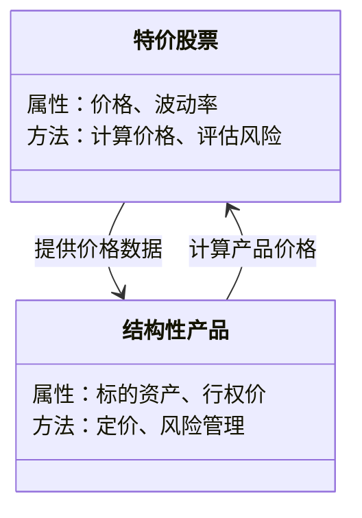
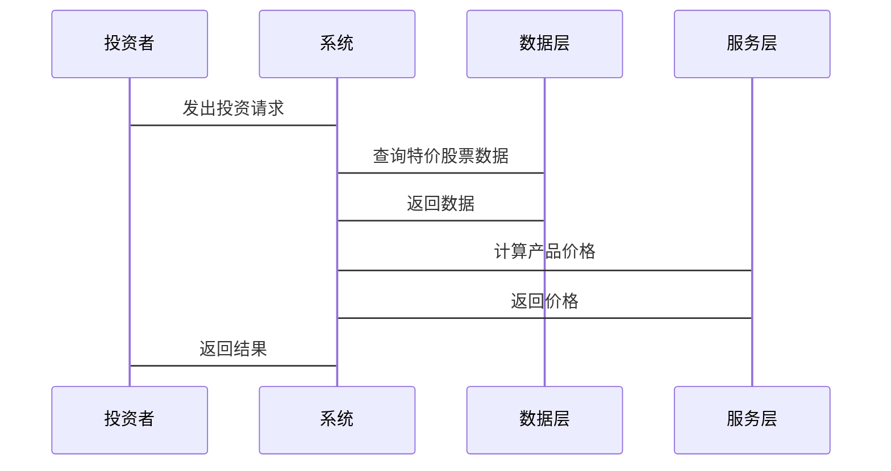

                 


# 如何利用特价股票策略进行结构性产品投资

> **关键词**: 特价股票策略, 结构性产品, 股票投资, 金融市场, 数学模型

> **摘要**: 本文详细探讨了如何利用特价股票策略进行结构性产品投资，从背景介绍、数学模型与算法原理、产品设计与定价、策略实施、系统分析与架构设计、项目实战以及最佳实践等方面进行深入分析。通过理论与实践相结合的方式，帮助读者全面理解特价股票策略在结构性产品中的应用，掌握投资技巧，降低风险，实现稳健收益。

---

## 第1章: 特价股票策略与结构性产品概述

### 1.1 特价股票策略的背景与概念

#### 1.1.1 特价股票的定义与特点
特价股票是指在特定市场条件下，价格被低估或具有较大折扣的股票。其特点包括高波动性、高风险和高潜在收益。特价股票通常出现在市场低迷或公司面临短期困难时，但具有长期投资价值。

#### 1.1.2 结构性产品的定义与特点
结构性产品是一种结合了金融衍生品和固定收益产品的投资工具，其收益与特定资产或指数的表现挂钩。结构性产品的特点包括高定制性、杠杆效应和风险可控性。

#### 1.1.3 特价股票策略在结构性产品中的应用
特价股票策略通过结构性产品将股票价格波动与投资者收益相结合，为投资者提供了一种在市场波动中获利的工具。结构性产品为特价股票策略提供了杠杆效应和风险对冲机制。

### 1.2 特价股票策略的市场机制

#### 1.2.1 特价股票市场的运作模式
特价股票市场通常由做市商提供流动性，投资者可以通过交易所或经纪商参与交易。市场机制包括订单匹配、价格发现和风险管理。

#### 1.2.2 结构性产品的市场运作机制
结构性产品的市场运作涉及发行、交易和结算。产品设计方根据市场情况和投资者需求设计产品，投资者通过购买产品参与市场。

#### 1.2.3 特价股票与结构性产品的关联性分析
特价股票为结构性产品提供了价格波动的基础，而结构性产品为特价股票策略提供了风险管理和收益增强的工具。两者结合可以有效降低投资风险，提高收益潜力。

### 1.3 特价股票策略的核心要素

#### 1.3.1 特价股票的定价模型
特价股票的定价模型需要考虑市场波动、流动性风险和公司基本面因素。常用模型包括Black-Scholes模型和二叉树模型。

#### 1.3.2 结构性产品的风险评估
结构性产品的风险评估需要考虑市场风险、信用风险和流动性风险。评估方法包括VaR（在险价值）和CVaR（条件在险价值）。

#### 1.3.3 特价股票策略的可行性分析
可行性分析包括市场环境、产品设计、投资目标和风险承受能力。投资者需要根据自身需求选择合适的策略。

---

## 第2章: 特价股票策略的数学模型与算法原理

### 2.1 特价股票策略的数学模型

#### 2.1.1 特价股票定价的数学公式
特价股票的定价公式基于市场波动率和时间价值。公式如下：
$$ S(t) = S(0) \times e^{(r-\sigma^2)t + \sigma \sqrt{t} Z} $$
其中，\( S(t) \) 是股票价格，\( S(0) \) 是初始价格，\( r \) 是无风险利率，\( \sigma \) 是波动率，\( Z \) 是标准正态分布随机变量。

#### 2.1.2 结构性产品定价的数学模型
结构性产品的定价模型结合了股票价格和期权定价。公式如下：
$$ P = S(0) \times e^{-rt} \times N(d_1) - K \times e^{-rt} \times N(d_2) $$
其中，\( P \) 是产品价格，\( K \) 是行权价，\( N(d) \) 是标准正态分布的累积分布函数。

#### 2.1.3 特价股票策略的风险评估公式
风险评估公式基于VaR和CVaR：
$$ VaR = \alpha \times \sigma \times \sqrt{t} $$
$$ CVaR = \frac{1}{1-\alpha} \times \int_{-\infty}^{VaR} (x - VaR) f(x) dx $$
其中，\( \alpha \) 是置信水平，\( \sigma \) 是波动率，\( t \) 是时间窗口。

### 2.2 算法原理

#### 2.2.1 特价股票策略的算法流程
1. 确定投资目标和策略。
2. 选择合适的结构性产品。
3. 制定投资计划和风险控制。

#### 2.2.2 结构性产品定价的算法实现
```python
import numpy as np
from scipy.stats import norm

def black_scholes(S, K, r, sigma, T):
    t = T / 365
    d1 = (np.log(S/K) + (r + 0.5*sigma**2)*t) / (sigma*np.sqrt(t))
    d2 = d1 - sigma*np.sqrt(t)
    C = S * norm.cdf(d1) - K * np.exp(-r*t) * norm.cdf(d2)
    return C
```

#### 2.2.3 特价股票策略的风险管理算法
1. 定期监控市场波动。
2. 调整投资组合。
3. 评估风险敞口。

### 2.3 算法实现

#### 2.3.1 算法的Python实现代码
```python
import numpy as np
from scipy.stats import norm

def calculate_vega(S, K, r, sigma, T):
    t = T / 365
    d1 = (np.log(S/K) + (r + 0.5*sigma**2)*t) / (sigma*np.sqrt(t))
    vega = S * norm.pdf(d1) * np.sqrt(t)
    return vega
```

#### 2.3.2 算法的数学推导与公式解释
推导过程如下：
$$ \frac{\partial C}{\partial \sigma} = S \times N'(d1) \times \sqrt{t} $$
其中，\( N'(d1) \) 是标准正态分布的密度函数。

#### 2.3.3 算法的优化与改进
优化包括使用更精确的数值方法和引入实时数据流。

---

## 第3章: 结构性产品的设计与定价

### 3.1 结构性产品的设计原理

#### 3.1.1 结构性产品的基本设计要素
包括标的资产、行权价、到期日和收益结构。

#### 3.1.2 特价股票策略在产品设计中的应用
通过嵌入期权或认沽权来对冲市场风险。

#### 3.1.3 结构性产品的风险收益分析
分析包括潜在收益和最大损失。

### 3.2 结构性产品的定价模型

#### 3.2.1 特价股票策略的定价方法
基于Black-Scholes模型和蒙特卡洛模拟。

#### 3.2.2 结构性产品的定价公式
$$ P = S(0) \times e^{-rt} \times N(d1) - K \times e^{-rt} \times N(d2) $$

#### 3.2.3 特价股票策略对产品定价的影响
波动率和期限对产品价格影响显著。

### 3.3 结构性产品的风险管理

#### 3.3.1 特价股票策略的风险来源
包括市场波动、流动性风险和信用风险。

#### 3.3.2 结构性产品的风险控制措施
引入对冲机制和设置止损点。

#### 3.3.3 特价股票策略的风险评估与应对
定期评估风险敞口并调整投资组合。

---

## 第4章: 特价股票策略在结构性产品中的实施

### 4.1 特价股票策略的实施步骤

#### 4.1.1 确定投资目标与策略
明确投资目标和风险承受能力。

#### 4.1.2 选择合适的结构性产品
根据市场环境和产品特点选择合适的产品。

#### 4.1.3 制定投资计划与风险控制
制定详细的交易计划并严格执行。

### 4.2 特价股票策略的实施案例

#### 4.2.1 案例分析：某结构性产品的设计与实施
以某指数期权产品为例，分析其设计和实施过程。

#### 4.2.2 案例分析：特价股票策略的实际应用
通过具体案例说明策略的应用和效果。

#### 4.2.3 案例分析：结构性产品的市场表现
分析市场表现并总结经验教训。

### 4.3 实施中的注意事项

#### 4.3.1 投资者需注意的风险
包括市场风险、流动性风险和信用风险。

#### 4.3.2 投资策略的调整
根据市场变化及时调整策略。

#### 4.3.3 风险管理措施
包括分散投资、设置止损和定期评估。

---

## 第5章: 系统分析与架构设计方案

### 5.1 系统功能设计

#### 5.1.1 领域模型Mermaid类图


#### 5.1.2 系统架构Mermaid架构图
```mermaid
archi
    界面层
    服务层
    数据层
```

### 5.2 系统接口设计

#### 5.2.1 系统接口设计
包括API接口和数据接口。

### 5.3 系统交互Mermaid序列图



---

## 第6章: 项目实战

### 6.1 项目环境安装

#### 6.1.1 Python环境安装
安装Python和必要的库，如numpy和scipy。

### 6.2 系统核心实现源代码

#### 6.2.1 系统核心实现源代码
```python
import numpy as np
from scipy.stats import norm

def black_scholes(S, K, r, sigma, T):
    t = T / 365
    d1 = (np.log(S/K) + (r + 0.5*sigma**2)*t) / (sigma*np.sqrt(t))
    d2 = d1 - sigma*np.sqrt(t)
    C = S * norm.cdf(d1) - K * np.exp(-r*t) * norm.cdf(d2)
    return C
```

#### 6.2.2 代码应用解读与分析
解释代码实现和应用。

### 6.3 实际案例分析

#### 6.3.1 案例分析
分析实际市场中的结构性产品，解释其设计和实施。

### 6.4 项目小结

---

## 第7章: 最佳实践、小结、注意事项与拓展阅读

### 7.1 最佳实践 tips
包括风险管理、分散投资和定期评估。

### 7.2 小结
总结全文，强调特价股票策略在结构性产品中的重要性。

### 7.3 注意事项
提醒投资者注意市场风险和流动性风险。

### 7.4 拓展阅读
推荐相关书籍和资源。

---

**作者：AI天才研究院/AI Genius Institute & 禅与计算机程序设计艺术 /Zen And The Art of Computer Programming**

