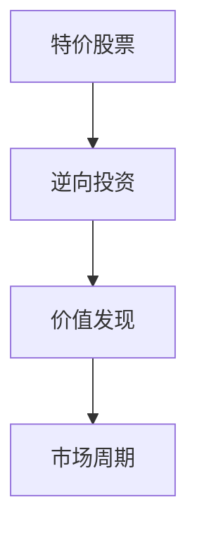
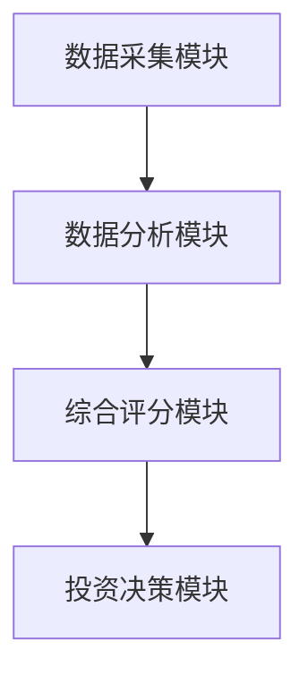
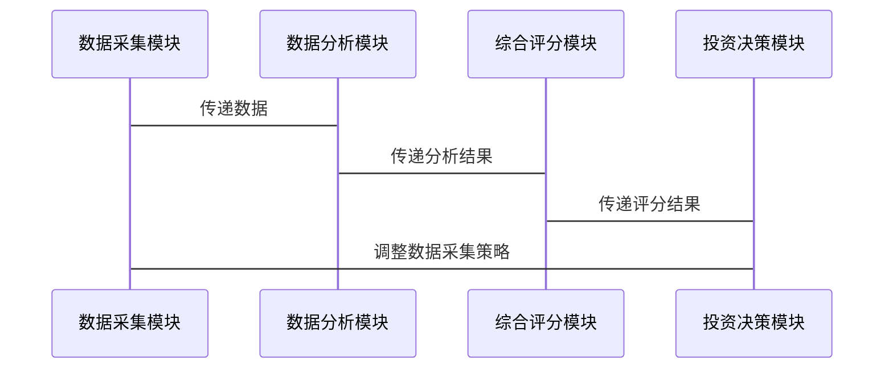

                 


# 《如何利用特价股票策略进行逆向产业投资》

> 关键词：特价股票策略、逆向投资、股票筛选算法、价值评估、投资风险管理

> 摘要：本文将详细探讨如何利用特价股票策略进行逆向产业投资。首先，我们将从特价股票策略和逆向投资的基本概念入手，分析它们的联系与区别。然后，我们将深入探讨特价股票策略的核心算法原理，包括基于市场周期的股票筛选和逆向投资中的价值评估。接下来，我们将结合实际案例，展示如何通过综合评分模型和系统架构设计来实现逆向产业投资。最后，我们将总结投资过程中需要注意的风险管理、税务规划和心理建设。

---

# 第1章: 特价股票策略与逆向投资概述

## 1.1 特价股票策略的基本概念
### 1.1.1 什么是特价股票
特价股票是指市场价格显著低于其内在价值的股票。这种差异通常出现在市场恐慌、行业低迷或公司基本面暂时出现问题的情况下。

### 1.1.2 特价股票的市场特征
- 市场价格与内在价值的偏离
- 低估值公司或行业的股票
- 投机与价值的双重属性

### 1.1.3 特价股票与普通股票的区别
| 属性 | 特价股票 | 普通股票 |
|------|----------|----------|
| 价格 | 低于内在价值 | 接近或高于内在价值 |
| 投资时机 | 市场恐慌时 | 市场稳定时 |
| 风险 | 较高 | 较低 |

## 1.2 逆向投资的基本原理
### 1.2.1 逆向投资的定义
逆向投资是一种在市场恐慌时买入、市场狂热时卖出的投资策略。其核心思想是“别人恐惧时我贪婪，别人贪婪时我恐惧”。

### 1.2.2 逆向投资的核心思想
- 逆市场情绪操作
- 寻找被市场抛弃的低估资产
- 突击行业低迷期或公司困境期

### 1.2.3 逆向投资与价值投资的区别
| 属性 | 逆向投资 | 价值投资 |
|------|----------|----------|
| 投资时机 | 市场恐慌时 | 市场稳定时 |
| 标的选择 | 低估资产 | 高质量资产 |
| 风险偏好 | 较高 | 较低 |

## 1.3 特价股票策略与逆向投资的联系
### 1.3.1 特价股票策略在逆向投资中的应用
- 在市场恐慌时，利用特价股票策略筛选出被市场低估的股票进行投资。
- 通过逆向投资的逻辑，寻找那些暂时被市场抛弃但具备长期价值的股票。

### 1.3.2 逆向投资视角下的特价股票分析
- 从行业周期的角度分析特价股票的投资价值。
- 通过公司基本面分析，寻找那些因短期问题导致股价暴跌但具备长期潜力的股票。

### 1.3.3 特价股票策略与逆向投资的结合案例
- 某行业在经济危机时股价大幅下跌，利用特价股票策略筛选出该行业的低估股票，并通过逆向投资的逻辑进行布局。

## 1.4 本章小结
本章通过介绍特价股票策略和逆向投资的基本概念，分析了它们的联系与区别，并通过实际案例展示了它们的结合应用。

---

# 第2章: 特价股票策略的核心概念与联系

## 2.1 特价股票策略的核心要素
### 2.1.1 市场周期分析
- 市场周期的定义与划分
- 不同周期下的投资策略

### 2.1.2 公司基本面评估
- 基本面分析的核心指标
- 企业价值评估的方法

### 2.1.3 技术分析指标
- 技术分析的基本原理
- 常用的技术指标（如MACD、RSI等）

## 2.2 逆向投资的核心原理
### 2.2.1 价值发现的逻辑
- 价值发现的核心思想
- 逆向投资中的价值评估方法

### 2.2.2 市场情绪与价格波动的关系
- 市场情绪的波动周期
- 市场情绪与股价波动的关联性

### 2.2.3 逆向投资中的安全边际概念
- 安全边际的定义
- 安全边际在逆向投资中的应用

## 2.3 特价股票策略与逆向投资的关系
### 2.3.1 策略的协同效应
- 特价股票策略与逆向投资的协同作用
- 两者结合的优势

### 2.3.2 策略的优劣势对比
- 特价股票策略的优劣势
- 逆向投资的优劣势
- 两者结合的综合优劣势

### 2.3.3 策略的适用场景分析
- 特价股票策略适用的场景
- 逆向投资适用的场景
- 两者结合适用的场景

## 2.4 核心概念属性对比表
| 概念 | 属性 | 描述 |
|------|------|------|
| 特价股票 | 市场价格 | 低于内在价值 |
| 逆向投资 | 投资时机 | 在市场恐慌时买入 |

## 2.5 ER实体关系图


## 2.6 本章小结
本章详细探讨了特价股票策略的核心要素和逆向投资的核心原理，分析了两者的关系和协同效应，并通过对比表和ER图展示了它们的联系。

---

# 第3章: 特价股票策略的算法原理

## 3.1 基于市场周期的股票筛选算法
### 3.1.1 市场周期的定义与划分
- 市场周期的定义
- 市场周期的划分方法

### 3.1.2 基于ARIMA模型的市场预测
- ARIMA模型的定义
- ARIMA模型的实现步骤
- ARIMA模型在市场预测中的应用

### 3.1.3 特价股票的筛选标准
- 特价股票的筛选指标
- 特价股票的筛选流程

## 3.2 逆向投资中的价值评估算法
### 3.2.1 基于DCF模型的企业价值评估
- DCF模型的定义
- DCF模型的实现步骤
- DCF模型在企业价值评估中的应用

### 3.2.2 市盈率与市净率的对比分析
- 市盈率与市净率的定义
- 市盈率与市净率的对比分析
- 市盈率与市净率在价值评估中的应用

### 3.2.3 等级评分模型的设计与实现
- 等级评分模型的定义
- 等级评分模型的实现步骤
- 等级评分模型在价值评估中的应用

## 3.3 综合评分模型的数学公式
$$

P_{score} = \frac{P_{DCF} + P_{市盈率} + P_{市净率}}{3} $$

其中：
- \( P_{DCF} \) 表示DCF模型评估的企业价值
- \( P_{市盈率} \) 表示市盈率评估的企业价值
- \( P_{市净率} \) 表示市净率评估的企业价值

## 3.4 本章小结
本章详细探讨了基于市场周期的股票筛选算法和逆向投资中的价值评估算法，介绍了综合评分模型的数学公式，并通过实例展示了它们的应用。

---

# 第4章: 特价股票策略的系统分析与架构设计

## 4.1 系统功能设计
### 4.1.1 数据采集模块
- 数据来源：股票市场数据、公司基本面数据、行业数据等
- 数据采集方法：API接口、数据库查询等

### 4.1.2 数据分析模块
- 数据分析方法：统计分析、机器学习算法等
- 数据分析工具：Python、R、MATLAB等

### 4.1.3 综合评分模块
- 综合评分模型的实现
- 综合评分结果的输出

### 4.1.4 投资决策模块
- 投资决策规则
- 投资决策输出

## 4.2 系统架构设计


## 4.3 系统接口设计
- 数据接口：数据输入接口、数据输出接口
- 投资决策接口：投资决策输出接口、投资策略调整接口

## 4.4 系统交互流程


## 4.5 本章小结
本章详细探讨了特价股票策略的系统功能设计、架构设计和交互流程，并通过图表展示了系统的整体架构。

---

# 第5章: 特价股票策略的项目实战

## 5.1 环境安装与配置
### 5.1.1 开发环境的选择
- Python、Jupyter Notebook等
### 5.1.2 数据源的获取
- 股票数据获取方法
- 数据清洗与预处理

## 5.2 数据采集与分析实现
### 5.2.1 数据采集代码示例
```python
import pandas as pd
import numpy as np

# 数据采集代码
data = pd.read_csv('stock_data.csv')
```

### 5.2.2 数据分析代码示例
```python
# 数据分析代码
data['EMA'] = data['收盘价'].ewm(alpha=0.5).mean()
```

## 5.3 综合评分模型实现
### 5.3.1 综合评分模型代码示例
```python
def calculate_score(df):
    # DCF模型评估
    dcf_score = df['DCF'].mean()
    # 市盈率评估
    pe_score = df['市盈率'].mean()
    # 市净率评估
    p

