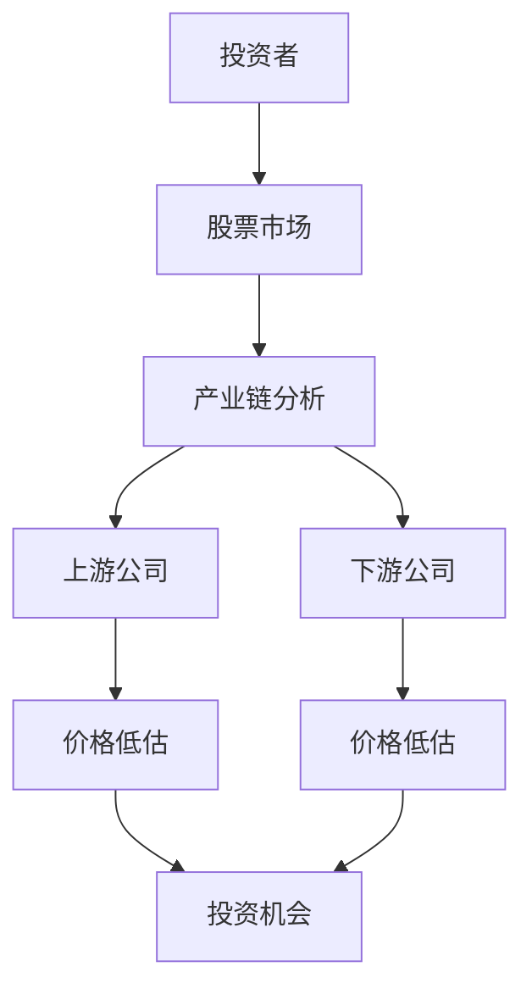
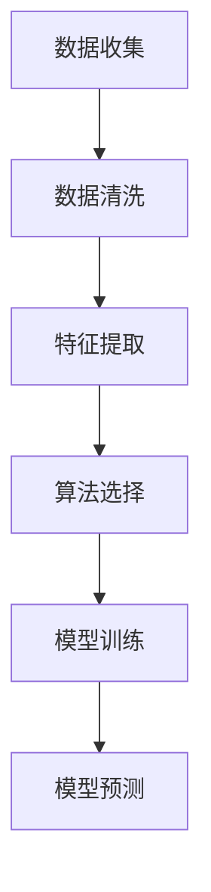

                 


```markdown
# 如何利用特价股票策略进行逆向产业链投资

> 关键词：特价股票、逆向产业链、投资策略、算法模型、系统架构

> 摘要：本文深入探讨了如何利用特价股票策略进行逆向产业链投资，从核心概念到算法模型，再到系统架构，详细阐述了如何通过逆向思维寻找投资机会。文章结合实际案例，分析了特价股票策略在逆向产业链中的应用，提出了基于机器学习的股票预测算法，并设计了完整的系统架构。最后，通过项目实战展示了如何在实际投资中应用这些策略和模型。

---

# 第一部分: 特价股票策略与逆向产业链投资基础

## 第1章: 特价股票策略概述

### 1.1 特价股票的定义与特点

#### 1.1.1 特价股票的定义
特价股票是指市场价格低于其内在价值的股票。通常，这些股票可能暂时被市场低估，但具备长期增长潜力。投资者通过识别这些股票，可以在低价时买入，待其价值回归时卖出，从而获利。

#### 1.1.2 特价股票的核心特点
- 价格低估：市场价格低于行业平均水平或历史平均水平。
- 基本面良好：公司财务状况健康，盈利能力强。
- 估值指标合理：市盈率（P/E）、市净率（P/B）等指标低于行业平均水平。

#### 1.1.3 特价股票与普通股票的区别
- 投资逻辑不同：特价股票注重价值回归，普通股票注重成长性。
- 风险偏好不同：特价股票适合风险厌恶型投资者，普通股票适合风险偏好型投资者。
- 持股时间不同：特价股票通常需要较长时间持有，普通股票交易频率较高。

### 1.2 逆向产业链投资的概念

#### 1.2.1 逆向产业链投资的定义
逆向产业链投资是指从产业链的下游或上游某个环节入手，逆向寻找投资机会。这种方法通常用于发现被市场忽视或低估的公司，尤其是那些在产业链中处于弱势地位但具备核心竞争力的企业。

#### 1.2.2 逆向产业链投资的背景与意义
- 市场波动性：股票价格受市场情绪影响较大，逆向投资可以在市场恐慌时寻找机会。
- 产业链协同：通过分析产业链上下游关系，发现潜在投资机会。
- 风险分散：逆向投资可以降低市场波动对投资组合的影响。

#### 1.2.3 逆向产业链投资的核心要素
- 产业链分析：了解产业链的构成和各环节的关系。
- 价格低估：寻找价格低于内在价值的公司。
- 长期持有：耐心等待价值回归。

## 第2章: 逆向产业链投资的现状与背景

### 2.1 特价股票策略的背景

#### 2.1.1 特价股票策略的历史发展
- 早期价值投资：格雷厄姆的“烟蒂投资”理念。
- 现代应用：量化分析与技术分析的结合。

#### 2.1.2 特价股票策略在现代投资中的地位
- 量化投资的重要组成部分。
- 机构投资者和个人投资者的共同选择。

#### 2.1.3 特价股票策略的市场环境分析
- 市场周期性：低价股在熊市中更容易出现。
- 行业波动：特定行业如周期性行业的股票更容易出现特价股票。

### 2.2 逆向产业链投资的现状

#### 2.2.1 逆向产业链投资的市场现状
- 市场参与者：机构投资者和个人投资者。
- 市场波动：逆向投资在市场恐慌时更具吸引力。

#### 2.2.2 特价股票策略在逆向产业链中的应用
- 产业链分析：从下游到上游或从上游到下游寻找机会。
- 价格低估：寻找价格低于行业平均水平的公司。
- 长期持有：耐心等待价值回归。

#### 2.2.3 当前市场中的典型案例分析
- 某行业的上游公司因市场波动导致股价下跌，但具备长期竞争力，适合逆向投资。

---

# 第二部分: 逆向产业链投资的核心概念与联系

## 第3章: 逆向产业链投资的核心概念

### 3.1 逆向产业链投资的核心原理

#### 3.1.1 产业链的构成与分析
- 产业链的构成：从上游到下游的各环节。
- 产业链的分析：识别各环节的关键公司和市场地位。

#### 3.1.2 逆向产业链投资的逻辑框架
- 从下游到上游：寻找被市场忽视的上游公司。
- 从上游到下游：寻找具有成本优势的下游公司。

#### 3.1.3 逆向产业链投资的关键要素
- 产业链分析：识别关键环节和公司。
- 价格低估：寻找价格低于内在价值的公司。
- 长期持有：耐心等待价值回归。

### 3.2 特价股票策略与逆向产业链的关系

#### 3.2.1 特价股票策略在逆向产业链中的作用
- 识别价格低估的公司。
- 通过产业链分析找到具有竞争力的公司。

#### 3.2.2 逆向产业链对特价股票策略的支撑
- 提供产业链视角，帮助发现潜在机会。
- 通过分析产业链上下游关系，增强投资决策的准确性。

#### 3.2.3 两者结合的协同效应
- 产业链分析帮助识别潜在低估公司。
- 特价股票策略帮助在产业链中找到价格低估的公司。

## 第4章: 核心概念的属性特征对比与实体关系图

### 4.1 核心概念的属性特征对比

#### 4.1.1 特价股票与普通股票的属性对比
| 属性       | 特价股票                | 普通股票                |
|------------|-------------------------|-------------------------|
| 价格       | 低于内在价值            | 可能高于内在价值        |
| 基本面      | 财务状况健康，盈利能力强 | 可能财务状况一般         |
| 投资逻辑    | 价值回归                | 成长性或市场情绪驱动     |

#### 4.1.2 逆向产业链与正向产业链的对比
| 属性       | 逆向产业链              | 正向产业链              |
|------------|-------------------------|-------------------------|
| 投资方向    | 从下游或上游入手        | 从核心环节入手          |
| 投资逻辑    | 寻找被市场忽视的机会    | 寻找市场关注的核心公司   |
| 投资难度    | 较高，需要深入分析产业链| 较低，市场信息较为透明   |

### 4.2 实体关系图（Mermaid流程图）



---

# 第三部分: 算法原理与数学模型

## 第5章: 基于机器学习的特价股票预测算法

### 5.1 算法原理

#### 5.1.1 数据收集与预处理
- 数据来源：股票历史数据、财务数据、行业数据。
- 数据清洗：处理缺失值、异常值。
- 特征提取：提取股价、成交量、财务指标等。

#### 5.1.2 算法选择与实现
- 算法选择：支持向量机（SVM）或随机森林（Random Forest）。
- 算法实现：使用Python的scikit-learn库。

#### 5.1.3 算法流程图（Mermaid流程图）



#### 5.1.4 数学模型
- 支持向量机（SVM）：
  - 核心思想：寻找一个超平面，使得正负样本点距离超平面最远。
  - 优化目标：最大化间隔。
  - 模型公式：
    $$ \text{最大化} \quad \frac{1}{2}\|w\|^2 $$
    $$ \text{约束} \quad y_i(w \cdot x_i + b) \geq 1 \quad \forall i $$
  - 通过拉格朗日乘数法求解。

---

# 第四部分: 系统分析与架构设计

## 第6章: 系统架构设计

### 6.1 系统功能设计

#### 6.1.1 领域模型（Mermaid类图）

```mermaid
classDiagram
class 投资者 {
    - 资金：float
    - 投资组合：list
    - 目标：string
}
class 股票市场 {
    - 股票列表：list
    - 价格数据：dict
}
class 产业链分析模块 {
    - 产业链数据：dict
    - 分析结果：list
}
class 预测模型 {
    - 模型参数：dict
    - 预测结果：list
}
investor -> 股票市场
股票市场 -> 产业链分析模块
产业链分析模块 -> 预测模型
```

#### 6.1.2 系统架构设计（Mermaid架构图）

```mermaid
docker
    service 投资者 {
        publish 80: http
    }
    service 股票市场 {
        publish 8080: http
    }
    service 产业链分析模块 {
        publish 8081: http
    }
    service 预测模型 {
        publish 8082: http
    }
    投资者 --> 股票市场
    股票市场 --> 产业链分析模块
    产业链分析模块 --> 预测模型
```

---

# 第五部分: 项目实战

## 第7章: 项目实战

### 7.1 环境安装与配置

#### 7.1.1 环境要求
- Python 3.8+
- scikit-learn、pandas、numpy等库。

#### 7.1.2 环境配置代码

```bash
pip install scikit-learn pandas numpy
```

### 7.2 核心实现代码

#### 7.2.1 数据收集与预处理代码

```python
import pandas as pd
import numpy as np

# 数据收集
data = pd.read_csv('stock_data.csv')

# 数据清洗
data.dropna(inplace=True)
data = data[~data['price'].isin([np.nan])]

# 特征提取
features = ['price', 'volume', 'eps']
target = 'target_price'
```

#### 7.2.2 模型训练代码

```python
from sklearn.svm import SVC
from sklearn.model_selection import train_test_split

X = data[features]
y = data[target]

X_train, X_test, y_train, y_test = train_test_split(X, y, test_size=0.2)

model = SVC()
model.fit(X_train, y_train)
```

#### 7.2.3 模型预测代码

```python
y_pred = model.predict(X_test)
print("预测结果:", y_pred)
```

### 7.3 实际案例分析

#### 7.3.1 案例背景
某行业上游公司因市场波动导致股价下跌，但公司财务状况健康，具备长期竞争力。

#### 7.3.2 数据分析
- 股价：当前股价低于行业平均水平。
- 财务指标：净利润增长稳定，负债率低。

#### 7.3.3 模型预测结果
- 预测结果：股价将在未来6个月内回归合理估值。

---

# 第六部分: 总结与展望

## 第8章: 总结与展望

### 8.1 总结

通过逆向产业链投资和特价股票策略的结合，投资者可以在市场波动中发现潜在机会。本文详细探讨了核心概念、算法模型和系统架构，并通过实际案例展示了如何在实际投资中应用这些策略和模型。

### 8.2 展望

未来，随着人工智能和大数据技术的发展，特价股票策略和逆向产业链投资将更加精准和高效。投资者可以利用更先进的算法和工具，进一步优化投资决策。

---

作者：AI天才研究院/AI Genius Institute & 禅与计算机程序设计艺术/Zen And The Art of Computer Programming
```

