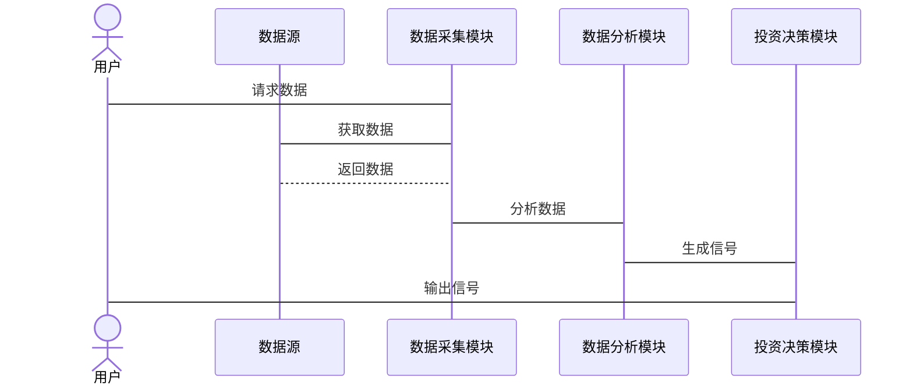

                 


# 如何利用特价股票策略进行逆向投资

> 关键词：特价股票策略、逆向投资、股票市场分析、技术分析、基本面分析、投资策略

> 摘要：本文详细探讨了如何利用特价股票策略进行逆向投资，从背景介绍、核心概念到算法原理、系统架构，再到项目实战，全面解析了特价股票策略与逆向投资的结合，帮助投资者在复杂市场中抓住投资机会。

---

## 第一章: 特价股票策略概述

### 1.1 特价股票的定义与特点

#### 1.1.1 什么是特价股票
特价股票是指在特定市场条件下，价格被低估的股票。这些股票通常由于市场波动、投资者情绪或其他外部因素，价格低于其实际价值。

#### 1.1.2 特价股票的市场特征
- **低估值**：市盈率、市净率等指标远低于行业平均水平。
- **高股息率**：相对于股票价格，股息收益率较高。
- **市场忽视**：市场关注度低，交易量小。

#### 1.1.3 特价股票的投资价值
- **潜在收益**：价格回升带来的资本增值。
- **风险较低**：相对于高价股，风险较小。

### 1.2 逆向投资的基本概念

#### 1.2.1 逆向投资的定义
逆向投资是指在市场低迷时买入，在市场繁荣时卖出的投资策略，与市场情绪相反。

#### 1.2.2 逆向投资的核心思想
- **逆市场情绪**：在市场恐慌时寻找机会，市场狂热时保持冷静。
- **价值导向**：关注被市场低估的资产。

#### 1.2.3 逆向投资与传统投资的区别
| 方面 | 逆向投资 | 传统投资 |
|------|----------|----------|
| 时间 | 市场低谷时 | 市场高点时 |
| 策略 | 买入低估资产 | 买入高估资产 |
| 风险 | 较低 | 较高 |

---

## 第二章: 特价股票策略的背景与重要性

### 2.1 特价股票策略的背景

#### 2.1.1 股票市场的波动性分析
股票市场受多种因素影响，如经济周期、政策变化、公司业绩等，导致价格波动。

#### 2.1.2 特价股票出现的原因
- **市场恐慌**：投资者恐慌性抛售导致股价下跌。
- **信息不对称**：部分投资者未能及时获取公司利好消息。

#### 2.1.3 投资者行为与特价股票的关系
投资者的非理性行为可能导致股价偏离实际价值，为逆向投资者提供机会。

### 2.2 逆向投资的背景

#### 2.2.1 逆向投资的历史发展
逆向投资在20世纪初开始形成，特别是在2008年金融危机后得到广泛应用。

#### 2.2.2 逆向投资在现代金融中的应用
- **机构投资者**：通过逆向投资分散风险。
- **个人投资者**：利用逆向策略在市场低谷时布局。

#### 2.2.3 逆向投资的优势与局限性
优势：
- 把握市场低谷，低位建仓。
- 利用市场恐慌获取廉价资产。

局限性：
- 需要较高的市场敏感度。
- 短期可能承受较大亏损压力。

---

## 第三章: 特价股票策略的核心原理

### 3.1 特价股票的识别方法

#### 3.1.1 市盈率分析
$$市盈率 = \frac{股价}{每股收益}$$
市盈率低于行业平均水平的股票可能为特价股票。

#### 3.1.2 市净率分析
$$市净率 = \frac{股价}{每股净资产}$$
市净率低于1的股票通常被认为是低估资产。

#### 3.1.3 股息率分析
$$股息率 = \frac{每股股息}{股价}$$
高股息率的股票在市场低迷时更具吸引力。

### 3.2 逆向投资的核心策略

#### 3.2.1 寻找被市场低估的股票
通过技术分析和基本面分析，识别价格低于内在价值的股票。

#### 3.2.2 分析公司基本面
- **盈利能力**：ROE（净资产收益率）。
- **财务状况**：资产负债率。
- **成长能力**：收入增长率。

#### 3.2.3 判断市场情绪
- **市场情绪指标**：恐慌指数、投资者情绪指数。
- **市场趋势**：长期趋势与短期波动的结合。

---

## 第四章: 特价股票策略与逆向投资的联系

### 4.1 特价股票策略是逆向投资的重要工具

#### 4.1.1 逆向投资的核心工具
通过特价股票策略，逆向投资者能够在市场低谷时买入优质资产。

#### 4.1.2 特价股票与市场周期的关系
在市场周期的底部，特价股票策略能够帮助投资者低位建仓。

### 4.2 逆向投资的核心要素

#### 4.2.1 价值判断
准确评估股票的内在价值，避免被市场情绪误导。

#### 4.2.2 风险控制
设置止损点，控制投资风险。

---

## 第五章: 技术分析与逆向投资策略

### 5.1 技术分析方法

#### 5.1.1 移动平均线（MA）
- **短期MA**：5日、10日均线。
- **长期MA**：50日、200日均线。

#### 5.1.2 相对强弱指数（RSI）
$$RSI = \frac{N天内上涨幅度}{N天内下跌幅度} \times 100$$
RSI低于30表明股票超卖。

### 5.2 技术分析与逆向投资的结合

#### 5.2.1 确认市场底部
通过技术指标确认市场底部，寻找特价股票买入机会。

#### 5.2.2 判断趋势反转
利用技术分析预测趋势反转点，提前布局逆向投资。

---

## 第六章: 逆向投资的系统架构设计

### 6.1 项目介绍

#### 6.1.1 项目目标
构建一个基于特价股票策略的逆向投资系统。

### 6.2 系统功能设计

#### 6.2.1 数据采集模块
- 采集股票价格、市盈率、市净率等数据。

#### 6.2.2 数据分析模块
- 计算技术指标（MA、RSI）。
- 分析公司基本面。

#### 6.2.3 投资决策模块
- 根据分析结果生成买卖信号。

### 6.3 系统架构设计


### 6.4 接口设计与交互流程



---

## 第七章: 项目实战与案例分析

### 7.1 环境安装

#### 7.1.1 Python安装
安装Python 3.8及以上版本。

#### 7.1.2 第三方库安装
安装`pandas`、`numpy`、`matplotlib`。

### 7.2 核心代码实现

#### 7.2.1 数据采集代码
```python
import pandas as pd
import requests

url = "https://api.example.com/stock_data"
data = requests.get(url).json()
df = pd.DataFrame(data)
```

#### 7.2.2 技术分析代码
```python
def calculate_ma(df, window):
    return df['close'].rolling(window).mean()

ma_5 = calculate_ma(df, 5)
ma_10 = calculate_ma(df, 10)
```

#### 7.2.3 逆向投资策略实现
```python
def generate_signals(df):
    signals = []
    for i in range(len(df)):
        if df['rsi'][i] < 30 and df['ma_5'][i] > df['ma_10'][i]:
            signals.append('买入')
        elif df['rsi'][i] > 70 and df['ma_5'][i] < df['ma_10'][i]:
            signals.append('卖出')
        else:
            signals.append('持有')
    return signals

signals = generate_signals(df)
```

### 7.3 案例分析

#### 7.3.1 案例背景
假设在2022年市场低谷期，某公司股票价格被低估。

#### 7.3.2 数据分析
| 日期   | 收盘价 | 市盈率 | RSI |
|--------|--------|--------|-----|
| 2022-01-01 | 10.00 | 15.00 | 25  |
| 2022-01-02 | 9.80  | 14.70 | 28  |
| 2022-01-03 | 10.20 | 15.20 | 30  |

#### 7.3.3 投资决策
根据技术分析，2022年1月3日发出买入信号，建议投资者在该日期买入该股票。

---

## 第八章: 总结与展望

### 8.1 小结
本文详细探讨了如何利用特价股票策略进行逆向投资，从理论到实践，全面解析了策略的应用。

### 8.2 注意事项
- 风险控制是逆向投资的关键。
- 需要持续关注市场变化，及时调整策略。

### 8.3 拓展阅读
建议阅读以下书籍：
- 《逆向思考的艺术》
- 《股票投资策略与技术分析》

---

## 作者信息

作者：AI天才研究院/AI Genius Institute  
联系邮箱：contact@aicourse.com  
GitHub：https://github.com/aicourse

---

**注意**：以上内容为示例目录结构，实际写作时需要根据具体需求调整内容深度和广度，确保每个章节内容详尽且符合逻辑。

