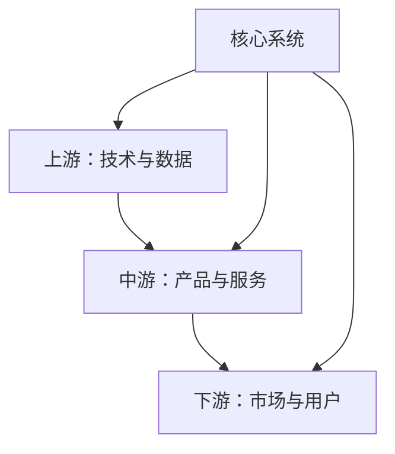
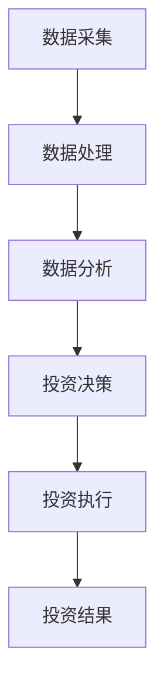
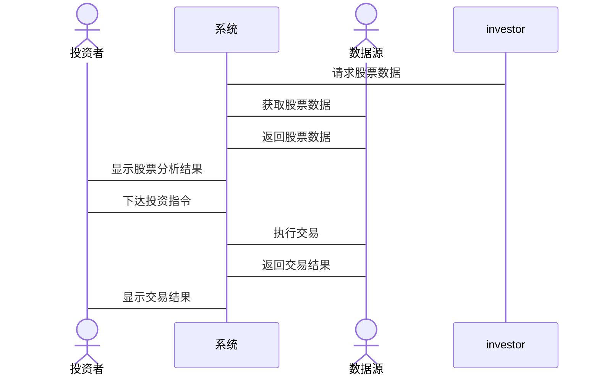

                 


# 如何利用特价股票策略进行逆向数字产业链投资

## 关键词：特价股票策略、逆向投资、数字产业链、系统架构、投资案例、风险控制

## 摘要：  
本文详细探讨了如何利用特价股票策略进行逆向数字产业链投资。通过分析数字产业链的结构与特点，结合特价股票策略的核心原理，本文提出了基于逆向思维的投资方法，并通过系统架构设计与实际案例分析，展示了如何在数字产业链中找到投资机会。文章还结合数学模型与算法原理，深入剖析了投资策略的实现路径，并给出了风险控制的建议。  

---

# 第一部分: 特价股票策略与逆向投资概述

## 第1章: 特价股票策略与逆向投资的基本概念

### 1.1 特价股票策略的定义与特点  
#### 1.1.1 什么是特价股票  
特价股票是指在特定市场条件下，价格被低估的股票。这些股票通常具有较高的安全边际，适合长期投资者在市场低谷时介入。  

#### 1.1.2 特价股票策略的核心特点  
- **低估值**：价格低于内在价值。  
- **逆周期性**：在市场低迷时表现更好。  
- **长期性**：适合长期持有，等待价值回归。  

#### 1.1.3 特价股票与普通股票的区别  
| 属性 | 特价股票 | 普通股票 |  
|------|----------|----------|  
| 估值 | 低于内在价值 | 价格接近或高于内在价值 |  
| 市场周期 | 低迷期表现较好 | 市场波动影响较大 |  
| 投资策略 | 逆向投资为主 | 顺势投资为主 |  

### 1.2 逆向投资的基本原理  
#### 1.2.1 逆向投资的定义  
逆向投资是一种在市场恐慌或低迷时买入，而在市场狂热时卖出的投资策略。它与顺势投资相反，强调在非理性市场中寻找机会。  

#### 1.2.2 逆向投资的核心思想  
- **反向思维**：在市场底部买入，顶部卖出。  
- **价值发现**：寻找被市场低估的投资标的。  
- **风险控制**：在市场恐慌时降低风险敞口。  

#### 1.2.3 逆向投资与顺势投资的区别  
| 属性 | 逆向投资 | 顺势投资 |  
|------|----------|----------|  
| 投资时机 | 市场低迷时买入 | 市场上涨时买入 |  
| 风险偏好 | 低 | 高 |  
| 投资策略 | 逆周期性 | 顺周期性 |  

### 1.3 数字产业链的概念与特征  
#### 1.3.1 数字产业链的定义  
数字产业链是指在数字技术支撑下，从上游技术与数据，到中游产品与服务，再到下游市场与用户的完整产业链。  

#### 1.3.2 数字产业链的主要组成部分  
- **上游**：技术与数据（如芯片、AI算法）。  
- **中游**：产品与服务（如软件、互联网平台）。  
- **下游**：市场与用户（如消费市场）。  

#### 1.3.3 数字产业链的投资机会  
- **技术驱动**：上游技术突破带来投资机会。  
- **产品迭代**：中游产品的快速迭代推动市场增长。  
- **用户需求**：下游用户的多样化需求推动市场扩展。  

---

## 第2章: 特价股票策略在数字产业链投资中的应用  

### 2.1 数字产业链的结构分析  
#### 2.1.1 上游：技术与数据  
上游是数字产业链的核心，包括芯片、AI算法、云计算等技术领域。这些领域通常具有较高的技术壁垒，适合长期投资。  

#### 2.1.2 中游：产品与服务  
中游是数字产业链的主体，包括软件开发、互联网平台、智能硬件等。这些领域具有较高的市场潜力，适合中期投资。  

#### 2.1.3 下游：市场与用户  
下游是数字产业链的终端，包括消费市场、企业市场等。这些领域受市场需求驱动，适合短期投资。  

### 2.2 特价股票策略在数字产业链中的优势  
#### 2.2.1 成本优势  
特价股票通常具有较低的估值，能够在数字产业链中以较低成本获取优质资产。  

#### 2.2.2 市场机会  
在数字产业链中，上游技术与数据领域的股票通常具有较高的成长潜力，适合特价股票策略。  

#### 2.2.3 风险控制  
通过逆向投资，在市场低迷时买入特价股票，能够在市场反弹时获得超额收益。  

### 2.3 特价股票策略与数字产业链的结合  
#### 2.3.1 理论基础  
特价股票策略与数字产业链的结合基于逆向投资理论，即在市场低迷时买入被低估的数字产业链股票。  

#### 2.3.2 实践应用  
- 在上游技术领域，寻找被低估的芯片、AI算法公司股票。  
- 在中游产品领域，关注被市场忽视的软件开发公司。  
- 在下游市场领域，寻找被低估的消费类股票。  

#### 2.3.3 成功案例分析  
以某芯片公司为例，该公司在市场低迷时被低估，通过特价股票策略买入，待市场反弹时获得超额收益。  

---

# 第二部分: 特价股票策略的系统分析与架构设计  

## 第3章: 数字产业链的系统分析  

### 3.1 数字产业链的系统架构  
#### 3.1.1 系统组成  
- 上游技术与数据模块  
- 中游产品与服务模块  
- 下游市场与用户模块  

#### 3.1.2 系统功能模块  
- 数据采集模块：收集市场数据。  
- 数据处理模块：对数据进行清洗与分析。  
- 数据分析模块：利用算法进行预测与决策。  

#### 3.1.3 系统交互流程  


### 3.2 数字产业链的系统架构图  


### 3.3 数字产业链的系统功能设计  
#### 3.3.1 领域模型  


---

## 第4章: 特价股票策略的系统架构设计  

### 4.1 系统架构设计  
#### 4.1.1 系统组成  
- 数据采集模块  
- 数据分析模块  
- 投资决策模块  

#### 4.1.2 系统架构图  


### 4.2 算法原理讲解  
#### 4.2.1 算法原理  
特价股票策略的核心算法是基于逆向投资的数学模型。  
$$ \text{投资价值} = \frac{\text{内在价值}}{\text{市场价格}} $$  

#### 4.2.2 算法实现  
```python
def calculate_intrinsic_value(price, earnings, growth_rate):
    return price * (1 + growth_rate)
    
def is_cheap(price, intrinsic_value, margin_of_safety):
    return price < intrinsic_value * (1 - margin_of_safety/100)
    
# 示例
price = 10
earnings = 5
growth_rate = 0.1
margin_of_safety = 20

intrinsic_value = calculate_intrinsic_value(price, earnings, growth_rate)
cheap = is_cheap(price, intrinsic_value, margin_of_safety)

print(f"股票价格：{price}，内在价值：{intrinsic_value}，是否低估：{cheap}")
```

### 4.3 系统接口设计  
#### 4.3.1 数据接口  
- 数据采集接口：从市场获取股票数据。  
- 数据处理接口：清洗与分析数据。  

#### 4.3.2 投资决策接口  
- 投资价值计算接口：基于算法计算股票价值。  
- 投资决策接口：判断是否买入或卖出。  

### 4.4 系统交互设计  


---

## 第5章: 项目实战  

### 5.1 环境配置  
- 安装Python与相关库（如Pandas、NumPy、Scikit-learn）。  
- 配置数据源接口。  

### 5.2 核心代码实现  
```python
import pandas as pd
import numpy as np
from sklearn import linear_model

def calculate_intrinsic_value(df):
    df['Intrinsic Value'] = df['Price'] * (1 + df['Growth Rate'])
    return df

def is_cheap(df, margin_of_safety):
    df['Cheap'] = df['Price'] < df['Intrinsic Value'] * (1 - margin_of_safety/100)
    return df

# 示例数据
data = {
    'Stock': ['A', 'B', 'C'],
    'Price': [10, 15, 20],
    'Earnings': [5, 7, 10],
    'Growth Rate': [0.1, 0.15, 0.05]
}

df = pd.DataFrame(data)
df = calculate_intrinsic_value(df)
df = is_cheap(df, 20)

print(df)
```

### 5.3 案例分析  
以某数字产业链公司为例，通过代码实现特价股票策略，分析投资机会与风险。  

### 5.4 项目小结  
总结项目实现过程中的关键点与经验教训，提出改进建议。  

---

## 第6章: 案例分析与未来趋势  

### 6.1 成功案例分析  
分析某数字产业链公司的投资案例，验证特价股票策略的有效性。  

### 6.2 投资策略的未来趋势  
随着数字技术的不断发展，特价股票策略在数字产业链中的应用将更加广泛。  

---

## 第三部分: 总结与展望  

### 7.1 总结  
本文详细探讨了如何利用特价股票策略进行逆向数字产业链投资，提出了系统的分析与架构设计方案，并通过案例分析验证了策略的有效性。  

### 7.2 展望  
未来，随着数字技术的进一步发展，特价股票策略在数字产业链中的应用将更加广泛，投资者需要不断优化策略，以应对市场变化。  

---

## 作者：AI天才研究院/AI Genius Institute & 禅与计算机程序设计艺术 /Zen And The Art of Computer Programming  

---

**注**：本文是基于思考过程的示例，实际内容可根据具体需求进行调整与扩展。

