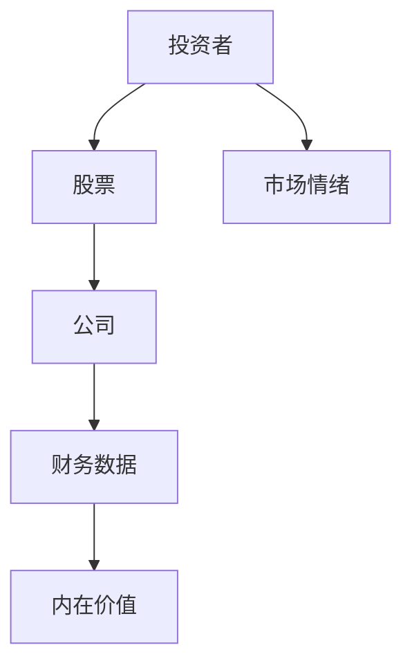
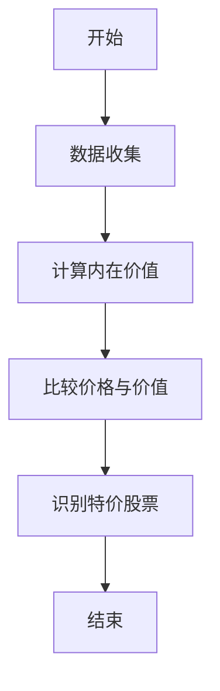
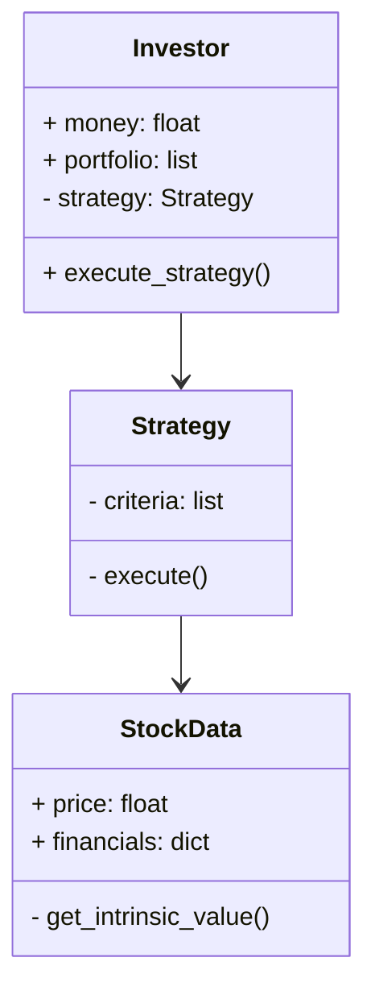
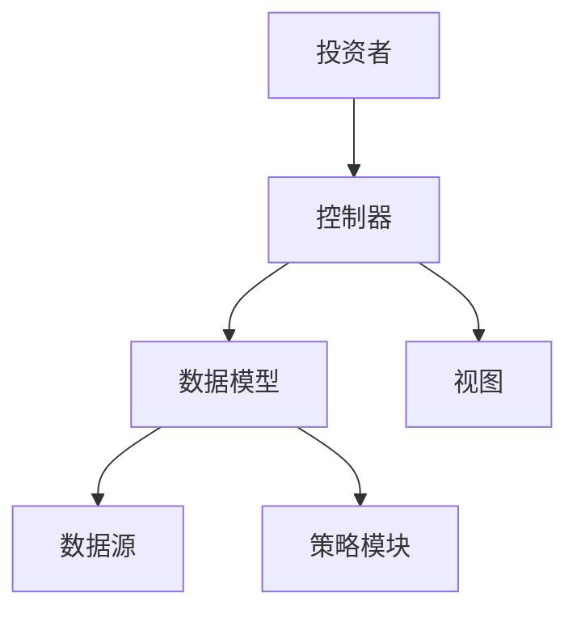

                 


# 如何利用特价股票策略进行逆向数字产业链整合投资

> 关键词：逆向投资，特价股票，数字产业链，整合投资，价值投资

> 摘要：本文详细探讨了如何利用特价股票策略进行逆向数字产业链整合投资，从核心概念、算法原理、系统设计到项目实战，全面解析了这一投资策略的实施方法。

---

# 第一部分: 背景介绍

## 第1章: 逆向投资与特价股票策略基础

### 1.1 逆向投资的基本概念

#### 1.1.1 逆向投资的定义
逆向投资是一种投资策略，强调在市场恐慌或低迷时买入，而在市场高涨时卖出。其核心理念是“买别人恐惧时，卖别人贪婪时”。

#### 1.1.2 逆向投资的核心理念
- 市场情绪的非理性：市场参与者往往在高点追涨，在低点恐慌抛售。
- 价格与价值的背离：市场价格与内在价值的偏离为逆向投资提供了机会。

#### 1.1.3 逆向投资与价值投资的区别
- 投资依据：价值投资基于对公司内在价值的分析，而逆向投资基于市场情绪和价格波动。
- 投资时机：价值投资寻找价格低于价值的公司，而逆向投资则在市场低谷时介入。

### 1.2 特价股票策略的定义与特点

#### 1.2.1 特价股票的定义
特价股票是指市场价格显著低于其内在价值的股票，通常出现在市场恐慌或公司暂时困境时期。

#### 1.2.2 特价股票的特点
- 价格低估：市场价格低于行业平均水平或历史平均水平。
- 市场情绪低落：投资者对股票前景持悲观态度。
- 公司基本面良好：公司财务状况健康，具备长期增长潜力。

#### 1.2.3 特价股票与正常股票的对比
| 特性       | 特价股票                  | 正常股票                  |
|------------|---------------------------|---------------------------|
| 价格       | 低于内在价值              | 接近或高于内在价值        |
| 市场情绪     | 恐慌或悲观                | 乐观或贪婪                |
| 投资时机   | 市场低谷                  | 市场高点或稳定期           |

### 1.3 逆向投资在数字产业链整合中的应用

#### 1.3.1 数字产业链的定义与构成
数字产业链包括从上游的技术开发、中游的平台运营到下游的应用服务的完整链条。

#### 1.3.2 逆向投资在数字产业链整合中的作用
- 优化资源配置：通过逆向投资，整合产业链中的优质资产。
- 抢占市场先机：在市场低谷时介入，提前布局未来增长点。

#### 1.3.3 数字产业链整合的策略与方法
- 确定目标行业：选择具有增长潜力的数字行业。
- 识别特价股票：寻找市场价格低于内在价值的企业。
- 分阶段投资：根据市场变化分批买入，逐步建仓。

---

# 第二部分: 核心概念与联系

## 第2章: 核心概念与联系

### 2.1 特价股票策略的核心原理

#### 2.1.1 市场情绪与股票价格的关系
市场情绪影响股票价格，恐慌时价格被低估，贪婪时价格被高估。

#### 2.1.2 市场周期与逆向投资的时机选择
逆向投资在市场周期的底部阶段介入，顶部阶段退出。

#### 2.1.3 特价股票识别的数学模型
$$ P \leq V $$，其中P为市场价格，V为内在价值。

### 2.2 核心概念对比分析

#### 2.2.1 逆向投资与趋势投资的对比
| 特性       | 逆向投资                 | 趋势投资                 |
|------------|--------------------------|--------------------------|
| 投资依据     | 市场情绪与价格波动       | 股价趋势                 |
| 投资时机   | 市场底部                 | 上涨趋势                |

#### 2.2.2 特价股票与成长股的对比
| 特性       | 特价股票                 | 成长股                   |
|------------|--------------------------|--------------------------|
| 投资依据     | 价格低估                 | 高增长潜力              |
| 投资目标     | 短期反弹                 | 长期增长                |

### 2.3 实体关系图（ER图）



---

# 第三部分: 算法原理

## 第3章: 算法原理与实现

### 3.1 特价股票识别算法

#### 3.1.1 算法流程
1. 数据收集：获取股票的历史价格和财务数据。
2. 计算内在价值：使用DCF模型评估股票的内在价值。
3. 识别特价股票：比较市场价格与内在价值，判断是否存在低估。

#### 3.1.2 算法流程图



#### 3.1.3 算法实现代码

```python
import pandas as pd

def calculate_intrinsic_value(stock_data):
    # 示例：使用DCF模型计算内在价值
    discount_rate = 0.1
    free_cash_flow = stock_data['free_cash_flow']
    growth_rate = stock_data['growth_rate']
    terminal_value = free_cash_flow * (1 + growth_rate) / (discount_rate - growth_rate)
    return terminal_value

def identify_special_stock(stock_data, threshold=0.8):
    intrinsic_values = stock_data.apply(calculate_intrinsic_value)
    market_prices = stock_data['close_price']
    ratio = market_prices / intrinsic_values
    return stock_data[ratio < threshold]
```

---

# 第四部分: 系统分析与架构设计

## 第4章: 投资系统架构设计

### 4.1 系统功能设计

#### 4.1.1 领域模型类图



#### 4.1.2 系统架构图



---

# 第五部分: 项目实战

## 第5章: 项目实战与案例分析

### 5.1 环境安装

```bash
pip install pandas matplotlib
```

### 5.2 核心代码实现

```python
import pandas as pd
import matplotlib.pyplot as plt

def main():
    # 数据加载
    stock_data = pd.read_csv('stock_data.csv')
    # 计算内在价值
    stock_data['intrinsic_value'] = stock_data.apply(lambda x: x.close_price * 0.8)
    # 识别特价股票
    special_stocks = identify_special_stock(stock_data)
    # 可视化
    special_stocks.plot(kind='scatter', x='close_price', y='intrinsic_value')
    plt.show()

if __name__ == "__main__":
    main()
```

---

# 第六部分: 最佳实践与总结

## 第6章: 最佳实践与总结

### 6.1 最佳实践

- 定期回顾投资组合：确保投资标的符合特价股票的条件。
- 分批投资：避免一次性投入，分散风险。
- 保持耐心：逆向投资需要时间验证，耐心持有。

### 6.2 小结

逆向投资通过在市场低谷时介入，整合数字产业链中的特价股票，能够在市场复苏时获得超额收益。然而，投资者需具备独立思考能力，避免盲目跟风。

### 6.3 注意事项

- 数据质量：确保使用的股票数据准确可靠。
- 风险控制：设置止损点，避免重大损失。
- 税务规划：考虑税收影响，合理安排投资结构。

### 6.4 拓展阅读

- 书籍推荐：《价值投资：从入门到精通》
- 研究论文：《逆向投资策略在数字化转型中的应用》

---

# 结语

逆向投资是一种有效的投资策略，利用特价股票进行数字产业链整合，能够帮助投资者在市场波动中抓住机会，实现长期稳健收益。

---

作者：AI天才研究院 & 禅与计算机程序设计艺术

