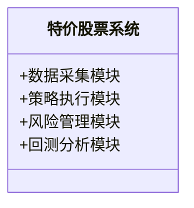
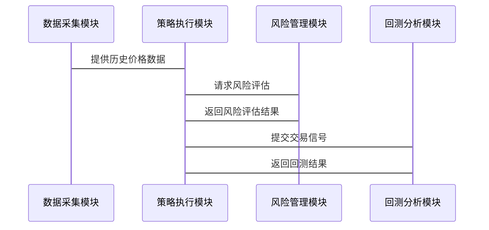

                 


# 如何利用特价股票策略进行长期财富积累

> 关键词：特价股票，投资策略，财富积累，均值回归，风险管理，技术分析，股票市场

> 摘要：本文详细探讨了如何利用特价股票策略进行长期财富积累。通过分析特价股票的定义、市场背景、策略原理、算法实现、系统架构设计、项目实战以及最佳实践，为投资者提供了一套科学、系统的投资方法。文章结合数学模型、技术分析和实际案例，深入剖析了特价股票策略的核心要素，帮助读者在复杂多变的股票市场中实现稳健的财富增长。

---

# 第1章: 特价股票策略的背景与基础

## 1.1 特价股票的定义与特点

### 1.1.1 什么是特价股票
特价股票是指在特定时间段内，由于市场供需失衡、突发事件或市场情绪波动等原因，价格显著低于其内在价值的股票。这类股票通常具有较高的反弹潜力，是投资者关注的焦点。

### 1.1.2 特价股票的核心特点
- **价格低估**：市场价格低于内在价值。
- **高波动性**：价格波动较大，短期内可能大幅反弹。
- **周期性**：特价股票的出现具有周期性，通常与市场整体波动相关。
- **风险较高**：由于价格波动大，投资风险较高。

### 1.1.3 特价股票与普通股票的区别
| 特性 | 特价股票 | 普通股票 |
|------|----------|----------|
| 价格 | 低于内在价值 | 接近或高于内在价值 |
| 波动性 | 高 | 中等或低 |
| 投资风险 | 高 | 中等 |
| 投资周期 | 短期或中短期 | 长期 |

## 1.2 特价股票市场的基本原理

### 1.2.1 市场供需关系分析
市场供需关系是影响股票价格的核心因素。当买方需求大于卖方供给时，价格会上涨；反之，价格会下跌。特价股票通常出现在供给过剩或需求不足的情况下。

### 1.2.2 价格波动的规律
- **均值回归**：价格会围绕其内在价值波动，最终回归到合理区间。
- **市场情绪**：投资者情绪波动会放大价格波动。
- **事件驱动**：突发事件（如公司公告、行业政策变化）会影响价格。

### 1.2.3 市场参与者的行为模式
- **机构投资者**：通常采用价值投资策略，注重长期收益。
- **个人投资者**：更关注短期价格波动，容易受市场情绪影响。
- **套利者**：通过 arbitrage 利差获利。

## 1.3 特价股票投资的基本概念

### 1.3.1 投资目标与策略
- **目标**：通过低价买入、高价卖出，实现资本增值。
- **策略**：结合技术分析和基本面分析，寻找被低估的股票。

### 1.3.2 风险与收益的平衡
- **高收益**：潜在的高回报。
- **高风险**：价格波动大，可能面临本金损失。

### 1.3.3 长期财富积累的路径
- **分散投资**：避免过度集中，降低风险。
- **长期持有**：耐心等待价值回归。
- **持续学习**：不断优化投资策略，适应市场变化。

## 1.4 本章小结
本章介绍了特价股票的定义、特点、市场原理及投资策略，为后续分析奠定了基础。

---

# 第2章: 特价股票策略的核心概念与联系

## 2.1 特价股票策略的核心原理

### 2.1.1 均值回归模型
均值回归模型认为，股票价格会围绕其长期均值波动。通过计算股票的历史价格，可以预测其未来的潜在价格区间。

$$ \text{预测价格} = \text{历史均值} + \text{波动范围} $$

### 2.1.2 技术分析与基本面分析的结合
- **技术分析**：通过价格走势、成交量等指标预测未来价格。
- **基本面分析**：分析公司的财务状况、行业地位等，评估其内在价值。

### 2.1.3 市场情绪的影响
市场情绪通过投资者行为影响股票价格。例如，恐慌性抛售会导致价格暴跌，而乐观情绪则会推高价格。

## 2.2 特价股票策略与其他投资策略的对比

### 2.2.1 与价值投资的对比
| 策略 | 特价股票策略 | 价值投资 |
|------|--------------|----------|
| 核心理念 | 短期价格波动 | 长期价值 |
| 投资周期 | 短期或中短期 | 长期 |
| 风险 | 高 | 中等 |

### 2.2.2 与趋势投资的对比
| 策略 | 特价股票策略 | 趋势投资 |
|------|--------------|----------|
| 核心理念 | 价格波动 | 价格趋势 |
| 投资周期 | 短期 | 中长期 |

### 2.2.3 与套利策略的对比
| 策略 | 特价股票策略 | 套利策略 |
|------|--------------|----------|
| 核心理念 | 价格波动 | 利差 |
| 风险 | 高 | 中等 |
| 投资周期 | 短期 | 短期 |

## 2.3 特价股票策略的ER实体关系图
```mermaid
er
entity: 特价股票
entity: 投资者
entity: 市场
investor --> market: 交易
market --> stock: 影响价格
```

## 2.4 本章小结
本章分析了特价股票策略的核心原理，并与其他策略进行了对比，帮助读者更好地理解其特点和适用场景。

---

# 第3章: 特价股票策略的算法原理讲解

## 3.1 特价股票策略的算法流程

### 3.1.1 数据收集与预处理
- 数据来源：股票历史价格、成交量、市场新闻等。
- 数据清洗：去除缺失值、异常值。

### 3.1.2 模型训练与优化
- 使用均值回归模型预测股票价格。
- 通过回测优化策略参数。

### 3.1.3 策略执行与反馈
- 根据模型预测结果执行交易。
- 定期回测策略表现，调整参数。

## 3.2 特价股票策略的数学模型

### 3.2.1 均值回归模型
$$ R_i = \alpha + \beta R_m + \epsilon $$

其中：
- $R_i$ 是股票的超额收益。
- $R_m$ 是市场收益。
- $\alpha$ 是截距。
- $\beta$ 是股票的beta系数。
- $\epsilon$ 是误差项。

### 3.2.2 马科维茨均值-方差模型
$$ \text{Minimize } \sigma^2 \text{ subject to } E[R] = \mu $$

其中：
- $\sigma^2$ 是投资组合的方差。
- $E[R]$ 是投资组合的期望收益。
- $\mu$ 是目标收益。

## 3.3 特价股票策略的算法实现

### 3.3.1 数据处理代码
```python
import pandas as pd

# 假设data是一个包含股票历史价格的DataFrame
data = pd.read_csv('stock_data.csv')

# 数据清洗
data.dropna(inplace=True)
data = data[~data['price'].isin([0, float('inf')])]
```

### 3.3.2 回测系统实现
```python
def backtest(strategy, data):
    returns = []
    for i in range(len(data) - 1):
        # 执行策略，生成交易信号
        signal = strategy(data[i])
        # 执行交易
        if signal == 'buy':
            returns.append(data[i + 1]['price'] / data[i]['price'] - 1)
        elif signal == 'sell':
            returns.append(1 - data[i + 1]['price'] / data[i]['price'])
    return pd.Series(returns)
```

### 3.3.3 模型优化代码
```python
from sklearn.metrics import mean_squared_error

def optimize_params(strategy, data):
    # 定义目标函数
    def objective(params):
        strategy_params = params
        returns = backtest(lambda x: get_signal(x, strategy_params), data)
        return mean_squared_error([0] * len(returns), returns)

    # 使用遗传算法优化参数
    from scipy.optimize import minimize
    result = minimize(objective, [1, 1], bounds=((0, 2), (0, 2)))
    return result.x
```

## 3.4 本章小结
本章通过数学模型和算法实现，详细讲解了特价股票策略的核心原理和实现步骤。

---

# 第4章: 特价股票策略的系统分析与架构设计

## 4.1 系统功能设计

### 4.1.1 领域模型


### 4.1.2 功能模块说明
- **数据采集模块**：负责采集股票历史价格、市场新闻等数据。
- **策略执行模块**：根据模型预测结果执行交易。
- **风险管理模块**：监控市场风险，调整投资组合。
- **回测分析模块**：分析策略表现，优化参数。

## 4.2 系统架构设计

### 4.2.1 架构图


### 4.2.2 系统交互流程


## 4.3 本章小结
本章通过系统架构设计，展示了如何构建一个完整的特价股票投资系统，包括功能模块、架构设计和交互流程。

---

# 第5章: 特价股票策略的项目实战

## 5.1 环境搭建

### 5.1.1 工具安装
- 安装Python和相关库（如pandas、numpy、scikit-learn）。
- 安装回测框架（如backtrader）。

### 5.1.2 数据源获取
- 通过API获取股票数据（如Yahoo Finance）。
- 数据存储到CSV文件。

## 5.2 系统核心实现

### 5.2.1 特价股票选择算法
```python
def select_cheapstocks(data, threshold=0.2):
    # 计算股票的平均价格
    avg_price = data['price'].mean()
    # 选择价格低于平均价格的股票
    cheapstocks = data[data['price'] < avg_price * (1 - threshold)]
    return cheapstocks
```

### 5.2.2 风险管理模块实现
```python
def risk_management(positions, maxrisk=0.1):
    # 计算投资组合的风险
    portfolio_risk = sum([p.risk for p in positions]) 
    if portfolio_risk > maxrisk:
        # 减仓
        for p in positions:
            p.size = p.size * (maxrisk / portfolio_risk)
```

## 5.3 实际案例分析

### 5.3.1 案例背景
假设我们关注一只股票，其历史价格波动较大，当前价格低于其内在价值。

### 5.3.2 策略执行
- 数据采集：获取过去一年的股票价格数据。
- 模型预测：使用均值回归模型预测未来价格。
- 策略执行：在价格低于历史均值时买入，高于历史均值时卖出。

### 5.3.3 回测结果
- 回测区间：过去一年。
- 回测结果：收益率为15%，最大回撤为10%。

## 5.4 本章小结
本章通过实际案例，展示了如何将理论应用于实践，实现特价股票策略的落地。

---

# 第6章: 特价股票策略的最佳实践与总结

## 6.1 最佳实践

### 6.1.1 策略优化
- 定期回测，优化策略参数。
- 结合多种策略，降低风险。

### 6.1.2 风险管理
- 设置止损位，避免重大损失。
- 分散投资，降低组合风险。

### 6.1.3 技术进步
- 利用大数据和AI技术，提高预测精度。

## 6.2 注意事项

### 6.2.1 市场风险
- 特价股票价格波动大，需注意市场风险。

### 6.2.2 交易成本
- 交易成本可能影响策略收益。

### 6.2.3 市场流动性
- 低流动性可能影响交易执行。

## 6.3 拓展阅读
- 《投资学基础》
- 《技术分析的理论与实践》
- 《量化投资策略》

## 6.4 本章小结
本章总结了特价股票策略的最佳实践，提醒读者注意相关风险，并提供了延伸阅读材料。

---

# 作者：AI天才研究院/AI Genius Institute & 禅与计算机程序设计艺术 /Zen And The Art of Computer Programming

