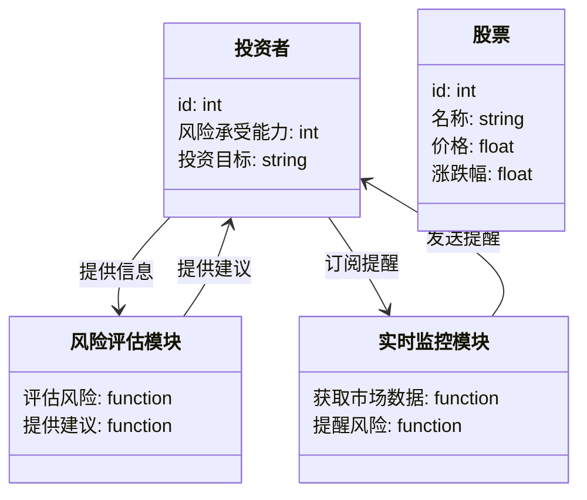
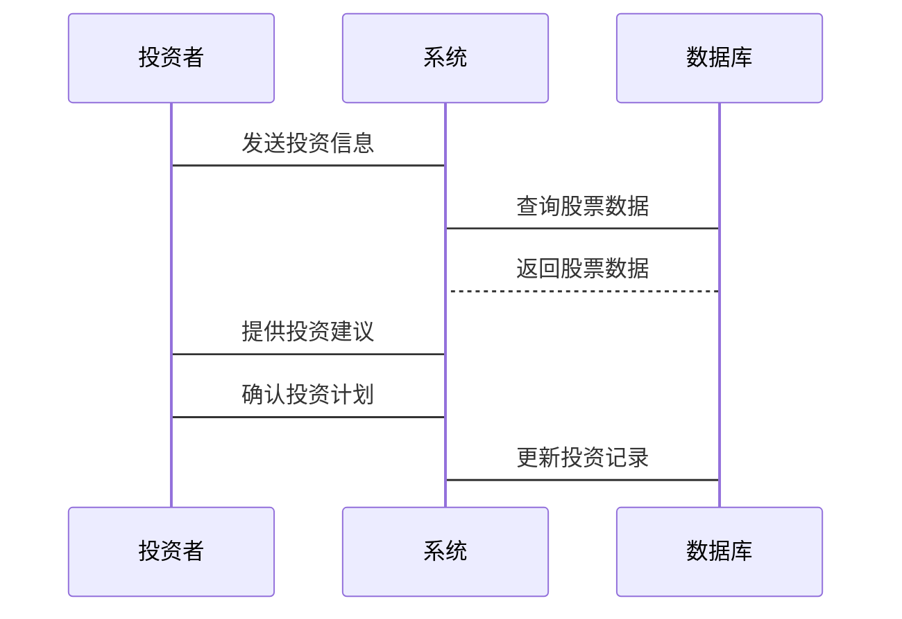

                 


```markdown
# 如何处理特价股票投资中的亏损

## 文章关键词

- 特价股票投资
- 投资亏损
- 风险管理
- 心理控制
- 投资策略

## 文章摘要

本文将深入探讨如何在特价股票投资中有效应对亏损。通过分析亏损的原因、制定科学的风险管理策略、优化投资心理和行为，帮助投资者在复杂多变的市场环境中实现稳健投资。文章从理论到实践，结合案例分析和系统设计，为投资者提供实用的操作指南。

## 第一部分：特价股票投资中的亏损概述

### 第1章：特价股票投资的基本概念

#### 1.1 特价股票的定义与特点

**1.1.1 特价股票的定义**

特价股票是指在特定市场条件下，价格被严重低估的股票。这类股票通常具有较高的潜在回报，但伴随着较高的风险。

$$
\text{特价股票} = \text{低估值} + \text{高潜力}
$$

**1.1.2 特价股票的核心特点**

- **价格低估**：市场反应尚未充分，价格远低于内在价值。
- **高波动性**：价格波动剧烈，容易受市场情绪影响。
- **高风险**：信息不对称和市场操纵风险较高。

**1.1.3 特价股票与普通股票的区别**

| 特性 | 特价股票 | 普通股票 |
|------|----------|----------|
| 价格 | 低估     | 合理     |
| 波动 | 高       | 中       |
| 风险 | 高       | 中       |
| 潜力 | 高       | 中       |

#### 1.2 投资亏损的定义与分类

**1.2.1 投资亏损的定义**

投资亏损是指投资者在投资过程中，实际收益低于预期收益或本金的情况。

$$
\text{亏损} = \text{实际收益} - \text{预期收益} < 0
$$

**1.2.2 投资亏损的分类**

- **短期亏损**：短期内价格波动导致的暂时性亏损。
- **长期亏损**：由于市场环境或公司基本面恶化导致的持续亏损。
- **结构性亏损**：由于市场结构或信息不对称导致的系统性亏损。

---

## 第二部分：亏损的原因分析

### 第2章：亏损的内在原因

#### 2.1 投资者心理因素

**2.1.1 投资者心理的脆弱性**

投资者的心理弱点是导致亏损的重要原因。例如：

- **贪婪**：盲目追求高收益，忽视风险。
- **恐惧**：市场下跌时过度恐慌，导致错失良机。

**2.1.2 情绪化决策的影响**

情绪化决策会导致以下问题：

- **决策失误**：在市场波动时做出错误判断。
- **纪律性差**：无法严格执行投资计划。

**2.1.3 过度自信的陷阱**

过度自信的投资者容易：

- **高估自身能力**：认为自己能够准确预测市场。
- **低估风险**：忽视潜在的市场风险。

---

### 第3章：亏损的外在因素

#### 3.1 市场波动与不确定性

**3.1.1 市场波动的不可预测性**

市场波动是投资中的常态，但其不可预测性增加了投资难度。

$$
\text{市场波动} = \text{市场情绪} + \text{经济数据}
$$

**3.1.2 经济周期对股票价格的影响**

经济周期对股票价格的影响：

- **上升周期**：股票价格普遍上涨。
- **下降周期**：股票价格普遍下跌。

**3.1.3 特价股票的特殊风险**

- **流动性风险**：交易量小，价格容易被操纵。
- **信息风险**：信息不对称导致决策失误。

#### 3.2 市场操纵与虚假信息

**3.2.1 市场操纵的定义与表现**

市场操纵是指通过虚假交易或其他手段影响股票价格。

- **拉高出货**：先拉高价格，再高位抛售。
- **打压吸筹**：先压低价格，再低位吸筹。

**3.2.2 虚假信息的传播与影响**

虚假信息可能导致：

- **投资者恐慌**：引发非理性抛售。
- **价格异常波动**：扰乱市场秩序。

**3.2.3 如何识别和应对市场操纵**

- **识别操纵行为**：关注交易量和价格走势异常。
- **减少操纵风险**：分散投资，避免集中持有单一股票。

---

## 第三部分：亏损的应对策略

### 第4章：风险管理策略

#### 4.1 投资组合的分散化

**4.1.1 分散化投资的原理**

通过分散投资降低风险。

$$
\text{分散化} = \sum_{i=1}^{n} \text{投资比例}_i \times \text{资产风险}_i
$$

**4.1.2 如何构建有效的投资组合**

- **资产配置**：根据风险承受能力分配资产。
- **行业分散**：投资不同行业的股票。

**4.1.3 分散化与风险控制的关系**

分散化可以降低非系统性风险，但无法完全消除系统性风险。

#### 4.2 止损策略的制定与执行

**4.2.1 什么是止损**

止损是指在亏损达到预设点位时，立即卖出以限制损失。

$$
\text{止损点} = \text{买入价} \times (1 - \text{止损比例})
$$

**4.2.2 如何制定止损点**

- **技术分析法**：基于价格支撑位或阻力位。
- **基本面法**：基于公司估值。

**4.2.3 止损执行中的常见问题**

- **执行延迟**：价格快速下跌导致止损无法及时执行。
- **频繁止损**：市场波动导致多次触发止损。

---

### 第5章：心理控制与自我管理

#### 5.1 投资者心理的自我认知

**5.1.1 认识自己的投资心理**

- **自我评估**：了解自己的风险承受能力和心理素质。
- **心理测试**：通过测试了解自己的投资心理特点。

**5.1.2 如何克服贪婪与恐惧**

- **贪婪**：避免追涨杀跌，控制贪婪情绪。
- **恐惧**：保持冷静，避免过度反应。

**5.1.3 心理素质对投资决策的影响**

- **情绪稳定**：保持理性，避免情绪化决策。
- **决策纪律**：严格执行投资计划，避免随意更改。

#### 5.2 自我管理技巧

**5.2.1 制定投资计划与纪律**

- **投资计划**：明确投资目标、策略和时间表。
- **纪律执行**：严格按照计划执行，避免随意更改。

**5.2.2 如何保持情绪稳定**

- **心理调节**：通过冥想、运动等方式放松心情。
- **情绪记录**：定期记录情绪变化，分析原因。

**5.2.3 投资记录与反思的重要性**

- **记录投资行为**：记录每次投资的决策、原因和结果。
- **定期反思**：分析投资结果，总结经验教训。

---

## 第四部分：亏损的案例分析与策略优化

### 第6章：亏损案例分析

#### 6.1 特价股票投资中的常见亏损案例

**案例一：盲目跟风的投资亏损**

- **背景**：投资者盲目跟风购买热门股票，未进行充分研究。
- **后果**：股票价格下跌，造成较大亏损。
- **教训**：投资前必须进行充分研究和分析。

**案例二：忽视风险的高收益追求**

- **背景**：投资者追求高收益，忽视潜在风险。
- **后果**：市场波动导致严重亏损。
- **教训**：收益与风险并存，必须重视风险管理。

**案例三：市场波动下的恐慌性抛售**

- **背景**：市场下跌引发投资者恐慌性抛售。
- **后果**：错失反弹机会，扩大亏损。
- **教训**：保持冷静，避免情绪化决策。

#### 6.2 亏损案例的启示

- **案例分析总结**：从失败案例中吸取教训，优化投资策略。
- **经验教训**：认识到风险控制的重要性，避免类似错误。

---

## 第五部分：系统设计与架构方案

### 第7章：系统架构设计

#### 7.1 问题场景介绍

- **目标**：构建一个智能投资系统，帮助投资者实现稳健投资。
- **核心功能**：风险评估、投资建议、实时监控、心理分析。

#### 7.2 系统功能设计

**领域模型（Mermaid 类图）**



**系统架构设计（Mermaid 架构图）**


**系统接口设计**

- **API 接口**：
  - GET /stocks 获取股票信息
  - POST /risk_assessment 提交风险评估请求
  - GET /alerts 获取提醒信息

**系统交互（Mermaid 序列图）**



---

## 第六部分：项目实战与最佳实践

### 第8章：项目实战

#### 8.1 环境安装

- **工具安装**：安装 Python、Pandas、Matplotlib 等工具。
- **数据获取**：获取历史股票数据，例如使用 Yahoo Finance API。

#### 8.2 核心实现

**代码实现**

```python
import pandas as pd
import matplotlib.pyplot as plt

# 获取股票数据
def get_stock_data(ticker):
    data = pd.DataFrame()
    # 模拟从数据库获取数据
    data['price'] = [100, 105, 98, 110, 108]
    data['date'] = ['2023-01-01', '2023-01-02', '2023-01-03', '2023-01-04', '2023-01-05']
    return data

# 计算波动率
def calculate_vatility(data):
    returns = data['price'].pct_change().dropna()
    volatility = returns.std() * 100
    return volatility

# 绘制股价走势
def plot_stock_price(ticker, data):
    plt.figure(figsize=(10,6))
    plt.plot(data['date'], data['price'])
    plt.title(f"{ticker} Stock Price")
    plt.xlabel('Date')
    plt.ylabel('Price')
    plt.show()

# 主程序
if __name__ == "__main__":
    ticker = 'AAPL'
    data = get_stock_data(ticker)
    volatility = calculate_volatile

