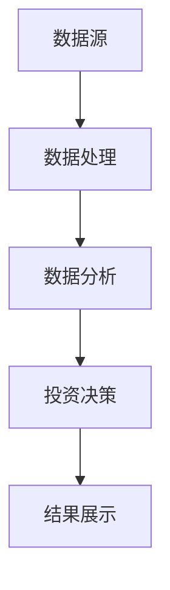
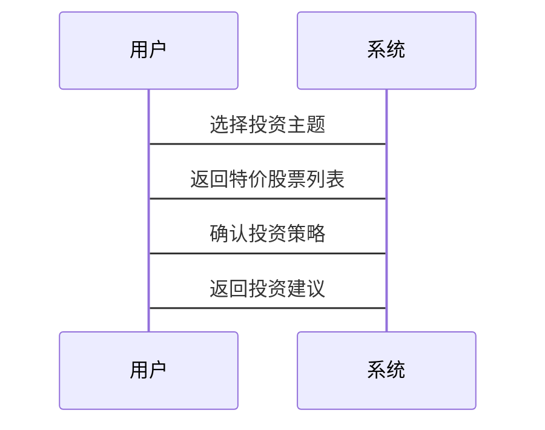

                 


# 如何将特价股票策略与主题投资相结合

> 关键词：特价股票策略，主题投资，股票市场，投资策略，市场分析

> 摘要：本文探讨了如何将特价股票策略与主题投资相结合，通过分析市场趋势和公司基本面，找到价格被低估的股票，结合特定主题进行投资，以实现更高的投资回报。

---

## 第一部分：特价股票策略与主题投资的背景与基础

### 第1章：特价股票策略概述

#### 1.1 特价股票的定义与特点

##### 1.1.1 什么是特价股票
特价股票指的是市场价格低于其内在价值的股票。这种股票通常在市场低迷或公司遇到短期困难时出现，但其内在价值并未受到影响。

##### 1.1.2 特价股票的核心特征
- **低估值**：市盈率、市净率等指标低于行业平均水平。
- **潜在增长**：公司基本面良好，具备长期增长潜力。
- **市场情绪影响**：市场恐慌或低估导致股价下跌。

##### 1.1.3 特价股票的投资机会与风险
- **机会**：低价买入，高价卖出，获取超额收益。
- **风险**：公司基本面恶化，市场整体下跌。

#### 1.2 主题投资的基本概念

##### 1.2.1 什么是主题投资
主题投资是指基于特定主题（如科技、消费、医疗）进行投资，关注行业趋势和市场热点。

##### 1.2.2 主题投资的分类与特点
- **行业主题**：如科技、金融、医疗。
- **概念主题**：如人工智能、大数据。
- **周期性**：主题投资具有明显的市场周期性，需关注市场热点变化。

##### 1.2.3 主题投资的市场周期性
主题投资的周期性较强，需关注市场的波动和行业趋势的变化。

### 第2章：特价股票策略与主题投资的结合

#### 2.1 特价股票策略与主题投资的结合定义
将特价股票策略与主题投资相结合，是指在特定主题下寻找价格被低估的股票，利用市场热点和价格优势实现投资收益。

#### 2.2 特价股票策略与主题投资的结合优势
- **提高投资效率**：通过主题筛选缩小投资范围，提高投资效率。
- **降低投资风险**：利用价格优势和行业趋势分散风险。
- **抓住市场热点**：通过主题投资抓住市场热点，获取超额收益。

#### 2.3 特价股票策略与主题投资的结合步骤
- **确定投资主题**：选择具有长期增长潜力的主题。
- **寻找特价股票**：在选定的主题下寻找价格被低估的股票。
- **制定投资策略**：结合市场趋势和公司基本面制定投资策略。
- **监控与调整**：定期监控投资组合，根据市场变化进行调整。

#### 2.4 特价股票策略与主题投资的结合案例
- **案例一：科技主题投资**
  - 选择科技行业中的特价股票，如某技术领先的公司因市场调整导致股价下跌。
- **案例二：消费主题投资**
  - 在消费行业中寻找因市场波动导致股价下跌的公司。

---

## 第二部分：特价股票策略与主题投资的策略模型

### 第3章：特价股票策略与主题投资的核心概念

#### 3.1 特价股票策略的核心概念
- **价格优势**：利用股价低于内在价值的机会。
- **市场时机**：选择合适的时机买入和卖出。
- **基本面分析**：分析公司的财务状况、行业地位等因素。

#### 3.2 主题投资的核心概念
- **主题选择**：选择具有长期增长潜力的主题。
- **主题周期性**：关注主题的市场周期，抓住热点。
- **主题风险评估**：评估主题相关的市场风险。

#### 3.3 特价股票策略与主题投资的结合原理
- **理论基础**：结合市场趋势和公司基本面，寻找价格被低估的股票。
- **实践应用**：通过主题筛选和价格分析，制定投资策略。

### 第4章：特价股票策略与主题投资的算法原理

#### 4.1 特价股票策略的数学模型
- **线性回归模型**：用于分析股价与公司基本面的关系。
  $$ y = \beta_0 + \beta_1x + \epsilon $$
  其中，$y$ 为股价，$x$ 为公司基本面指标，$\beta_0$ 和 $\beta_1$ 为回归系数。

#### 4.2 主题投资的分类模型
- **决策树模型**：用于分类不同主题的股票。
  ```mermaid
  graph TD
      A[主题分类] --> B[决策树模型]
      B --> C[数据预处理]
      C --> D[特征选择]
      D --> E[模型训练]
      E --> F[结果分析]
  ```

#### 4.3 特价股票策略与主题投资的结合算法
- **步骤**：
  1. 收集数据：收集目标主题下的股票数据。
  2. 数据预处理：清洗数据，处理缺失值。
  3. 特征选择：选择影响股价的关键特征。
  4. 模型训练：使用机器学习模型进行训练。
  5. 结果分析：分析模型预测结果，制定投资策略。

---

## 第三部分：系统分析与架构设计

### 第5章：系统架构设计

#### 5.1 系统功能设计
- **数据采集**：收集目标主题下的股票数据。
- **数据分析**：分析股价与公司基本面的关系。
- **决策支持**：提供投资建议和风险评估。

#### 5.2 系统架构图


#### 5.3 系统接口设计
- **数据接口**：与数据源对接，获取股票数据。
- **用户接口**：提供用户友好的操作界面。

#### 5.4 系统交互序列图


---

## 第四部分：项目实战

### 第6章：项目实战

#### 6.1 项目环境安装
- **工具安装**：安装Python、Pandas、NumPy、Scikit-learn等工具。

#### 6.2 核心代码实现
```python
import pandas as pd
from sklearn.linear_model import LinearRegression

# 数据加载
data = pd.read_csv('stock_data.csv')

# 特征选择
X = data[['市盈率', '市净率']]
y = data['股价']

# 模型训练
model = LinearRegression()
model.fit(X, y)

# 预测结果
predicted_price = model.predict(X)
```

#### 6.3 案例分析
- **案例：人工智能主题投资**
  - 数据来源：人工智能行业股票数据。
  - 数据分析：分析股价与公司基本面的关系。
  - 投资策略：选择价格被低估的股票进行投资。

#### 6.4 项目小结
- **总结**：通过项目实战，验证了特价股票策略与主题投资结合的有效性。
- **经验**：数据质量和模型选择对投资结果有重要影响。

---

## 第五部分：总结与展望

### 第7章：总结与展望

#### 7.1 最佳实践
- **数据质量**：确保数据准确性和完整性。
- **风险管理**：制定合理的风险管理策略。
- **持续学习**：关注市场变化，不断优化投资策略。

#### 7.2 未来展望
- **技术进步**：随着人工智能和大数据技术的发展，投资策略将更加精准。
- **市场变化**：需关注市场变化，及时调整投资策略。

---

## 作者信息

作者：AI天才研究院/AI Genius Institute & 禅与计算机程序设计艺术 /Zen And The Art of Computer Programming

---

以上是《如何将特价股票策略与主题投资相结合》的技术博客文章的目录和内容概述。如需进一步扩展或调整，请随时告知！

