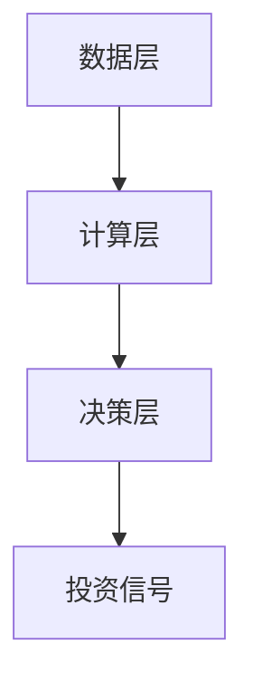

                 


# 如何将特价股票策略与价值成长投资相结合

> 关键词：特价股票策略，价值成长投资，股票投资，投资策略，风险管理

> 摘要：本文详细探讨了如何将特价股票策略与价值成长投资相结合，通过系统化的分析和实践案例，揭示了两种策略的结合方法，帮助投资者实现稳健的投资回报。

---

## 第一部分: 特价股票策略与价值成长投资的核心概念

### 第1章: 特价股票策略的定义与特点

#### 1.1 特价股票的定义与特征
##### 1.1.1 什么是特价股票
特价股票是指市场价格低于其内在价值的股票。这类股票通常被认为被市场低估，具有较大的上涨潜力。  
$$\text{内在价值} = \text{未来现金流的现值}$$  
特价股票的核心在于识别市场低估的机会，通常通过估值指标（如市盈率、市净率）来判断。

##### 1.1.2 特价股票的主要特征
- **低估值**：市场价格低于行业平均水平或历史平均水平。
- **高分红**：部分特价股票公司倾向于高分红，提供稳定的现金流。
- **低波动性**：相对于成长股，特价股票波动性较低，风险可控。

##### 1.1.3 特价股票与普通股票的区别
| 特性 | 特价股票 | 普通股票 |
|------|----------|----------|
| 估值 | 低于行业均值 | 接近或高于行业均值 |
| 风险 | 较低 | 较高 |
| 收益 | 中期较高 | 短期不确定 |

#### 1.2 价值成长投资的核心要素
##### 1.2.1 价值投资的基本原理
价值投资由本杰明·格雷厄姆提出，核心在于寻找市场价格低于内在价值的股票。  
$$\text{安全边际} = \text{内在价值} - \text{市场价格}$$  
安全边际越大，投资风险越小。

##### 1.2.2 成长投资的关键指标
- **收入增长率**：公司收入连续多年保持较高增长。
- **净利润率**：净利润率高，表明公司盈利能力强。
- **ROE（净资产收益率）**：ROE越高，公司使用资本效率越高。

##### 1.2.3 价值与成长的结合点
价值成长投资关注同时具备低估特性和成长潜力的公司。例如，一家市盈率低于行业平均水平，但收入和利润持续增长的企业。

---

### 第2章: 特价股票策略与价值成长投资的联系与区别

#### 2.1 特价股票与价值投资的结合
##### 2.1.1 特价股票如何体现价值投资
通过寻找市场价格低于内在价值的股票，投资者可以在市场低估时买入，等待价值回归。

##### 2.1.2 价值投资在特价股票中的应用
价值投资者通过分析公司的基本面，寻找那些被市场忽视或低估的特价股票。

#### 2.2 特价股票与成长投资的结合
##### 2.2.1 成长型股票的识别标准
- 高收入增长率。
- 高ROE。
- 行业前景广阔。

##### 2.2.2 特价成长股的筛选方法
- 选择市盈率低于行业平均水平，但收入和利润持续增长的公司。

#### 2.3 特价股票策略与价值成长投资的区别
##### 2.3.1 投资目标的差异
- 特价股票策略：追求市场低估带来的价值回归。
- 价值成长投资：同时关注内在价值和成长潜力。

##### 2.3.2 分析方法的差异
- 特价股票策略：主要依赖估值指标（如市盈率、市净率）。
- 价值成长投资：综合分析估值、成长性和盈利能力。

##### 2.3.3 风险承受的差异
- 特价股票策略：风险较低，适合保守型投资者。
- 价值成长投资：风险较高，适合风险承受能力强的投资者。

---

## 第二部分: 特价股票策略与价值成长投资的结合策略

### 第3章: 特价股票策略与价值成长投资的结合模型

#### 3.1 模型构建的基本思路
##### 3.1.1 数据来源与处理
数据来源包括历史股价、财务报表、行业数据等。需要清洗数据，去除缺失值和异常值。

##### 3.1.2 模型假设与限制条件
- 假设市场有效，但存在短期偏差。
- 限制条件：公司财务数据完整，且无重大风险事件。

##### 3.1.3 模型的验证与优化
通过回测验证模型的有效性，并根据回测结果调整参数。

#### 3.2 模型的核心算法
##### 3.2.1 数据预处理流程
1. 数据清洗：去除缺失值和异常值。
2. 标准化处理：对财务数据进行标准化处理。

##### 3.2.2 特征选择与权重分配
- 特征：市盈率（P/E）、市净率（P/B）、ROE、收入增长率。
- 权重：根据经验或回测结果确定。

##### 3.2.3 模型训练与评估
使用历史数据训练模型，并通过回测评估模型的性能。

### 第4章: 特价股票策略与价值成长投资的系统架构设计

#### 4.1 系统功能模块划分
##### 4.1.1 数据采集模块
- 功能：采集股票数据，包括历史股价、财务报表等。
- 工具：使用Python的pandas库和Yahoo Finance API。

##### 4.1.2 数据分析模块
- 功能：计算估值指标（如P/E、P/B）和成长性指标（如收入增长率、ROE）。
- 工具：使用Python的numpy和pandas库。

##### 4.1.3 投资决策模块
- 功能：根据模型结果生成投资信号（买入/卖出）。
- 工具：使用机器学习模型（如随机森林）进行分类。

#### 4.2 系统架构设计
##### 4.2.1 分层架构设计
- 数据层：存储股票数据。
- 计算层：计算估值和成长性指标。
- 决策层：生成投资信号。

##### 4.2.2 模块间接口设计
- 数据接口：数据层与计算层之间的数据传递。
- 信号接口：计算层与决策层之间的信号传递。

##### 4.2.3 系统流程图


### 第5章: 特价股票策略与价值成长投资的数学模型与公式

#### 5.1 数学模型的构建
##### 5.1.1 基于价值的成长模型
$$\text{综合评分} = 0.5 \times \text{估值评分} + 0.5 \times \text{成长评分}$$

##### 5.1.2 基于成长的价值模型
$$\text{综合评分} = 0.5 \times \text{成长评分} + 0.5 \times \text{估值评分}$$

##### 5.1.3 综合评分模型
$$\text{综合评分} = \alpha \times \text{估值评分} + \beta \times \text{成长评分}$$  
其中，$\alpha + \beta = 1$，$\alpha$ 和 $\beta$ 根据回测结果调整。

#### 5.2 数学公式的详细推导
##### 5.2.1 市净率（P/B）公式
$$\text{市净率} = \frac{\text{股价}}{\text{每股净资产}}$$

##### 5.2.2 市盈率（P/E）公式
$$\text{市盈率} = \frac{\text{股价}}{\text{每股净利润}}$$

##### 5.2.3 内在价值（Intrinsic Value）公式
$$\text{内在价值} = \sum_{t=1}^{n} \frac{\text{现金流}_t}{(1 + r)^t}$$  
其中，$r$ 是折现率，$n$ 是预测的年数。

---

## 第三部分: 特价股票策略与价值成长投资的项目实战

### 第6章: 特价股票策略与价值成长投资的系统实现

#### 6.1 环境安装与配置
- Python环境：安装Python 3.8及以上版本。
- 依赖库：安装pandas、numpy、scikit-learn、yfinance。

#### 6.2 核心代码实现
##### 6.2.1 数据采集
```python
import yfinance as yf

# 下载股票数据
data = yf.download(tickers="AAPL", period="max")
```

##### 6.2.2 数据分析
```python
import pandas as pd
import numpy as np

# 计算市盈率
data['PE'] = data['Close'] / data['EPS']
```

##### 6.2.3 模型训练
```python
from sklearn.ensemble import RandomForestClassifier

# 训练模型
model = RandomForestClassifier()
model.fit(X_train, y_train)
```

#### 6.3 案例分析与解读
##### 6.3.1 案例介绍
以苹果公司（AAPL）为例，分析其市盈率和ROE。

##### 6.3.2 数据分析
- 市盈率：$$\text{PE} = \frac{\text{股价}}{\text{每股净利润}}$$
- ROE：$$\text{ROE} = \frac{\text{净利润}}{\text{股东权益}}$$

##### 6.3.3 投资决策
根据模型输出的投资信号，决定是否买入或卖出。

### 第7章: 特价股票策略与价值成长投资的项目小结

#### 7.1 项目总结
通过结合特价股票策略和价值成长投资，投资者可以更好地捕捉市场低估的机会，同时关注公司的成长性。

#### 7.2 投资注意事项
- 风险管理：设置止损点，避免重大损失。
- 持续学习：关注市场变化，不断优化投资策略。
- 保持耐心：价值回归需要时间，避免短期波动影响判断。

---

## 第四部分: 特价股票策略与价值成长投资的最佳实践

### 第8章: 投资策略的优化与改进

#### 8.1 优化方向
- 提高模型的准确性。
- 扩大数据范围，包括更多指标。

#### 8.2 改进措施
- 引入机器学习算法，如XGBoost和LSTM。
- 定期回测，根据市场变化调整模型参数。

### 第9章: 未来投资策略的发展趋势

#### 9.1 技术进步对投资策略的影响
- 大数据技术的应用：通过海量数据挖掘发现投资机会。
- 人工智能的发展：提升模型的预测能力和自动化水平。

#### 9.2 市场变化对投资策略的影响
- 经济周期的波动：影响股票的估值和成长性。
- 政策变化：如税收政策、行业监管等。

---

## 第五部分: 总结与展望

### 第10章: 总结与展望

#### 10.1 总结
通过结合特价股票策略和价值成长投资，投资者可以实现稳健的投资回报。本文详细探讨了两种策略的结合方法，并通过实际案例展示了其应用。

#### 10.2 展望
未来，随着技术的进步和市场的变化，投资策略将更加多元化和智能化。投资者需要不断学习和适应，以应对市场的挑战。

---

## 作者：AI天才研究院/AI Genius Institute & 禅与计算机程序设计艺术 /Zen And The Art of Computer Programming

---

以上就是《如何将特价股票策略与价值成长投资相结合》的完整目录和文章内容。希望这篇文章能为投资者提供有价值的见解和指导。

