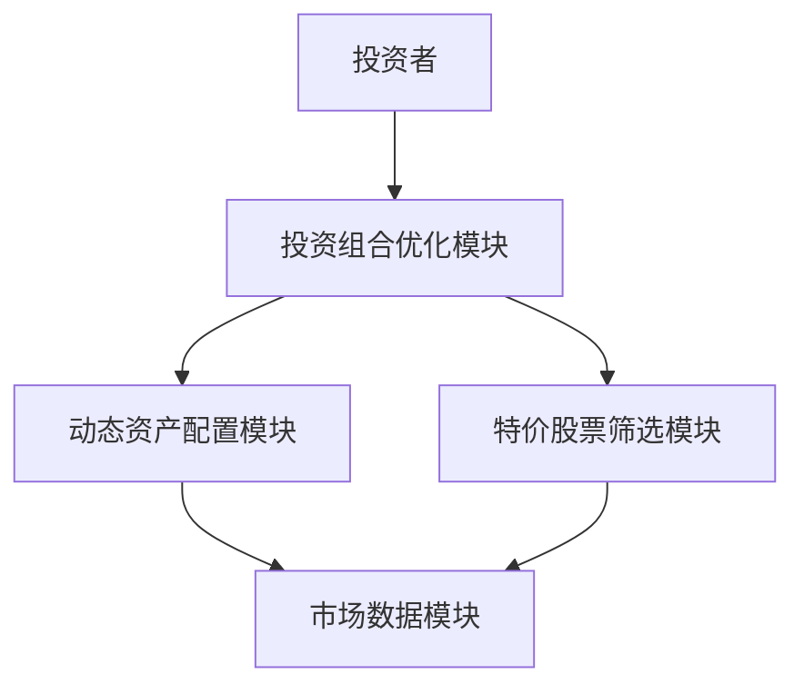
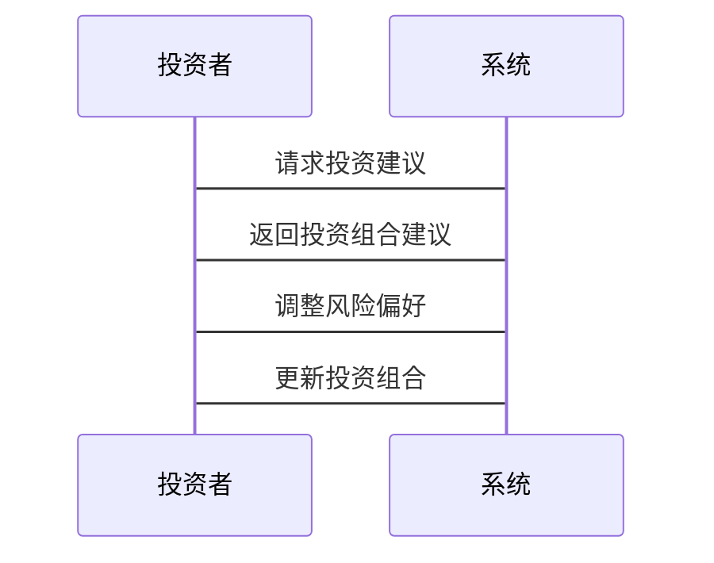

                 


# 如何将特价股票策略与动态资产配置相结合

> 关键词：特价股票策略，动态资产配置，股票投资，资产优化，量化交易

> 摘要：本文探讨了如何将特价股票策略与动态资产配置相结合，通过分析两者的核心概念、算法原理和系统架构，提供了从理论到实践的详细指导。文章结合数学模型和优化算法，展示了如何在实际投资中优化资产配置，降低风险，提高收益。

---

## 第一部分: 特价股票策略与动态资产配置的背景介绍

### 第1章: 特价股票策略与动态资产配置的背景介绍

#### 1.1 特价股票策略的核心概念

##### 1.1.1 特价股票的定义与特点
特价股票是指在特定时间以低于市场价或内在价值购买的股票。其特点包括高折扣率、高潜在回报和高风险。特价股票通常出现在市场低迷时期或公司基本面暂时出现问题时。

##### 1.1.2 特价股票策略的应用场景
特价股票策略常用于价值投资，投资者在市场底部买入优质股票，等待其价值回归。此外，特价股票策略也适用于事件驱动型投资，如公司重组或并购。

##### 1.1.3 特价股票策略的核心要素
- **市场周期分析**：识别市场底部或低估区域。
- **公司基本面分析**：评估公司的财务状况和竞争优势。
- **买入时机选择**：在合适的时间点以合理价格买入。

#### 1.2 动态资产配置的基本原理

##### 1.2.1 动态资产配置的定义
动态资产配置是指根据市场环境和投资者风险偏好，定期调整资产配置比例，以优化投资组合的表现。

##### 1.2.2 动态资产配置的核心要素
- **市场预测**：基于宏观经济指标和市场趋势预测。
- **风险承受能力**：投资者对风险的承受能力影响资产配置。
- **再平衡策略**：定期调整资产比例以维持目标配置。

#### 1.3 特价股票策略与动态资产配置的结合意义

##### 1.3.1 结合的必要性
- **优化投资回报**：动态调整资产配置，抓住特价股票的投资机会。
- **降低风险**：通过动态调整，避免过度集中于高风险资产。
- **提高灵活性**：根据市场变化及时调整，适应不同市场环境。

##### 1.3.2 结合的优势
- **风险控制**：通过动态调整，降低单一资产的风险。
- **收益增强**：抓住特价股票的低估值机会，提高整体收益。
- **适应性强**：策略可根据市场变化快速调整，适应不同经济周期。

##### 1.3.3 结合的应用前景
随着量化交易和大数据技术的发展，特价股票策略与动态资产配置的结合将更加智能化和高效化。未来，结合人工智能和机器学习技术，将进一步提升策略的精准性和执行效率。

---

## 第二部分: 特价股票策略与动态资产配置的核心概念

### 第2章: 特价股票策略与动态资产配置的核心概念

#### 2.1 特价股票策略的数学模型

##### 2.1.1 特价股票价格的计算公式
特价股票的内在价值可以通过市盈率、市净率等指标估算。假设某公司每股收益（EPS）为$ε$，行业平均市盈率为$P/E$，则内在价值$V$可表示为：
$$
V = \frac{P}{E} \times ε
$$

##### 2.1.2 特价股票策略的数学模型
特价股票策略的核心是寻找价格低于内在价值的股票。假设当前股价为$P$，内在价值为$V$，则特价股票的条件为：
$$
P < V
$$

##### 2.1.3 特价股票策略的核心算法
```python
def is_special_stock(price, value):
    return price < value
```

#### 2.2 动态资产配置的优化模型

##### 2.2.1 动态资产配置的目标函数
最大化投资组合的预期收益，同时最小化风险。目标函数可表示为：
$$
Maximize \quad \sum_{i=1}^{n} w_i r_i
$$
$$
Subject \quad to \quad \sum_{i=1}^{n} w_i = 1, \quad w_i \geq 0
$$
其中，$w_i$为资产$i$的权重，$r_i$为预期收益率。

##### 2.2.2 动态资产配置的约束条件
- 投资比例限制：$0 \leq w_i \leq 1$
- 风险承受能力：投资组合的波动率不超过目标波动率。

##### 2.2.3 动态资产配置的优化算法
使用均值-方差优化模型，通过求解上述目标函数和约束条件，找到最优资产配置。

#### 2.3 特价股票策略与动态资产配置的关联性分析

##### 2.3.1 特价股票策略对动态资产配置的影响
特价股票的引入增加了投资组合的多样性，可能降低整体风险。

##### 2.3.2 动态资产配置对特价股票策略的支持
通过动态调整，投资者可以在市场波动时及时调整资产配置，抓住特价股票的投资机会。

##### 2.3.3 两者的协同效应
结合两者可以实现风险控制和收益优化的双重目标，提升投资组合的整体表现。

---

## 第三部分: 特价股票策略与动态资产配置的算法原理

### 第3章: 特价股票策略与动态资产配置的算法原理

#### 3.1 特价股票策略的算法实现

##### 3.1.1 特价股票价格预测算法
使用历史数据和回归模型预测股票价格，判断是否为特价股票。

##### 3.1.2 特价股票交易时机算法
根据市场趋势和公司基本面，确定最佳买入和卖出时机。

##### 3.1.3 特价股票风险评估算法
评估股票的波动性和下行风险，避免高风险资产。

#### 3.2 动态资产配置的优化算法

##### 3.2.1 动态资产配置的资产分配算法
根据市场预测和风险偏好，分配各资产的投资比例。

##### 3.2.2 动态资产配置的再平衡算法
定期调整资产比例，确保投资组合与目标配置一致。

##### 3.2.3 动态资产配置的风险控制算法
通过止损和止盈机制，控制投资组合的风险。

#### 3.3 特价股票策略与动态资产配置的协同算法

##### 3.3.1 协同算法的定义
协同算法将特价股票策略嵌入到动态资产配置中，实时调整资产比例。

##### 3.3.2 协同算法的实现步骤
1. 预测市场趋势和公司基本面。
2. 确定特价股票的投资机会。
3. 动态调整资产配置比例。
4. 实时监控和再平衡。

##### 3.3.3 协同算法的优化方法
引入机器学习模型，提升市场预测的准确性，优化资产配置。

---

## 第四部分: 特价股票策略与动态资产配置的系统架构设计

### 第4章: 特价股票策略与动态资产配置的系统架构设计

#### 4.1 系统功能设计

##### 4.1.1 特价股票筛选模块
- 输入：市场数据和公司基本面数据。
- 输出：符合条件的特价股票列表。

##### 4.1.2 动态资产配置模块
- 输入：市场预测和风险偏好。
- 输出：资产配置建议。

##### 4.1.3 投资组合优化模块
- 输入：特价股票和动态资产配置建议。
- 输出：最优投资组合。

#### 4.2 系统架构设计

##### 4.2.1 系统架构图


#### 4.3 系统接口设计

##### 4.3.1 API接口
- GET /market-data: 获取市场数据。
- POST /special-stocks: 提交特价股票筛选请求。

#### 4.4 系统交互设计

##### 4.4.1 交互流程图


---

## 第五部分: 特价股票策略与动态资产配置的项目实战

### 第5章: 项目实战

#### 5.1 环境安装

##### 5.1.1 安装Python和必要的库
```bash
pip install numpy pandas matplotlib
```

#### 5.2 系统核心实现源代码

##### 5.2.1 特价股票筛选代码
```python
import pandas as pd

def screen_special_stocks(prices, values):
    return prices[prices < values]
```

##### 5.2.2 动态资产配置代码
```python
import numpy as np

def optimize_portfolio(returns, risk_tolerance):
    n = len(returns.columns)
    cov_matrix = returns.cov()
    mu = returns.mean()
    # 使用均值-方差优化
    weights = np.linalg.inv(cov_matrix) @ mu
    weights = weights / sum(weights)
    return weights
```

#### 5.3 代码应用解读与分析

##### 5.3.1 特价股票筛选
通过历史价格和内在价值比较，筛选出低估股票。

##### 5.3.2 动态资产配置
根据市场预测和风险偏好，动态调整资产配置比例。

##### 5.3.3 投资组合优化
综合考虑特价股票和动态配置建议，优化投资组合。

#### 5.4 实际案例分析和详细讲解剖析

##### 5.4.1 案例背景
假设2020年新冠疫情后的市场，寻找被低估的股票。

##### 5.4.2 数据收集
收集某段时间内的股价和公司基本面数据。

##### 5.4.3 策略实施
筛选出低估股票，动态调整资产配置，定期再平衡。

##### 5.4.4 结果分析
分析投资组合的表现，验证策略的有效性。

#### 5.5 项目小结

##### 5.5.1 成功经验
策略在市场底部表现优异，风险控制有效。

##### 5.5.2 改进建议
引入机器学习模型，提高市场预测的准确性。

---

## 第六部分: 特价股票策略与动态资产配置的最佳实践

### 第6章: 最佳实践

#### 6.1 实用技巧与注意事项

##### 6.1.1 风险控制
设置止损点，避免重大损失。

##### 6.1.2 定期回顾
定期评估策略效果，及时调整参数。

##### 6.1.3 多策略结合
结合其他投资策略，分散风险。

#### 6.2 小结

##### 6.2.1 章节回顾
从背景到实战，系统介绍了策略的结合与应用。

##### 6.2.2 总结
通过动态资产配置优化投资组合，抓住特价股票机会，实现长期稳健收益。

#### 6.3 注意事项

##### 6.3.1 市场风险
市场波动可能导致策略失效。

##### 6.3.2 数据质量
数据的准确性和及时性影响策略效果。

##### 6.3.3 模型局限
模型假设可能与实际市场不符，需灵活调整。

#### 6.4 拓展阅读

##### 6.4.1 推荐书籍
- 《投资学》
- 《量化交易入门》

##### 6.4.2 在线资源
- 量化交易平台
- 数据分析工具

---

## 第七部分: 结语

### 7.1 结语

通过本文的详细讲解，读者可以理解如何将特价股票策略与动态资产配置相结合，优化投资组合。这种结合不仅能提高收益，还能有效控制风险，适应不同市场环境。

### 7.2 作者信息

作者：AI天才研究院 & 禅与计算机程序设计艺术  
邮箱：[contact@aimatech.com](mailto:contact@aimatech.com)  
网站：[aimatech.com](https://aimatech.com)

---

感谢您的阅读，希望本文对您在投资策略和资产配置方面有所帮助！

