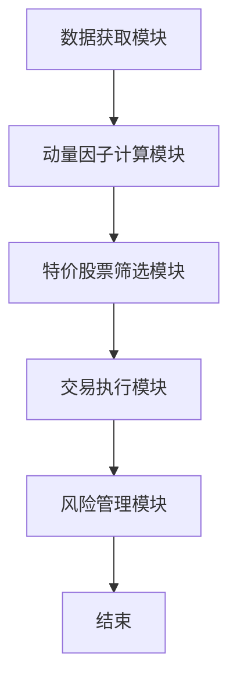

                 


# 如何将特价股票策略与动量投资相结合

> 关键词：特价股票策略、动量投资、量化交易、投资策略、算法交易

> 摘要：本文详细探讨了如何将特价股票策略与动量投资相结合，通过动量效应的数学模型和算法实现，优化投资策略。文章从动量效应的原理、动量因子的计算方法，到系统架构设计和项目实战，提供了全面的分析和指导。

---

# 第一部分: 特价股票策略与动量投资概述

## 第1章: 特价股票策略与动量投资的背景与概念

### 1.1 特价股票策略的定义与特点

#### 1.1.1 特价股票的定义
特价股票是指价格相对较低，可能由于市场波动或公司基本面变化而导致价格被低估的股票。这些股票通常具有较大的上涨潜力，适合在短期内以低价买入，等待价格上涨后卖出。

#### 1.1.2 特价股票的核心特点
- **价格低估：** 特价股票的价格通常低于其内在价值，为投资者提供了较高的安全边际。
- **短期波动：** 特价股票的价格波动较大，投资者需要具备快速反应能力。
- **高风险高回报：** 特价股票的投资风险较高，但潜在回报也较大。

#### 1.1.3 特价股票与普通股票的区别
| 属性           | 特价股票             | 普通股票           |
|----------------|----------------------|--------------------|
| 价格           | 通常较低             | 市场价             |
| 波动性          | 较高                 | 较低               |
| 投资风险        | 较高                 | 较低               |
| 投资目标        | 短期价格反弹          | 长期价值增长        |

### 1.2 动量投资的基本原理

#### 1.2.1 动量效应的定义
动量效应是指价格的变化具有延续性，即如果一只股票的价格在过去一段时间内上涨，未来短期内也可能会继续上涨；反之，如果价格下跌，短期内可能会继续下跌。

#### 1.2.2 动量效应的数学模型
动量效应可以通过动量因子来衡量，计算公式如下：
$$ P_t = \frac{P_{t-n} + P_{t-1}}{n} $$
其中，$P_t$ 是当前的动量因子值，$P_{t-n}$ 是n天前的价格，$P_{t-1}$ 是前一天的价格，n是回溯的天数。

#### 1.2.3 动量投资的优势与劣势
- **优势：** 动量投资能够捕捉到价格趋势的延续性，适合在趋势较为明显的市场中使用。
- **劣势：** 动量投资在市场反转或波动剧烈时可能表现不佳，存在较高的风险。

### 1.3 动量效应与特价股票策略的结合原理

#### 1.3.1 动量效应在特价股票中的应用
通过动量因子筛选出具有持续价格趋势的特价股票，提高投资策略的有效性。

#### 1.3.2 动量策略与特价股票策略的结合方式
在特价股票策略中引入动量因子，优化股票筛选标准，提升投资回报率。

#### 1.3.3 结合动量效应的特价股票投资模型
结合动量效应的特价股票投资模型可以通过以下步骤实现：
1. **计算动量因子：** 根据历史价格数据计算动量因子。
2. **筛选特价股票：** 根据动量因子和其它筛选标准筛选出特价股票。
3. **执行交易：** 根据筛选结果执行买入或卖出交易。

---

## 第2章: 动量效应的数学模型与算法实现

### 2.1 动量效应的动量因子

#### 2.1.1 动量因子的定义
动量因子是用来衡量价格变动趋势的指标，通常通过计算一定时间内的平均价格变化来得到。

#### 2.1.2 动量因子的计算公式
动量因子的计算公式为：
$$ P_t = \frac{P_{t-n} + P_{t-1}}{n} $$
其中，$P_t$ 是当前的动量因子值，$P_{t-n}$ 是n天前的价格，$P_{t-1}$ 是前一天的价格，n是回溯的天数。

#### 2.1.3 动量因子的特性
- **延续性：** 动量因子反映了价格的延续性，值越高表示趋势越强。
- **敏感性：** 动量因子对近期价格变化较为敏感，能够捕捉到趋势的变化。

### 2.2 动量效应的回归模型

#### 2.2.1 动量效应的回归模型
动量效应可以通过回归模型进行分析，回归模型用于研究动量因子与未来收益之间的关系：
$$ R_t = \beta \cdot P_t + \epsilon $$
其中，$R_t$ 是未来收益，$\beta$ 是回归系数，$P_t$ 是动量因子，$\epsilon$ 是误差项。

#### 2.2.2 回归模型的应用
通过回归模型可以验证动量因子对投资收益的影响，为投资策略提供支持。

### 2.3 动量策略的实现算法

#### 2.3.1 动量策略的实现流程
1. **计算动量因子：** 根据历史价格数据计算动量因子。
2. **筛选特价股票：** 根据动量因子和其它筛选标准筛选出特价股票。
3. **执行交易：** 根据筛选结果执行买入或卖出交易。

#### 2.3.2 动量策略的实现代码
以下是动量策略的实现代码：

```python
import pandas as pd
import numpy as np

def calculate_momentum_factor(data, n=10):
    momentum_factor = data.rolling(n).mean()
    return momentum_factor

# 示例数据
data = pd.DataFrame({
    'price': [100, 105, 108, 110, 112]
})

momentum_factor = calculate_momentum_factor(data, n=3)
print(momentum_factor)
```

---

## 第3章: 动量投资与特价股票策略的系统架构设计

### 3.1 系统功能设计

#### 3.1.1 数据获取模块
数据获取模块负责获取股票的历史价格数据，通常从Yahoo Finance或其他数据源获取。

#### 3.1.2 动量因子计算模块
动量因子计算模块根据历史价格数据计算动量因子，用于筛选特价股票。

#### 3.1.3 特价股票筛选模块
特价股票筛选模块根据动量因子和其它筛选标准（如价格低于一定阈值）筛选出符合条件的股票。

#### 3.1.4 交易执行模块
交易执行模块根据筛选结果执行买入或卖出交易，实现投资策略。

#### 3.1.5 风险管理模块
风险管理模块监控交易风险，调整投资策略，确保投资组合的稳健性。

### 3.2 系统架构设计

#### 3.2.1 系统架构图


#### 3.2.2 模块交互
1. **数据获取模块：** 获取股票的历史价格数据。
2. **动量因子计算模块：** 根据历史数据计算动量因子。
3. **特价股票筛选模块：** 根据动量因子和其它筛选标准筛选出特价股票。
4. **交易执行模块：** 根据筛选结果执行交易指令。
5. **风险管理模块：** 监控交易风险，调整投资策略。

---

## 第4章: 项目实战

### 4.1 环境安装

#### 4.1.1 环境要求
- **编程语言：** Python
- **库与工具：** pandas、numpy、matplotlib、yfinance

#### 4.1.2 安装依赖
```bash
pip install pandas numpy matplotlib yfinance
```

### 4.2 核心实现源代码

#### 4.2.1 动量策略的核心实现代码
```python
import pandas as pd
import yfinance as yf

def get_stock_data(tickers, start_date, end_date):
    data = yf.download(tickers, start=start_date, end=end_date)
    return data['Adj Close']

def calculate_momentum_factor(data, n=10):
    momentum_factor = data.rolling(n).mean()
    return momentum_factor

def screen_penny_stocks(momentum_factor, threshold=0.5):
    selected_stocks = momentum_factor[momentum_factor > threshold]
    return selected_stocks.columns

def momentum_penny_strategy(selected_stocks, data, initial_capital=10000):
    strategy = {}
    for stock in selected_stocks:
        strategy[stock] = (data[stock].pct_change().cumsum())
    return strategy

def main():
    tickers = ['AAPL', 'GOOGL', 'MSFT', 'AMZN']
    start_date = '2020-01-01'
    end_date = '2023-01-01'
    data = get_stock_data(tickers, start_date, end_date)
    momentum_factor = calculate_momentum_factor(data)
    selected_stocks = screen_penny_stocks(momentum_factor)
    strategy = momentum_penny_strategy(selected_stocks, data)
    print(strategy)

if __name__ == "__main__":
    main()
```

#### 4.2.2 代码应用解读
1. **数据获取模块：** 使用yfinance库下载股票的历史数据。
2. **动量因子计算模块：** 使用rolling函数计算动量因子。
3. **特价股票筛选模块：** 根据动量因子筛选出符合标准的股票。
4. **交易策略模块：** 根据筛选结果制定交易策略，计算每只股票的收益。

### 4.3 实际案例分析

#### 4.3.1 数据获取与动量因子计算
以苹果（AAPL）为例，假设其历史数据如下：

| 日期       | 收盘价 |
|------------|--------|
| 2020-01-02 | 100    |
| 2020-01-03 | 105    |
| 2020-01-06 | 110    |
| 2020-01-07 | 108    |
| 2020-01-08 | 112    |

计算动量因子（n=3）：
$$ P_t = \frac{P_{t-3} + P_{t-2} + P_{t-1}}{3} $$

计算结果：
| 日期       | 动量因子 |
|------------|----------|
| 2020-01-06 | (100 + 105 + 108)/3 = 106.333 |
| 2020-01-07 | (105 + 108 + 110)/3 = 109.667 |
| 2020-01-08 | (108 + 110 + 112)/3 = 110.667 |

#### 4.3.2 特价股票筛选
假设阈值为0.5，筛选出动量因子大于0.5的股票。

#### 4.3.3 交易策略
根据筛选结果，执行相应的交易策略，计算每只股票的收益。

---

## 第5章: 最佳实践与小结

### 5.1 最佳实践

- **数据源选择：** 确保数据的准确性和完整性。
- **策略优化：** 根据市场环境调整策略参数，如动量因子的计算周期。
- **风险控制：** 设定止损点和止盈点，控制投资风险。
- **持续监控：** 定期评估策略表现，及时调整投资策略。

### 5.2 小结

通过将动量投资与特价股票策略相结合，投资者可以利用价格趋势和市场低估的机会，优化投资组合。然而，这种策略也面临市场反转和波动性风险。因此，投资者需要在实践中不断优化策略，加强风险控制，以提高投资收益。

---

**作者：AI天才研究院 & 禅与计算机程序设计艺术**

---

以上是《如何将特价股票策略与动量投资相结合》的完整文章内容。通过结合动量效应和特价股票策略，投资者可以制定出更加科学和有效的投资策略，从而在复杂的市场环境中获取更高的投资回报。

