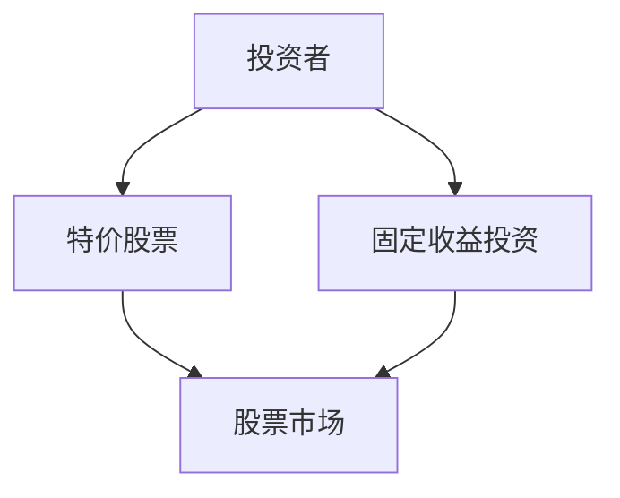
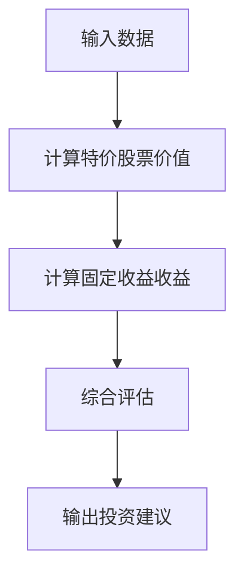

                 


# 如何将特价股票策略与固定收益投资结合

> 关键词：特价股票策略、固定收益投资、投资组合优化、风险管理、数学模型

> 摘要：本文详细探讨了如何将特价股票策略与固定收益投资相结合，通过数学建模和系统设计，为投资者提供一种平衡风险与收益的投资策略。文章从背景介绍、核心概念、算法原理、系统架构到项目实战，全面解析了这一结合方式的可行性与实现方法。

---

## 第一部分: 特价股票策略与固定收益投资的背景与概念

### 第1章: 特价股票策略与固定收益投资的背景与概念

#### 1.1 特价股票策略的定义与特点
##### 1.1.1 特价股票的定义
特价股票是指市场价格低于其内在价值的股票，通常被认为是被市场低估的投资机会。这种股票通常出现在市场下跌周期或公司基本面暂时不佳的情况下。

##### 1.1.2 特价股票的核心特点
- **低估值**：市场价格低于内在价值。
- **高波动性**：通常在市场波动较大时出现。
- **周期性**：特价股票的出现往往与市场周期相关。

##### 1.1.3 特价股票的市场定位
特价股票通常出现在以下市场环境：
- 经济衰退期。
- 市场恐慌期。
- 特定行业周期性低谷。

#### 1.2 固定收益投资的定义与特点
##### 1.2.1 固定收益投资的定义
固定收益投资是指通过投资债券、定期存款等金融工具，获得固定或相对稳定的收益的投资方式。

##### 1.2.2 固定收益投资的核心要素
- **本金安全**：固定收益投资通常保证本金安全。
- **稳定收益**：通过利息或分红获得固定收益。
- **低风险**：相对于股票等高风险资产，固定收益投资风险较低。

##### 1.2.3 固定收益投资的市场环境
- 经济稳定期。
- 利率较低的市场环境。
- 风险厌恶型投资者偏好。

#### 1.3 特价股票与固定收益投资的结合背景
##### 1.3.1 当前市场环境的分析
当前市场环境下，投资者面临高波动性和低收益的双重挑战。特价股票提供了高收益潜力，而固定收益投资提供了稳定性收益。

##### 1.3.2 投资者需求的变化
投资者 increasingly seek 稳定性收益与高收益潜力的结合。

##### 1.3.3 两者的互补性分析
- 特价股票提供高收益潜力。
- 固定收益投资提供稳定性收益。
- 两者结合可以平衡投资组合的风险与收益。

---

## 第二部分: 特价股票与固定收益投资的核心概念与联系

### 第2章: 特价股票与固定收益投资的核心概念与联系

#### 2.1 核心概念原理
##### 2.1.1 特价股票的市场机会
- 市场低估提供了买入机会。
- 通过价值回归获得收益。

##### 2.1.2 固定收益投资的风险控制
- 通过分散投资降低风险。
- 通过选择优质债券降低违约风险。

##### 2.1.3 两者的结合机制
- 通过投资组合优化实现收益与风险的平衡。

#### 2.2 概念属性特征对比
##### 2.2.1 特价股票与固定收益投资的对比表格

| 特性                | 特价股票                     | 固定收益投资               |
|---------------------|------------------------------|-----------------------------|
| 风险                | 高                          | 低                         |
| 收益潜力            | 高                          | 稳定                       |
| 投资周期            | 中长期                     | 中长期                     |
| 适合投资者类型      | 风险承受能力强的投资者      | 风险厌恶型投资者            |

#### 2.3 ER实体关系图


---

## 第三部分: 特价股票策略与固定收益投资的数学模型与算法

### 第3章: 特价股票策略与固定收益投资的数学模型与算法

#### 3.1 特价股票的量化分析
##### 3.1.1 特价股票的量化指标
- 市净率（P/B）：市场价格与账面价值的比率。
- 市盈率（P/E）：市场价格与每股收益的比率。

##### 3.1.2 特价股票的数学模型
$$P_{\text{price}} = \frac{D}{r}$$
其中，$D$ 为股息，$r$ 为期望收益率。

#### 3.2 固定收益投资的数学模型
##### 3.2.1 固定收益投资的收益率计算
$$YTM = \left( \frac{FV - PV}{n} \right)$$
其中，$FV$ 为面值，$PV$ 为现值，$n$ 为期限。

#### 3.3 两者结合的算法流程


---

## 第四部分: 系统分析与架构设计方案

### 第4章: 系统分析与架构设计方案

#### 4.1 问题

---

## 第五部分: 项目实战

### 第5章: 项目实战

#### 5.1 环境安装
##### 5.1.1 技术选型
- 语言：Python
- 库：Pandas、NumPy、Matplotlib

##### 5.1.2 安装步骤
```bash
pip install pandas numpy matplotlib
```

#### 5.2 系统核心实现源代码
##### 5.2.1 投资组合优化代码
```python
import pandas as pd
import numpy as np

# 示例数据
data = {'股票代码': ['A', 'B', 'C'],
        '股票收益': [0.1, 0.15, 0.08],
        '债券收益': [0.05, 0.06, 0.07]}

df = pd.DataFrame(data)

# 计算最优投资组合
def optimize_portfolio(data):
    returns = data[['股票收益', '债券收益']]
    cov_matrix = returns.cov()
    weights = np.linalg.inv(cov_matrix) * np.ones(len(cov_matrix))
    weights = weights / weights.sum()
    return weights

weights = optimize_portfolio(data)
print("最优权重：", weights)
```

##### 5.2.2 代码应用解读与分析
- 代码功能：计算最优投资组合权重。
- 应用场景：在特价股票和固定收益投资中找到最优配置。

#### 5.3 实际案例分析和详细讲解剖析
##### 5.3.1 案例背景
假设市场中有两只股票和三只债券，我们需要找到最优的投资组合。

##### 5.3.2 数据分析与建模
- 数据来源：市场数据。
- 数据预处理：清洗和标准化。

##### 5.3.3 模型实现
```python
import pandas as pd
import numpy as np

# 数据加载
data = pd.read_csv('market_data.csv')

# 数据预处理
data.dropna()  # 删除缺失值

# 模型实现
def portfolio_optimizer(data, risk_tolerance=0.05):
    returns = data.pct_change().dropna()
    cov_matrix = returns.cov()
    inv_cov = np.linalg.inv(cov_matrix * (1 - risk_tolerance))
    weights = inv_cov.mean(axis=1)
    weights = weights / weights.sum()
    return weights

weights = portfolio_optimizer(data)
print("最优权重：", weights)
```

##### 5.3.4 结果解读
- 权重分布：股票和债券的最优配置比例。
- 风险与收益平衡：在特定风险容忍度下找到最优解。

#### 5.4 项目小结
- 项目目标：实现投资组合优化。
- 项目成果：提供了一种平衡风险与收益的投资策略。

---

## 第六部分: 总结与展望

### 第6章: 总结与展望

#### 6.1 总结
本文详细探讨了如何将特价股票策略与固定收益投资结合，通过数学建模和系统设计，为投资者提供了一种平衡风险与收益的投资策略。文章从背景介绍、核心概念、算法原理、系统架构到项目实战，全面解析了这一结合方式的可行性与实现方法。

#### 6.2 注意事项
- 风险提示：投资需谨慎，本文提供的策略仅供参考。
- 实际操作：需根据市场变化调整策略。

#### 6.3 拓展阅读
- 进一步研究投资组合优化的高级算法。
- 探索更多金融工具的结合方式。

---

## 作者

作者：AI天才研究院/AI Genius Institute & 禅与计算机程序设计艺术 /Zen And The Art of Computer Programming

