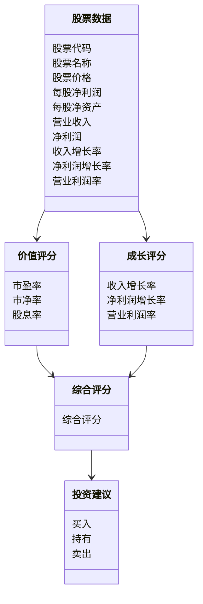
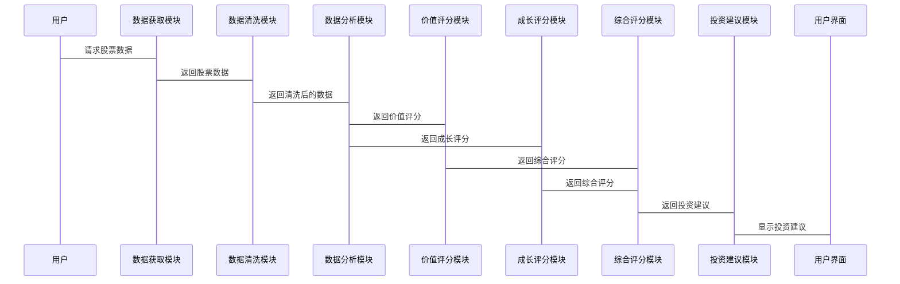

                 


# 如何将特价股票策略与成长投资相结合

## 关键词：特价股票，成长投资，价值评估，数学模型，系统架构，项目实战

## 摘要：本文详细探讨了如何将特价股票策略与成长投资相结合，通过分析两者的核心概念、数学模型、系统架构和项目实战，展示了如何在投资决策中同时考虑股票的价值和成长性。文章结合理论与实践，为投资者提供了优化的投资策略和风险控制方法。

---

## 第一部分: 特价股票策略与成长投资概述

### 第1章: 特价股票策略与成长投资的核心概念

#### 1.1 特价股票策略的定义与特点

##### 1.1.1 什么是特价股票策略
特价股票策略是一种投资策略，旨在通过寻找市场价格低于其内在价值的股票，利用市场短期波动带来的价格低估，实现长期收益。这种策略的核心在于发现市场的非理性定价，并在价格回归合理时获利。

##### 1.1.2 特价股票策略的核心特点
- **价格低估**：股票的市场价格低于其内在价值。
- **安全边际**：通过购买价格低于内在价值的股票，降低投资风险。
- **逆向投资**：在市场恐慌时买入，市场狂热时卖出。

##### 1.1.3 特价股票策略的适用场景
- **市场低迷**：在市场整体表现不佳时，更容易找到价格低估的股票。
- **行业困境**：某些行业因周期性或突发事件出现低估机会。
- **个股困境**：某些个股因短期负面消息被市场错杀。

#### 1.2 成长投资的定义与特点

##### 1.2.1 什么是成长投资
成长投资是一种长期投资策略，专注于投资那些具有持续增长潜力的公司。这种策略的核心在于寻找那些能够不断扩展收入和利润的公司，通过长期持有实现资本增值。

##### 1.2.2 成长投资的核心特点
- **持续增长**：公司收入和利润持续增长。
- **高增长行业**：投资于处于高增长行业的公司。
- **长期持有**：通过长期持有分享公司的增长成果。

##### 1.2.3 成长投资的适用场景
- **高增长行业**：如科技、生物技术等行业。
- **新兴市场**：新兴市场中的高增长公司。
- **经济周期早期**：在经济周期的早期阶段投资高增长行业。

#### 1.3 特价股票策略与成长投资的结合意义

##### 1.3.1 结合的必要性
- **平衡风险与收益**：通过结合特价股票策略和成长投资，可以在控制风险的同时，抓住成长机会。
- **优化投资组合**：通过结合价值和成长因素，优化投资组合的收益与风险比。

##### 1.3.2 结合的优势
- **双重筛选**：通过价值和成长两个维度筛选股票，提高投资标的的质量。
- **风险分散**：结合价值和成长投资，可以在市场波动中分散风险。

##### 1.3.3 结合的潜在风险
- **估值偏差**：成长性高的公司可能估值偏高，需要谨慎筛选。
- **市场波动**：市场波动可能导致价值和成长性评估的变化。

---

### 第2章: 特价股票策略与成长投资的核心概念对比

#### 2.1 价值投资与成长投资的对比

##### 2.1.1 价值投资的核心要素
- **内在价值**：股票的真正价值。
- **安全边际**：购买价格低于内在价值。
- **逆向投资**：在市场恐慌时买入。

##### 2.1.2 成长投资的核心要素
- **增长潜力**：公司未来收入和利润的增长潜力。
- **高增长行业**：投资于高增长行业。
- **长期持有**：通过长期持有分享公司增长。

##### 2.1.3 价值投资与成长投资的异同
| 特性         | 价值投资                     | 成长投资                     |
|--------------|------------------------------|----------------------------|
| 核心目标     | 寻找价格低估的股票             | 寻找具有增长潜力的公司         |
| 投资期限     | 中长期                       | 长期                        |
| 风险偏好     | 低风险                       | 中高风险                    |
| 适用场景     | 市场低迷、行业困境             | 高增长行业、新兴市场          |

#### 2.2 特价股票策略在成长投资中的作用

##### 2.2.1 特价股票策略在成长投资中的作用
- **降低估值风险**：通过寻找价格低估的成长股，降低估值过高的风险。
- **提高安全边际**：在成长投资中加入价值筛选，提高投资的安全边际。

##### 2.2.2 成长投资对特价股票策略的补充
- **成长性筛选**：在价值投资的基础上，筛选具有增长潜力的公司。
- **长期视角**：成长投资的长期视角可以帮助价值投资者更耐心地等待价值回归。

##### 2.2.3 两者结合的优化路径
- **双重筛选**：先通过价值筛选，再通过成长性筛选，选出兼具价值和成长性的股票。
- **动态调整**：根据市场变化，动态调整价值和成长性筛选的权重。

---

### 第3章: 特价股票策略与成长投资的数学模型与分析方法

#### 3.1 特价股票策略的数学模型

##### 3.1.1 市盈率模型
市盈率（P/E）= 股票价格 / 每股净利润

公式：
$$ P/E = \frac{P}{EPS} $$

##### 3.1.2 市净率模型
市净率（P/B）= 股票价格 / 每股净资产

公式：
$$ P/B = \frac{P}{BPS} $$

##### 3.1.3 股息率模型
股息率 = 每股股息 / 股票价格

公式：
$$ Dividend Yield = \frac{Dividend per share}{Price per share} $$

#### 3.2 成长投资的数学模型

##### 3.2.1 收入增长率模型
收入增长率 = （当年收入 - 上年收入） / 上年收入 × 100%

公式：
$$ Revenue Growth Rate = \frac{(Current Revenue - Previous Revenue)}{Previous Revenue} \times 100\% $$

##### 3.2.2 净利润增长率模型
净利润增长率 = （当年净利润 - 上年净利润） / 上年净利润 × 100%

公式：
$$ Net Profit Growth Rate = \frac{(Current Net Profit - Previous Net Profit)}{Previous Net Profit} \times 100\% $$

##### 3.2.3 营业利润率模型
营业利润率 = 净利润 / 营业收入 × 100%

公式：
$$ Operating Profit Margin = \frac{Net Profit}{Revenue} \times 100\% $$

#### 3.3 两者结合的综合评分模型

##### 3.3.1 综合评分公式
综合评分 = （价值评分 × 成长评分） / （价值评分 + 成长评分）

公式：
$$ Composite Score = \frac{(Value Score \times Growth Score)}{Value Score + Growth Score} $$

##### 3.3.2 综合评分的应用
- **评分权重**：价值评分和成长评分的权重可以根据市场环境和投资者偏好进行调整。
- **评分范围**：评分范围通常在1到10分之间，评分越高表示综合表现越好。

##### 3.3.3 综合评分的优缺点
- **优点**：综合考虑了价值和成长性，避免了单一策略的局限性。
- **缺点**：评分权重需要根据市场环境和投资者偏好调整，增加了策略的复杂性。

---

### 第4章: 特价股票策略与成长投资的系统分析与架构设计

#### 4.1 系统分析

##### 4.1.1 问题场景介绍
- **目标**：通过结合特价股票策略和成长投资，优化投资组合。
- **问题**：如何在实际投资中平衡价值和成长性，降低风险，提高收益。

##### 4.1.2 项目介绍
- **项目目标**：开发一个基于特价股票策略和成长投资的综合评分系统。
- **项目范围**：涵盖数据获取、清洗、分析、评分和投资决策。

##### 4.1.3 系统功能设计
- **数据获取**：从金融数据库获取股票数据。
- **数据清洗**：对数据进行清洗和预处理。
- **数据分析**：计算价值和成长性指标。
- **综合评分**：根据综合评分模型计算股票评分。
- **投资决策**：根据评分生成投资建议。

##### 4.1.4 系统架构设计
- **前端架构**：用户界面，展示股票评分和投资建议。
- **后端架构**：数据处理和评分计算。
- **数据存储**：存储股票数据和评分结果。

#### 4.2 系统架构设计

##### 4.2.1 领域模型设计（Mermaid类图）


##### 4.2.2 系统架构设计（Mermaid架构图）


##### 4.2.3 系统接口设计
- **输入接口**：股票代码、数据获取范围。
- **输出接口**：股票评分、投资建议。

##### 4.2.4 系统交互设计（Mermaid序列图）


---

### 第5章: 特价股票策略与成长投资的项目实战

#### 5.1 环境安装与配置

##### 5.1.1 数据获取工具安装
- **工具**：Python的`pandas`、`numpy`、`requests`库，用于数据获取和处理。
- **安装命令**：
  ```bash
  pip install pandas numpy requests
  ```

##### 5.1.2 数据分析工具安装
- **工具**：Jupyter Notebook或VS Code，用于数据分析和可视化。
- **安装命令**：
  ```bash
  pip install jupyter notebook
  ```

##### 5.1.3 系统开发工具安装
- **工具**：Python的`flask`或`django`框架，用于开发Web界面。
- **安装命令**：
  ```bash
  pip install flask
  ```

#### 5.2 系统核心实现源代码

##### 5.2.1 数据清洗与预处理代码
```python
import pandas as pd

# 数据清洗代码
def clean_data(data):
    # 删除缺失值
    data = data.dropna()
    # 处理异常值
    data = data[abs(data['价格'] - data['价格'].mean()) < 3 * data['价格'].std()]
    return data

# 数据预处理代码
def preprocess_data(data):
    data = clean_data(data)
    return data
```

##### 5.2.2 特价股票评分计算代码
```python
def calculate_value_score(data):
    # 计算市盈率
    data['PE'] = data['价格'] / data['每股净利润']
    # 计算市净率
    data['PB'] = data['价格'] / data['每股净资产']
    # 计算股息率
    data['Dividend Yield'] = data['股息'] / data['价格']
    return data
```

##### 5.2.3 成长评分计算代码
```python
def calculate_growth_score(data):
    # 计算收入增长率
    data['收入增长率'] = (data['收入'] - data['上期收入']) / data['上期收入'] * 100
    # 计算净利润增长率
    data['净利润增长率'] = (data['净利润'] - data['上期净利润']) / data['上期净利润'] * 100
    # 计算营业利润率
    data['营业利润率'] = data['净利润'] / data['收入'] * 100
    return data
```

##### 5.2.4 综合评分计算代码
```python
def calculate_composite_score(data):
    # 计算价值评分
    value_data = calculate_value_score(data)
    # 计算成长评分
    growth_data = calculate_growth_score(data)
    # 综合评分
    data['综合评分'] = (value_data['PE'] * growth_data['收入增长率']) / (value_data['PE'] + growth_data['收入增长率'])
    return data
```

#### 5.3 代码应用解读与分析

##### 5.3.1 数据清洗与预处理
- **数据清洗**：删除缺失值和异常值，确保数据质量。
- **数据预处理**：将清洗后的数据进行标准化处理，便于后续分析。

##### 5.3.2 价值评分与成长评分
- **价值评分**：计算市盈率、市净率和股息率，评估股票的内在价值。
- **成长评分**：计算收入增长率、净利润增长率和营业利润率，评估公司的增长潜力。

##### 5.3.3 综合评分
- **综合评分计算**：通过综合价值评分和成长评分，得出综合评分，帮助投资者做出决策。

#### 5.4 实际案例分析和详细讲解剖析

##### 5.4.1 案例分析
- **案例背景**：假设我们有两只股票，股票A和股票B。
- **数据获取**：获取股票A和股票B的相关数据。
- **数据清洗**：对数据进行清洗和预处理。
- **价值评分**：计算股票A和股票B的价值评分。
- **成长评分**：计算股票A和股票B的成长评分。
- **综合评分**：计算股票A和股票B的综合评分。
- **投资建议**：根据综合评分生成投资建议。

##### 5.4.2 详细讲解剖析
- **数据清洗**：确保数据的准确性和完整性。
- **价值评分**：通过市盈率、市净率和股息率评估股票的内在价值。
- **成长评分**：通过收入增长率、净利润增长率和营业利润率评估公司的增长潜力。
- **综合评分**：结合价值评分和成长评分，得出综合评分，帮助投资者做出决策。

#### 5.5 项目小结

##### 5.5.1 项目总结
- **项目目标**：通过结合特价股票策略和成长投资，优化投资组合。
- **项目成果**：开发了一个基于综合评分的股票筛选系统。
- **项目意义**：帮助投资者在实际投资中平衡价值和成长性，降低风险，提高收益。

##### 5.5.2 项目经验与教训
- **经验**：通过结合价值和成长性，可以优化投资组合。
- **教训**：需要根据市场环境和投资者偏好动态调整评分权重。

---

## 第二部分: 风险管理与投资策略优化

### 第6章: 风险管理与投资策略优化

#### 6.1 风险管理的重要性
- **市场风险**：市场波动带来的投资风险。
- **流动性风险**：股票流动性不足带来的买卖风险。
- **公司风险**：公司基本面变化带来的投资风险。

#### 6.2 投资策略优化

##### 6.2.1 动态调整策略
- **市场环境变化**：根据市场环境动态调整价值和成长性筛选的权重。
- **公司基本面变化**：根据公司基本面变化调整投资组合。

##### 6.2.2 风险控制
- **分散投资**：通过投资多个股票分散风险。
- **止损机制**：设置止损点，控制投资损失。

#### 6.3 最佳实践 tips
- **长期视角**：投资需要耐心，避免短期波动影响判断。
- **持续学习**：保持对市场和公司的了解，及时调整投资策略。
- **风险管理**：制定合理的风险管理策略，保护投资本金。

---

## 第三部分: 小结与展望

### 第7章: 小结与展望

#### 7.1 小结
- **核心内容**：本文详细探讨了如何将特价股票策略与成长投资相结合，通过分析两者的核心概念、数学模型、系统架构和项目实战，展示了如何在投资决策中同时考虑股票的价值和成长性。
- **主要结论**：通过结合价值和成长性，可以优化投资组合，降低风险，提高收益。

#### 7.2 展望
- **未来研究方向**：进一步研究价值和成长性在不同市场环境下的表现，优化综合评分模型。
- **技术创新**：探索人工智能和大数据技术在股票筛选中的应用，提高投资决策的效率和准确性。

---

## 作者：AI天才研究院/AI Genius Institute & 禅与计算机程序设计艺术 /Zen And The Art of Computer Programming

