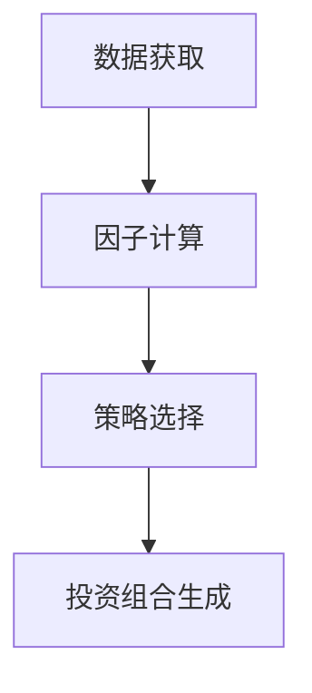

                 


# 如何将特价股票策略与数字低波动因子投资相结合

> 关键词：特价股票策略、数字低波动因子、投资组合优化、量化投资、风险管理

> 摘要：本文详细探讨了如何将特价股票策略与数字低波动因子投资相结合，通过数学模型和算法优化，构建一个稳定且高收益的投资组合。文章从背景介绍、核心概念、数学模型、系统架构到项目实战，全面阐述了这一结合的必要性与实现方法。

---

## 第1章 特价股票策略的核心概念

### 1.1 特价股票策略的定义与特点

#### 1.1.1 特价股票的定义
特价股票通常指市场价格低于其内在价值的股票。这种股票可能因为市场短期波动或公司特定情况而被低估，为投资者提供了潜在的收益机会。

#### 1.1.2 特价股票策略的核心特点
- **价值导向**：基于基本面分析，寻找被低估的股票。
- **长期投资**：通常需要较长时间持有，等待市场重新评估其价值。
- **风险较低**：由于价格低于内在价值，下跌空间有限。

#### 1.1.3 特价股票策略的适用场景
适用于市场低迷时期或行业低谷期，适合风险承受能力较低的投资者。

---

### 1.2 数字低波动因子投资的原理

#### 1.2.1 低波动因子的定义
低波动因子是指在一定时间段内，股票价格波动较小的特性。通过选择波动率低的股票，可以降低投资组合的整体波动性。

#### 1.2.2 数字技术在低波动因子中的应用
- **大数据分析**：利用大数据技术筛选低波动股票。
- **算法交易**：通过算法自动调整投资组合，降低波动性。

#### 1.2.3 低波动因子投资的优势
- **风险控制**：降低投资组合的波动性，减少回撤。
- **稳定性**：低波动股票通常具有较高的稳定性，适合长期投资。

---

## 第2章 特价股票策略与数字低波动因子的结合必要性

### 2.1 结合的背景与意义

#### 2.1.1 当前市场环境的分析
近年来，市场波动加剧，投资者寻求更稳定的投资策略。

#### 2.1.2 投资者需求的变化
投资者越来越关注风险控制和稳定性，而不仅仅是收益。

#### 2.1.3 结合投资的优势
通过结合特价股票策略和低波动因子，可以在保持收益的同时降低风险。

### 2.2 结合的目标与预期效果

#### 2.2.1 投资目标的明确
构建一个既具备价值投资潜力，又具有低波动性的投资组合。

#### 2.2.2 预期收益与风险控制
在控制波动性的前提下，实现稳定收益。

#### 2.2.3 组合优化的潜力
通过因子分析，进一步优化投资组合的结构。

---

## 第3章 数学模型与算法原理

### 3.1 特价股票策略的数学模型

#### 3.1.1 市盈率（P/E）计算公式
$$ \text{市盈率} = \frac{\text{股价}}{\text{每股收益}} $$

#### 3.1.2 市净率（P/B）计算公式
$$ \text{市净率} = \frac{\text{股价}}{\text{每股净资产}} $$

#### 3.1.3 其他估值指标
- 市销率（P/S）
- 股息率（Dividend Yield）

### 3.2 数字低波动因子的数学模型

#### 3.2.1 波动率计算公式
$$ \text{波动率} = \sqrt{\sum_{i=1}^{n} (x_i - \bar{x})^2} $$

#### 3.2.2 风险调整后的收益计算
使用夏普比率衡量风险调整后的收益：
$$ \text{夏普比率} = \frac{\text{收益} - \text{无风险利率}}{\text{波动率}} $$

---

## 第4章 系统架构设计

### 4.1 系统功能设计
- 数据获取模块：从数据库获取股票数据。
- 因子计算模块：计算市盈率、市净率等因子。
- 策略选择模块：基于因子筛选股票。
- 执行模块：生成投资组合。

### 4.2 系统架构图


---

## 第5章 项目实战

### 5.1 环境安装
- Python 3.8+
- numpy, pandas, matplotlib

### 5.2 核心代码实现

```python
import numpy as np
import pandas as pd

# 示例数据
data = pd.DataFrame({
    '股价': [10, 20, 30, 40],
    '每股收益': [2, 3, 4, 5]
})

# 计算市盈率
data['市盈率'] = data['股价'] / data['每股收益']

print(data)
```

### 5.3 实际案例分析
以某行业为例，筛选市盈率低于行业平均水平且波动率低的股票。

---

## 第6章 最佳实践与总结

### 6.1 小结
通过结合特价股票策略和数字低波动因子，可以构建一个稳定且收益较高的投资组合。

### 6.2 注意事项
- 数据质量至关重要。
- 定期调整投资组合。
- 风险管理不可忽视。

### 6.3 拓展阅读
- 阅读相关学术论文。
- 关注最新的量化投资技术。

---

## 作者信息

作者：AI天才研究院/AI Genius Institute & 禅与计算机程序设计艺术 /Zen And The Art of Computer Programming

