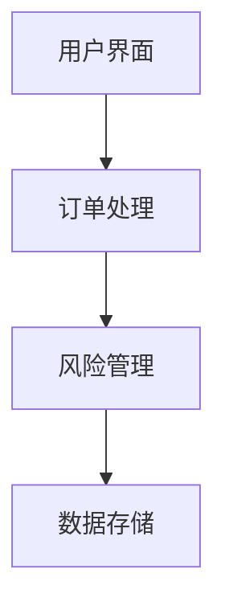

                 

# 如何将特价股票策略与数字资产合成代币投资结合

## 关键词：特价股票、数字资产、合成代币、量化交易、风险管理

## 摘要：本文详细探讨了如何将特价股票策略与数字资产合成代币投资相结合。通过分析合成代币的原理、量化交易算法、风险管理模型以及系统架构设计，本文为投资者提供了一种高效的投资策略，帮助其在复杂市场中优化投资组合，降低风险，实现长期收益。

---

## 第一部分：背景与核心概念

### 第1章：特价股票策略与数字资产的结合背景

#### 1.1 特价股票策略的基本概念

##### 1.1.1 特价股票的定义与特点
特价股票是指在特定市场条件下价格低于其内在价值的股票。其特点包括高波动性、高潜在收益和高风险。投资者通常通过技术分析和基本面分析来识别特价股票的投资机会。

##### 1.1.2 特价股票在投资中的优势
- **高收益潜力**：特价股票在市场反弹时可能带来超额收益。
- **分散投资**：通过投资多种特价股票，降低单一股票的风险。
- **市场敏感性**：特价股票对市场波动敏感，适合短期交易策略。

##### 1.1.3 特价股票的市场分析与应用
市场分析包括技术分析（如K线图、均线）和基本面分析（如市盈率、ROE）。应用中，投资者常利用这些分析制定买入和卖出策略。

#### 1.2 数字资产合成代币的基本概念

##### 1.2.1 数字资产的基本概念
数字资产包括比特币、以太坊等，具有去中心化、匿名性和全球流动性等特点。

##### 1.2.2 合成代币的定义与特点
合成代币是通过智能合约在区块链上合成的代币，可以代表任何资产，如黄金、股票或外汇。其特点包括高流动性、低门槛和可编程性。

##### 1.2.3 合成代币的优势与应用场景
优势包括降低交易成本、提高效率和增强资产流动性。应用场景包括跨境支付、资产融资和风险管理。

#### 1.3 特价股票与数字资产结合的背景与意义

##### 1.3.1 两者的结合背景
数字资产的兴起和区块链技术的发展为传统金融资产的数字化提供了可能，而特价股票的高波动性为数字资产投资者提供了新的机会。

##### 1.3.2 结合的意义与潜在价值
通过合成代币投资特价股票，投资者可以利用数字资产的特性，如杠杆和自动化交易，提升投资效率和风险管理能力。

##### 1.3.3 未来发展趋势与挑战
未来，合成代币可能成为主流投资工具，但需应对技术风险和监管挑战。

---

## 第二部分：核心概念与联系

### 第2章：合成代币的原理与优势

#### 2.1 合成代币的原理

##### 2.1.1 合成代币的定义
合成代币是通过智能合约在区块链上合成的代币，可以代表任何资产。

##### 2.1.2 合成代币的创建过程
创建过程包括选择底层资产、编写智能合约和发行代币。

##### 2.1.3 合成代币的发行机制
发行机制包括固定供应和动态调整，确保代币的价值与底层资产保持一致。

#### 2.2 合成代币的优势

##### 2.2.1 提高投资效率
合成代币允许投资者通过单一平台投资多种资产，提高效率。

##### 2.2.2 分散投资风险
通过投资多种合成代币，投资者可以分散风险，避免单一资产的风险。

##### 2.2.3 降低交易成本
合成代币的交易成本通常低于传统金融资产。

### 第3章：特价股票策略与合成代币的结合

#### 3.1 结合的必要性

##### 3.1.1 特价股票的波动性
特价股票价格波动大，适合短期交易。

##### 3.1.2 数字资产的高风险高回报
数字资产具有高波动性和高回报潜力。

##### 3.1.3 结合后的潜在收益
结合两者可以利用数字资产的杠杆效应和特价股票的高波动性，提高收益。

#### 3.2 结合的具体方式

##### 3.2.1 通过合成代币投资特价股票
投资者可以通过购买合成代币间接投资特价股票，无需直接持有股票。

##### 3.2.2 利用数字资产的杠杆效应
通过杠杆交易，投资者可以放大投资收益。

##### 3.2.3 结合多种投资策略
结合量化交易和风险管理策略，优化投资组合。

---

## 第三部分：算法与数学模型

### 第4章：量化交易算法

#### 4.1 量化交易的基本原理

##### 4.1.1 量化交易的定义
量化交易是通过算法和模型进行交易的策略。

##### 4.1.2 量化交易的核心算法
包括均值回归、动量策略和统计套利等。

##### 4.1.3 量化交易的优缺点
优点是高效和纪律性，缺点是复杂性和黑天鹅事件风险。

#### 4.2 特价股票的量化策略

##### 4.2.1 基于技术分析的量化策略
使用移动平均线和RSI指标构建交易模型。

##### 4.2.2 基于基本面分析的量化策略
通过财务指标筛选具有投资价值的股票。

##### 4.2.3 常见量化交易模型的实现
包括动量策略、均值回归和统计套利模型。

### 第5章：风险管理模型

#### 5.1 风险管理的基本概念

##### 5.1.1 风险的定义与分类
风险包括市场风险、流动性风险和操作风险。

##### 5.1.2 风险管理的目标与方法
目标是降低风险，方法包括分散投资、对冲和保险。

##### 5.1.3 风险管理在投资中的重要性
是保护投资组合免受重大损失的关键。

#### 5.2 数字资产合成代币的风险管理

##### 5.2.1 合成代币的风险来源
包括市场波动、智能合约漏洞和监管风险。

##### 5.2.2 风险评估模型的构建
使用VaR和CVaR模型评估风险。

##### 5.2.3 风险控制策略的制定
包括止损、对冲和分散投资策略。

---

## 第四部分：系统架构与设计

### 第6章：系统架构设计

#### 6.1 系统整体架构

##### 6.1.1 系统功能模块划分
包括用户界面、订单处理、风险管理、数据存储和智能合约模块。

##### 6.1.2 系统架构图
使用mermaid图展示系统架构。

#### 6.2 功能模块设计

##### 6.2.1 用户界面模块
负责用户交互和订单提交。

##### 6.2.2 订单处理模块
处理用户的交易请求，并与智能合约交互。

##### 6.2.3 风险管理模块
监控市场风险并触发止损机制。

##### 6.2.4 数据存储模块
存储交易数据和用户信息。

### 第7章：接口与交互设计

#### 7.1 系统接口设计

##### 7.1.1 API接口
包括市场数据API和交易API。

##### 7.1.2 接口设计文档
详细描述接口功能和使用方法。

#### 7.2 系统交互流程

##### 7.2.1 用户登录与认证
用户通过身份验证后访问系统。

##### 7.2.2 订单提交与处理
用户提交订单，系统处理并反馈结果。

##### 7.2.3 风险监控与通知
风险管理模块实时监控并通知用户风险事件。

---

## 第五部分：项目实战与最佳实践

### 第8章：项目实战

#### 8.1 环境安装

##### 8.1.1 安装区块链平台
如以太坊或波场，用于部署智能合约。

##### 8.1.2 安装量化交易框架
如QuantLib或Backtrader，用于算法实现。

#### 8.2 系统核心实现源代码

##### 8.2.1 智能合约实现
使用Solidity编写智能合约，定义代币发行和交易规则。

##### 8.2.2 量化交易算法实现
使用Python编写交易策略，如动量策略。

##### 8.2.3 风险管理模块实现
实现风险评估模型和止损机制。

#### 8.3 代码应用解读与分析

##### 8.3.1 智能合约代码解读
解释智能合约的功能和实现细节。

##### 8.3.2 量化交易代码解读
分析交易策略的实现逻辑。

##### 8.3.3 风险管理代码解读
展示风险管理模块的实现和监控功能。

#### 8.4 实际案例分析和详细讲解剖析

##### 8.4.1 案例背景
选择一个具体的市场环境，如2023年某次市场波动。

##### 8.4.2 投资策略实施
实施合成代币投资策略，跟踪市场表现。

##### 8.4.3 实验结果分析
分析策略的有效性和风险控制效果。

#### 8.5 项目小结

##### 8.5.1 项目总结
总结项目的实现过程和取得的成果。

##### 8.5.2 成功经验与教训
分享项目中的成功经验及遇到的挑战。

### 第9章：最佳实践、小结、注意事项与拓展阅读

#### 9.1 最佳实践

##### 9.1.1 投资策略选择
建议根据市场情况选择合适的策略。

##### 9.1.2 风险管理的重要性
强调风险管理在投资中的关键作用。

##### 9.1.3 系统优化建议
建议持续优化系统架构和交易策略。

#### 9.2 小结

##### 9.2.1 本文总结
总结全文的主要内容和观点。

##### 9.2.2 未来展望
展望合成代币投资的未来发展趋势。

#### 9.3 注意事项

##### 9.3.1 技术风险
提醒注意智能合约漏洞和交易系统的技术风险。

##### 9.3.2 市场风险
提示市场波动对投资的影响。

##### 9.3.3 法律风险
提醒注意监管政策的变化。

#### 9.4 拓展阅读

##### 9.4.1 推荐书籍
推荐与量化交易、区块链和风险管理相关的书籍。

##### 9.4.2 推荐资源
推荐相关的在线资源和社区，供读者深入学习。

---

## 第十章：总结与未来展望

### 10.1 全文总结

##### 10.1.1 核心内容回顾
回顾全文的核心内容和主要观点。

##### 10.1.2 投资策略的优化
总结如何通过合成代币优化投资策略。

##### 10.1.3 风险管理的重要性
强调风险管理在投资中的关键作用。

### 10.2 未来展望

##### 10.2.1 合成代币的发展趋势
预测合成代币的未来发展和潜在机会。

##### 10.2.2 技术创新与应用
探讨区块链技术和量化交易的进一步创新与应用。

##### 10.2.3 投资者教育与市场普及
呼吁加强投资者教育，提高市场对合成代币的认知和接受度。

---

## 作者：AI天才研究院/AI Genius Institute & 禅与计算机程序设计艺术 /Zen And The Art of Computer Programming

