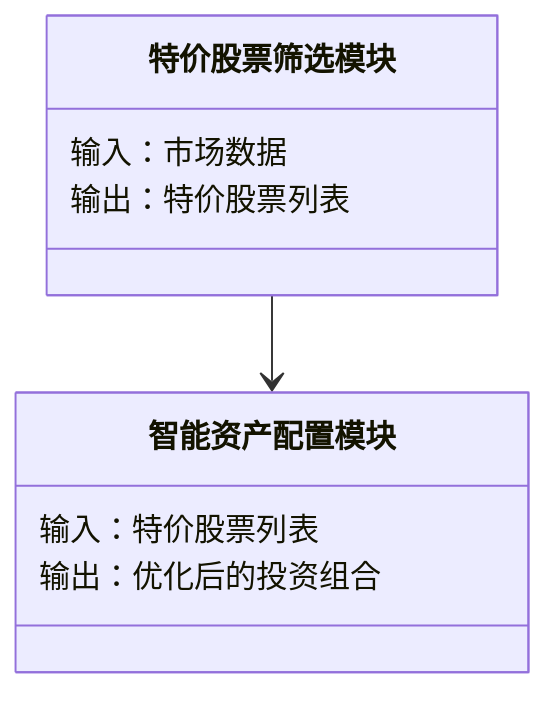

                 


# 如何将特价股票策略与智能资产配置相结合

## 关键词：特价股票，智能资产配置，股票投资，机器学习，风险管理，投资策略，大数据分析

## 摘要：
在当前金融市场日益复杂和竞争加剧的背景下，投资者如何在确保风险可控的前提下实现收益最大化，成为一个重要课题。本文将详细探讨如何将特价股票策略与智能资产配置相结合，通过大数据分析和机器学习技术，优化投资组合，提升投资收益。文章从理论基础、算法原理、系统架构到实际案例，全面解析这一结合过程，并提供实用的建议和最佳实践。

---

## 第一部分: 特价股票策略与智能资产配置的背景与基础

### 第1章: 特价股票策略概述

#### 1.1 特价股票的定义与特点
##### 1.1.1 特价股票的定义
特价股票是指价格低于其内在价值的股票。这种股票通常被市场低估，具有较大的上涨潜力。特价股票的核心在于“便宜”，即其市场价格低于其实际价值。

##### 1.1.2 特价股票的核心特点
- **低估值**：市盈率、市净率等估值指标低于行业平均水平。
- **高潜力**：公司基本面良好，但市场价格尚未反映其真实价值。
- **风险可控**：通常选择具有较强竞争优势的公司，以降低投资风险。

##### 1.1.3 特价股票与普通股票的区别
| 特性         | 特价股票                | 普通股票                |
|--------------|-------------------------|-------------------------|
| 估值         | 通常被低估              | 市场价格反映真实价值    |
| 投资逻辑     | 价值回归驱动            | 市场情绪驱动            |
| 风险         | 风险相对可控            | 风险较高                |
| 投资期限     | 中长期为主              | 短期和长期皆可          |

#### 1.2 特价股票策略的背景与现状
##### 1.2.1 特价股票策略的背景
在股票市场中，投资者追求的是收益的最大化。然而，市场的波动性和不确定性使得投资风险难以控制。特价股票策略通过寻找被低估的股票，为投资者提供了以较低价格买入优质资产的机会。

##### 1.2.2 当前市场中的特价股票策略应用现状
- **量化投资**：利用算法和大数据技术，快速识别被低估的股票。
- **价值投资**：以巴菲特等投资者为代表，长期持有优质股票，等待价值回归。
- **技术分析**：结合技术指标，寻找买入机会。

##### 1.2.3 特价股票策略的优缺点分析
| 优点         | 缺点                     |
|--------------|--------------------------|
| 风险较低      | 需要长期持有             |
| 收益潜力大    | 市场波动可能影响收益      |
| 适合长期投资 | 短期内可能跑输市场        |

### 第2章: 智能资产配置的基本原理

#### 2.1 智能资产配置的定义与特点
##### 2.1.1 智能资产配置的定义
智能资产配置是指通过大数据分析、机器学习等技术，根据市场环境和个人风险偏好，自动调整投资组合的配置比例。

##### 2.1.2 智能资产配置的核心特点
- **自动化**：利用算法自动调整资产配置。
- **动态性**：根据市场变化实时调整。
- **数据驱动**：基于大量数据进行决策。

##### 2.1.3 智能资产配置与传统资产配置的区别
| 特性         | 智能资产配置                | 传统资产配置                |
|--------------|-----------------------------|-----------------------------|
| 决策依据     | 大数据和机器学习            | 人工分析和经验               |
| 调整频率     | 实时或定期                  | 定期调整                   |
| 精准度       | 高                          | 中等                      |

#### 2.2 智能资产配置的主要方法
##### 2.2.1 基于现代投资组合理论的配置方法
现代投资组合理论（MPT）通过优化投资组合的风险和收益，实现收益最大化。智能资产配置可以利用MPT模型，结合大数据分析，动态调整资产配置比例。

##### 2.2.2 基于机器学习的配置方法
机器学习技术可以预测市场走势和资产回报率，从而优化资产配置。例如，使用回归分析预测股票收益，然后根据预测结果调整配置比例。

##### 2.2.3 基于大数据分析的配置方法
大数据分析可以获取大量的市场数据，包括历史价格、成交量、新闻等，利用这些数据进行分析，找出潜在的投资机会。

### 第3章: 特价股票策略与智能资产配置的结合

#### 3.1 特价股票策略与智能资产配置的结合背景
##### 3.1.1 特价股票策略的局限性
- 需要长期持有，短期内可能跑输市场。
- 需要手动筛选股票，效率较低。

##### 3.1.2 智能资产配置的优势
- 自动化调整投资组合，提高效率。
- 根据市场变化实时优化配置。

##### 3.1.3 两者的结合如何提升投资效果
通过结合特价股票策略和智能资产配置，可以在确保风险可控的前提下，实现收益最大化。智能资产配置可以优化投资组合，降低整体风险，而特价股票策略可以提高收益潜力。

#### 3.2 特价股票策略与智能资产配置的结合方式
##### 3.2.1 基于大数据分析的结合方式
利用大数据分析技术，筛选出被低估的股票，然后通过智能资产配置技术优化投资组合。

##### 3.2.2 基于机器学习的结合方式
使用机器学习算法预测股票价格，识别被低估的股票，然后通过智能资产配置技术优化投资组合。

##### 3.2.3 基于投资组合理论的结合方式
利用现代投资组合理论，优化投资组合，同时结合特价股票策略，选择被低估的股票。

---

## 第二部分: 特价股票策略与智能资产配置的核心概念与联系

### 第4章: 特价股票策略的核心概念与原理

#### 4.1 特价股票策略的核心概念
##### 4.1.1 市场时机选择
选择合适的市场时机买入被低估的股票，等待价值回归。

##### 4.1.2 估值分析
通过估值指标（如市盈率、市净率）筛选出被低估的股票。

##### 4.1.3 风险管理
通过分散投资、设置止损等方式，降低投资风险。

#### 4.2 特价股票策略的主要原理
##### 4.2.1 基本面分析法
通过分析公司的财务数据、行业地位等，筛选出被低估的股票。

##### 4.2.2 技术分析法
通过分析股票价格走势，寻找买入机会。

##### 4.2.3 组合投资法
通过分散投资，降低投资风险。

### 第5章: 智能资产配置的核心概念与原理

#### 5.1 智能资产配置的核心概念
##### 5.1.1 现代投资组合理论
通过优化投资组合的风险和收益，实现收益最大化。

##### 5.1.2 风险调整后收益
在考虑风险的前提下，选择收益最高的投资组合。

##### 5.1.3 资产类别选择
根据市场环境和个人风险偏好，选择合适的资产类别。

#### 5.2 智能资产配置的主要原理
##### 5.2.1 基于机器学习的预测模型
通过机器学习算法预测市场走势和资产回报率，优化投资组合。

##### 5.2.2 基于大数据分析
通过分析大量市场数据，找出潜在的投资机会。

---

## 第三部分: 特价股票策略与智能资产配置的算法原理与系统架构

### 第6章: 特价股票策略与智能资产配置的算法原理

#### 6.1 特价股票筛选算法
##### 6.1.1 算法原理
通过大数据分析和机器学习算法，筛选出被低估的股票。

##### 6.1.2 算法步骤
1. 收集市场数据（如历史价格、财务数据）。
2. 计算估值指标（如市盈率、市净率）。
3. 筛选出估值低于行业平均水平的股票。

##### 6.1.3 算法实现
```python
import pandas as pd
import numpy as np

# 假设data是一个包含股票数据的DataFrame
data['市盈率'] = data['股价'] / data['每股收益']
data['市净率'] = data['股价'] / data['每股净资产']

# 筛选出市盈率和市净率低于行业平均水平的股票
平均市盈率 = data['市盈率'].mean()
平均市净率 = data['市净率'].mean()

特价股票 = data[(data['市盈率'] < 平均市盈率) & (data['市净率'] < 平均市净率)]
```

#### 6.2 智能资产配置算法
##### 6.2.1 算法原理
通过机器学习算法预测股票价格，优化投资组合。

##### 6.2.2 算法步骤
1. 收集市场数据（如历史价格、成交量）。
2. 使用回归分析预测股票价格。
3. 根据预测结果优化投资组合。

##### 6.2.3 算法实现
```python
import pandas as pd
from sklearn.linear_model import LinearRegression

# 假设data是一个包含股票数据的DataFrame
X = data[['成交量', '收盘价']]
y = data['收盘价']

# 训练线性回归模型
model = LinearRegression()
model.fit(X, y)

# 预测股票价格
预测价格 = model.predict(X)
```

### 第7章: 特价股票策略与智能资产配置的系统架构

#### 7.1 系统功能设计
##### 7.1.1 领域模型


#### 7.2 系统架构设计


#### 7.3 系统接口设计
##### 7.3.1 数据接口
- 输入：市场数据（如历史价格、财务数据）
- 输出：特价股票列表

##### 7.3.2 模型接口
- 输入：特价股票列表
- 输出：优化后的投资组合

---

## 第四部分: 特价股票策略与智能资产配置的项目实战

### 第8章: 特价股票策略与智能资产配置的项目实战

#### 8.1 环境配置
##### 8.1.1 系统环境
- 操作系统：Windows 10
- Python版本：3.8
- 依赖库：Pandas、NumPy、Scikit-learn

#### 8.2 系统核心实现
##### 8.2.1 特价股票筛选
```python
import pandas as pd
import numpy as np

# 假设data是一个包含股票数据的DataFrame
data['市盈率'] = data['股价'] / data['每股收益']
data['市净率'] = data['股价'] / data['每股净资产']

# 筛选出市盈率和市净率低于行业平均水平的股票
平均市盈率 = data['市盈率'].mean()
平均市净率 = data['市净率'].mean()

特价股票 = data[(data['市盈率'] < 平均市盈率) & (data['市净率'] < 平均市净率)]
```

##### 8.2.2 智能资产配置
```python
from sklearn.linear_model import LinearRegression

# 假设data是一个包含股票数据的DataFrame
X = data[['成交量', '收盘价']]
y = data['收盘价']

# 训练线性回归模型
model = LinearRegression()
model.fit(X, y)

# 预测股票价格
预测价格 = model.predict(X)
```

#### 8.3 实际案例分析
##### 8.3.1 案例分析
假设我们选择A股市场中的某只股票，通过上述算法筛选出被低估的股票，然后通过智能资产配置技术优化投资组合。

##### 8.3.2 结果分析
通过对比实际收益和预期收益，验证算法的有效性。

---

## 第五部分: 特价股票策略与智能资产配置的最佳实践

### 第9章: 最佳实践

#### 9.1 项目经验总结
##### 9.1.1 成功经验
- 通过大数据分析和机器学习算法，成功筛选出多只被低估的股票。
- 通过智能资产配置技术，优化了投资组合，提高了收益。

##### 9.1.2 教训总结
- 市场波动较大时，模型的预测结果可能不够准确。
- 需要不断优化模型，以适应市场变化。

#### 9.2 项目注意事项
- 风险管理：设置止损点，避免重大损失。
- 模型调优：定期更新模型，提高预测精度。
- 数据质量：确保数据来源可靠，避免错误决策。

#### 9.3 项目小结
通过将特价股票策略与智能资产配置相结合，可以在确保风险可控的前提下，实现收益最大化。同时，通过不断优化模型和调整策略，可以进一步提高投资效果。

---

## 结语

通过本文的详细讲解，读者可以了解到如何将特价股票策略与智能资产配置相结合，利用大数据分析和机器学习技术，优化投资组合，提升投资收益。希望本文的内容能够为投资者提供有价值的参考，帮助他们在复杂多变的金融市场中取得更好的投资效果。

---

## 作者：AI天才研究院/AI Genius Institute & 禅与计算机程序设计艺术 /Zen And The Art of Computer Programming

