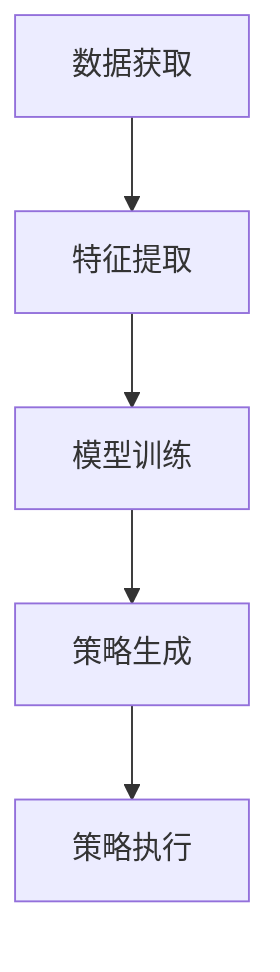

                 

# 如何将特价股票策略与机器学习优化策略相结合

> 关键词：特价股票、机器学习、投资策略优化、量化交易、算法优化

> 摘要：本文将详细介绍如何将特价股票策略与机器学习优化策略相结合。首先，我们将介绍特价股票策略的核心概念与数学模型，分析其在股票投资中的优势与局限性。接着，我们将探讨机器学习优化策略的基本原理，包括监督学习、非监督学习和强化学习在股票投资中的应用。随后，我们将深入分析如何将这两种策略结合起来，利用机器学习算法优化特价股票策略的选股逻辑、估值模型和风险控制。最后，我们将通过实际案例展示如何将这些理论应用于实践，并总结出最佳实践方法。

---

## 第一部分：特价股票策略与机器学习优化策略的背景与基础

### 第1章：特价股票策略概述

#### 1.1 特价股票的定义与特点

**1.1.1 特价股票的定义**  
特价股票是指市场价格显著低于其内在价值的股票。这种股票通常被市场低估，具有较高的潜在回报率。投资者可以通过分析公司的基本面（如市盈率、市净率、股息率等）来识别特价股票。

**1.1.2 特价股票的核心特点**  
- **低估性**：市场价格低于内在价值。
- **高潜力**：具有较高的增长潜力。
- **低风险**：通常出现在市场低迷时期，风险较低。

**1.1.3 特价股票的市场定位与投资价值**  
特价股票通常出现在市场周期的底部，是价值投资者的理想选择。通过长期持有这些股票，投资者可以在市场回升时获得超额回报。

#### 1.2 机器学习优化策略的基本原理

**1.2.1 机器学习的基本概念**  
机器学习是一种人工智能技术，通过算法和数据训练模型，使模型能够从数据中学习并做出预测或决策。其核心在于模型能够通过数据不断优化自身的预测能力。

**1.2.2 机器学习在金融领域的应用**  
- **股票预测**：利用历史数据预测股票价格走势。
- **风险控制**：通过分析市场数据识别潜在风险。
- **交易策略优化**：利用算法优化投资组合和交易决策。

**1.2.3 机器学习优化策略的核心思想**  
通过机器学习算法分析海量数据，提取特征并构建模型，优化传统的投资策略，提升选股的准确性和投资回报率。

#### 1.3 特价股票策略与机器学习优化策略的结合意义

**1.3.1 传统股票投资策略的局限性**  
- **信息过载**：市场数据繁杂，难以快速筛选出有价值的信息。
- **主观性**：依赖分析师的主观判断，容易受到情绪影响。
- **效率低下**：人工分析耗时耗力，难以应对高频交易的需求。

**1.3.2 机器学习优化策略的优势**  
- **高效性**：机器学习算法能够快速处理海量数据，提高选股效率。
- **客观性**：通过数据驱动的模型进行决策，减少人为情绪干扰。
- **适应性**：模型能够根据市场变化自动调整，具有较强的适应性。

**1.3.3 两者的结合如何提升投资效率**  
通过将机器学习优化策略应用于特价股票策略，投资者可以更快速、更准确地识别低估股票，优化投资组合，降低风险，提升整体投资收益。

---

### 第2章：特价股票策略的核心概念与数学模型

#### 2.1 特价股票策略的核心概念

**2.1.1 市场分析与选股逻辑**  
- **市场分析**：通过对市场整体走势的分析，判断特价股票的投资机会。
- **选股逻辑**：基于公司基本面指标（如市盈率、市净率、股息率等）筛选低估股票。

**2.1.2 特价股票的估值方法**  
- **相对估值法**：通过比较股票的市盈率、市净率等指标与行业平均水平的差异，判断股票是否被低估。
- **绝对估值法**：通过DCF模型（现金流贴现法）估算公司的内在价值。

**2.1.3 特价股票的风险评估与控制**  
- **风险评估**：通过分析公司的财务状况、行业风险等因素，评估投资风险。
- **风险控制**：通过分散投资、设置止损等方式降低投资风险。

#### 2.2 特价股票策略的数学模型

**2.2.1 市场趋势预测模型**  
- **线性回归模型**：用于预测股票价格的走势。
  $$ y = \beta_0 + \beta_1 x + \epsilon $$
  其中，$y$ 是股票价格，$x$ 是时间变量，$\beta_0$ 和 $\beta_1$ 是回归系数，$\epsilon$ 是误差项。

**2.2.2 股票估值模型**  
- **市盈率模型**：$$ P/E = \frac{股票价格}{每股收益} $$
- **市净率模型**：$$ P/B = \frac{股票价格}{每股净资产} $$

**2.2.3 风险评估模型**  
- **波动率模型**：通过股票价格的历史波动率预测未来风险。
  $$ \sigma = \sqrt{\frac{1}{n-1} \sum_{i=1}^{n} (x_i - \bar{x})^2} $$
  其中，$\sigma$ 是波动率，$x_i$ 是股票价格，$\bar{x}$ 是平均价格，$n$ 是数据点数。

#### 2.3 机器学习优化策略的数学模型

**2.3.1 机器学习算法的核心公式**  
- **随机森林算法**：通过构建多棵决策树并进行投票或平均，提高模型的准确性和鲁棒性。
- **支持向量机（SVM）**：通过构建超平面将数据点分类。
  $$ \text{目标函数}：\min_{w,b,\xi} \frac{1}{2}w^Tw + C\sum_{i=1}^n \xi_i $$
  $$ \text{约束条件}：y_i(w \cdot x_i + b) \geq 1 - \xi_i, \xi_i \geq 0 $$

**2.3.2 优化策略的数学表达**  
- **目标函数**：最大化投资收益，同时最小化投资风险。
  $$ \max \mu - \lambda \sigma $$
  其中，$\mu$ 是收益，$\sigma$ 是风险，$\lambda$ 是风险厌恶系数。

**2.3.3 模型的训练与验证过程**  
1. 数据预处理：清洗数据，处理缺失值和异常值。
2. 特征提取：从历史数据中提取有用的特征（如价格、成交量、技术指标等）。
3. 模型训练：利用训练数据训练机器学习模型。
4. 模型验证：通过验证数据评估模型的性能，调整超参数。
5. 模型部署：将模型应用于实际投资决策中。

---

## 第二部分：机器学习优化策略的核心原理与实现

### 第3章：机器学习优化策略的核心原理

#### 3.1 机器学习在股票投资中的应用

**3.1.1 监督学习在股票预测中的应用**  
- **线性回归**：预测股票价格。
- **支持向量回归（SVR）**：预测股票价格。

**3.1.2 非监督学习在股票市场分析中的应用**  
- **聚类分析**：将股票分成不同的类别，分析其市场表现。
  $$ \text{目标函数}：\min \sum_{i=1}^{k} \sum_{j=1}^{n_i} d(x_i, c_j) $$
  其中，$k$ 是聚类数，$n_i$ 是第$i$个聚类中的数据点数，$d(x_i, c_j)$ 是数据点$x_i$与聚类中心$c_j$之间的距离。

**3.1.3 强化学习在投资决策中的应用**  
- **Q-Learning算法**：通过状态-动作-奖励机制，优化投资决策。

---

#### 3.2 机器学习优化策略的核心思想

**3.2.1 数据驱动的决策**  
- 利用机器学习算法分析海量数据，提取有用的信息，优化投资决策。

**3.2.2 动态调整**  
- 根据市场变化动态调整模型参数，保持模型的适应性。

**3.2.3 风险控制**  
- 通过机器学习模型预测市场风险，优化投资组合，降低整体风险。

---

## 第4章：机器学习优化策略的实现与优化

### 4.1 机器学习优化策略的核心实现步骤

#### 4.1.1 数据预处理

**4.1.1.1 数据清洗**  
- 处理缺失值、异常值和重复值。

**4.1.1.2 数据归一化**  
- 对特征进行标准化或归一化处理，确保模型收敛。

#### 4.1.2 特征提取

**4.1.2.1 技术指标提取**  
- 提取移动平均线（MA）、相对强弱指数（RSI）、MACD等技术指标。

**4.1.2.2 市场情绪分析**  
- 通过新闻、社交媒体等数据，分析市场情绪。

#### 4.1.3 算法选择

**4.1.3.1 分类算法**  
- 使用随机森林、SVM等算法进行分类。

**4.1.3.2 回归算法**  
- 使用线性回归、Lasso回归等算法进行预测。

#### 4.1.4 模型调优

**4.1.4.1 超参数优化**  
- 使用网格搜索或随机搜索优化模型参数。

**4.1.4.2 模型评估**  
- 通过交叉验证评估模型的性能。

---

### 4.2 优化策略的数学模型

#### 4.2.1 特征工程

**4.2.1.1 特征选择**  
- 使用特征重要性分析选择关键特征。

**4.2.1.2 特征组合**  
- 通过主成分分析（PCA）等方法降低特征维度。

#### 4.2.2 算法优化

**4.2.2.1 线性回归优化**  
- 使用Lasso回归或Ridge回归减少过拟合。

**4.2.2.2 随机森林优化**  
- 调整树的数量、深度等参数，提高模型性能。

---

### 第5章：系统架构与项目实战

#### 5.1 系统架构设计

**5.1.1 系统功能设计**  
- 数据获取模块：从数据源获取股票数据。
- 特征提取模块：提取技术指标和市场情绪特征。
- 模型训练模块：训练机器学习模型。
- 策略生成模块：生成最优投资策略。
- 策略执行模块：根据策略执行交易。

**5.1.2 系统架构图**  

---

### 第6章：总结与展望

#### 6.1 总结

通过将特价股票策略与机器学习优化策略相结合，投资者可以更高效、更准确地识别低估股票，优化投资组合，降低风险，提升整体投资收益。

#### 6.2 未来展望

未来，随着人工智能技术的不断发展，机器学习优化策略在股票投资中的应用将更加广泛和深入。通过结合更多的数据源和更复杂的算法，投资者将能够实现更精准的市场预测和投资决策。

---

## 作者

作者：AI天才研究院/AI Genius Institute & 禅与计算机程序设计艺术 /Zen And The Art of Computer Programming

