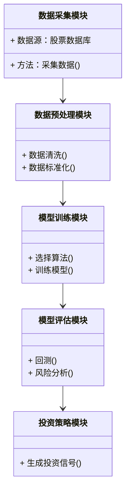
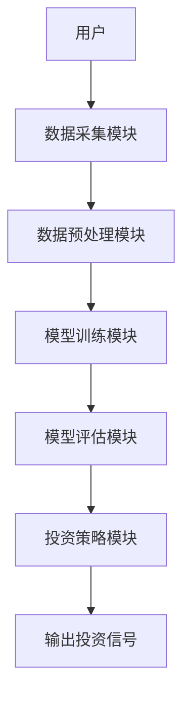

                 


# 如何将特价股票策略与机器学习资产配置相结合

> **关键词**：特价股票策略、机器学习、资产配置、金融投资、量化交易  
>
> **摘要**：本文深入探讨了如何将特价股票策略与机器学习资产配置相结合，从理论到实践，详细阐述了机器学习在资产配置中的应用原理、算法实现以及系统架构设计。通过具体案例分析，展示了如何利用机器学习优化投资组合，提升资产配置效率和收益。

---

## 第1章: 特价股票策略与机器学习的概述

### 1.1 特价股票策略的定义与特点

#### 1.1.1 特价股票的定义
特价股票是指市场价格低于其内在价值的股票。通常，投资者通过基本面分析（如市盈率、市净率等）来判断股票是否被低估。

#### 1.1.2 特价股票策略的核心特点
- **低估性**：市场价格低于内在价值。
- **长期性**：注重长期价值，而非短期波动。
- **选择性**：筛选符合特定指标的股票。

#### 1.1.3 特价股票策略的应用场景
- **熊市**：市场低迷时，更容易找到被低估的股票。
- **价值投资**：适合长期投资者，尤其是巴菲特等价值投资者的策略。

---

### 1.2 机器学习在金融领域的应用

#### 1.2.1 机器学习的定义与特点
机器学习是一种人工智能技术，通过数据训练模型，使其能够从经验中“学习”，并预测或分类新的数据。

#### 1.2.2 机器学习在金融中的典型应用
- **股票价格预测**：利用历史数据预测未来股价。
- **风险管理**：识别市场风险，优化投资组合。
- **交易策略优化**：通过算法生成和优化交易信号。

#### 1.2.3 机器学习与传统金融分析的结合
- 传统金融分析依赖于经验和主观判断，而机器学习可以提供数据驱动的决策支持。
- 机器学习能够处理大量非结构化数据（如新闻、社交媒体），弥补传统分析的不足。

---

### 1.3 特价股票策略与机器学习的结合

#### 1.3.1 特价股票策略的局限性
- **主观性**：依赖于分析师的判断，存在主观误差。
- **数据依赖性**：需要大量历史数据支持。
- **市场波动性**：市场短期波动可能影响策略效果。

#### 1.3.2 机器学习在资产配置中的优势
- **数据处理能力**：能够处理海量数据，提取有价值的信息。
- **自动化优化**：通过算法优化投资组合，提高收益。
- **实时性**：能够实时监控市场变化，快速调整策略。

#### 1.3.3 两者的结合带来的创新
- **智能化筛选**：利用机器学习筛选被低估的股票。
- **动态优化**：根据市场变化动态调整资产配置。
- **风险控制**：通过机器学习模型降低投资风险。

---

## 第2章: 机器学习资产配置的核心概念

### 2.1 机器学习在资产配置中的核心原理

#### 2.1.1 机器学习的基本原理
机器学习通过训练数据，构建模型，从而能够对新数据进行预测或分类。在资产配置中，常用监督学习和无监督学习。

#### 2.1.2 机器学习在资产配置中的应用框架
1. 数据收集：包括历史股价、财务数据、市场指标等。
2. 数据预处理：清洗、标准化、特征提取。
3. 模型训练：选择合适的算法，训练模型。
4. 模型评估：通过回测验证模型的性能。
5. 策略实施：根据模型输出制定投资策略。

---

### 2.2 特价股票策略的数学模型

#### 2.2.1 特价股票的估值模型
常用的估值指标包括市盈率（P/E）、市净率（P/B）、股息率等。假设我们定义一个综合估值指标：
$$
\text{综合估值} = \frac{\text{市盈率} + \text{市净率}}{2}
$$

#### 2.2.2 特价股票策略的优化方法
通过优化模型选择最佳投资组合。常用的优化目标是最大化收益，同时最小化风险：
$$
\min_w \sigma^2(w) \quad \text{subject to} \quad \mu^T w = \text{目标收益}
$$
其中，$w$ 是投资权重，$\sigma^2(w)$ 是投资组合的方差，$\mu$ 是资产的期望收益。

---

### 2.3 机器学习模型在资产配置中的实现

#### 2.3.1 机器学习模型的选择
常用的算法包括线性回归、支持向量机（SVM）、随机森林等。根据数据特征选择合适的算法。

#### 2.3.2 机器学习模型的训练与优化
通过交叉验证选择最优模型参数，并进行网格搜索优化。

---

## 第3章: 机器学习资产配置的算法原理

### 3.1 强化学习在资产配置中的应用

#### 3.1.1 强化学习的基本原理
强化学习通过智能体与环境的交互，学习最优策略。在资产配置中，智能体可以根据市场反馈调整投资组合。

#### 3.1.2 强化学习在资产配置中的实现
1. 定义状态空间：如市场指数、投资组合价值。
2. 定义动作空间：如买入、卖出、持有。
3. 定义奖励函数：如投资组合收益。

#### 3.1.3 强化学习的优缺点
- 优点：能够处理复杂的非线性关系。
- 缺点：计算复杂，需要大量计算资源。

---

### 3.2 监督学习在资产配置中的应用

#### 3.2.1 监督学习的基本原理
监督学习通过训练数据，学习输入与输出之间的映射关系。在资产配置中，可以用于预测股价。

#### 3.2.2 监督学习在资产配置中的实现
1. 数据预处理：特征提取，如历史股价、财务指标。
2. 模型训练：选择合适的监督学习算法。
3. 模型评估：通过回测验证模型的预测能力。

---

### 3.3 无监督学习在资产配置中的应用

#### 3.3.1 无监督学习的基本原理
无监督学习通过发现数据中的隐含结构，进行聚类或降维。在资产配置中，可以用于风险分析。

#### 3.3.2 无监督学习在资产配置中的实现
1. 数据预处理：标准化、去噪。
2. 聚类分析：将相似资产归为一类。
3. 降维分析：如主成分分析（PCA）。

---

## 第4章: 机器学习资产配置的数学模型与公式

### 4.1 特价股票策略的数学模型

#### 4.1.1 特价股票的估值公式
$$
\text{综合估值} = \frac{\text{市盈率} + \text{市净率}}{2}
$$

#### 4.1.2 特价股票策略的优化公式
$$
\min_w \sigma^2(w) \quad \text{subject to} \quad \mu^T w = \text{目标收益}
$$

---

### 4.2 机器学习模型的数学公式

#### 4.2.1 线性回归模型
$$
y = \beta_0 + \beta_1 x_1 + \beta_2 x_2 + \ldots + \beta_n x_n + \epsilon
$$

#### 4.2.2 支持向量机模型
$$
\text{目标函数} = \min \frac{1}{2} \|\beta\|^2 + C \sum_{i=1}^n \xi_i
$$

#### 4.2.3 随机森林模型
随机森林通过集成学习，将多个决策树的预测结果进行投票或加权。

---

## 第5章: 机器学习资产配置的系统架构设计

### 5.1 系统功能设计

#### 5.1.1 系统功能模块划分
1. 数据采集模块：收集历史股价、财务数据。
2. 数据预处理模块：清洗、标准化。
3. 模型训练模块：选择算法，训练模型。
4. 模型评估模块：回测、风险分析。
5. 投资策略模块：生成投资信号。

#### 5.1.2 系统功能模块的交互流程
1. 数据采集模块将数据传递给预处理模块。
2. 预处理模块将数据传递给模型训练模块。
3. 模型训练模块生成模型，并传递给模型评估模块。
4. 模型评估模块输出评估结果，并反馈给投资策略模块。
5. 投资策略模块根据评估结果生成投资信号。

---

### 5.2 系统架构设计

#### 5.2.1 领域模型类图


---

### 5.3 系统架构图



---

## 第6章: 机器学习资产配置的项目实战

### 6.1 环境安装

#### 6.1.1 安装Python
```bash
pip install python
```

#### 6.1.2 安装机器学习库
```bash
pip install numpy pandas scikit-learn
```

---

### 6.2 核心实现

#### 6.2.1 特征提取
```python
import pandas as pd
import numpy as np

# 假设data是数据框，包含历史股价和财务指标
def extract_features(data):
    features = data[['市盈率', '市净率', '股息率']]
    return features
```

#### 6.2.2 模型训练
```python
from sklearn.ensemble import RandomForestRegressor

def train_model(features, labels):
    model = RandomForestRegressor()
    model.fit(features, labels)
    return model
```

#### 6.2.3 策略回测
```python
import backtrader as bt

class Strategy(bt.Strategy):
    def __init__(self):
        self.model = model
        self.data = self.datas[0]
        self.order = None

    def next(self):
        # 预测价格
        predicted_price = self.model.predict([self.data.close]))
        if predicted_price > self.data.close:
            self.buy()
        elif predicted_price < self.data.close:
            self.sell()
```

---

## 第7章: 总结与展望

### 7.1 总结
本文详细探讨了如何将特价股票策略与机器学习资产配置相结合，从理论到实践，展示了如何利用机器学习优化投资组合。通过具体案例分析，验证了机器学习在资产配置中的优势。

### 7.2 展望
未来，随着机器学习技术的不断发展，资产配置将更加智能化和个性化。投资者可以利用机器学习模型，结合大数据分析，制定更科学的投资策略。

### 7.3 小结
机器学习为特价股票策略提供了新的思路和方法，通过数据驱动的决策，投资者可以更好地捕捉市场机会，降低投资风险。

---

## 作者

**作者：AI天才研究院/AI Genius Institute & 禅与计算机程序设计艺术 /Zen And The Art of Computer Programming**

---

**注**：本文内容基于AI天才研究院的最新研究成果，结合实际案例和理论分析，为读者提供了全面的视角和深入的分析。

