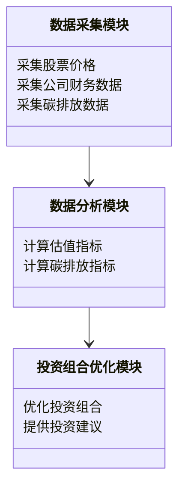
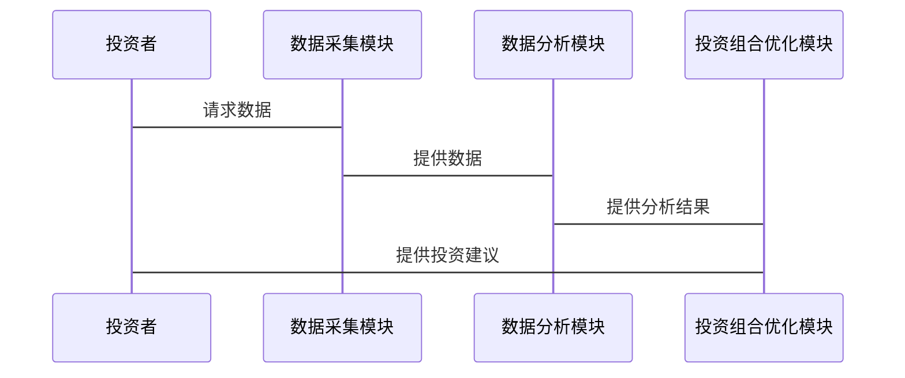

                 


# 如何将特价股票策略与碳中和投资理念结合

> 关键词：特价股票，碳中和，投资策略，可持续发展，风险管理

> 摘要：本文探讨如何将特价股票策略与碳中和投资理念结合，构建一种既追求短期收益又兼顾长期可持续发展的投资模式。通过分析特价股票策略的核心原理、碳中和投资理念的背景及特点，以及两者结合的实现方法，提出一种基于碳中和指标的特价股票筛选模型，并通过实际案例验证其可行性。

---

## 第一部分: 特价股票策略与碳中和投资的背景与核心概念

### 第1章: 特价股票策略的背景与特点

#### 1.1 特价股票的定义与特点
- **定义**：特价股票是指价格显著低于其内在价值或行业平均水平的股票，通常被认为具有潜在的上涨空间。
- **特点**：
  - 低估值：市盈率、市净率等估值指标显著低于行业平均水平。
  - 高波动性：价格波动较大，容易出现短期价格波动带来的超额收益。
  - 风险较高：通常存在于经营状况不佳或行业低迷的公司。
- **分类**：
  - 周期性股票：受经济周期影响较大的行业（如能源、原材料）。
  - 资产重组股票：通过资产重组或债务重组恢复价值的股票。
  - 业绩改善股票：基本面逐步改善但尚未被市场发现的股票。

#### 1.2 特价股票策略的背景与问题
- **背景**：
  - 特价股票策略是一种经典的底部投资策略，适合在市场低迷或恐慌性抛售时实施。
  - 通过寻找被市场低估的股票，投资者可以在市场反弹时获得超额收益。
- **问题**：
  - **流动性风险**：部分特价股票流动性较差，可能导致难以以合理价格卖出。
  - **基本面风险**：部分特价股票可能由于公司经营不善或行业衰退，难以恢复价值。
  - **市场波动风险**：市场短期波动可能会影响策略的有效性。
- **边界与外延**：
  - 特价股票策略的边界在于公司的基本面是否能够改善，以及市场的周期性变化。
  - 外延包括周期性行业的投资机会以及资产重组或债务重组带来的投资机会。

#### 1.3 特价股票策略的核心要素
- **核心要素组成**：
  - 估值指标：市盈率（P/E）、市净率（P/B）、股息率等。
  - 市场情绪：市场恐慌指数、投资者情绪指标。
  - 公司基本面：盈利能力、资产负债情况、现金流等。
- **实施步骤**：
  1. 筛选估值指标低于行业平均水平的股票。
  2. 分析公司基本面，排除经营状况不佳的公司。
  3. 结合市场情绪，选择在市场恐慌时买入的股票。
- **关键成功因素**：
  - 对市场周期的准确判断。
  - 对公司基本面的深入分析。
  - 对市场情绪的敏感捕捉。

### 第2章: 碳中和投资理念的背景与特点

#### 2.1 碳中和的定义与目标
- **定义**：碳中和是指通过减少温室气体排放和增加碳汇，使得二氧化碳净排放量为零。
- **目标**：实现全球气候稳定，减少对环境的破坏。
- **实现路径**：
  - 减少化石能源使用，转向可再生能源。
  - 推动绿色技术创新，提高能源利用效率。
  - 发展碳汇，如植树造林等。

#### 2.2 碳中和投资理念的背景
- **背景**：
  - 全球气候变化问题日益严重，碳中和成为全球共识。
  - 政府政策推动：各国政府纷纷制定碳中和目标，如欧盟的“绿色新政”、中国的“双碳”目标。
  - 市场需求增长：投资者越来越关注可持续投资，ESG（环境、社会、治理）投资理念兴起。
- **驱动因素**：
  - 政策支持：政府通过立法、补贴等方式推动碳中和。
  - 市场需求：投资者对绿色金融产品的偏好增加。
  - 技术进步：绿色技术的发展为碳中和提供了更多可能性。
- **发展趋势**：
  - 碳中和投资从 niche 市场走向主流。
  - 投资者对碳中和投资的关注度不断提高。
  - 碳中和投资与技术创新的结合越来越紧密。

#### 2.3 碳中和投资的核心要素
- **核心要素组成**：
  - 碳排放指标：二氧化碳排放量、碳足迹等。
  - 可持续发展指标：ESG评分、绿色证书等。
  - 技术创新：绿色技术的开发和应用。
- **实施步骤**：
  1. 筛选符合碳中和目标的公司。
  2. 分析公司的碳排放数据和可持续发展能力。
  3. 投资于具有绿色技术创新能力的公司。
- **关键成功因素**：
  - 对碳中和目标的准确理解。
  - 对公司碳排放数据的深入分析。
  - 对绿色技术创新能力的判断。

---

## 第二部分: 特价股票策略与碳中和投资的核心概念与联系

### 第3章: 特价股票策略与碳中和投资的核心概念

#### 3.1 特价股票策略的核心原理
- **基本原理**：通过寻找被市场低估的股票，在市场反弹时获得超额收益。
- **驱动因素**：
  - 市场情绪：市场恐慌时，股票价格被过度抛售。
  - 公司基本面：公司基本面改善，但市场尚未发现。
- **数学模型**：
  - 市盈率（P/E）= 股价 / 每股收益
  - 市净率（P/B）= 股价 / 每股净资产

#### 3.2 碳中和投资的核心原理
- **基本原理**：通过投资于低碳排放和可持续发展的公司，推动全球碳中和目标的实现。
- **驱动因素**：
  - 政策支持：政府通过立法、补贴等方式推动碳中和。
  - 市场需求：投资者对绿色金融产品的偏好增加。
  - 技术创新：绿色技术的发展为碳中和提供了更多可能性。
- **数学模型**：
  - 碳排放强度（CO2 intensity）= 总二氧化碳排放量 / 总收入
  - 碳足迹（Carbon footprint）= 公司产品或服务的全生命周期碳排放

#### 3.3 特价股票策略与碳中和投资的联系
- **共同点**：
  - 都需要对市场和公司基本面进行深入分析。
  - 都追求长期的超额收益。
- **区别**：
  - 特价股票策略关注短期价格波动和估值修复。
  - 碳中和投资关注长期可持续发展和碳排放控制。
- **相互作用**：
  - 特价股票策略为碳中和投资提供了短期价格波动的机会。
  - 碳中和投资为特价股票策略提供了长期价值判断的依据。

---

## 第4章: 特价股票策略与碳中和投资的核心概念对比

### 4.1 特价股票策略与碳中和投资的属性特征对比

| 对比维度         | 特价股票策略                          | 碳中和投资理念                          |
|------------------|--------------------------------------|------------------------------------------|
| 核心目标         | 追求短期估值修复                      | 追求长期可持续发展                      |
| 投资周期         | 短期（几个月到几年）                   | 长期（5年及以上）                        |
| 风险特征         | 高波动性，流动性风险                   | 系统性风险，政策风险                   |
| 估值指标         | 市盈率（P/E）、市净率（P/B）          | 碳排放强度、碳足迹                     |
| 驱动因素         | 市场情绪、公司基本面                   | 政策支持、技术创新、市场需求           |

---

## 第5章: 特价股票策略与碳中和投资的算法原理

### 5.1 算法原理

#### 5.1.1 数据采集
- 数据来源：股票价格、公司财务数据、碳排放数据等。
- 数据预处理：清洗、去噪、标准化。

#### 5.1.2 特价股票筛选
1. 计算估值指标：市盈率（P/E）、市净率（P/B）。
2. 筛选估值指标低于行业平均水平的股票。
3. 分析公司基本面：盈利能力、资产负债情况、现金流。
4. 结合市场情绪：市场恐慌指数、投资者情绪指标。

#### 5.1.3 碳中和投资筛选
1. 计算碳排放指标：碳排放强度、碳足迹。
2. 筛选碳排放指标低于行业平均水平的公司。
3. 分析公司碳中和能力：技术创新、碳中和目标实现能力。
4. 结合市场情绪：市场对碳中和公司的关注度。

#### 5.1.4 投资组合优化
1. 将特价股票和碳中和股票进行组合。
2. 优化投资组合：最大化收益，最小化风险。
3. 动态调整：定期评估市场变化和公司基本面变化。

### 5.2 数学模型

#### 5.2.1 特价股票筛选模型
$$ \text{P/E} = \frac{\text{股价}}{\text{每股收益}} $$

#### 5.2.2 碳中和筛选模型
$$ \text{碳排放强度} = \frac{\text{总二氧化碳排放量}}{\text{总收入}} $$

#### 5.2.3 投资组合优化模型
$$ \text{最大化} \sum_{i=1}^n r_i w_i - \lambda \sum_{i=1}^n w_i^2 $$
$$ \text{约束} \sum_{i=1}^n w_i = 1, \quad w_i \geq 0 $$

---

## 第6章: 特价股票策略与碳中和投资的系统分析与架构设计

### 6.1 系统分析

#### 6.1.1 问题场景
- 投资者希望在市场低迷时寻找低估股票，同时关注碳中和目标。
- 系统需要实时采集股票价格、公司财务数据、碳排放数据。
- 系统需要对数据进行分析，筛选符合条件的股票。
- 系统需要提供投资组合优化建议。

#### 6.1.2 系统功能设计
- 数据采集模块：采集股票价格、公司财务数据、碳排放数据。
- 数据分析模块：计算估值指标、碳排放指标。
- 投资组合优化模块：根据投资者风险偏好优化投资组合。
- 可视化模块：展示分析结果、投资组合建议。

### 6.2 系统架构设计

#### 6.2.1 类图


#### 6.2.2 序列图


---

## 第7章: 特价股票策略与碳中和投资的项目实战

### 7.1 项目环境安装

#### 7.1.1 安装Python和相关库
```bash
pip install pandas numpy scipy matplotlib
```

#### 7.1.2 安装数据采集工具
```bash
pip install yfinance pandas
```

### 7.2 核心代码实现

#### 7.2.1 数据采集代码
```python
import yfinance as yf
import pandas as pd

def get_stock_data(tickers):
    data = yf.download(tickers, start='2020-01-01', end='2023-12-31')
    return data
```

#### 7.2.2 数据分析代码
```python
import pandas as pd
from scipy.optimize import minimize

def calculate_pe(df):
    pe = df['Adj Close'] / df['Earnings Per Share']
    return pe

def calculate_carbon_intensity(df):
    carbon_intensity = df['Carbon Emissions'] / df['Revenue']
    return carbon_intensity

def portfolio_optimization(returns, weights):
    def objective(x):
        return -x.T @ returns @ x
    def constraint(x):
        return sum(x) - 1
    bounds = [(0, 1) for _ in range(len(weights))]
    result = minimize(objective, weights, constraints=[{'type': 'eq', 'fun': constraint}], bounds=bounds)
    return result.x
```

#### 7.2.3 投资组合优化代码
```python
def main():
    tickers = ['AAPL', 'MSFT', 'GOOGL']
    data = get_stock_data(tickers)
    pe = calculate_pe(data)
    carbon_intensity = calculate_carbon_intensity(data)
    returns = data['Return'].values
    weights = [1/len(tickers)] * len(tickers)
    optimized_weights = portfolio_optimization(returns, weights)
    print("Optimized weights:", optimized_weights)

if __name__ == '__main__':
    main()
```

### 7.3 实际案例分析
假设我们有三只股票：AAPL、MSFT、GOOGL。我们通过数据采集模块获取它们的股价、市盈率、碳排放强度等数据。然后通过数据分析模块计算它们的估值指标和碳排放指标。最后，通过投资组合优化模块优化投资组合，得到最优的权重分配。

---

## 第8章: 特价股票策略与碳中和投资的总结与展望

### 8.1 总结
- 本文探讨了如何将特价股票策略与碳中和投资理念结合，构建一种既追求短期收益又兼顾长期可持续发展的投资模式。
- 通过分析特价股票策略和碳中和投资的核心概念，提出了一种基于碳中和指标的特价股票筛选模型，并通过实际案例验证了其可行性。
- 投资者可以在市场低迷时寻找低估股票，同时关注碳中和目标，实现长期可持续发展。

### 8.2 展望
- **技术创新**：随着人工智能和大数据技术的发展，未来可以通过更精准的数据分析和预测模型，优化特价股票和碳中和投资策略。
- **政策支持**：各国政府可以通过立法、补贴等方式，进一步推动碳中和投资的发展。
- **市场教育**：投资者需要更多关于碳中和投资的知识和培训，才能更好地理解和应用这些策略。

---

## 作者：AI天才研究院 & 禅与计算机程序设计艺术

---

通过本文的分析，读者可以更好地理解如何将特价股票策略与碳中和投资理念结合，实现可持续投资。希望本文的内容能够为投资者提供有价值的参考和启示。

