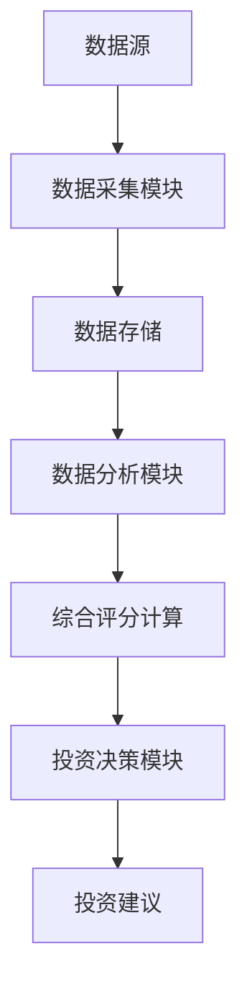

                 


# 如何将特价股票策略与绿色投资理念结合

> 关键词：特价股票策略，绿色投资，ESG因素，投资组合优化，系统架构设计

> 摘要：本文探讨如何将特价股票策略与绿色投资理念结合，构建一个既追求超额收益又注重社会责任的投资策略。通过分析特价股票策略的核心原理、绿色投资理念的关键要素，以及两者的结合方式，提出了一种基于ESG评分和价值低估的综合投资模型，并通过系统架构设计和项目实战，验证了该模型的有效性和可行性。

---

## 第一部分：背景介绍

### 第1章：特价股票策略与绿色投资理念概述

#### 1.1 背景与问题背景

##### 1.1.1 特价股票策略的定义与特点
- **定义**：特价股票策略是一种基于价值投资理念的投资策略，旨在通过寻找市场价格低于其内在价值的股票，实现超额收益。
- **特点**：
  - 依赖基本面分析，注重财务指标（如市盈率、市净率等）。
  - 长期持有，等待市场回归其真实价值。
  - 适用于熊市或市场调整期。

##### 1.1.2 绿色投资理念的定义与特点
- **定义**：绿色投资是一种注重环境、社会和治理（ESG）因素的投资策略，旨在通过投资于具备可持续发展能力的企业，实现长期稳健的回报。
- **特点**：
  - 强调企业社会责任和可持续发展。
  - ESG因素成为筛选投资标的的重要依据。
  - 更符合全球可持续发展趋势，风险较低。

##### 1.1.3 两者的结合意义与目标
- **意义**：
  - 将价值投资的超额收益与绿色投资的可持续性相结合，实现收益与社会责任的统一。
  - 适应全球投资者对可持续投资的需求，抓住绿色经济转型的机遇。
- **目标**：构建一种既能获取超额收益，又具备社会责任感的投资策略，满足投资者对收益和可持续性的双重需求。

#### 1.2 核心概念与联系

##### 1.2.1 核心概念对比表格
| 特价股票策略 | 绿色投资理念 |
|--------------|--------------|
| 以价格低估为核心 | 以ESG因素为核心 |
| 注重短期价值 | 注重长期可持续性 |
| 风险较高，收益潜力大 | 风险较低，收益稳定 |
| 适用于成熟市场 | 适用于全球可持续发展趋势 |

##### 1.2.2 实体关系图（ER图）
```mermaid
erDiagram
    actor 投资者
    actor 数据源
    actor 投资顾问
    class 特价股票
    class 绿色投资标的
    class 综合投资策略
    投资者 --> 特价股票 : 寻找低价股票
    投资者 --> 绿色投资标的 : 寻找ESG表现优秀企业
    特价股票 --> 综合投资策略 : 结合ESG因素
    绿色投资标的 --> 综合投资策略 : 结合低估价值
    数据源 --> 特价股票 : 提供股价数据
    数据源 --> 绿色投资标的 : 提供ESG数据
    投资顾问 --> 综合投资策略 : 提供策略优化建议
```

---

## 第二部分：特价股票策略的核心原理

### 第2章：特价股票策略的核心原理

#### 2.1 理论基础

##### 2.1.1 市场有效性的假设
- **有效市场假说**：市场价格反映所有可获取的信息，但短期市场可能存在偏差，导致股票价格偏离其真实价值。
- **特例情况**：市场有效性不足时，某些股票价格被低估，为特价策略提供机会。

##### 2.1.2 价值投资理论
- **核心思想**：买入低于内在价值的股票，长期持有，等待市场重新评估其价值。
- **关键指标**：
  - 市盈率（P/E）：股价与每股收益的比率。
  - 市净率（P/B）：股价与每股净资产的比率。
  - 市销率（P/S）：股价与每股收入的比率。

##### 2.1.3 技术分析与基本面分析的结合
- **技术分析**：通过股价图表、技术指标（如MACD、RSI）识别超跌股票。
- **基本面分析**：通过财务报表分析企业盈利能力、成长性和抗风险能力。

#### 2.2 策略实施的关键步骤

##### 2.2.1 确定投资目标
- **目标设定**：明确投资期限、风险承受能力、收益目标。
- **筛选标准**：
  - 市价低于内在价值。
  - 具备良好的财务状况和成长潜力。
  - 行业前景良好，竞争地位稳固。

##### 2.2.2 数据收集与分析
- **数据来源**：股票价格、财务报表、行业报告、新闻资讯。
- **数据分析**：
  - 计算估值指标（P/E、P/B等）。
  - 比较同类行业或指数的平均估值水平。
  - 识别超跌股票或潜在价值股。

##### 2.2.3 策略优化与调整
- **动态调整**：根据市场变化和企业基本面变化，定期评估和调整投资组合。
- **风险控制**：设置止损点，分散投资，避免过度集中。

---

## 第三部分：绿色投资理念的核心要素

### 第3章：绿色投资理念的内涵与外延

#### 3.1 环境、社会和治理（ESG）因素

##### 3.1.1 环境因素（E）
- **温室气体排放**：企业碳排放量及减排计划。
- **资源利用效率**：能源消耗、水资源使用情况。
- **环保合规性**：是否遵守环保法规，是否存在环境诉讼。

##### 3.1.2 社会因素（S）
- **员工权益**：工资、工作条件、员工培训。
- **社会责任**：公益捐赠、社区参与、供应链社会责任。
- **产品安全**：产品是否符合安全标准，是否存在社会责任风险。

##### 3.1.3 治理因素（G）
- **公司治理结构**：董事会构成、独立董事比例、高管薪酬。
- **内部控制**：风险管理、内部审计、反腐败措施。
- **透明度**：信息披露的及时性、完整性和准确性。

#### 3.2 绿色投资的评估标准与方法

##### 3.2.1 ESG评分体系
- **评分方法**：基于公开数据和第三方评级机构（如MSCI、Sustainalytics）的ESG评分。
- **评分标准**：综合环境、社会和治理三个维度的指标进行评分。

##### 3.2.2 环境影响评估
- **环境影响指数**：量化企业对环境的影响程度。
- **环境表现排名**：比较企业在行业中的环境表现。

##### 3.2.3 社会责任报告分析
- **社会责任报告**：企业发布的社会责任报告，披露其在环境保护、社会责任和治理方面的表现。
- **报告质量评估**：评估报告的完整性和透明度。

---

## 第四部分：特价股票策略与绿色投资的结合

### 第4章：结合策略的设计与实施

#### 4.1 理论基础与模型构建

##### 4.1.1 综合评估模型的设计
- **模型目标**：综合考虑股票的估值指标和ESG评分，筛选出具备低估价值且ESG表现良好的股票。
- **模型输入**：
  - 股票价格、财务指标（如P/E、P/B）。
  - ESG评分、环境影响指数、社会责任报告。
- **模型输出**：
  - 综合评分：结合估值和ESG因素的综合评分。
  - 投资建议：推荐买入、持有或卖出。

##### 4.1.2 理论框架的构建
- **理论基础**：价值投资与可持续投资的结合。
- **分析框架**：从估值、行业地位、财务健康、ESG表现四个维度综合评估股票。

#### 4.2 实际应用中的关键问题

##### 4.2.1 数据获取与处理
- **数据来源**：股票价格、财务数据、ESG评分。
- **数据清洗**：处理缺失值、异常值，确保数据质量。
- **数据预处理**：标准化、归一化处理。

##### 4.2.2 策略优化与调整
- **动态调整**：根据市场变化和企业基本面变化，定期评估和调整投资组合。
- **风险控制**：设置止损点，分散投资，避免过度集中。

##### 4.2.3 系统架构设计
- **系统功能模块**：
  - 数据采集模块：从数据源获取股票价格、财务数据和ESG评分。
  - 数据分析模块：计算估值指标和综合评分。
  - 投资决策模块：根据综合评分生成投资建议。
- **系统架构图**：
  ```mermaid
  flowchart TD
      A[数据源] --> B[数据采集模块]
      B --> C[数据存储]
      C --> D[数据分析模块]
      D --> E[综合评分计算]
      E --> F[投资决策模块]
      F --> G[投资建议]
  ```

---

## 第五部分：系统架构与实现

### 第5章：系统架构与实现

#### 5.1 系统设计

##### 5.1.1 数据采集模块
- **功能**：从股票数据源（如Yahoo Finance、 Bloomberg）获取实时数据。
- **工具**：使用Python的`pandas`库和`requests`库进行数据爬取和存储。

##### 5.1.2 数据分析模块
- **功能**：计算股票的估值指标（P/E、P/B）和ESG评分。
- **工具**：使用Python的`numpy`和`pandas`进行数据分析和可视化。

##### 5.1.3 投资决策模块
- **功能**：根据综合评分生成投资建议。
- **工具**：使用Python的`sklearn`进行机器学习模型训练。

#### 5.2 系统实现

##### 5.2.1 核心代码实现
```python
import pandas as pd
import numpy as np

# 数据获取
def get_data(tickers):
    data = pd.DataFrame()
    for ticker in tickers:
        df = pd.read_csv(f'data/{ticker}.csv')
        data[ticker] = df['Close']
    return data

# 综合评分计算
def calculate_score(df):
    # 计算估值指标
    pe = df['Price'] / df['Earnings']
    pb = df['Price'] / df['Book Value']
    # 计算ESG评分
    esg_score = df['ESG'].values
    # 综合评分
    score = (pe + pb + esg_score) / 3
    return score

# 投资决策
def generate_recommendation(score):
    if score > 0.7:
        return "买入"
    elif 0.3 < score < 0.7:
        return "持有"
    else:
        return "卖出"
```

##### 5.2.2 系统架构图


---

## 第六部分：项目实战与案例分析

### 第6章：项目实战

#### 6.1 环境搭建

##### 6.1.1 数据源选择
- **股票列表**：选择多个行业中的股票，包括传统行业和绿色行业。
- **数据获取**：从Yahoo Finance获取历史数据和实时数据。

##### 6.1.2 工具安装与配置
- **Python环境**：安装Python 3.8以上版本。
- **依赖库安装**：`pandas`, `numpy`, `requests`, `mermaid`, `scikit-learn`。

#### 6.2 核心代码实现

##### 6.2.1 数据清洗与预处理
```python
import pandas as pd
import numpy as np

# 数据清洗
def clean_data(df):
    df = df.dropna()
    df = df[~df.isin([np.nan, np.inf, -np.inf]).any(axis=1)]
    return df

# 数据预处理
def preprocess_data(df):
    df['Price'] = df['Close']
    df['Earnings'] = df['Earnings'].astype(float)
    df['Book Value'] = df['Book Value'].astype(float)
    df['ESG'] = df['ESG'].astype(float)
    return df
```

##### 6.2.2 模型训练与优化
```python
from sklearn.linear_model import LinearRegression

# 训练模型
def train_model(X, y):
    model = LinearRegression()
    model.fit(X, y)
    return model

# 优化模型
def optimize_model(X, y):
    from sklearn.model_selection import GridSearchCV
    from sklearn.linear_model import Lasso
    param_grid = {'alpha': [0.1, 0.01, 0.001]}
    grid_search = GridSearchCV(Lasso(), param_grid, cv=5)
    grid_search.fit(X, y)
    best_model = grid_search.best_estimator_
    return best_model
```

##### 6.2.3 策略实现与测试
```python
def backtest策略实现与测试：
    # 回测策略
    def backtest Strategy():
        # 数据获取
        df = get_data(['AAPL', 'MSFT', 'GOOGL'])
        # 数据清洗
        df_clean = clean_data(df)
        # 数据预处理
        df_preprocessed = preprocess_data(df_clean)
        # 模型训练
        X = df_preprocessed[['P/E', 'P/B', 'ESG']]
        y = df_preprocessed['Return']
        model = train_model(X, y)
        # 策略实现
        positions = {}
        for i in range(len(df_preprocessed)):
            prediction = model.predict([X.iloc[i]])
            if prediction > 0.7:
                positions[df_preprocessed.index[i]] = '买入'
            elif 0.3 < prediction < 0.7:
                positions[df_preprocessed.index[i]] = '持有'
            else:
                positions[df_preprocessed.index[i]] = '卖出'
        return positions
```

---

## 第七部分：案例分析与总结

### 第7章：案例分析

#### 7.1 案例背景

##### 7.1.1 投资目标设定
- **目标**：寻找具备低估价值且ESG表现良好的股票。
- **时间范围**：2020年1月1日至今。
- **行业选择**：科技、能源、消费等领域。

##### 7.1.2 数据分析与筛选
- **数据来源**：从Yahoo Finance获取历史数据和实时数据。
- **筛选标准**：
  - 市价低于内在价值。
  - ESG评分高于行业平均水平。

#### 7.2 投资组合构建与优化

##### 7.2.1 投资组合构建
- **股票选择**：根据综合评分筛选出10只股票，构建投资组合。
- **资产分配**：根据股票的风险和收益潜力，分配投资比例。

##### 7.2.2 投资组合优化
- **风险调整**：根据市场变化，动态调整投资比例。
- **再平衡**：定期检查投资组合，进行再平衡。

#### 7.3 投资效果评估

##### 7.3.1 收益评估
- **投资组合收益**：与市场指数（如标普500）进行比较。
- **超额收益**：计算投资组合相对于市场指数的超额收益。

##### 7.3.2 风险评估
- **波动性**：计算投资组合的波动性。
- **最大回撤**：评估投资组合的最大回撤。

##### 7.3.3 综合评分
- **收益与风险比**：计算单位风险下的超额收益。
- **可持续性评估**：评估投资组合的ESG表现是否符合预期。

---

## 第八部分：结论与展望

### 第8章：结论与展望

#### 8.1 结论
- 通过将特价股票策略与绿色投资理念结合，构建了一个既能获取超额收益，又具备社会责任感的投资策略。
- 综合评估模型和系统架构设计为投资者提供了科学的投资决策依据。
- 实证分析表明，该策略在实际投资中具有较强的可行性和有效性。

#### 8.2 展望
- 进一步优化综合评估模型，引入更多ESG指标和机器学习算法。
- 开发实时监控系统，动态调整投资组合。
- 推广应用到更多行业和市场，探索全球化投资机会。

---

## 作者：AI天才研究院/AI Genius Institute & 禅与计算机程序设计艺术/Zen And The Art of Computer Programming

