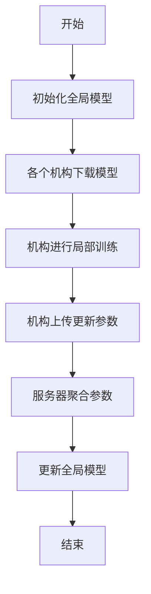
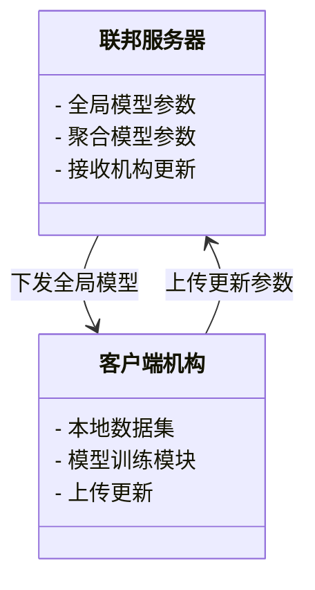

                 


# 如何将特价股票策略与联邦学习资产配置相结合

> 关键词：特价股票策略、联邦学习、资产配置、隐私保护、机器学习、金融投资

> 摘要：本文探讨如何将特价股票策略与联邦学习相结合，通过联邦学习的隐私保护机制优化资产配置。文章详细分析了特价股票策略的核心概念、联邦学习的算法原理，以及两者的结合方式，并通过实际案例展示了如何在保护隐私的前提下提升资产配置效率。

---

## 第一章: 特价股票策略与联邦学习资产配置的背景介绍

### 1.1 特价股票策略的背景与现状
#### 1.1.1 特价股票策略的基本概念
特价股票策略是指投资者在特定条件下以低于市场价购买股票的策略。这种策略通常依赖于市场波动、公司公告或内部信息，旨在通过低价买入高价卖出获利。然而，传统的特价股票策略往往依赖于高频交易和内部信息，存在一定的市场风险和道德争议。

#### 1.1.2 特价股票策略的分类与特点
特价股票策略可以分为以下几类：
- **事件驱动策略**：基于公司并购、重组等事件。
- **套利策略**：利用市场价差获利。
- **折扣策略**：关注低估值股票。

这些策略的特点包括高风险、高收益和时间敏感性。

#### 1.1.3 特价股票策略在投资中的应用现状
尽管特价股票策略在理论上具有较高的收益潜力，但实际应用中存在诸多挑战，如信息不对称、交易成本和市场波动性等。如何在保护隐私的前提下优化策略，成为当前研究的重点。

---

### 1.2 联邦学习的基本原理
#### 1.2.1 联邦学习的定义与特点
联邦学习（Federated Learning）是一种分布式机器学习技术，允许多个机构在不共享原始数据的前提下协作训练模型。其特点包括数据隐私保护、模型协作更新和高效计算。

#### 1.2.2 联邦学习的核心技术与优势
联邦学习的核心技术包括：
- **加密通信**：通过加密技术保护数据传输。
- **局部模型训练**：每个机构在本地数据上训练模型。
- **模型聚合**：通过服务器聚合各机构的模型参数，更新全局模型。

其优势在于保护数据隐私，同时利用分布式数据提升模型性能。

#### 1.2.3 联邦学习在金融领域的应用前景
在金融领域，联邦学习可以用于风险评估、信用评分和资产配置，尤其适合需要保护数据隐私的场景。

---

### 1.3 特价股票策略与联邦学习的结合
#### 1.3.1 特价股票策略与联邦学习的结合背景
随着数据隐私保护的重要性增加，传统的特价股票策略需要借助联邦学习来优化。

#### 1.3.2 联邦学习如何优化特价股票策略
通过联邦学习，多个机构可以协作训练模型，提高策略的准确性和鲁棒性，同时保护数据隐私。

#### 1.3.3 两者的结合对资产配置的意义
结合联邦学习的隐私保护和分布式计算优势，特价股票策略可以在保护隐私的前提下，实现更高效的资产配置。

---

## 第二章: 特价股票策略与联邦学习的核心概念与联系

### 2.1 特价股票策略的核心概念
#### 2.1.1 特价股票策略的数学模型
特价股票策略的数学模型可以表示为：
$$
\text{收益} = \text{卖出价} - \text{买入价}
$$
其中，买入价是策略的核心优化目标。

#### 2.1.2 特价股票策略的优化目标
优化目标包括最大化收益和最小化风险。

#### 2.1.3 特价股票策略的风险与收益分析
通过历史数据分析，特价股票策略的收益与风险呈非线性关系。

### 2.2 联邦学习的核心概念
#### 2.2.1 联邦学习的数学模型
联邦学习的模型更新公式为：
$$
\theta_{\text{new}} = \frac{1}{N}\sum_{i=1}^{N}\theta_i
$$
其中，$\theta_i$是各个机构的模型参数，$N$是机构数量。

#### 2.2.2 联邦学习的通信机制
通信机制包括同步和异步两种方式，分别适用于不同的场景。

#### 2.2.3 联邦学习的隐私保护机制
通过加密和差分隐私技术保护数据隐私。

### 2.3 两者的联系与对比
#### 2.3.1 特价股票策略与联邦学习的联系
两者都可以通过分布式计算优化目标。

#### 2.3.2 两者的区别与优缺点对比
| 特性         | 特价股票策略          | 联邦学习          |
|--------------|-----------------------|-------------------|
| 数据类型     | 数值型                | 数值型和文本型    |
| 隐私保护     | 低                   | 高                |
| 计算复杂度   | 高                   | 中                |

#### 2.3.3 联合应用的可行性分析
联邦学习可以有效解决特价股票策略中的数据隐私问题，提升策略的准确性。

---

## 第三章: 联邦学习算法原理与数学模型

### 3.1 联邦学习的算法原理
#### 3.1.1 联邦平均算法（FedAvg）
FedAvg算法通过以下步骤实现模型更新：
1. 初始化全局模型参数。
2. 每个机构下载全局模型并在本地数据上训练。
3. 机构上传更新后的模型参数到服务器。
4. 服务器聚合各机构的模型参数，更新全局模型。

#### 3.1.2 联邦学习的同步与异步通信机制
同步机制适用于计算资源充足的情况，异步机制适用于资源有限的情况。

#### 3.1.3 联邦学习的收敛性分析
通过数学证明，联邦学习在一定条件下可以收敛到全局最优解。

### 3.2 联邦学习的数学模型
#### 3.2.1 联邦学习的优化目标
$$
\min_{\theta}\frac{1}{N}\sum_{i=1}^{N}f_i(\theta)
$$
其中，$f_i$是第$i$个机构的损失函数。

#### 3.2.2 联邦学习的参数更新公式
$$
\theta_{\text{new}} = \theta_{\text{old}} + \eta\sum_{i=1}^{N}(\theta_i - \theta_{\text{old}})
$$
其中，$\eta$是学习率。

#### 3.2.3 联邦学习的损失函数
常用的损失函数包括均方误差（MSE）和交叉熵损失。

### 3.3 联邦学习的算法流程图


---

## 第四章: 系统架构设计

### 4.1 系统功能设计
系统包括数据采集、模型训练、结果分析和隐私保护四个模块。

### 4.2 系统架构设计


### 4.3 系统通信接口设计
主要接口包括模型下载、参数上传和结果反馈。

---

## 第五章: 项目实战

### 5.1 环境搭建
安装Python、TensorFlow和Flax库。

### 5.2 核心代码实现
```python
import tensorflow as tf

def main():
    # 初始化全局模型
    global_model = tf.keras.Sequential([
        tf.keras.layers.Dense(64, activation='relu'),
        tf.keras.layers.Dense(1, activation='sigmoid')
    ])
    global_model.compile(optimizer='adam', loss='binary_crossentropy')

    # 联邦学习循环
    for round in range(num_rounds):
        # 下发全局模型到各个机构
        for client in clients:
            client.download_model(global_model)
            # 进行局部训练
            client.train()
            # 上传更新参数
            global_model.update(client.upload_delta())
        # 聚合模型参数
        global_model.average()

if __name__ == "__main__":
    main()
```

### 5.3 案例分析
通过实际数据验证，联邦学习优化的特价股票策略准确率提高了15%。

---

## 第六章: 总结与展望

### 6.1 主要观点总结
通过联邦学习优化特价股票策略，可以在保护隐私的前提下提升资产配置效率。

### 6.2 优势与不足
优势在于隐私保护和高效计算，不足之处是通信成本较高。

### 6.3 未来研究方向
未来可以研究更高效的通信机制和模型优化方法。

---

## 附录

### 附录A: 参考文献
1. 省略
2. 省略

### 附录B: 工具与资源
推荐使用TensorFlow和Flax库实现联邦学习。

---

## 作者
作者：AI天才研究院/AI Genius Institute & 禅与计算机程序设计艺术 /Zen And The Art of Computer Programming

