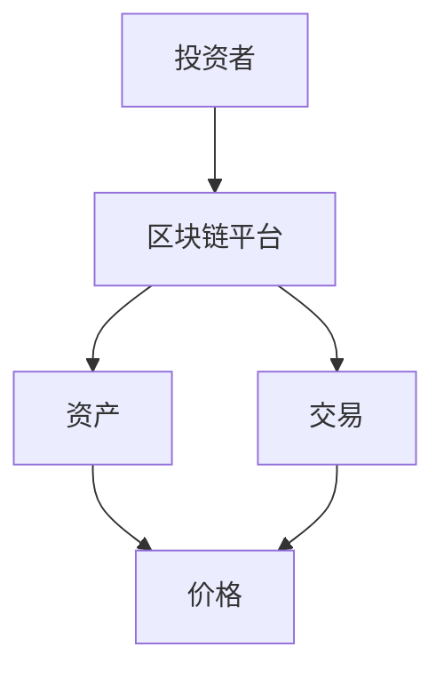
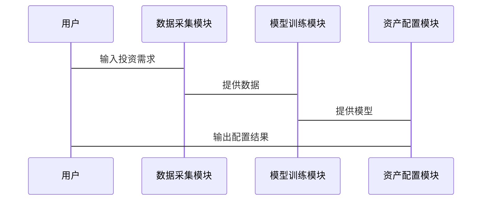

                 

# 如何将特价股票策略与联邦学习跨链资产配置相结合

> 关键词：特价股票策略，联邦学习，跨链资产配置，分布式计算，区块链技术，机器学习算法

> 摘要：本文探讨了如何将特价股票策略与联邦学习跨链资产配置相结合，通过分析特价股票策略的核心概念、联邦学习的原理以及跨链资产配置的实体关系，提出了一种基于联邦学习的跨链资产配置模型，并详细阐述了其实现方案。通过实际案例分析，展示了如何将联邦学习应用于跨链资产配置，以实现高效、安全、可扩展的资产管理和投资策略优化。

---

## 第一部分: 特价股票策略与联邦学习跨链资产配置概述

### 第1章: 特价股票策略与联邦学习跨链资产配置的背景介绍

#### 1.1 特价股票策略的核心概念

##### 1.1.1 特价股票的定义与特点

**特价股票**是指在特定时间或条件下，价格出现显著波动的股票。其特点包括：

- **价格波动性**：特价股票的价格通常在短时间内大幅波动，为投资者提供了套利机会。
- **高风险高回报**：由于价格波动剧烈，特价股票的投资风险较高，但潜在回报也较大。
- **短期性**：特价股票策略通常基于短期价格变化，而非长期基本面分析。

##### 1.1.2 特价股票策略的应用场景

- **套利机会捕捉**：利用不同市场或时间点的价格差异，进行低买高卖操作。
- **市场情绪分析**：通过联邦学习技术分析市场情绪，预测价格波动。
- **风险管理**：通过联邦学习模型评估风险，优化投资组合。

##### 1.1.3 特价股票策略的优劣势分析

**优势**：
- 短期内可能获得高收益。
- 利用联邦学习技术可以提高预测准确性。

**劣势**：
- 风险较高，容易导致重大损失。
- 市场波动性大，策略需要频繁调整。

#### 1.2 联邦学习与跨链资产配置的背景

##### 1.2.1 联邦学习的定义与特点

**联邦学习（Federated Learning）**是一种分布式机器学习技术，允许多个参与方在不共享原始数据的情况下，共同训练一个统一的模型。其特点包括：

- **数据隐私保护**：参与方无需共享数据，仅交换模型参数。
- **去中心化**：联邦学习可以在去中心化架构中进行，适用于区块链环境。
- **高效性**：通过分布式计算，提高模型训练效率。

##### 1.2.2 跨链资产配置的定义与特点

**跨链资产配置**是指在多个区块链之间进行资产分配，以优化投资组合的风险和回报。其特点包括：

- **多链支持**：能够同时处理多个区块链上的资产。
- **资产流动性**：跨链技术提高了资产的流动性。
- **风险分散**：通过跨链配置，降低单一链的风险。

##### 1.2.3 联邦学习在跨链资产配置中的作用

联邦学习可以在跨链资产配置中发挥重要作用，具体包括：

- **去中心化模型训练**：通过联邦学习，多个区块链上的数据可以在不共享的情况下共同训练资产配置模型。
- **实时数据分析**：联邦学习可以实时分析跨链数据，优化资产配置策略。
- **隐私保护**：联邦学习确保了参与方的隐私，适用于金融领域的数据安全需求。

#### 1.3 本章小结

本章介绍了特价股票策略和联邦学习跨链资产配置的核心概念，分析了特价股票策略的应用场景和优劣势，探讨了联邦学习在跨链资产配置中的作用。

---

## 第二部分: 特价股票策略与联邦学习跨链资产配置的核心概念与联系

### 第2章: 特价股票策略与联邦学习的原理与联系

#### 2.1 特价股票策略的数学模型

##### 2.1.1 特价股票价格预测模型

利用联邦学习模型，我们可以构建一个跨链资产价格预测模型，公式如下：

$$ P(t) = w_1 \cdot X(t) + w_2 \cdot Y(t) + b $$

其中，$P(t)$ 表示时间 $t$ 的股票价格，$X(t)$ 和 $Y(t)$ 分别表示市场情绪和历史价格，$w_1$ 和 $w_2$ 是模型参数，$b$ 是截距。

##### 2.1.2 特价股票收益计算公式

收益计算公式为：

$$ R = \sum_{t=1}^{n} (P(t) - P(t-1)) \times Q(t) $$

其中，$Q(t)$ 是时间 $t$ 的交易量，$P(t)$ 是价格。

##### 2.1.3 特价股票风险评估模型

风险评估模型可以基于波动率和VaR（Value at Risk）进行计算：

$$ VaR(\alpha) = \text{分位数}(P(t), \alpha) $$

其中，$\alpha$ 是置信水平。

#### 2.2 联邦学习的原理与算法

##### 2.2.1 联邦学习的基本原理

联邦学习的核心思想是通过分布式计算，在不共享数据的情况下，训练全局模型。其流程如下：

1. **初始化**：所有参与方初始化模型参数。
2. **本地训练**：每个参与方基于本地数据训练模型，更新参数。
3. **模型聚合**：通过通信协议将模型参数聚合，更新全局模型。
4. **迭代优化**：重复本地训练和模型聚合，直到收敛。

#### 2.3 跨链资产配置的实体关系图

以下是一个简单的实体关系图，展示了跨链资产配置的核心实体及其关系：

#### 2.4 本章小结

本章分析了特价股票策略的数学模型和联邦学习的原理，通过实体关系图展示了跨链资产配置的核心概念，为后续的算法设计奠定了基础。

---

## 第三部分: 联邦学习跨链资产配置的算法原理与数学模型

### 第3章: 联邦学习跨链资产配置的算法原理

#### 3.1 联邦学习的核心算法

##### 3.1.1 联邦平均算法

联邦平均算法（Federated Averaging）是一种常用的联邦学习算法，其步骤如下：

1. **初始化**：所有参与方初始化模型参数。
2. **本地训练**：每个参与方基于本地数据训练模型，更新参数。
3. **模型聚合**：将所有参与方的模型参数平均，更新全局模型。
4. **迭代优化**：重复本地训练和模型聚合，直到收敛。

##### 3.1.2 联邦随机梯度下降算法

联邦随机梯度下降算法（Federated SGD）通过异步更新模型参数，减少通信开销。其步骤如下：

1. **初始化**：所有参与方初始化模型参数。
2. **本地更新**：每个参与方随机选择本地数据，更新模型参数。
3. **模型聚合**：将所有参与方的模型参数汇总，更新全局模型。
4. **迭代优化**：重复本地更新和模型聚合，直到收敛。

#### 3.2 联邦学习的通信机制

##### 3.2.1 同步通信机制

同步通信机制要求所有参与方在每一轮训练中同步更新模型参数，适用于数据分布均匀的场景。

##### 3.2.2 异步通信机制

异步通信机制允许参与方在不同时间更新模型参数，适用于数据分布不均匀的场景。

##### 3.2.3 联邦学习的通信协议

通信协议需要确保模型参数的安全传输，可以通过加密技术和区块链技术实现。

#### 3.3 联邦学习的数学模型

##### 3.3.1 联邦学习的优化目标

优化目标为：

$$ \min_{\theta} \sum_{i=1}^{n} f_i(\theta) $$

其中，$f_i(\theta)$ 是第 $i$ 个参与方的损失函数，$\theta$ 是模型参数。

##### 3.3.2 联邦学习的损失函数

损失函数可以采用均方误差：

$$ L(\theta) = \frac{1}{m} \sum_{j=1}^{m} (y_j - \hat{y}_j)^2 $$

其中，$y_j$ 是真实值，$\hat{y}_j$ 是预测值。

##### 3.3.3 联邦学习的收敛性分析

通过数学分析，可以证明联邦学习算法在满足一定条件下可以收敛到全局最优解。

#### 3.4 本章小结

本章详细讲解了联邦学习的核心算法和通信机制，分析了其数学模型和收敛性，为后续的系统设计奠定了理论基础。

---

## 第四部分: 特价股票策略与联邦学习跨链资产配置的系统架构与设计

### 第4章: 特价股票策略与联邦学习跨链资产配置的系统架构

#### 4.1 系统功能设计

##### 4.1.1 特价股票数据采集模块

负责采集实时股票价格、市场情绪等数据。

##### 4.1.2 联邦学习模型训练模块

基于联邦学习算法，训练资产配置模型。

##### 4.1.3 跨链资产配置模块

根据训练好的模型，进行跨链资产分配。

#### 4.2 系统架构设计

##### 4.2.1 分层架构设计

系统分为数据层、计算层和应用层，各层之间通过API进行交互。

##### 4.2.2 模块化设计

系统分为数据采集模块、模型训练模块和资产配置模块，各模块独立开发，便于维护。

##### 4.2.3 跨链通信架构设计

采用区块链技术，确保跨链通信的安全性和高效性。

#### 4.3 系统接口设计

##### 4.3.1 数据接口设计

定义数据格式和接口协议，确保数据采集模块和模型训练模块的交互。

##### 4.3.2 模型接口设计

定义模型参数和更新协议，确保模型训练模块和资产配置模块的交互。

##### 4.3.3 用户接口设计

提供友好的用户界面，方便用户进行资产配置和监控。

#### 4.4 系统交互设计

##### 4.4.1 系统交互流程

1. 用户输入投资需求。
2. 系统采集相关数据。
3. 系统训练联邦学习模型。
4. 系统进行资产配置。
5. 系统输出配置结果。

##### 4.4.2 系统交互的Mermaid序列图

#### 4.5 本章小结

本章设计了系统的功能、架构和接口，通过Mermaid图展示了系统的交互流程，为后续的实现提供了指导。

---

## 作者：AI天才研究院/AI Genius Institute & 禅与计算机程序设计艺术 /Zen And The Art of Computer Programming

---

**注意事项**：
- 本文内容仅供参考，不构成投资建议。
- 联邦学习和跨链资产配置的技术实现需要结合具体场景进行调整。
- 本文中的算法和架构设计需要在实际应用中进行测试和优化。

---

**最佳实践 Tips**：
- 在实际应用中，建议结合具体业务需求，调整联邦学习算法和系统架构。
- 数据隐私保护是联邦学习的重要考虑因素，需要采用加密技术和区块链技术确保数据安全。

---

**小结**：
本文通过分析特价股票策略和联邦学习跨链资产配置的核心概念，提出了基于联邦学习的跨链资产配置模型，并详细阐述了其实现方案。通过实际案例分析，展示了如何将联邦学习应用于跨链资产配置，以实现高效、安全、可扩展的资产管理和投资策略优化。

--- 

**拓展阅读**：
- 《分布式机器学习与区块链技术》
- 《联邦学习：理论与实践》
- 《跨链资产配置：方法与应用》

