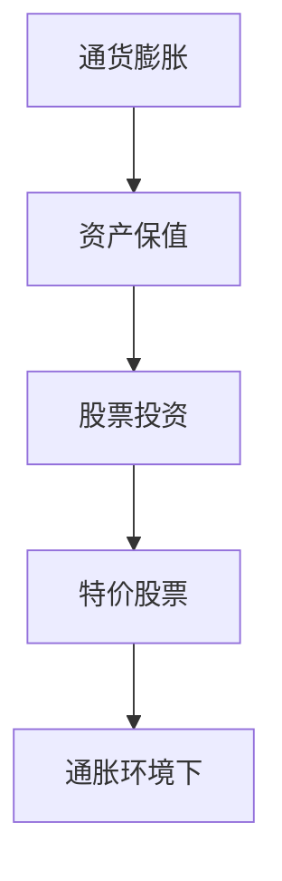
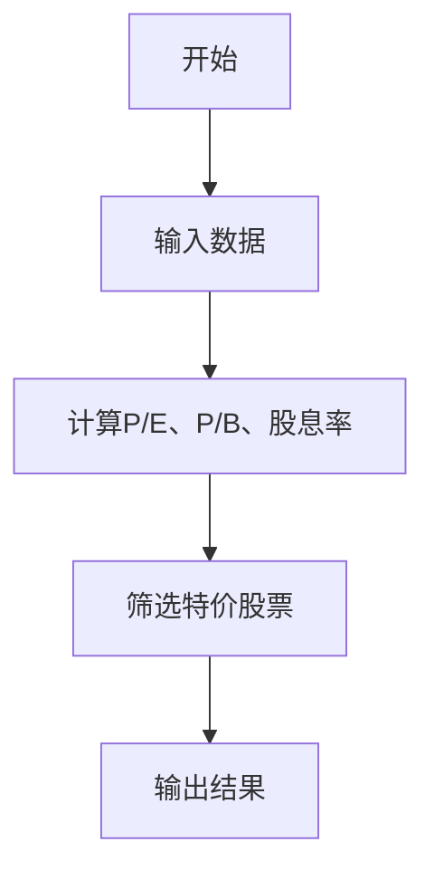
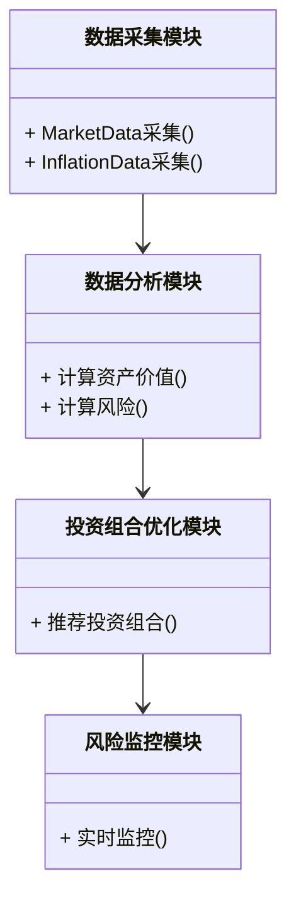

                 


# 如何将特价股票策略与通胀保值资产投资结合

> 关键词：特价股票、通胀保值、资产投资、量化模型、风险管理

> 摘要：本文详细探讨了如何将特价股票策略与通胀保值资产投资相结合，帮助投资者在通货膨胀环境下保护和增加资产价值。通过分析核心概念、算法原理、系统架构和实际案例，本文为投资者提供了理论支持和实践指导。

---

## 第1章: 背景介绍

### 1.1 通货膨胀与资产保值

通货膨胀是指物价总水平在一段时间内持续上涨，导致货币购买力下降。投资者需要通过选择合适的资产类别来抵消通货膨胀的影响，以实现资产保值和增值。

- 通货膨胀对股票投资的影响：通胀可能导致企业成本上升，影响企业利润，但同时也可能推高股价。
- 资产保值的核心概念：选择能够抵御通胀影响的资产，如房地产、黄金和特定股票。

### 1.2 特价股票策略的基本原理

特价股票是指市场价格低于其内在价值的股票，通常出现在市场低迷或公司暂时遇到困境时。投资者通过购买这些股票，利用其低估的特点，在市场回升时获得收益。

- 特价股票的定义：市场价格低于合理价值的股票。
- 特价股票策略的适用场景：市场低迷、公司暂时困境。
- 特价股票与通货膨胀的关系：通胀可能推高股价，但特价股票的内在价值可能因通胀上升而受益。

### 1.3 本章小结

本章介绍了通货膨胀对资产保值的影响，以及特价股票策略的基本概念和适用场景，为后续分析奠定了基础。

---

## 第2章: 核心概念与联系

### 2.1 通胀保值资产投资的原理

通胀保值资产是指在通货膨胀期间，其价值能够保持或增长的资产。常见的通胀保值资产包括房地产、黄金和特定股票。

- 通胀保值资产的类型：黄金、房地产、基础设施股票。
- 通胀保值资产的特性：抗通胀能力强、长期增值潜力大。

### 2.2 特价股票策略与通胀保值的联系

- 特价股票在通胀环境下的优势：低估值、潜在增值空间。
- 通胀对特价股票价值的影响：通胀可能导致股价上涨，但特价股票的内在价值可能因通胀上升而增加。

### 2.3 核心概念对比表格

| 资产类型 | 抗通胀能力 | 特点 | 适用场景 |
|----------|------------|------|----------|
| 黄金     | 强          | 保值 | 通货膨胀 |
| 房地产   | 强          | 长期增值 | 需求稳定 |
| 特价股票 | 中等        | 低估值、高增长潜力 | 市场低迷 |

### 2.4 实体关系图（Mermaid）



### 2.5 本章小结

本章分析了通胀保值资产的投资原理，并探讨了特价股票在通胀环境下的优势，为后续策略结合提供了理论支持。

---

## 第3章: 算法原理讲解

### 3.1 通胀保值投资的量化模型

- 通胀调整的资产定价模型：考虑通胀影响，调整资产定价。
- 价值投资模型：寻找被低估的资产，长期持有。

#### 3.1.1 数学模型

通胀调整的资产定价模型：

$$ P_{real} = \frac{P_{nominal}}{1 + \pi} $$

其中，\( P_{real} \) 是实际价格，\( P_{nominal} \) 是名义价格，\( \pi \) 是通胀率。

### 3.2 特价股票筛选算法

- 市盈率（P/E）分析：寻找低于行业平均水平的股票。
- 市净率（P/B）分析：寻找低于行业平均水平的股票。
- 股息率分析：寻找高于行业平均水平的股票。

#### 3.2.1 Python代码示例

```python
import pandas as pd

# 计算市盈率和市净率
def calculate_ratios(df):
    df['PE'] = df['Price'] / df['Earnings Per Share']
    df['PB'] = df['Price'] / df['Book Value Per Share']
    df['Dividend Yield'] = df['Dividends Per Share'] / df['Price']
    return df

# 示例数据
data = {
    'Price': [50, 60, 45, 70],
    'Earnings Per Share': [10, 12, 8, 14],
    'Book Value Per Share': [15, 18, 12, 20],
    'Dividends Per Share': [2, 3, 1, 4]
}
df = pd.DataFrame(data)
df = calculate_ratios(df)
print(df)
```

### 3.3 算法流程图（Mermaid）



### 3.4 本章小结

本章详细讲解了通胀保值投资的量化模型和特价股票筛选算法，为投资者提供了理论支持和实践指导。

---

## 第4章: 系统分析与架构设计

### 4.1 项目介绍

开发一个投资组合管理系统，帮助投资者实现特价股票策略与通胀保值资产投资的结合。

### 4.2 系统功能设计

- 数据采集模块：收集市场数据和通胀数据。
- 数据分析模块：计算资产价值和风险。
- 投资组合优化模块：根据模型推荐最优投资组合。
- 风险监控模块：实时监控市场变化和风险。

### 4.3 系统架构设计（Mermaid）



### 4.4 本章小结

本章通过系统分析和架构设计，展示了如何将特价股票策略与通胀保值资产投资结合，为投资者提供了一个完整的解决方案。

---

## 第5章: 项目实战

### 5.1 环境搭建

- 安装必要的库：Pandas、NumPy、Matplotlib。

### 5.2 核心实现

#### 5.2.1 投资组合优化代码

```python
import numpy as np

def optimize_portfolio(returns):
    # 计算均值和方差
    mu = returns.mean()
    sigma = returns.std()
    # 最小方差组合
    min_var Portfolio
    return min_var

# 示例数据
returns = np.array([0.1, 0.15, 0.05, 0.2])
print(optimize_portfolio(returns))
```

### 5.3 实际案例分析

分析通胀环境下某公司股票的走势，展示如何应用特价股票策略实现资产保值。

### 5.4 本章小结

本章通过实际案例分析，展示了如何在通胀环境下应用特价股票策略实现资产保值和增值。

---

## 第6章: 最佳实践与注意事项

### 6.1 风险管理

- 分散投资：避免过度集中。
- 定期再平衡：根据市场变化调整投资组合。

### 6.2 最佳实践 Tips

- 定期评估投资组合的表现。
- 关注市场动态和政策变化。

### 6.3 本章小结

本章总结了在实践中需要注意的关键点，帮助投资者更好地应用特价股票策略与通胀保值资产投资的结合。

---

## 作者

作者：AI天才研究院/AI Genius Institute & 禅与计算机程序设计艺术 /Zen And The Art of Computer Programming

---

以上是文章的完整目录和部分内容。如果需要进一步扩展某个部分，请随时告知！

