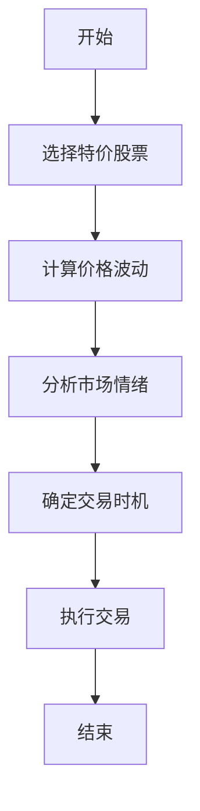
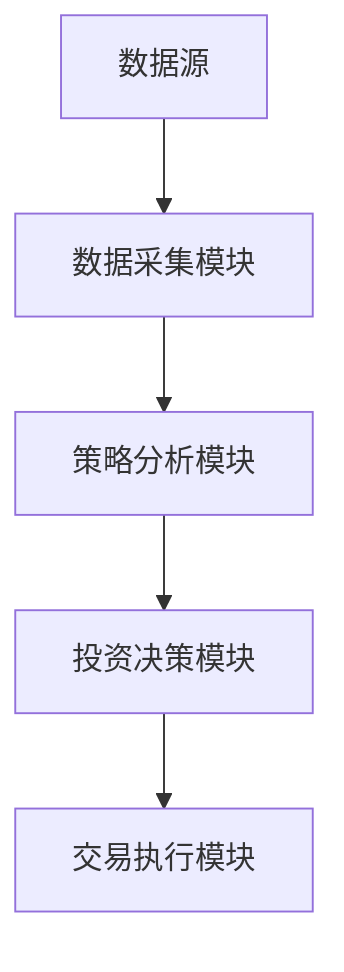
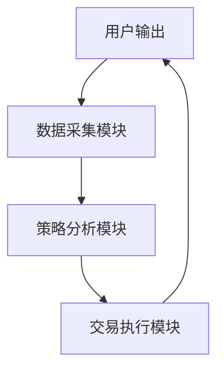

                 


# 如何将特价股票策略应用于ETF投资

> 关键词：特价股票，ETF投资，策略应用，算法原理，系统架构

> 摘要：本文将详细介绍如何将特价股票策略应用于ETF投资。首先，我们从特价股票的定义、分类及其在投资中的潜力入手，然后深入探讨ETF的基本概念与选择标准。接着，我们分析特价股票策略的核心原理，包括数学模型与算法实现。随后，我们将重点讲解如何将该策略应用到ETF投资中，包括策略筛选标准、组合优化与风险管理。最后，通过系统架构设计与项目实战，展示如何将理论转化为实际操作，并总结投资中的注意事项与最佳实践。

---

# 第一部分: 特价股票策略与ETF投资基础

## 第1章: 特价股票策略概述

### 1.1 特价股票的定义与分类

#### 1.1.1 什么是特价股票
特价股票是指在特定时间或条件下，价格低于正常水平的股票。这种股票通常由于市场波动、公司财报发布或其他市场因素而出现价格折扣。

#### 1.1.2 特价股票的分类
- **短期特价股票**：价格波动较小，持续时间较短。
- **长期特价股票**：价格长期被低估，具有较大的上涨潜力。
- **周期性特价股票**：受行业周期影响，价格波动较大。

#### 1.1.3 特价股票的特点
- 价格波动性高
- 投资风险较大
- 潜在收益高

### 1.2 ETF投资的基本概念

#### 1.2.1 ETF的定义与特点
ETF（交易所交易基金）是一种在交易所上市交易的基金，其价格跟踪指数或其他资产的表现。ETF具有以下特点：
- 分散投资风险
- 交易灵活
- 费用较低

#### 1.2.2 ETF的投资优势
- 多样化投资
- 便于操作
- 成本低

#### 1.2.3 ETF的种类与选择
- 股票型ETF
- 债券型ETF
- 指数型ETF

### 1.3 特价股票策略在ETF投资中的应用潜力

#### 1.3.1 ETF与特价股票策略的结合点
- 通过ETF分散投资特价股票的风险
- 利用ETF的多样性捕捉特价股票的收益

#### 1.3.2 特价股票策略在ETF投资中的优势
- 提高投资效率
- 降低个体股票投资风险

#### 1.3.3 应用中的潜在风险与挑战
- 市场波动风险
- 信息不对称

---

## 第2章: 特价股票策略的核心原理

### 2.1 特价股票策略的数学模型

#### 2.1.1 价格波动模型
$$ P(t) = P_0 + \alpha \cdot \epsilon $$
其中，$P(t)$ 表示股票价格在时间 $t$，$P_0$ 是初始价格，$\alpha$ 是波动系数，$\epsilon$ 是随机误差项。

#### 2.1.2 市场情绪分析模型
$$ S(t) = \beta \cdot V(t) + \gamma \cdot M(t) $$
其中，$S(t)$ 是市场情绪指数，$V(t)$ 是成交量，$M(t)$ 是市场消息指数。

#### 2.1.3 交易时机选择模型
$$ T(t) = \begin{cases} 
1 & \text{如果 } P(t) < P_{\text{threshold}} \\
0 & \text{否则}
\end{cases} $$

### 2.2 特价股票策略的算法实现

#### 2.2.1 算法流程图（Mermaid）



#### 2.2.2 Python代码示例
```python
import numpy as np
import pandas as pd

def calculate_price_fluctuation(prices):
    return prices - np.mean(prices)

def analyze_market_sentiment(volume, price_fluctuation):
    return np.corrcoef(volume, price_fluctuation)[0,1]

def determine_trading时机(price_fluctuation, sentiment):
    threshold = 0.5
    return 1 if (price_fluctuation < threshold and sentiment > 0.6) else 0

# 示例数据
prices = pd.Series([100, 105, 98, 102, 101])
volume = pd.Series([1000, 1200, 900, 1100, 1300])

fluctuation = calculate_price_fluctuation(prices)
sentiment = analyze_market_sentiment(volume, fluctuation)
trading_timings = determine_trading时机(fluctuation, sentiment)
print(trading_timings)
```

---

## 第3章: 将特价股票策略应用于ETF投资的方法

### 3.1 ETF投资中的策略筛选标准

#### 3.1.1 选择具有低估潜力的ETF
- 基于历史价格波动
- 结合市场情绪分析

#### 3.1.2 ETF的流动性与交易成本
- 确保高流动性
- 降低交易成本

### 3.2 ETF投资组合优化

#### 3.2.1 组合优化的数学模型
$$ \text{Minimize } \sum_{i=1}^n w_i \cdot c_i $$
$$ \text{Subject to } \sum_{i=1}^n w_i = 1 $$
其中，$w_i$ 是第 $i$ 个ETF的权重，$c_i$ 是交易成本。

#### 3.2.2 组合优化的实现步骤
- 确定目标函数
- 建立约束条件
- 使用优化算法求解

### 3.3 风险管理与控制

#### 3.3.1 风险评估指标
- VaR（在险价值）
- 最大回撤

#### 3.3.2 风险控制策略
- 设置止损点
- 分批投资

---

## 第4章: ETF投资中的系统架构与实现

### 4.1 系统架构设计

#### 4.1.1 系统模块划分
- 数据采集模块
- 策略分析模块
- 投资决策模块

#### 4.1.2 系统架构图（Mermaid）



### 4.2 接口设计与交互流程

#### 4.2.1 系统接口设计
- 数据接口：从数据源获取股票价格、成交量等数据。
- 策略接口：接收策略参数，返回交易信号。

#### 4.2.2 交互流程图（Mermaid）



---

## 第5章: 项目实战与案例分析

### 5.1 环境安装与数据准备

#### 5.1.1 环境安装
- 安装Python
- 安装Pandas、NumPy等库

#### 5.1.2 数据获取
- 从Yahoo Finance获取ETF数据

### 5.2 核心代码实现

#### 5.2.1 策略实现代码
```python
import pandas as pd
import numpy as np

def apply_discount(prices, discount_rate=0.05):
    return prices * (1 - discount_rate)

# 示例数据
prices = pd.Series([100, 105, 98, 102, 101])
discounted_prices = apply_discount(prices)
print(discounted_prices)
```

#### 5.2.2 投资组合优化代码
```python
import scipy.optimize as opt

def portfolio_optimization(returns, weights):
    # 定义目标函数
    def objective(weights, returns):
        return np.dot(weights, returns.mean() * weights.T)
    
    # 约束条件
    constraints = [
        ('sum', weights, 1),
        ('>=', weights, 0)
    ]
    
    # 使用SLSQP求解
    result = opt.minimize(objective, np.ones(len(weights)) / len(weights), 
                          method='SLSQP', constraints=constraints)
    return result.x

# 示例数据
returns = pd.Series([0.05, 0.03, 0.04, 0.02])
weights = portfolio_optimization(returns)
print(weights)
```

### 5.3 案例分析与结果解读

#### 5.3.1 案例分析
- 数据背景
- 策略选择
- 实施过程

#### 5.3.2 结果解读
- 投资回报
- 风险评估

---

## 第6章: 总结与展望

### 6.1 全文总结
- 特价股票策略的优势
- ETF投资的应用潜力

### 6.2 投资建议与注意事项
- 风险管理
- 策略调整

### 6.3 未来展望
- 算法优化
- 系统升级

---

# 作者：AI天才研究院/AI Genius Institute & 禅与计算机程序设计艺术 /Zen And The Art of Computer Programming

