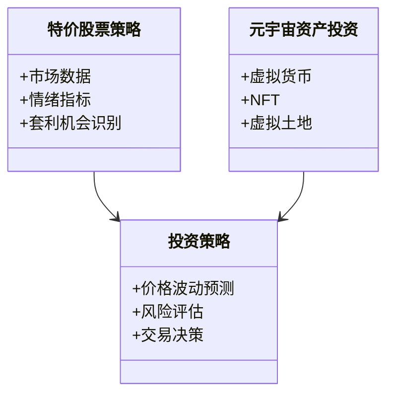
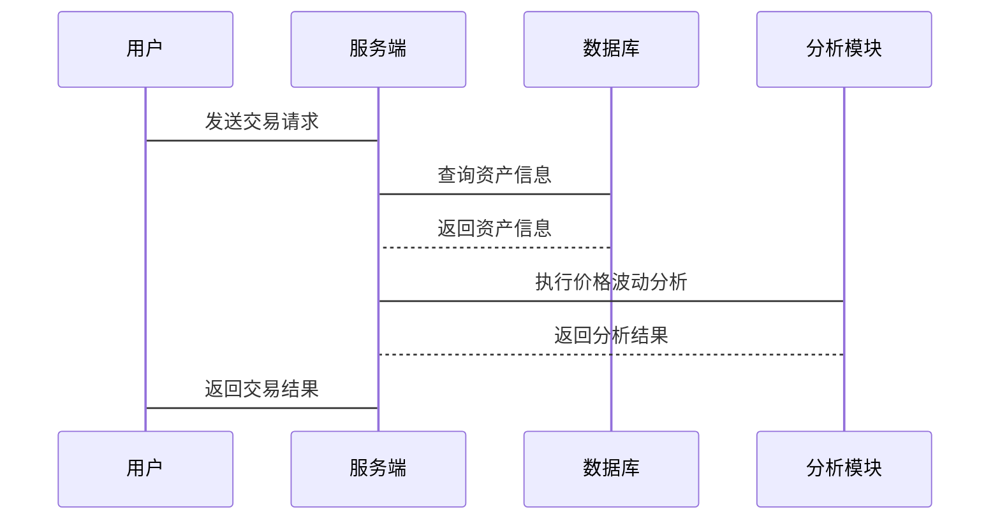

                 


# 如何将特价股票策略应用于元宇宙资产(MA)投资

## 关键词：特价股票策略、元宇宙资产、投资策略、数学模型、算法优化

## 摘要：  
本文探讨了如何将传统的特价股票策略应用于新兴的元宇宙资产投资领域。通过分析元宇宙资产的特性、价格波动规律以及特价策略的核心原理，结合数学模型和算法优化，提出了适用于元宇宙资产投资的策略框架。文章从背景介绍、核心概念、算法原理、系统架构到项目实战，全面解析了如何在元宇宙环境中有效应用特价策略进行投资，为投资者提供了理论支持和实践指导。

---

# 第一部分: 特价股票策略与元宇宙资产投资的背景与基础

## 第1章: 特价股票策略与元宇宙资产投资的背景

### 1.1 特价股票策略概述  
#### 1.1.1 特价股票策略的定义  
特价股票策略是一种基于市场价格波动的套利策略，旨在通过识别市场中的价格异常机会，以低于市场价买入股票，并在价格回升时卖出以获利。其核心在于捕捉短期价格波动中的套利机会。  

#### 1.1.2 特价股票策略的核心要素  
- **价格波动**: 市场价格受供需关系、情绪波动等因素影响，存在短期价格波动的机会。  
- **套利机会**: 当市场价格偏离其内在价值时，套利者可以通过买入低估资产并在价格回升时卖出获利。  
- **风险控制**: 特价策略需结合严格的止损机制和风险评估，以降低市场波动带来的损失。  

#### 1.1.3 特价股票策略在传统投资中的应用  
- **短期套利**: 如新股上市、市场流动性不足等情况下的套利机会。  
- **市场情绪分析**: 基于情绪指标（如VIX指数）判断市场波动，寻找套利窗口。  
- **技术分析**: 利用技术指标（如RSI、MACD）预测价格波动，辅助套利决策。  

### 1.2 元宇宙资产投资概述  
#### 1.2.1 元宇宙的定义与特征  
元宇宙是一个虚拟的三维空间，结合了区块链、虚拟现实（VR）、增强现实（AR）和人工智能等技术，构建了一个去中心化的虚拟经济体系。其主要特征包括：  
- **去中心化**: 元宇宙中的资产所有权基于区块链技术，具有不可篡改性。  
- **虚拟经济**: 元宇宙内的资产（如NFT、虚拟货币）具有经济价值，并可通过交易实现价值转移。  
- **沉浸式体验**: 用户可通过VR设备深度参与元宇宙，进行虚拟社交、交易等活动。  

#### 1.2.2 元宇宙资产的类型与价值评估  
- **虚拟货币**: 如比特币、以太坊等，用于元宇宙内的交易和支付。  
- **NFT（非同质化代币）**: 代表元宇宙中的虚拟物品、艺术品等独特资产。  
- **虚拟土地**: 元宇宙中的虚拟地块，具有投资和商业用途。  
- **虚拟商品**: 如虚拟装备、虚拟服务等，具有市场需求和交易价值。  

#### 1.2.3 元宇宙资产投资的现状与趋势  
- **市场需求**: 元宇宙的兴起引发了大量投资者的关注，虚拟货币和NFT的交易量持续增长。  
- **技术驱动**: 区块链技术的进步降低了交易成本，提高了资产流动性和透明度。  
- **政策影响**: 全球各国对元宇宙的监管政策逐渐明朗，为投资提供了法律保障。  

### 1.3 特价股票策略应用于元宇宙资产投资的背景  
#### 1.3.1 元宇宙资产投资的机遇与挑战  
- **机遇**: 元宇宙资产的高增长性和稀缺性为投资者提供了丰厚的回报潜力。  
- **挑战**: 元宇宙资产价格波动剧烈，市场信息不透明，投资风险较高。  

#### 1.3.2 特价股票策略在元宇宙资产投资中的潜在价值  
- **套利机会**: 元宇宙资产的短期价格波动为套利者提供了潜在的获利窗口。  
- **价格发现**: 通过分析元宇宙资产的价格走势，投资者可以发现被低估的资产并进行投资。  
- **风险控制**: 特价策略结合风险控制机制，可有效降低投资风险。  

#### 1.3.3 元宇宙资产投资中的价格波动与套利机会  
- **价格波动**: 元宇宙资产价格受市场情绪、供需关系和技术升级的影响，具有较高的波动性。  
- **套利机会**: 当市场价格偏离其内在价值时，套利者可通过买入低估资产并在价格回升时卖出获利。  

---

## 第2章: 特价股票策略与元宇宙资产投资的核心概念  

### 2.1 特价股票策略的核心原理  
#### 2.1.1 市场定价机制与特价机会的识别  
市场价格由供需关系决定，当市场出现短期供大于求时，价格会低于其内在价值，此时即为套利机会。  

#### 2.1.2 市场情绪与价格波动的关系  
市场情绪（如贪婪、恐慌）会影响投资者的决策，进而导致价格波动。通过分析市场情绪，套利者可以更好地识别套利机会。  

#### 2.1.3 特价股票策略的风险与收益分析  
- **风险**: 市场价格波动、政策风险、技术风险等。  
- **收益**: 短期套利收益、资产增值收益等。  

### 2.2 元宇宙资产投资的核心原理  
#### 2.2.1 元宇宙的虚拟经济体系  
元宇宙的虚拟经济体系基于区块链技术，具有去中心化、不可篡改的特点，为资产交易提供了安全的环境。  

#### 2.2.2 元宇宙资产的价值驱动因素  
- **市场需求**: 资产的市场需求决定了其价值。  
- **稀缺性**: 稀有资产具有更高的价值。  
- **技术升级**: 元宇宙的技术进步会提升资产的使用价值。  

#### 2.2.3 元宇宙资产投资的交易机制  
- **去中心化交易**: 基于区块链技术的去中心化交易所（如Uniswap）支持元宇宙资产的交易。  
- **流动性**: 资产的流动性影响其交易价格和交易频率。  

### 2.3 特价股票策略与元宇宙资产投资的结合点  
#### 2.3.1 元宇宙资产价格波动的规律  
- **周期性波动**: 元宇宙资产价格具有周期性波动的特点。  
- **短期波动**: 市场情绪和技术升级可能导致短期价格波动。  

#### 2.3.2 特价股票策略在元宇宙资产投资中的适用性  
- **套利机会识别**: 通过分析元宇宙资产的价格波动，识别套利机会。  
- **风险控制**: 结合风险控制机制，降低投资风险。  

#### 2.3.3 元宇宙资产投资中的套利机会与风险控制  
- **套利机会**: 元宇宙资产价格波动为套利者提供了机会。  
- **风险控制**: 通过止损机制和风险评估，降低投资风险。  

---

## 第3章: 特价股票策略应用于元宇宙资产投资的数学模型  

### 3.1 特价股票策略的数学模型  
#### 3.1.1 市场价格波动模型  
市场价格波动可以看作是一个随机过程，可以用马尔可夫过程或布朗运动模型来描述。  

#### 3.1.2 市场情绪与价格关系的数学表达  
市场情绪可以用情绪指标（如VIX指数）来量化，价格波动与情绪指标之间存在相关性，可以通过回归分析来建模。  

#### 3.1.3 套利机会的数学分析  
套利机会可以通过价格与价值的偏差来量化，可以用以下公式表示：  
$$ \text{套利机会} = \max(0, \text{市场价格} - \text{内在价值}) $$  

### 3.2 元宇宙资产投资的数学模型  
#### 3.2.1 元宇宙资产价值评估模型  
元宇宙资产的内在价值可以通过市场需求、稀缺性和技术升级等因素进行评估，可以用以下公式表示：  
$$ \text{内在价值} = \alpha \times \text{市场需求} + \beta \times \text{稀缺性} + \gamma \times \text{技术升级} $$  

#### 3.2.2 元宇宙资产价格波动预测模型  
价格波动可以用时间序列分析（如ARIMA模型）或机器学习模型（如LSTM）进行预测。  

#### 3.2.3 元宇宙资产交易策略的数学优化  
交易策略可以通过优化算法（如遗传算法）进行优化，以最大化收益并最小化风险。  

### 3.3 特价股票策略与元宇宙资产投资结合的数学模型  
#### 3.3.1 元宇宙资产价格波动与特价机会的关系模型  
特价机会的存在可以通过以下公式表示：  
$$ \text{特价机会} = \max(0, \text{市场价格} - \text{内在价值}) $$  

#### 3.3.2 基于特价股票策略的元宇宙资产投资优化模型  
投资优化可以通过以下公式表示：  
$$ \max \sum_{i=1}^{n} w_i \times \text{收益}_i - \lambda \times \text{风险}_i $$  
其中，$w_i$ 是第i个资产的权重，$\lambda$ 是风险系数。  

#### 3.3.3 模型的验证与优化  
通过历史数据验证模型的准确性，并通过参数调整和模型优化提高预测精度。  

---

## 第4章: 系统分析与架构设计  

### 4.1 系统功能设计  
#### 4.1.1 领域模型（Mermaid 类图）  


#### 4.1.2 系统架构设计（Mermaid 架构图）  


#### 4.1.3 系统接口设计  
- **API接口**: 提供数据获取、策略执行和交易操作的API接口。  
- **数据接口**: 与区块链节点、交易所等外部系统对接，获取实时数据。  

#### 4.1.4 系统交互（Mermaid 序列图）  


### 4.2 算法优化与实现  

#### 4.2.1 套利机会识别算法  
套利机会识别算法基于市场价格与内在价值的偏差，可以通过以下步骤实现：  
1. 获取市场价格数据。  
2. 计算资产的内在价值。  
3. 比较市场价格与内在价值，识别套利机会。  

#### 4.2.2 价格波动预测算法  
价格波动预测算法可以采用时间序列分析（ARIMA模型）或机器学习模型（LSTM）。  

#### 4.2.3 风险控制算法  
风险控制算法通过设置止损点和风险系数，优化交易策略，降低投资风险。  

---

## 第5章: 项目实战  

### 5.1 环境安装  
- **安装Python**: 需要安装Python 3.8及以上版本。  
- **安装相关库**: 安装Pandas、NumPy、Matplotlib、Scikit-learn等库。  
- **安装区块链钱包**: 根据需要选择合适的区块链钱包（如MetaMask）。  

### 5.2 核心代码实现  
#### 5.2.1 套利机会识别代码  
```python
import pandas as pd
import numpy as np

def calculate_intrinsic_value(data):
    # 简单示例：内在价值计算
    return data['价格'] * 0.8

def identify_arbitrage_opportunity(data):
    intrinsic_values = calculate_intrinsic_value(data)
    opportunities = []
    for i in range(len(data)):
        if data['价格'][i] < intrinsic_values[i]:
            opportunities.append(i)
    return opportunities

# 示例数据
data = pd.DataFrame({
    '价格': [100, 90, 80, 70, 60]
})
print(identify_arbitrage_opportunity(data))
```

#### 5.2.2 价格波动预测代码  
```python
from sklearn.preprocessing import MinMaxScaler
from keras.models import Sequential
from keras.layers import LSTM, Dense

def prepare_data(data, window_size=10):
    X = []
    Y = []
    for i in range(len(data) - window_size):
        X.append(data[i:i+window_size])
        Y.append(data[i+window_size])
    return np.array(X), np.array(Y)

# 示例数据
data = np.random.random(100)
X, Y = prepare_data(data)

model = Sequential()
model.add(LSTM(50, input_shape=(window_size, 1)))
model.add(Dense(1))
model.compile(optimizer='adam', loss='mean_squared_error')
model.fit(X, Y, epochs=10, batch_size=32)
```

#### 5.2.3 投资策略实现代码  
```python
import numpy as np
import pandas as pd

def calculate_arbitrage_profit(prices, intrinsic_values):
    profit = 0
    for i in range(len(prices)):
        if prices[i] < intrinsic_values[i]:
            profit += (intrinsic_values[i] - prices[i])
    return profit

# 示例数据
prices = [90, 85, 80, 75, 70]
intrinsic_values = [100, 95, 90, 85, 80]
print(calculate_arbitrage_profit(prices, intrinsic_values))
```

### 5.3 案例分析与解读  
通过实际案例分析，展示如何利用特价股票策略在元宇宙资产投资中实现套利。  

### 5.4 项目小结  
总结项目实施过程中的关键点和经验教训，为后续优化提供参考。  

---

## 第6章: 最佳实践与注意事项  

### 6.1 最佳实践  
- **数据质量**: 确保数据来源可靠，数据清洗和预处理是关键。  
- **模型优化**: 根据实际情况不断优化模型，提高预测精度。  
- **风险控制**: 设置合理的止损点，避免过度杠杆化。  

### 6.2 小结  
总结全文，强调特价股票策略在元宇宙资产投资中的应用价值和未来发展方向。  

### 6.3 注意事项  
- **市场风险**: 元宇宙资产价格波动剧烈，需谨慎投资。  
- **政策风险**: 注意监管政策的变化，避免法律风险。  
- **技术风险**: 确保技术设施的稳定性和安全性。  

---

## 第7章: 拓展阅读与进一步研究  

### 7.1 拓展阅读  
推荐相关书籍、论文和在线资源，供读者深入学习。  

### 7.2 进一步研究方向  
- **复杂网络分析**: 研究元宇宙资产之间的关联性，优化投资组合。  
- **人工智能应用**: 探索更先进的AI算法，提高价格预测精度。  
- **多策略组合**: 将特价策略与其他策略结合，提高投资收益。  

---

## 作者：AI天才研究院/AI Genius Institute & 禅与计算机程序设计艺术 /Zen And The Art of Computer Programming  

---

**全文完**

