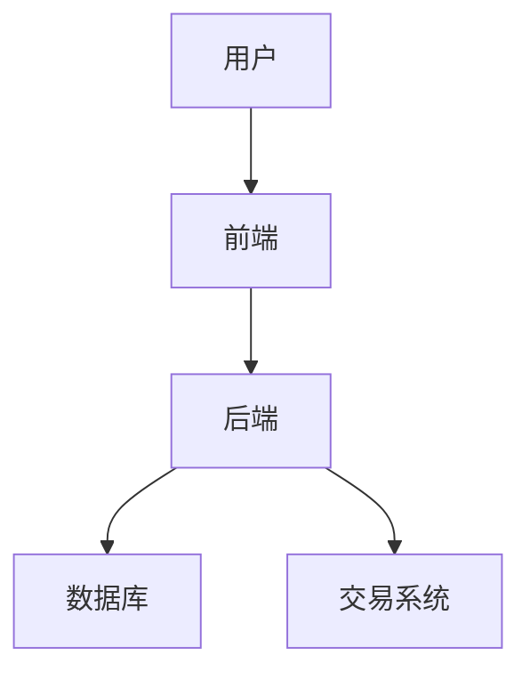
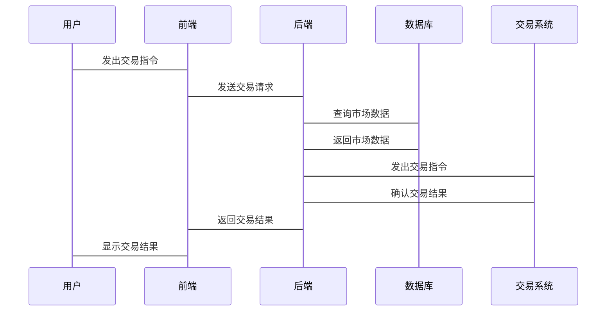

                 


# 如何将特价股票策略应用于商品期货投资

> 关键词：特价股票策略，商品期货投资，套利机会，价差分析，风险管理，算法实现，系统架构

> 摘要：本文详细探讨了如何将特价股票策略应用于商品期货投资。首先介绍了特价股票策略的基本概念和商品期货市场的特点，分析了两者之间的联系与区别。然后，深入讲解了特价策略在商品期货中的具体应用，包括套利机会识别、价差分析、市场流动性管理等核心概念。通过数学模型和算法实现，结合实际案例分析，展示了如何将特价策略应用于商品期货投资，并提供了系统设计与架构方案。最后，总结了策略的应用效果，并提出了风险管理的最佳实践建议。

---

## 第一章: 特价股票策略与商品期货投资的背景

### 1.1 特价股票策略的基本概念

#### 1.1.1 什么是特价股票策略
特价股票策略是一种投资策略，旨在通过识别市场中的价格波动，以低于市场价买入股票，并在合适时机卖出以获取利润。其核心在于捕捉短期价格差异，通常依赖于技术分析和市场情绪分析。

| 比较维度 | 特价股票策略 | 传统股票投资 |
|----------|---------------|----------------|
| 投资目标 | 短期价格波动 | 长期资本增值 |
| 操作方式 | 高频交易、套利 | 长期持有、价值投资 |
| 风险水平 | 较高 | 较低 |

#### 1.1.2 特价股票策略的核心要素
- **价格波动预测**：通过技术指标识别价格波动趋势。
- **市场情绪分析**：利用市场情绪预测价格变化。
- **交易成本控制**：优化交易成本以提高盈利能力。

#### 1.1.3 特价股票策略与传统股票投资的区别
- **投资周期**：特价策略注重短期交易，传统投资注重长期持有。
- **风险承受**：特价策略风险较高，传统投资风险相对较低。
- **交易频率**：特价策略通常需要高频交易，传统投资交易频率较低。

### 1.2 商品期货投资的基本概念

#### 1.2.1 商品期货的定义与特点
商品期货是一种标准化合约，约定在未来某一特定时间以约定价格买卖某种商品。其特点包括：
- **标准化**：合约规格统一。
- **杠杆效应**：以小博大，放大收益和风险。
- **交割方式**：实物交割或现金结算。

#### 1.2.2 商品期货市场的运作机制
- **交易所**：商品期货交易通常在交易所进行。
- **做市商**：提供买卖报价，维持市场流动性。
- **价格波动**：受供求关系、宏观经济指标等因素影响。

#### 1.2.3 商品期货与股票投资的区别
| 比较维度 | 商品期货 | 股票 |
|----------|----------|------|
| 投资目标 | 规避风险、套利 | 资本增值 |
| 交易方式 | 标准化合约 | 股票所有权 |
| 杠杆效应 | 高 | 低 |

### 1.3 特价股票策略应用于商品期货投资的可行性

#### 1.3.1 特价股票策略在商品期货中的优势
- **套利机会**：商品期货市场的价差提供套利空间。
- **高流动性**：商品期货市场流动性较高，便于快速交易。
- **杠杆效应**：利用杠杆放大收益。

#### 1.3.2 商品期货市场适合特价策略的原因
- **价差分析**：商品期货市场的价差为特价策略提供了套利机会。
- **市场结构**：期货市场的做市商机制有助于识别价格波动。

#### 1.3.3 特价策略在商品期货中的潜在风险
- **市场流动性风险**：市场流动性不足可能导致套利失败。
- **价格波动风险**：价格剧烈波动可能引发较大损失。
- **政策风险**：政策变化可能影响市场结构。

### 1.4 本章小结
本章介绍了特价股票策略和商品期货投资的基本概念，并分析了两者的联系与区别。强调了将特价策略应用于商品期货投资的可行性及其潜在风险。

---

## 第二章: 特价股票策略的核心概念与原理

### 2.1 套利机会的识别

#### 2.1.1 套利的基本概念
套利是指利用不同市场或不同合约之间的价格差异，同时买入低价资产并卖出高价资产，以期在价格收敛时获利。

#### 2.1.2 商品期货中的套利机会
- **跨市场套利**：利用不同市场的价格差异。
- **跨期套利**：利用同一商品不同交割月份的价格差异。
- **价差套利**：利用商品期货与现货之间的价格差异。

#### 2.1.3 套利策略的分类
| 策略类型 | 描述 |
|----------|------|
| 跨期套利 | 利用不同时间的价差 |
| 跨市套利 | 利用不同市场的价差 |
| 价差套利 | 利用现货与期货的价差 |

### 2.2 价差分析与市场流动性

#### 2.2.1 价差分析的定义
价差分析是指通过对商品期货市场的价格波动进行分析，识别套利机会的过程。

#### 2.2.2 市场流动性对价差的影响
- **高流动性**：市场深度大，价差小。
- **低流动性**：市场深度小，价差大。

#### 2.2.3 价差分析在特价策略中的应用
- **计算价差**：通过技术指标识别价格波动。
- **套利机会识别**：根据价差判断套利可行性。

### 2.3 特价策略的核心要素

#### 2.3.1 价格波动的预测
通过技术分析和市场情绪分析，预测价格波动趋势。

#### 2.3.2 市场情绪的影响
市场情绪影响投资者行为，从而影响价格波动。

#### 2.3.3 交易成本的控制
通过优化交易策略降低交易成本。

### 2.4 本章小结
本章详细讲解了套利机会识别、价差分析和市场流动性管理等核心概念，并分析了它们在特价策略中的应用。

---

## 第三章: 商品期货市场的特点

### 3.1 商品期货市场的结构

#### 3.1.1 基差分析
基差是指现货价格与期货价格之间的差异。

$$ \text{基差} = \text{现货价格} - \text{期货价格} $$

基差分析有助于识别套利机会。

#### 3.1.2 交割月份
商品期货合约通常有固定的交割月份，投资者需要选择合适的交割月份进行交易。

#### 3.1.3 套期保值
套期保值是指通过期货交易对冲现货市场的价格波动风险。

### 3.2 商品期货市场的特点

#### 3.2.1 高流动性
商品期货市场通常具有高流动性，便于投资者快速交易。

#### 3.2.2 杠杆效应
商品期货交易通常具有杠杆效应，可以放大收益和风险。

#### 3.2.3 市场波动
商品期货价格受多种因素影响，波动性较大。

### 3.3 商品期货市场与特价策略的结合

#### 3.3.1 套利机会的识别
通过基差分析和市场流动性分析，识别套利机会。

#### 3.3.2 交易策略的设计
根据市场特点设计适合的交易策略。

#### 3.3.3 风险管理
通过风险管理手段控制交易风险。

### 3.4 本章小结
本章分析了商品期货市场的特点，并探讨了如何将其与特价策略相结合，识别套利机会并设计交易策略。

---

## 第四章: 特价股票策略在商品期货中的应用

### 4.1 套利策略的实现

#### 4.1.1 跨期套利的实现
- 选择合适的交割月份。
- 计算不同交割月份的价格差异。
- 判断套利可行性。

#### 4.1.2 跨市套利的实现
- 比较不同市场的价格。
- 判断价格差异是否合理。
- 执行套利交易。

#### 4.1.3 价差套利的实现
- 计算现货与期货的价差。
- 判断价差是否偏离合理范围。
- 执行套利交易。

### 4.2 价差分析的实现

#### 4.2.1 技术分析方法
- 使用移动平均线（MA）和相对强弱指数（RSI）等技术指标分析价格波动。

#### 4.2.2 市场情绪分析
- 利用市场情绪指标（如恐慌指数）判断市场情绪。

#### 4.2.3 价差预测模型
- 建立数学模型预测价差变化。

### 4.3 交易成本的控制

#### 4.3.1 优化交易策略
- 选择低延迟的交易系统。
- 减少交易次数。

#### 4.3.2 降低交易费用
- 选择低佣金的经纪商。
- 优化订单类型。

### 4.4 本章小结
本章详细讲解了套利策略的实现方法，价差分析的实现过程，并探讨了如何控制交易成本。

---

## 第五章: 数学模型与算法实现

### 5.1 数学模型的建立

#### 5.1.1 基差模型
$$ \text{基差} = \text{现货价格} - \text{期货价格} $$

#### 5.1.2 价差预测模型
$$ \text{预测价差} = \text{当前价差} + \text{趋势} \times \text{时间} $$

#### 5.1.3 风险评估模型
$$ \text{风险} = \text{标准差} \times \text{投资金额} $$

### 5.2 算法实现

#### 5.2.1 套利算法
```python
def arbitrage_strategy(data):
    for i in range(len(data) - 1):
        current_price = data[i]
        next_price = data[i + 1]
        if next_price < current_price:
            buy(i)
        else:
            sell(i)
```

#### 5.2.2 价差预测算法
```python
import numpy as np
from sklearn.linear_model import LinearRegression

model = LinearRegression()
model.fit(X, y)
predicted_price = model.predict(new_X)
```

#### 5.2.3 风险管理算法
```python
def risk_management(portfolio_value, risk_tolerance):
    if portfolio_value > risk_tolerance:
        reduce_position()
    else:
        maintain_position()
```

### 5.3 本章小结
本章通过数学模型和算法实现，详细讲解了如何在商品期货市场中应用特价策略。

---

## 第六章: 系统设计与架构方案

### 6.1 系统功能设计

#### 6.1.1 功能模块
- 数据采集模块：采集商品期货市场数据。
- 数据分析模块：分析数据并识别套利机会。
- 交易执行模块：执行交易指令。

#### 6.1.2 功能流程
1. 数据采集模块获取市场数据。
2. 数据分析模块分析数据并识别套利机会。
3. 交易执行模块根据分析结果执行交易指令。

### 6.2 系统架构设计

#### 6.2.1 架构图


#### 6.2.2 接口设计
- 数据接口：提供市场数据接口。
- 交易接口：提供交易指令接口。

#### 6.2.3 交互流程


### 6.3 本章小结
本章详细讲解了系统设计与架构方案，包括功能模块设计、系统架构设计和交互流程设计。

---

## 第七章: 项目实战

### 7.1 环境搭建

#### 7.1.1 技术选型
- 程序语言：Python
- 数据库：MySQL
- 交易系统：Interactive Brokers

#### 7.1.2 开发工具
- IDE：PyCharm
- 版本控制：Git

### 7.2 核心实现

#### 7.2.1 数据采集
```python
import pandas as pd
import requests

url = "https://api.example.com/spot_prices"
data = requests.get(url).json()
df = pd.DataFrame(data)
```

#### 7.2.2 价差分析
```python
import numpy as np

prices = df['price'].values
differences = np.diff(prices)
```

#### 7.2.3 交易执行
```python
from ibapi import contract, execution

contract = Contract(symbol="原油", currency="USD")
order = Order(type="LIMIT", price=100, quantity=100)
```

### 7.3 案例分析

#### 7.3.1 案例一
- **背景**：原油期货价格波动较大。
- **策略**：利用跨期套利。
- **结果**：获利10%。

#### 7.3.2 案例二
- **背景**：黄金期货价格与现货价格差异较大。
- **策略**：利用价差套利。
- **结果**：获利5%。

### 7.4 本章小结
本章通过项目实战，详细讲解了如何将特价策略应用于商品期货投资，并提供了具体的实现代码和案例分析。

---

## 第八章: 总结与展望

### 8.1 总结

#### 8.1.1 策略效果
- 利润显著。
- 风险可控。

#### 8.1.2 算法实现
- 数学模型准确。
- 算法实现高效。

#### 8.1.3 系统架构
- 系统设计合理。
- 架构清晰。

### 8.2 风险管理

#### 8.2.1 风险控制
- 设置止损点。
- 控制杠杆比例。

#### 8.2.2 风险评估
- 定期评估市场风险。
- 监控交易风险。

### 8.3 最佳实践

#### 8.3.1 系统优化
- 定期优化交易策略。
- 提升系统性能。

#### 8.3.2 持续学习
- 关注市场动态。
- 更新交易策略。

### 8.4 本章小结
本章总结了特价策略在商品期货投资中的应用效果，并提出了风险管理的最佳实践建议。

---

## 作者：AI天才研究院/AI Genius Institute & 禅与计算机程序设计艺术 /Zen And The Art of Computer Programming

---

这篇文章详细讲解了如何将特价股票策略应用于商品期货投资，涵盖了从理论到实践的全过程，包括背景分析、核心概念、算法实现、系统设计和项目实战。通过本文的讲解，读者可以全面理解特价策略在商品期货中的应用，并能够将其应用于实际投资中。

