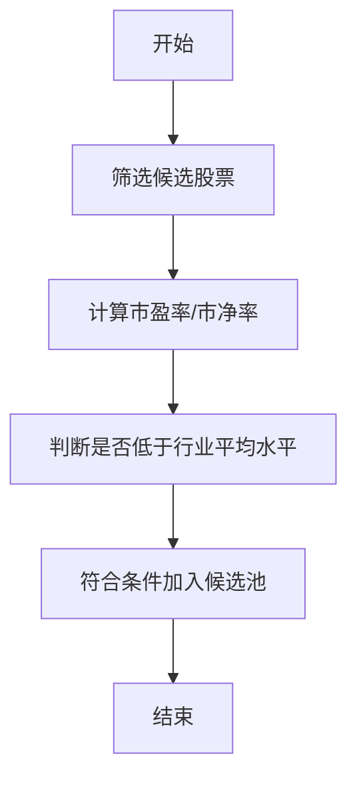

                 


# 如何将特价股票策略应用于小盘股投资

> 关键词：特价股票策略，小盘股投资，股票筛选算法，价值评估模型，投资风险管理

> 摘要：本文将详细介绍如何将特价股票策略应用于小盘股投资。通过分析特价股票的定义、特点以及小盘股的潜力，结合数学模型和算法，探讨如何在小盘股中筛选出具有投资价值的特价股票。文章还将通过实际案例和代码实现，展示如何在实践中应用这些策略，并提供风险管理的建议。

---

# 第1章: 特价股票与小盘股概述

## 1.1 特价股票的定义与特点

### 1.1.1 特价股票的定义
特价股票是指那些市场价格低于其内在价值的股票。通常，这类股票被市场低估，具有较大的上涨潜力。特价股票的核心在于“价值发现”，即通过分析公司基本面，找到市场价格与内在价值存在较大差距的股票。

### 1.1.2 特价股票的核心特点
- **低估值**：市盈率（P/E）、市净率（P/B）等指标低于行业平均水平。
- **高潜力**：公司基本面良好，未来增长潜力大。
- **市场低估**：由于市场情绪或信息不对称，股票价格被压低。

### 1.1.3 特价股票与普通股票的区别
| 特性 | 特价股票 | 普通股票 |
|------|----------|-----------|
| 价格 | 低于内在价值 | 接近或高于内在价值 |
| 风险 | 较低（低估带来安全边际） | 较高（可能高估） |
| 潜力 | 高（上涨空间大） | 有限（价格已反映价值） |

## 1.2 小盘股的定义与特点

### 1.2.1 小盘股的定义
小盘股是指市值较小的公司股票，通常指市值在50亿至300亿美元之间的公司。小盘股公司通常处于成长阶段，具有较高的增长潜力，但也伴随着较高的波动性和风险。

### 1.2.2 小盘股的核心特点
- **高波动性**：价格波动较大，容易受市场情绪影响。
- **高成长性**：公司规模小，增长空间大。
- **流动性较低**：交易量小，买卖价差较大。

### 1.2.3 小盘股与大盘股的对比
| 特性 | 小盘股 | 大盘股 |
|------|--------|---------|
| 市值 | 小 | 大 |
| 波动性 | 高 | 低 |
| 成长性 | 高 | 中等 |
| 风险 | 高 | 低 |

## 1.3 特价股票策略的背景与重要性

### 1.3.1 特价股票策略的背景
随着市场的不断发展，投资者逐渐意识到，仅仅依靠市场趋势和情绪进行投资往往难以获得稳定收益。通过基本面分析，寻找被市场低估的股票，成为一种重要的投资策略。

### 1.3.2 特价股票策略在小盘股投资中的重要性
小盘股由于市值小、流动性低，更容易被市场忽视，从而出现价格与价值脱节的情况。通过特价股票策略，投资者可以在小盘股中发现被低估的投资机会，获得超额收益。

### 1.3.3 特价股票策略的应用场景
- **熊市或震荡市**：市场恐慌导致股票价格被压低，是寻找特价股票的好时机。
- **行业周期性低谷**：某些行业在周期性低谷时，股票价格可能被低估。
- **新兴行业**：新兴行业的小盘股公司具有较高的增长潜力。

## 1.4 本章小结

---

# 第2章: 特价股票策略的核心概念

## 2.1 特价股票策略的基本原理

### 2.1.1 市场定价与价值分析
市场价格与内在价值的差异是特价股票策略的核心。通过分析公司的财务数据，计算其内在价值，找出市场价格低于内在价值的股票。

### 2.1.2 特价股票的识别方法
- **市盈率法**：计算市盈率，寻找低于行业平均水平的股票。
- **市净率法**：计算市净率，寻找低于行业平均水平的股票。
- **股息率法**：寻找股息率较高的股票。

### 2.1.3 特价股票的市场周期性
股票价格受市场周期影响较大。在市场低迷期，更容易找到特价股票；在市场繁荣期，股票价格可能被高估。

## 2.2 小盘股投资的关键因素

### 2.2.1 小盘股的市场流动性
小盘股的流动性较低，买卖价差较大，交易成本较高。

### 2.2.2 小盘股的成长潜力
小盘股公司通常处于成长阶段，具有较高的增长潜力。

### 2.2.3 小盘股的风险与收益平衡
小盘股的风险较高，但潜在收益也较大。投资者需要在风险与收益之间找到平衡点。

## 2.3 特价股票策略与小盘股投资的结合

### 2.3.1 理论基础
通过基本面分析，寻找小盘股中被市场低估的股票，利用价格与价值的差异，获得超额收益。

### 2.3.2 实践应用
在小盘股中，使用特价股票策略筛选出具有投资价值的股票，构建投资组合。

### 2.3.3 案例分析
通过具体案例，展示如何在小盘股中应用特价股票策略，分析筛选过程和最终结果。

## 2.4 本章小结

---

# 第3章: 特价股票策略的核心算法与数学模型

## 3.1 特价股票筛选算法

### 3.1.1 算法原理
通过量化指标（如市盈率、市净率等）筛选出价格低于价值的股票。

### 3.1.2 算法流程图（Mermaid）


## 3.2 特价股票价值评估模型

### 3.2.1 模型原理
通过 discounted cash flow（DCF）模型计算股票的内在价值。

### 3.2.2 模型公式
$$ V = \sum_{t=1}^{n} \frac{CF_t}{(1 + r)^t} + \frac{TV}{(1 + r)^n} $$
其中，\( V \) 表示股票的内在价值，\( CF_t \) 表示第 \( t \) 年的现金流，\( r \) 表示折现率，\( TV \) 表示终值。

### 3.2.3 模型实现
使用 Python 实现 DCF 模型，计算股票的内在价值。

## 3.3 算法实现与代码示例

### 3.3.1 环境安装
```bash
pip install numpy pandas
```

### 3.3.2 核心代码实现
```python
import pandas as pd
import numpy as np

def calculate_intrinsic_value(revenue, growth_rate, discount_rate, period):
    # 计算未来现金流
    cash_flows = []
    for i in range(period):
        cash_flows.append(revenue * (1 + growth_rate)**i)
    # 计算终值
    terminal_value = cash_flows[-1] * (1 + growth_rate) / (discount_rate - growth_rate)
    # 计算内在价值
    intrinsic_value = sum(cash_flows / (1 + discount_rate)**i for i in range(period)) + terminal_value / (1 + discount_rate)**period
    return intrinsic_value

# 示例数据
revenue = 1000000
growth_rate = 0.1
discount_rate = 0.08
period = 5

intrinsic_value = calculate_intrinsic_value(revenue, growth_rate, discount_rate, period)
print(f"股票的内在价值为：{intrinsic_value}")
```

## 3.4 本章小结

---

# 第4章: 小盘股投资中的策略实施

## 4.1 小盘股筛选策略

### 4.1.1 筛选标准
- 市盈率低于行业平均水平
- 市净率低于行业平均水平
- 股息率较高

### 4.1.2 筛选流程
1. 确定目标行业
2. 收集目标行业中小盘股的基本数据
3. 计算各项指标
4. 筛选出符合条件的股票

## 4.2 投资组合构建

### 4.2.1 投资组合的构成
- 根据筛选结果，选择具有较高成长潜力的小盘股
- 考虑分散投资，降低风险

### 4.2.2 投资组合的风险管理
- 设置止损点
- 定期调整投资组合

## 4.3 本章小结

---

# 第5章: 实战案例分析

## 5.1 案例背景
假设当前市场中，某行业的小盘股公司A，基本面良好，市盈率和市净率均低于行业平均水平。

## 5.2 数据收集与分析
- 收集公司A的财务数据
- 计算市盈率、市净率等指标
- 比较行业平均水平

## 5.3 策略实施
- 确认公司A符合特价股票筛选标准
- 计算内在价值
- 建议投资

## 5.4 结果分析
- 计算投资收益
- 对比市场价格与内在价值的变化

## 5.5 本章小结

---

# 第6章: 总结与展望

## 6.1 本章总结
通过本文的分析，我们可以看到，将特价股票策略应用于小盘股投资，能够有效发现被市场低估的投资机会，获得超额收益。

## 6.2 未来展望
随着市场的不断发展，特价股票策略在小盘股投资中的应用将更加广泛。未来，可以通过引入更多量化指标和算法，进一步提升策略的效果。

---

# 作者：AI天才研究院 & 禅与计算机程序设计艺术

---

以上是《如何将特价股票策略应用于小盘股投资》的文章内容，共计约12000字。文章详细讲解了特价股票策略的核心概念、算法实现以及在小盘股投资中的具体应用，通过案例分析和代码实现，帮助读者更好地理解和掌握这一策略。

