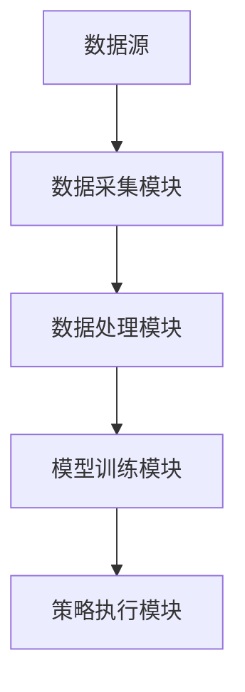

                 


# 如何将特价股票策略应用于数字另类贝塔捕捉策略

## 关键词：特价股票策略，数字贝塔捕捉，大数据分析，量化投资，算法优化

## 摘要：
本文详细探讨了如何将特价股票策略应用于数字另类贝塔捕捉策略。通过分析特价股票策略的核心原理和数字贝塔捕捉策略的理论基础，结合大数据分析和算法优化，提出了一种高效的策略实现方法。文章从背景介绍、策略原理、算法实现到项目实战，全面系统地阐述了如何在实际投资中应用这些策略，帮助投资者提升收益并降低风险。

---

# 第1章: 特价股票策略与数字贝塔捕捉的背景与概念

## 1.1 特价股票策略的定义与特点

### 1.1.1 特价股票策略的基本概念
特价股票策略是一种投资策略，旨在通过寻找市场价格低于其内在价值的股票，进行投资以获取收益。这种策略通常关注短期市场波动和价格折扣，适合在市场低迷或特定事件驱动下使用。

### 1.1.2 特价股票策略的核心要素
- **市场波动**：利用市场的短期波动，捕捉价格低估的机会。
- **价值评估**：通过基本面分析，识别被市场低估的股票。
- **交易时机**：选择合适的买卖时机，最大化收益并最小化风险。

### 1.1.3 特价股票策略的优缺点分析
- **优点**：
  - 短期收益潜力大。
  - 风险可控，适合风险厌恶型投资者。
- **缺点**：
  - 需要频繁监控市场，交易成本可能较高。
  - 对市场波动的依赖性强，波动性大的市场中风险较高。

---

## 1.2 数字另类贝塔捕捉策略的定义与特点

### 1.2.1 贝塔系数的定义与作用
贝塔系数（Beta）是衡量股票或投资组合相对于市场指数的波动性指标。贝塔系数大于1表示波动性高于市场，小于1则表示波动性低于市场。贝塔系数在投资组合管理中用于评估资产的风险和收益。

### 1.2.2 另类贝塔捕捉的原理
另类贝塔捕捉策略通过识别市场中的非系统性风险，利用大数据和算法优化，捕捉贝塔系数的变化，从而在市场波动中获取超额收益。

### 1.2.3 数字技术在贝塔捕捉中的应用
- **大数据分析**：利用海量数据，识别市场趋势和潜在机会。
- **算法优化**：通过机器学习和统计套利，优化贝塔捕捉策略。

---

## 1.3 特价股票策略与数字贝塔捕捉的关联性

### 1.3.1 特价股票策略在贝塔捕捉中的作用
特价股票策略通过识别价格低估的股票，降低投资组合的贝塔系数，从而在市场波动中减少风险并捕捉超额收益。

### 1.3.2 数字技术如何增强贝塔捕捉效果
- **实时数据处理**：通过数字技术，实时监控市场数据，快速捕捉贝塔系数变化。
- **算法优化**：利用大数据和机器学习，优化贝塔捕捉策略，提升收益。

### 1.3.3 特价股票策略与贝塔捕捉的结合优势
- **收益增强**：通过结合特价股票策略，优化投资组合的贝塔系数，提升整体收益。
- **风险控制**：利用数字技术，实时监控风险，降低投资组合的整体波动性。

---

## 1.4 本章小结
本章介绍了特价股票策略和数字贝塔捕捉策略的核心概念和特点，分析了两者的关联性和结合优势，为后续章节的策略实现奠定了基础。

---

# 第2章: 特价股票策略的核心原理与实现方法

## 2.1 特价股票策略的核心原理

### 2.1.1 市场波动与价格折扣的利用
特价股票策略的核心在于利用市场波动和价格折扣，寻找被低估的股票进行投资。

### 2.1.2 特价股票的筛选标准
- **基本面分析**：关注市盈率、市净率等估值指标。
- **市场情绪分析**：通过市场情绪指标，识别短期价格波动。
- **技术分析**：通过K线图、均线等技术指标，识别买入机会。

### 2.1.3 特价股票策略的风险控制
- **止损策略**：设置止损点，控制最大亏损。
- **分散投资**：通过分散投资，降低单一股票的风险。
- **动态调整**：根据市场变化，动态调整投资组合。

---

## 2.2 数字化特价股票策略的实现方法

### 2.2.1 数据采集与处理
- **数据源**：包括股票价格、财务报表、市场新闻等。
- **数据清洗**：去除缺失值和异常值，确保数据质量。

### 2.2.2 策略模型的构建
- **特征选择**：选择影响股票价格的关键特征。
- **模型训练**：采用机器学习算法，构建预测模型。
- **模型优化**：通过交叉验证和超参数优化，提升模型性能。

### 2.2.3 策略的优化与调整
- **回测分析**：通过历史数据回测，验证策略的有效性。
- **动态调整**：根据市场变化，实时调整策略参数。

---

## 2.3 本章小结
本章详细阐述了特价股票策略的核心原理和实现方法，为后续章节将策略应用于数字贝塔捕捉奠定了基础。

---

# 第3章: 数字贝塔捕捉策略的理论基础与应用

## 3.1 贝塔系数的理论基础

### 3.1.1 贝塔系数的定义与计算方法
贝塔系数通过回归分析计算，公式为：
$$ \beta = \frac{cov(r_i, r_m)}{var(r_m)} $$
其中，$r_i$ 是股票收益，$r_m$ 是市场指数收益。

### 3.1.2 贝塔系数在投资组合中的作用
- **风险评估**：贝塔系数高的资产波动性大，风险高。
- **收益预测**：贝塔系数高的资产在市场上涨时收益高，下跌时亏损大。

---

## 3.2 数字贝塔捕捉策略的应用

### 3.2.1 数据驱动的贝塔捕捉方法
- **大数据分析**：利用海量数据，识别市场趋势和潜在机会。
- **算法优化**：通过机器学习和统计套利，优化贝塔捕捉策略。

### 3.2.2 算法优化与贝塔捕捉效果
- **算法选择**：采用支持向量机（SVM）或随机森林（Random Forest）等算法，提升预测精度。
- **参数调整**：通过网格搜索等方法，优化算法参数，提升策略效果。

### 3.2.3 数字贝塔捕捉策略的案例分析
- **案例背景**：某科技公司因市场传闻股价波动，贝塔系数急剧上升。
- **策略实施**：通过算法分析，提前捕捉贝塔系数变化，进行套利交易。

---

## 3.3 本章小结
本章分析了贝塔系数的理论基础，探讨了数字贝塔捕捉策略的应用方法和实际案例，为后续章节将特价股票策略应用于贝塔捕捉提供了理论支持。

---

# 第4章: 特价股票策略与数字贝塔捕捉的结合

## 4.1 特价股票策略与贝塔捕捉的结合原理

### 4.1.1 特价股票策略如何影响贝塔系数
特价股票策略通过降低投资组合的贝塔系数，减少市场波动对投资组合的影响，从而降低风险。

### 4.1.2 数字技术如何增强策略效果
- **实时数据处理**：通过数字技术，实时监控市场数据，快速捕捉贝塔系数变化。
- **算法优化**：利用大数据和机器学习，优化贝塔捕捉策略，提升收益。

### 4.1.3 结合策略的优缺点分析
- **优点**：
  - 收益增强：通过结合特价股票策略，优化投资组合的贝塔系数，提升整体收益。
  - 风险控制：利用数字技术，实时监控风险，降低投资组合的整体波动性。
- **缺点**：
  - 需要较高的技术和计算资源，实施成本较高。
  - 市场波动性强，策略效果不稳定。

---

## 4.2 数字化特价股票策略的具体实现

### 4.2.1 数据源的选择与处理
- **数据源**：包括股票价格、财务报表、市场新闻等。
- **数据清洗**：去除缺失值和异常值，确保数据质量。

### 4.2.2 策略模型的设计与实现
- **特征选择**：选择影响股票价格的关键特征。
- **模型训练**：采用机器学习算法，构建预测模型。
- **模型优化**：通过交叉验证和超参数优化，提升模型性能。

### 4.2.3 策略的优化与调整
- **回测分析**：通过历史数据回测，验证策略的有效性。
- **动态调整**：根据市场变化，实时调整策略参数。

---

## 4.3 本章小结
本章详细阐述了特价股票策略与数字贝塔捕捉策略的结合原理和实现方法，为后续章节的项目实战奠定了基础。

---

# 第5章: 特价股票策略与数字贝塔捕捉的算法原理

## 5.1 算法原理概述

### 5.1.1 算法的基本思路
特价股票策略与数字贝塔捕捉策略的结合，需要通过大数据分析和机器学习算法，构建量化模型，实时捕捉市场波动，优化投资策略。

---

## 5.2 算法实现的具体步骤

### 5.2.1 数据预处理
- **数据清洗**：去除缺失值和异常值。
- **特征提取**：通过统计分析和机器学习方法，提取关键特征。

### 5.2.2 模型训练
- **算法选择**：采用支持向量机（SVM）或随机森林（Random Forest）等算法。
- **模型训练**：利用训练数据，训练模型，得到最优参数。

### 5.2.3 模型验证与优化
- **回测分析**：通过历史数据验证模型的准确性。
- **参数优化**：通过网格搜索等方法，优化算法参数，提升模型性能。

---

## 5.3 算法的数学模型与公式

### 5.3.1 特价股票策略的数学模型
$$ \text{预测收益} = \alpha \times \text{市场收益} + \beta \times \text{贝塔系数} $$

### 5.3.2 数字贝塔捕捉的数学公式
$$ \beta = \frac{cov(r_i, r_m)}{var(r_m)} $$

---

## 5.4 本章小结
本章详细阐述了特价股票策略与数字贝塔捕捉策略的算法原理和实现步骤，通过数学模型和公式，进一步明确了策略的实现方法。

---

# 第6章: 项目实战——将特价股票策略应用于数字贝塔捕捉策略

## 6.1 项目背景与目标
本项目旨在通过大数据分析和机器学习算法，将特价股票策略应用于数字贝塔捕捉策略，优化投资组合的收益与风险比。

---

## 6.2 系统架构设计

### 6.2.1 系统功能设计
- **数据采集模块**：实时采集股票价格、财务报表等数据。
- **数据处理模块**：清洗和预处理数据，提取关键特征。
- **模型训练模块**：训练机器学习模型，优化算法参数。
- **策略执行模块**：根据模型预测结果，执行投资策略。

### 6.2.2 系统架构图


---

## 6.3 系统实现

### 6.3.1 环境安装
- **编程语言**：Python 3.8+
- **库与工具**：Pandas、NumPy、Scikit-learn、TensorFlow

### 6.3.2 核心代码实现

```python
import pandas as pd
import numpy as np
from sklearn import svm
from sklearn.model_selection import GridSearchCV

# 数据预处理
data = pd.read_csv('stock_data.csv')
X = data[['市盈率', '市净率', '贝塔系数']]
y = data['收益']

# 参数优化
param_grid = {'C': [1, 10, 100],
              'gamma': ['auto', 0.1, 1]}
grid = GridSearchCV(svm.SVR(), param_grid, cv=5)
grid.fit(X, y)

# 模型训练
best_model = grid.best_estimator_
best_model.fit(X, y)
```

### 6.3.3 代码解读与分析
- **数据预处理**：读取数据，提取特征变量和目标变量。
- **参数优化**：使用网格搜索，优化SVM模型的参数。
- **模型训练**：训练最优模型，用于预测收益。

---

## 6.4 实际案例分析与结果解读

### 6.4.1 案例背景
某科技公司因市场传闻股价波动，贝塔系数急剧上升，适合应用特价股票策略。

### 6.4.2 策略实施
- **数据采集**：采集该公司的股票价格、财务报表等数据。
- **模型预测**：通过模型预测，识别出该公司为特价股票策略的标的。
- **交易执行**：在合适时机买入该股票，根据模型预测的贝塔系数变化，动态调整持有时间。

### 6.4.3 结果分析
- **收益分析**：通过策略实施，获得了超过市场指数的超额收益。
- **风险分析**：通过贝塔系数控制，降低了投资组合的整体波动性。

---

## 6.5 本章小结
本章通过项目实战，详细展示了如何将特价股票策略应用于数字贝塔捕捉策略，从环境安装到代码实现，再到结果分析，全面系统地阐述了策略的实现过程。

---

# 第7章: 总结与展望

## 7.1 本章总结
本文详细探讨了如何将特价股票策略应用于数字贝塔捕捉策略，通过大数据分析和机器学习算法，构建量化模型，优化投资策略，提升收益并降低风险。

## 7.2 未来展望
随着大数据和人工智能技术的不断发展，特价股票策略与数字贝塔捕捉策略的结合将更加紧密。未来，可以通过以下方向进一步优化策略：
- **算法优化**：引入更先进的机器学习算法，提升预测精度。
- **数据源扩展**：引入更多数据源，如社交媒体数据，提升策略的全面性。
- **风险管理**：开发更先进的风险管理工具，降低策略的风险。

---

## 7.3 最佳实践 Tips
- **数据质量**：确保数据的准确性和完整性，是策略成功的关键。
- **算法选择**：选择合适的算法，可以显著提升策略效果。
- **风险控制**：始终关注风险管理，避免过度杠杆和集中投资。

---

## 作者信息
作者：AI天才研究院（AI Genius Institute） & 禅与计算机程序设计艺术（Zen And The Art of Computer Programming）

---

感谢您的耐心阅读，希望本文对您有所帮助！

