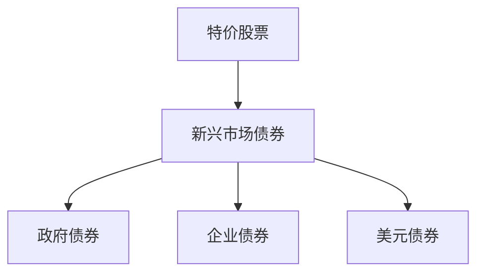

                 


# 如何将特价股票策略应用于新兴市场债券投资

> 关键词：特价股票策略，新兴市场债券，投资策略，数学模型，系统设计

> 摘要：本文探讨如何将特价股票策略应用于新兴市场债券投资，分析其背景、核心概念、数学模型、系统架构及实战案例，提供详细的技术指导和实践建议。

---

## 第1章 特价股票策略与新兴市场债券投资概述

### 1.1 特价股票策略的定义与特点

#### 1.1.1 特价股票策略的定义
特价股票策略是一种投资策略，旨在通过购买价格低于面值的股票，捕捉市场低估带来的增值机会。该策略基于市场波动和公司基本面分析，寻找具有潜在上涨空间的股票。

#### 1.1.2 特价股票策略的核心特点
- **价格低估**：寻找市场价格低于内在价值的股票。
- **价值投资**：关注公司的基本面，如盈利能力、财务状况和行业地位。
- **长期持有**：通常持有股票至价值回归或达到目标价。

#### 1.1.3 特价股票策略的应用场景
- 市场恐慌或下跌周期。
- 公司业绩短期下滑导致股价被低估。
- 特定行业或市场的结构性低估。

### 1.2 新兴市场债券投资的概述

#### 1.2.1 新兴市场的定义与特点
新兴市场指经济快速发展但尚未完全工业化的国家，如中国、印度、巴西等。这些市场通常具有高增长潜力，但也伴随着较高的风险。

#### 1.2.2 新兴市场债券的主要类型
- **政府债券**：由政府发行，用于筹集资金。
- **企业债券**：由企业发行，用于融资。
- **美元债券**：以美元计价，面向国际投资者。

#### 1.2.3 新兴市场债券投资的机遇与挑战
- **机遇**：高增长潜力，较高的收益率。
- **挑战**：高波动性，信用风险，政策风险。

### 1.3 特价股票策略应用于新兴市场债券投资的可行性分析

#### 1.3.1 问题背景与问题描述
新兴市场债券价格波动较大，存在低估机会，但传统股票策略是否适用于债券投资？

#### 1.3.2 问题解决的思路与方法
- 将股票策略的核心理念移植到债券投资。
- 通过低估价格和高内在价值寻找投资机会。

#### 1.3.3 应用的边界与外延
- 适用于政府债券和高信用评级企业债券。
- 不适用于高风险、低流动性债券。

---

## 第2章 特价股票策略与新兴市场债券投资的核心概念

### 2.1 特价股票策略的原理与机制

#### 2.1.1 特价股票策略的基本原理
基于市场有效性和效率，寻找价格低于内在价值的股票，通过长期持有实现收益。

#### 2.1.2 特价股票策略的核心机制
- 识别市场低估：分析市场波动和公司基本面。
- 评估内在价值：计算合理价格区间。
- 确定买入时机：等待价格回归价值。

### 2.2 新兴市场债券投资的核心要素

#### 2.2.1 债券发行主体的分析
- 政府债券：分析国家财政状况和政策稳定性。
- 企业债券：评估企业财务状况和行业前景。

#### 2.2.2 债券信用评级的影响
- 评级高的债券风险较低，评级低的债券风险较高。

#### 2.2.3 债券市场价格波动的特征
- 受利率变化、汇率波动和市场情绪影响较大。

### 2.3 特价股票策略与新兴市场债券投资的联系

#### 2.3.1 战略目标的相似性
- 都追求低于面值的价格。
- 都注重长期增值。

#### 2.3.2 风险特征的对比分析
| 风险类型 | 特价股票 | 新兴市场债券 |
|----------|----------|---------------|
| 市场风险 | 高       | 高             |
| 信用风险 | 无       | 有             |
| 利率风险 | 无       | 高             |

#### 2.3.3 投资策略的可迁移性
- 价值评估方法可移植。
- 风险控制策略可借鉴。

### 2.4 核心概念的ER实体关系图



---

## 第3章 特价股票策略与新兴市场债券投资的数学模型与公式

### 3.1 特价股票策略的数学模型

#### 3.1.1 特价股票价值计算公式
$$ V = \frac{P}{(1 + r)^n} $$
- \( V \)：债券的现值。
- \( P \)：债券的面值。
- \( r \)：折现率。
- \( n \)：期限。

### 3.2 新兴市场债券投资的数学模型

#### 3.2.1 债券收益率计算公式
$$ YTM = \frac{C + \frac{F - P}{n}}{F} $$
- \( YTM \)：到期收益率。
- \( C \)：债券的年利息。
- \( F \)：债券面值。
- \( P \)：购买价格。
- \( n \)：剩余期限。

### 3.3 特价股票策略与债券投资的组合优化模型

#### 3.3.1 组合优化的数学表达
$$ Maximize \quad \sum_{i=1}^{n} w_i R_i $$
$$ Subject \quad to \quad \sum_{i=1}^{n} w_i = 1 $$
- \( w_i \)：投资比例。
- \( R_i \)：债券的预期收益。

---

## 第4章 系统分析与架构设计方案

### 4.1 问题场景介绍
新兴市场债券价格波动大，存在低估机会，投资者需要一个系统化的策略来识别和评估这些机会。

### 4.2 项目介绍
设计一个基于特价股票策略的新兴市场债券投资系统，帮助投资者识别低估债券，优化投资组合。

### 4.3 系统功能设计

#### 4.3.1 数据采集模块
- 数据源：新兴市场债券市场数据。
- 工具：数据接口、爬虫工具。

#### 4.3.2 债券筛选模块
- 筛选标准：价格低于面值，高信用评级，高预期收益。

#### 4.3.3 风险评估模块
- 评估工具：信用评分模型、波动率分析。

### 4.4 系统架构设计


### 4.5 系统接口设计
- 数据接口：与债券数据供应商对接。
- 用户接口：图形化界面，显示筛选结果和建议。

### 4.6 系统交互设计


---

## 第5章 项目实战

### 5.1 环境安装
- 安装Python、Pandas、NumPy等工具。

### 5.2 核心代码实现

```python
import pandas as pd

# 数据加载
bond_data = pd.read_csv('em_bonds.csv')

# 筛选标准
selected_bonds = bond_data[(bond_data['price'] < bond_data['face_value']) &
                            (bond_data['credit_rating'] >= 'BBB')]

# 计算价值
selected_bonds['value'] = selected_bonds['face_value'] / (1 + 0.05)**10

# 输出结果
print(selected_bonds.head())
```

### 5.3 案例分析
以印度政府债券为例，分析其价格波动和内在价值，确定是否符合特价股票策略的筛选标准。

---

## 第6章 总结与最佳实践

### 6.1 小结
本文详细探讨了如何将特价股票策略应用于新兴市场债券投资，提供了数学模型、系统设计和实战案例。

### 6.2 注意事项
- 严格控制风险。
- 定期评估模型。
- 保持对市场的敏感性。

### 6.3 拓展阅读
- 《投资学》。
- 《债券市场分析》。

---

作者：AI天才研究院 & 禅与计算机程序设计艺术

