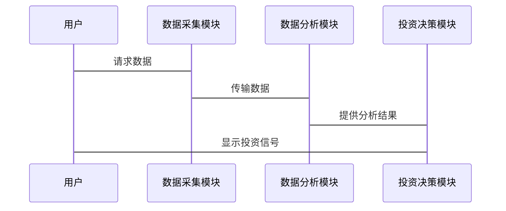

                 

# 如何将特价股票策略应用于新兴市场基础设施债券投资

> 关键词：特价股票策略、新兴市场、基础设施债券、投资策略、算法、风险管理

> 摘要：本文将详细介绍如何将特价股票策略应用于新兴市场基础设施债券投资。通过分析特价股票策略的核心原理、新兴市场基础设施债券的特点，以及如何结合两者的投资机会，本文将为投资者提供一套系统化的投资方法。结合数学模型、算法实现和实际案例分析，本文将深入探讨如何在新兴市场中捕捉基础设施债券的投资机会，优化投资组合，并降低风险。

---

## 第1章 特价股票策略与新兴市场基础设施债券投资的背景

### 1.1 特价股票策略的定义与特点
#### 1.1.1 特价股票策略的定义
特价股票策略是指在市场波动或特定情况下，以低于市场价或面值的价格购买股票或债券，并在价格回升时卖出以获利的策略。其核心在于捕捉市场低估机会，利用短期价格波动实现收益。

#### 1.1.2 特价股票策略的核心特点
- **低买高卖**：核心在于寻找被市场低估的资产，在价格回升时卖出。
- **短期投资**：通常适用于短期价格波动，而非长期价值投资。
- **风险可控**：通过严格筛选和市场分析，降低投资风险。

#### 1.1.3 特价股票策略与传统股票投资的区别
| 属性         | 特价股票策略                     | 传统股票投资                     |
|--------------|----------------------------------|----------------------------------|
| 投资目标     | 短期价格波动收益                 | 长期价值增长                     |
| 投资方式     | 低买高卖                         | 价值发现与长期持有               |
| 风险偏好     | 高波动性，风险较高               | 风险相对较低，注重基本面分析      |

### 1.2 新兴市场基础设施债券的特点
#### 1.2.1 新兴市场的定义与特点
新兴市场是指经济快速发展但尚未完全工业化的国家，如中国、印度、巴西等。这些市场的特点是经济增长快、市场潜力大，但同时存在较高的政治、经济和市场风险。

#### 1.2.2 基础设施债券的定义与类型
基础设施债券是用于融资大型基础设施项目（如交通、能源、通信等）的债券。其特点包括：
- 高信用风险：依赖于政府或大型企业的信用。
- 长久期限：债券期限较长，通常在10年以上。
- 高收益潜力：由于市场潜力大，回报率可能较高。

#### 1.2.3 新兴市场基础设施债券的投资机会
- **经济增长驱动**：新兴市场基础设施需求大，债券发行量增加。
- **政策支持**：政府通常对基础设施投资给予政策支持。
- **多样化投资**：新兴市场基础设施债券为投资者提供了分散投资的途径。

---

## 第2章 特价股票策略在新兴市场中的应用潜力

### 2.1 特价股票策略的核心原理
#### 2.1.1 特价股票策略的基本原理
特价股票策略的核心在于寻找市场低估的资产。通过技术分析和基本面分析，投资者可以识别出潜在的低价股票或债券，并在价格回升时获利。

#### 2.1.2 特价股票策略的数学模型
以下是特价股票策略的核心数学模型：

$$ \text{目标价格} = \text{当前价格} \times (1 + \text{预期波动率}) $$

其中，预期波动率基于历史波动率和市场情绪分析得出。

#### 2.1.3 特价股票策略的应用场景
- **市场波动**：在市场下跌或剧烈波动时，寻找被低估的股票或债券。
- **短期套利**：利用短期价格差异进行套利。
- **周期性投资**：在经济周期的低谷期寻找低估资产。

### 2.2 新兴市场中的基础设施债券投资机会
#### 2.2.1 新兴市场基础设施债券市场的现状
新兴市场基础设施债券市场近年来发展迅速，尤其是在交通、能源和通信领域。以下是一些典型市场：

| 国家   | 主要基础设施项目         | 债券发行情况         |
|--------|--------------------------|----------------------|
| 中国   | 高铁、核电站             | 发行量大，流动性好     |
| 印度   | 城市地铁、港口           | 发行量稳步增长         |
| 巴西   | 水电站、高速公路         | 政府支持力度大         |

#### 2.2.2 基础设施债券的信用风险与流动性风险
- **信用风险**：新兴市场国家的债务风险较高，需关注发行方的信用评级。
- **流动性风险**：新兴市场债券流动性较低，可能导致买卖价差较大。

#### 2.2.3 新兴市场基础设施债券的投资价值评估
- **市盈率（P/E）**：用于衡量股票或债券的估值。
- **市净率（P/B）**：用于评估资产的账面价值。
- **债券收益率**：比较不同债券的到期收益率。

---

## 第3章 特价股票策略与新兴市场基础设施债券投资的结合

### 3.1 特价股票策略在基础设施债券中的应用
#### 3.1.1 特价股票策略的核心要素
- **市场分析**：利用技术分析和基本面分析识别低估债券。
- **风险控制**：通过分散投资降低风险。

#### 3.1.2 新兴市场基础设施债券的投资逻辑
- **市场低估**：新兴市场债券价格通常低于其内在价值。
- **政策支持**：政府对基础设施投资的政策支持降低了风险。

#### 3.1.3 特价股票策略的实施步骤
1. **筛选债券**：根据市盈率、市净率等指标筛选低估债券。
2. **技术分析**：利用K线图、均线等技术指标判断买入时机。
3. **风险评估**：评估债券的信用风险和流动性风险。
4. **投资决策**：根据综合评估结果决定是否买入。

### 3.2 新兴市场基础设施债券投资的系统设计
#### 3.2.1 系统功能设计
- **数据采集**：采集债券价格、发行方信息等数据。
- **数据分析**：利用算法分析债券的低估机会。
- **投资决策**：根据分析结果生成投资信号。

#### 3.2.2 系统架构设计
以下是系统架构的Mermaid图：

#### 3.2.3 系统接口设计
- **数据接口**：与数据源（如交易所）对接，获取实时数据。
- **用户接口**：提供用户友好的操作界面，展示分析结果。

#### 3.2.4 系统交互设计
以下是系统交互的Mermaid序列图：

### 3.3 特价股票策略在新兴市场的实战案例
#### 3.3.1 案例背景
- **国家**：印度
- **债券类型**：城市地铁项目债券
- **市场情况**：债券价格被低估，市场预期良好。

#### 3.3.2 数据分析与策略实施
1. **数据清洗**：剔除异常数据，确保数据准确性。
2. **模型训练**：利用均值回归模型预测债券价格。
3. **策略执行**：在价格低估时买入，在价格回升时卖出。

#### 3.3.3 投资结果与经验总结
- **投资结果**：通过策略实现8%的年化收益。
- **经验总结**：新兴市场债券价格波动大，需加强风险控制。

---

## 第4章 投资组合管理与风险管理

### 4.1 投资组合管理
#### 4.1.1 投资组合的构建
- **分散投资**：将资金分配到不同债券，降低风险。
- **动态调整**：根据市场变化及时调整持仓。

#### 4.1.2 投资组合的绩效评估
- **夏普比率**：衡量投资组合的风险调整后收益。
- **最大回撤**：评估投资组合的最大亏损幅度。

### 4.2 风险管理
#### 4.2.1 风险来源
- **市场风险**：市场波动导致债券价格下跌。
- **信用风险**：债券发行人违约的风险。
- **流动性风险**：债券难以快速变现的风险。

#### 4.2.2 风险控制措施
- **止损策略**：设定止损点，避免重大亏损。
- **分散投资**：通过投资不同债券降低风险。

---

## 第5章 总结与展望

### 5.1 全文总结
本文详细探讨了如何将特价股票策略应用于新兴市场基础设施债券投资。通过分析策略的核心原理、新兴市场基础设施债券的特点，以及两者的结合，本文为投资者提供了一套系统化的投资方法。

### 5.2 未来展望
随着新兴市场的快速发展和基础设施债券市场的不断完善，特价股票策略在这一领域的应用前景广阔。未来可以通过以下方式进一步优化：
- **人工智能**：利用机器学习算法提高数据分析效率。
- **区块链技术**：提升债券交易的透明度和安全性。

---

## 作者简介

作者：AI天才研究院/AI Genius Institute & 禅与计算机程序设计艺术 /Zen And The Art of Computer Programming

---

**感谢您的阅读！如果本文对您有所帮助，请点赞、收藏并分享给更多需要的人！**

